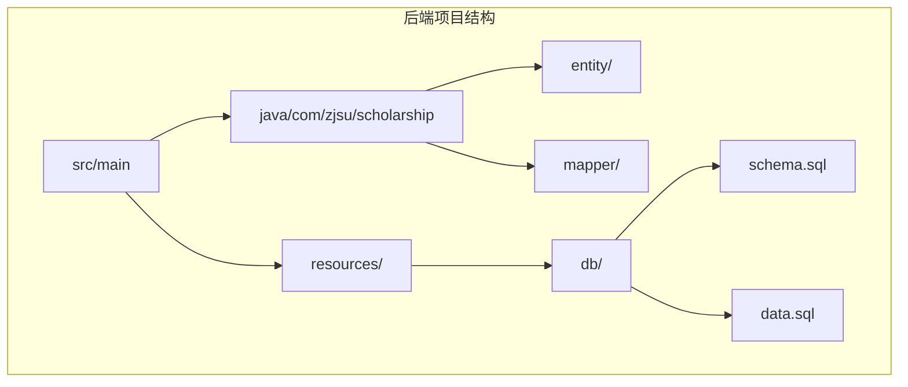
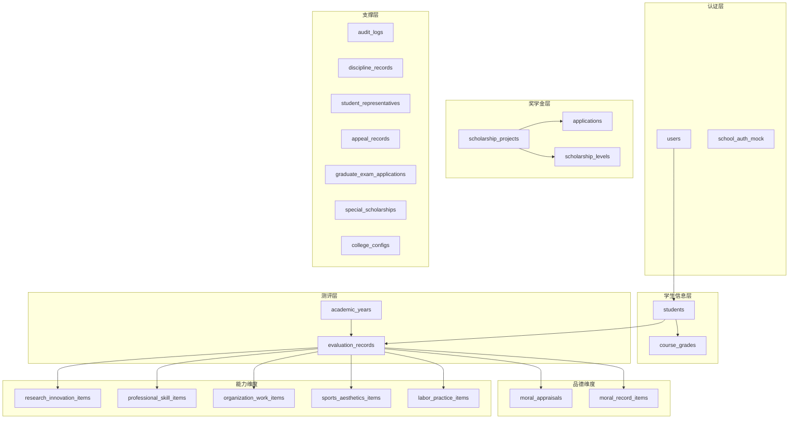
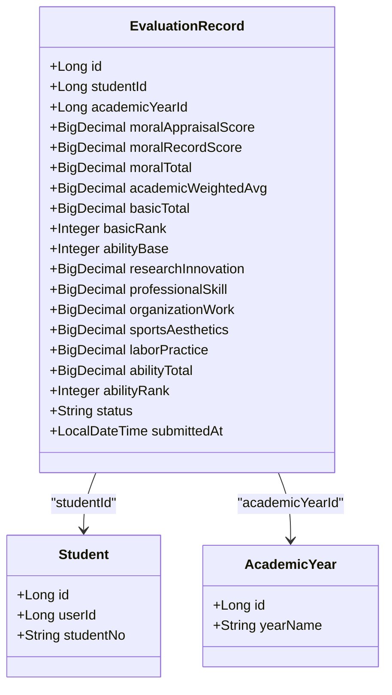
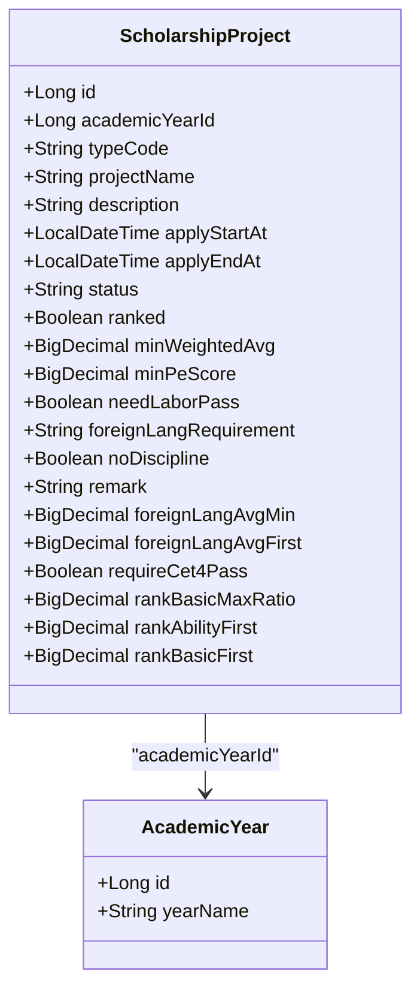
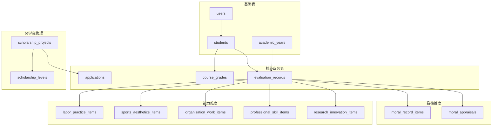
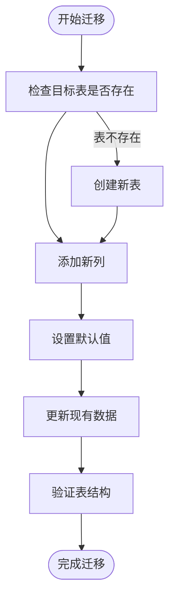

# 数据库表结构设计

<cite>
**本文档引用的文件**
- [schema.sql](file://backend/src/main/resources/db/schema.sql)
- [User.java](file://backend/src/main/java/com/zjsu/scholarship/entity/User.java)
- [Student.java](file://backend/src/main/java/com/zjsu/scholarship/entity/Student.java)
- [AcademicYear.java](file://backend/src/main/java/com/zjsu/scholarship/entity/AcademicYear.java)
- [EvaluationRecord.java](file://backend/src/main/java/com/zjsu/scholarship/entity/EvaluationRecord.java)
- [CourseGrade.java](file://backend/src/main/java/com/zjsu/scholarship/entity/CourseGrade.java)
- [MoralAppraisal.java](file://backend/src/main/java/com/zjsu/scholarship/entity/MoralAppraisal.java)
- [MoralRecordItem.java](file://backend/src/main/java/com/zjsu/scholarship/entity/MoralRecordItem.java)
- [ResearchInnovationItem.java](file://backend/src/main/java/com/zjsu/scholarship/entity/ResearchInnovationItem.java)
- [ScholarshipProject.java](file://backend/src/main/java/com/zjsu/scholarship/entity/ScholarshipProject.java)
- [Application.java](file://backend/src/main/java/com/zjsu/scholarship/entity/Application.java)
</cite>

## 目录
1. [引言](#引言)
2. [项目结构](#项目结构)
3. [核心组件](#核心组件)
4. [架构概览](#架构概览)
5. [详细组件分析](#详细组件分析)
6. [依赖分析](#依赖分析)
7. [性能考虑](#性能考虑)
8. [故障排除指南](#故障排除指南)
9. [结论](#结论)
10. [附录](#附录)

## 引言

本文件基于奖学金管理系统的核心数据库架构，详细分析了12个关键表的结构设计。该系统服务于浙江工商大学本科生奖学金评选，遵循《2025版学生素质评价办法》和《2025版奖学金实施办法》制定的规范。

系统采用双轨制综合测评体系，将学生素质评价分为"基本项"和"综合能力"两大维度，通过科学的评分算法实现公平、透明的奖学金评选过程。

## 项目结构

后端项目采用标准的Maven三层架构，数据库相关代码主要位于以下位置：

**图表来源**
- [schema.sql:1-402](file://backend/src/main/resources/db/schema.sql#L1-L402)

**章节来源**
- [schema.sql:1-402](file://backend/src/main/resources/db/schema.sql#L1-L402)

## 核心组件

系统数据库架构围绕以下核心表展开，每个表都承载着特定的业务职责：

### 用户认证表 (users)
用户认证是整个系统的入口点，负责管理所有系统用户的登录凭证和角色权限。

### 学生信息表 (students)
存储本科生的详细个人信息，包括学籍信息、语言成绩和体育测试相关信息。

### 学年表 (academic_years)
定义学年的基本信息和各阶段的时间节点，支持多学年并行管理。

### 综合测评记录表 (evaluation_records)
核心业务表，记录学生的综合测评结果，采用双轨制评分体系。

### 课程成绩表 (course_grades)
存储学生的课程学习记录，为专业素质评分提供数据支撑。

### 奖学金项目表 (scholarship_projects)
定义各类奖学金项目的评选规则和条件，支持复杂的筛选逻辑。

**章节来源**
- [schema.sql:7-43](file://backend/src/main/resources/db/schema.sql#L7-L43)
- [schema.sql:45-58](file://backend/src/main/resources/db/schema.sql#L45-L58)
- [schema.sql:60-87](file://backend/src/main/resources/db/schema.sql#L60-L87)
- [schema.sql:89-97](file://backend/src/main/resources/db/schema.sql#L89-L97)
- [schema.sql:234-260](file://backend/src/main/resources/db/schema.sql#L234-L260)

## 架构概览

系统采用分层架构设计，通过清晰的表关系实现业务逻辑的模块化：

**图表来源**
- [schema.sql:7-402](file://backend/src/main/resources/db/schema.sql#L7-L402)

## 详细组件分析

### 用户认证表 (users)

用户认证表是系统安全的基础，采用主键自增设计确保用户标识的唯一性。

| 字段名 | 数据类型 | 约束条件 | 业务含义 |
|--------|----------|----------|----------|
| id | BIGINT | PRIMARY KEY, AUTO_INCREMENT | 用户唯一标识符 |
| account | VARCHAR(32) | NOT NULL, UNIQUE | 登录账号，唯一约束 |
| name | VARCHAR(50) | NOT NULL | 用户真实姓名 |
| role | VARCHAR(20) | NOT NULL | 用户角色：STUDENT/ADMIN/COUNSELOR |
| password_hash | VARCHAR(120) | - | 密码哈希值 |
| email | VARCHAR(100) | - | 邮箱地址 |
| phone | VARCHAR(20) | - | 联系电话 |
| status | VARCHAR(20) | DEFAULT 'ACTIVE' | 账号状态 |
| created_at | TIMESTAMP | DEFAULT CURRENT_TIMESTAMP | 创建时间 |

**设计要点**：
- 使用VARCHAR(32)确保账号长度适中，避免过长影响索引性能
- 角色字段采用枚举式字符串，便于权限控制
- 密码采用哈希存储，符合安全最佳实践

**章节来源**
- [schema.sql:7-17](file://backend/src/main/resources/db/schema.sql#L7-L17)
- [User.java:10-23](file://backend/src/main/java/com/zjsu/scholarship/entity/User.java#L10-L23)

### 学生信息表 (students)

学生信息表存储本科生的完整个人信息，支持学籍管理和日常业务操作。

| 字段名 | 数据类型 | 约束条件 | 业务含义 |
|--------|----------|----------|----------|
| id | BIGINT | PRIMARY KEY, AUTO_INCREMENT | 学生记录唯一标识 |
| user_id | BIGINT | NOT NULL | 关联users表的外键 |
| student_no | VARCHAR(20) | NOT NULL, UNIQUE | 学号，唯一约束 |
| name | VARCHAR(50) | - | 姓名 |
| gender | VARCHAR(4) | - | 性别 |
| college | VARCHAR(80) | - | 所属学院 |
| major | VARCHAR(80) | - | 专业名称 |
| grade | VARCHAR(10) | - | 年级 |
| class_name | VARCHAR(50) | - | 班级名称 |
| dorm_no | VARCHAR(20) | - | 宿舍号 |
| cet4_score | INT | - | 大学英语四级成绩 |
| cet6_score | INT | - | 大学英语六级成绩 |
| pe_score | DECIMAL(5,1) | - | 体育成绩或体测分数 |
| labor_evaluation | VARCHAR(20) | DEFAULT 'PENDING' | 劳动教育测评结果 |
| pe_exempt | BOOLEAN | DEFAULT FALSE | 体育免测标志 |

**设计要点**：
- 采用VARCHAR(20)存储学号，兼顾唯一性和查询效率
- 体育成绩使用DECIMAL(5,1)精确到小数点后一位
- 新增pe_exempt字段支持体育免测情况

**章节来源**
- [schema.sql:25-43](file://backend/src/main/resources/db/schema.sql#L25-L43)
- [Student.java:9-32](file://backend/src/main/java/com/zjsu/scholarship/entity/Student.java#L9-L32)

### 学年表 (academic_years)

学年表定义了学年的基本信息和关键时间节点，支持多学年并行管理。

| 字段名 | 数据类型 | 约束条件 | 业务含义 |
|--------|----------|----------|----------|
| id | BIGINT | PRIMARY KEY, AUTO_INCREMENT | 学年唯一标识 |
| year_name | VARCHAR(20) | NOT NULL, UNIQUE | 学年名称，格式如"2023-2024" |
| start_date | DATE | - | 学年开始日期 |
| end_date | DATE | - | 学年结束日期 |
| status | VARCHAR(20) | DEFAULT 'ACTIVE' | 学年状态 |
| fill_start_at | TIMESTAMP | NULL | 信息填写开始时间 |
| fill_end_at | TIMESTAMP | NULL | 信息填写结束时间 |
| review_start_at | TIMESTAMP | NULL | 审核开始时间 |
| review_end_at | TIMESTAMP | NULL | 审核结束时间 |
| public_start_at | TIMESTAMP | NULL | 结果公示开始时间 |
| public_end_at | TIMESTAMP | NULL | 结果公示结束时间 |

**设计要点**：
- year_name字段唯一约束确保学年不重复
- 时间戳字段支持灵活的业务流程控制
- 状态字段支持学年的生命周期管理

**章节来源**
- [schema.sql:45-58](file://backend/src/main/resources/db/schema.sql#L45-L58)
- [AcademicYear.java:11-26](file://backend/src/main/java/com/zjsu/scholarship/entity/AcademicYear.java#L11-L26)

### 综合测评记录表 (evaluation_records)

这是系统的核心业务表，采用双轨制评分体系，记录学生的综合测评结果。

**图表来源**
- [EvaluationRecord.java:11-44](file://backend/src/main/java/com/zjsu/scholarship/entity/EvaluationRecord.java#L11-L44)

**字段设计详解**：

**基本项评分**：
- 品德评议分(moral_appraisal_score)：基于多维度评议的综合评分
- 品德记实分(moral_record_score)：基于具体行为记录的累计评分
- 专业素质评分(academic_weighted_avg)：基于课程成绩计算的加权平均分

**双轨制计算**：
- 基本项总分 = 品德×30% + 专业×70%
- 综合能力 = 能力基础分(75) + 各能力维度加分

**唯一约束**：
- uk_eval_ug联合唯一约束(student_id, academic_year_id)确保每个学生每学年只能有一份测评记录

**章节来源**
- [schema.sql:60-87](file://backend/src/main/resources/db/schema.sql#L60-L87)
- [EvaluationRecord.java:11-44](file://backend/src/main/java/com/zjsu/scholarship/entity/EvaluationRecord.java#L11-L44)

### 课程成绩表 (course_grades)

课程成绩表存储学生的课程学习记录，为专业素质评分提供数据基础。

| 字段名 | 数据类型 | 约束条件 | 业务含义 |
|--------|----------|----------|----------|
| id | BIGINT | PRIMARY KEY, AUTO_INCREMENT | 成绩记录唯一标识 |
| student_id | BIGINT | NOT NULL | 关联学生标识 |
| academic_year_id | BIGINT | NOT NULL | 关联学年标识 |
| course_name | VARCHAR(120) | - | 课程名称 |
| credit | DECIMAL(4,1) | - | 学分 |
| score | DECIMAL(5,1) | - | 成绩分数 |

**设计要点**：
- 课程名称使用VARCHAR(120)支持长课程名
- 学分和成绩均使用DECIMAL(4,1)和DECIMAL(5,1)确保精度
- 与evaluation_records表形成一对多关系

**章节来源**
- [schema.sql:89-97](file://backend/src/main/resources/db/schema.sql#L89-L97)
- [CourseGrade.java:10-20](file://backend/src/main/java/com/zjsu/scholarship/entity/CourseGrade.java#L10-L20)

### 品德评议表 (moral_appraisals)

品德评议表记录学生在六个维度上的评议结果，支持三种评议来源。

| 字段名 | 数据类型 | 约束条件 | 业务含义 |
|--------|----------|----------|----------|
| id | BIGINT | PRIMARY KEY, AUTO_INCREMENT | 评议记录唯一标识 |
| evaluation_id | BIGINT | NOT NULL | 关联测评记录 |
| appraiser_type | VARCHAR(20) | NOT NULL | 评议来源：SELF/STUDENT_REP/COUNSELOR |
| political_literacy | DECIMAL(4,1) | DEFAULT 0 | 政治素养评分(0-20) |
| legal_awareness | DECIMAL(4,1) | DEFAULT 0 | 法治观念评分(0-20) |
| mental_quality | DECIMAL(4,1) | DEFAULT 0 | 心理素质评分(0-20) |
| integrity_score | DECIMAL(4,1) | DEFAULT 0 | 诚实守信评分(0-20) |
| teamwork | DECIMAL(4,1) | DEFAULT 0 | 团队协作评分(0-20) |
| social_responsibility | DECIMAL(4,1) | DEFAULT 0 | 社会责任评分(0-20) |
| total | DECIMAL(5,2) | DEFAULT 0 | 六维度合计 |
| created_at | TIMESTAMP | DEFAULT CURRENT_TIMESTAMP | 创建时间 |

**设计要点**：
- 每个维度满分为20分，总分满分为120分
- 支持三种评议来源确保评分的客观性
- 采用DECIMAL(4,1)确保评分精度

**章节来源**
- [schema.sql:100-112](file://backend/src/main/resources/db/schema.sql#L100-L112)
- [MoralAppraisal.java:11-35](file://backend/src/main/java/com/zjsu/scholarship/entity/MoralAppraisal.java#L11-L35)

### 品德记实项表 (moral_record_items)

品德记实项表记录学生的具体行为表现，支持志愿服务、纪律处分、荣誉奖励等类型。

| 字段名 | 数据类型 | 约束条件 | 业务含义 |
|--------|----------|----------|----------|
| id | BIGINT | PRIMARY KEY, AUTO_INCREMENT | 记实项唯一标识 |
| evaluation_id | BIGINT | NOT NULL | 关联测评记录 |
| item_type | VARCHAR(30) | NOT NULL | 项目类型：VOLUNTEER/DISCIPLINE/HONOR/COLLECTIVE_HONOR |
| description | VARCHAR(255) | - | 事件描述 |
| occurred_date | DATE | - | 发生日期 |
| hours | DECIMAL(5,1) | - | 服务时长 |
| raw_value | DECIMAL(7,2) | - | 原始分值 |
| honor_level | VARCHAR(20) | - | 荣誉等级：NATIONAL/PROVINCIAL/CITY/SCHOOL/COLLEGE |
| score | DECIMAL(7,2) | DEFAULT 0 | 实际得分 |
| attachment_url | VARCHAR(255) | - | 附件URL |
| review_status | VARCHAR(20) | DEFAULT 'PENDING' | 审核状态：PENDING/APPROVED/REJECTED |
| review_remark | VARCHAR(255) | - | 审核备注 |
| created_at | TIMESTAMP | DEFAULT CURRENT_TIMESTAMP | 创建时间 |

**设计要点**：
- 支持多种记实类型，涵盖学生在校期间的主要表现
- 荣誉等级采用分级制度，便于量化评估
- 审核状态字段支持完整的审批流程

**章节来源**
- [schema.sql:115-129](file://backend/src/main/resources/db/schema.sql#L115-L129)
- [MoralRecordItem.java:12-33](file://backend/src/main/java/com/zjsu/scholarship/entity/MoralRecordItem.java#L12-L33)

### 综合能力维度表

系统提供五个综合能力维度的评分表，每个维度都有其独特的评分规则和应用场景。

#### 研究创新项 (research_innovation_items)

研究创新维度涵盖竞赛、论文、专利、科研项目等多个方面。

| 字段名 | 数据类型 | 约束条件 | 业务含义 |
|--------|----------|----------|----------|
| id | BIGINT | PRIMARY KEY, AUTO_INCREMENT | 项目唯一标识 |
| evaluation_id | BIGINT | NOT NULL | 关联测评记录 |
| item_type | VARCHAR(30) | NOT NULL | 类型：COMPETITION/PAPER/PATENT/PROJECT |
| name | VARCHAR(200) | - | 项目名称 |
| level_field | VARCHAR(30) | - | 等级字段 |
| award_level | VARCHAR(20) | - | 获奖等级：FIRST/SECOND/THIRD/PARTICIPATE |
| competition_category | VARCHAR(4) | - | 竞赛类别：A/B/C |
| patent_type | VARCHAR(20) | - | 专利类型：INVENTION/UTILITY/APPEARANCE |
| project_level | VARCHAR(40) | - | 项目级别：SCHOOL_GENERAL/SCHOOL_KEY/PROVINCIAL/NATIONAL |
| project_status | VARCHAR(20) | - | 项目状态：APPROVED/CONCLUDED/OVERDUE |
| journal_level | VARCHAR(50) | - | 期刊级别：SCI_Q1/SCI_Q2/CSSCI/TOP等 |
| total_authors | INT | DEFAULT 1 | 总作者数 |
| my_rank | INT | DEFAULT 1 | 个人排名 |
| has_advisor | BOOLEAN | DEFAULT FALSE | 是否有指导教师 |
| is_core_member | BOOLEAN | DEFAULT FALSE | 是否核心成员 |
| description | VARCHAR(255) | - | 项目描述 |
| occurred_date | DATE | - | 发生日期 |
| score | DECIMAL(7,2) | DEFAULT 0 | 实际得分 |
| attachment_url | VARCHAR(255) | - | 附件URL |
| review_status | VARCHAR(20) | DEFAULT 'PENDING' | 审核状态 |
| review_remark | VARCHAR(255) | - | 审核备注 |
| created_at | TIMESTAMP | DEFAULT CURRENT_TIMESTAMP | 创建时间 |

**设计要点**：
- 支持多种研究类型的量化评估
- 核心成员概念通过is_core_member字段体现
- 作者排名和总人数字段支持团队项目的公平评估

**章节来源**
- [schema.sql:132-155](file://backend/src/main/resources/db/schema.sql#L132-L155)
- [ResearchInnovationItem.java:12-48](file://backend/src/main/java/com/zjsu/scholarship/entity/ResearchInnovationItem.java#L12-L48)

#### 专业技能项 (professional_skill_items)

专业技能维度评估学生的专业能力和技能水平。

| 字段名 | 数据类型 | 约束条件 | 业务含义 |
|--------|----------|----------|----------|
| id | BIGINT | PRIMARY KEY, AUTO_INCREMENT | 技能记录唯一标识 |
| evaluation_id | BIGINT | NOT NULL | 关联测评记录 |
| item_type | VARCHAR(30) | NOT NULL | 技能类型 |
| name | VARCHAR(200) | - | 技能名称 |
| skill_category | VARCHAR(50) | - | 技能类别 |
| skill_level | VARCHAR(30) | - | 技能等级 |
| description | VARCHAR(255) | - | 技能描述 |
| occurred_date | DATE | - | 获得日期 |
| score | DECIMAL(7,2) | DEFAULT 0 | 得分 |
| attachment_url | VARCHAR(255) | - | 附件URL |
| review_status | VARCHAR(20) | DEFAULT 'PENDING' | 审核状态 |
| review_remark | VARCHAR(255) | - | 审核备注 |
| created_at | TIMESTAMP | DEFAULT CURRENT_TIMESTAMP | 创建时间 |

**设计要点**：
- 支持多种专业技能的量化评估
- 技能等级字段便于横向比较

**章节来源**
- [schema.sql:158-172](file://backend/src/main/resources/db/schema.sql#L158-L172)

#### 组织工作项 (organization_work_items)

组织工作维度评估学生在学生组织和社团中的表现。

| 字段名 | 数据类型 | 约束条件 | 业务含义 |
|--------|----------|----------|----------|
| id | BIGINT | PRIMARY KEY, AUTO_INCREMENT | 工作记录唯一标识 |
| evaluation_id | BIGINT | NOT NULL | 关联测评记录 |
| name | VARCHAR(200) | - | 组织/职位名称 |
| org_level | VARCHAR(20) | - | 组织级别 |
| position_name | VARCHAR(100) | - | 职位名称 |
| position_score | INT | DEFAULT 0 | 职位分值 |
| performance_grade | VARCHAR(10) | - | 工作绩效等级 |
| performance_score | INT | DEFAULT 0 | 绩效分值 |
| duration_months | INT | - | 任职时长(月) |
| description | VARCHAR(255) | - | 工作描述 |
| occurred_date | DATE | - | 任职日期 |
| score | DECIMAL(7,2) | DEFAULT 0 | 实际得分 |
| attachment_url | VARCHAR(255) | - | 附件URL |
| review_status | VARCHAR(20) | DEFAULT 'PENDING' | 审核状态 |
| review_remark | VARCHAR(255) | - | 审核备注 |
| created_at | TIMESTAMP | DEFAULT CURRENT_TIMESTAMP | 创建时间 |

**设计要点**：
- 职位分值和绩效分值分离，体现不同层次的贡献
- 任职时长作为重要考量因素

**章节来源**
- [schema.sql:175-192](file://backend/src/main/resources/db/schema.sql#L175-L192)

#### 体育美育项 (sports_aesthetics_items)

体育美育维度评估学生的体育锻炼和艺术修养表现。

| 字段名 | 数据类型 | 约束条件 | 业务含义 |
|--------|----------|----------|----------|
| id | BIGINT | PRIMARY KEY, AUTO_INCREMENT | 项目唯一标识 |
| evaluation_id | BIGINT | NOT NULL | 关联测评记录 |
| item_type | VARCHAR(30) | NOT NULL | 类型：COMPETITION/ART_ACTIVITY |
| name | VARCHAR(200) | - | 活动/比赛名称 |
| level_field | VARCHAR(30) | - | 等级字段 |
| award_level | VARCHAR(20) | - | 等级：FIRST/SECOND/THIRD/PARTICIPATE |
| is_team | BOOLEAN | DEFAULT FALSE | 是否团体项目 |
| is_core_member | BOOLEAN | DEFAULT FALSE | 是否核心成员 |
| team_size | INT | DEFAULT 1 | 团队规模 |
| description | VARCHAR(255) | - | 活动描述 |
| occurred_date | DATE | - | 发生日期 |
| score | DECIMAL(7,2) | DEFAULT 0 | 实际得分 |
| attachment_url | VARCHAR(255) | - | 附件URL |
| review_status | VARCHAR(20) | DEFAULT 'PENDING' | 审核状态 |
| review_remark | VARCHAR(255) | - | 审核备注 |
| created_at | TIMESTAMP | DEFAULT CURRENT_TIMESTAMP | 创建时间 |

**设计要点**：
- 支持个人和团体项目的差异化评估
- 核心成员概念同样适用于体育美育领域

**章节来源**
- [schema.sql:195-212](file://backend/src/main/resources/db/schema.sql#L195-L212)

#### 劳动实践项 (labor_practice_items)

劳动实践维度评估学生参与社会实践和劳动教育的情况。

| 字段名 | 数据类型 | 约束条件 | 业务含义 |
|--------|----------|----------|----------|
| id | BIGINT | PRIMARY KEY, AUTO_INCREMENT | 实践记录唯一标识 |
| evaluation_id | BIGINT | NOT NULL | 关联测评记录 |
| item_type | VARCHAR(30) | NOT NULL | 类型：SOCIAL_PRACTICE/VOLUNTEER/LABOR_TRAINING |
| name | VARCHAR(200) | - | 实践活动名称 |
| level_field | VARCHAR(30) | - | 等级字段 |
| award_level | VARCHAR(20) | - | 等级：FIRST/SECOND/THIRD/PARTICIPATE |
| is_team | BOOLEAN | DEFAULT FALSE | 是否团体项目 |
| is_core_member | BOOLEAN | DEFAULT FALSE | 是否核心成员 |
| team_size | INT | DEFAULT 1 | 团队规模 |
| description | VARCHAR(255) | - | 实践描述 |
| occurred_date | DATE | - | 实践日期 |
| score | DECIMAL(7,2) | DEFAULT 0 | 实际得分 |
| attachment_url | VARCHAR(255) | - | 附件URL |
| review_status | VARCHAR(20) | DEFAULT 'PENDING' | 审核状态 |
| review_remark | VARCHAR(255) | - | 审核备注 |
| created_at | TIMESTAMP | DEFAULT CURRENT_TIMESTAMP | 创建时间 |

**设计要点**：
- 覆盖社会实践、志愿服务、劳动培训等多种形式
- 与体育美育项类似，支持团队和个人项目的评估

**章节来源**
- [schema.sql:215-232](file://backend/src/main/resources/db/schema.sql#L215-L232)

### 奖学金项目表 (scholarship_projects)

奖学金项目表定义了各类奖学金的评选规则和条件，支持复杂的筛选逻辑。

**图表来源**
- [ScholarshipProject.java:11-49](file://backend/src/main/java/com/zjsu/scholarship/entity/ScholarshipProject.java#L11-L49)

| 字段名 | 数据类型 | 约束条件 | 业务含义 |
|--------|----------|----------|----------|
| id | BIGINT | PRIMARY KEY, AUTO_INCREMENT | 项目唯一标识 |
| academic_year_id | BIGINT | NOT NULL | 关联学年标识 |
| type_code | VARCHAR(40) | NOT NULL | 项目类型编码 |
| project_name | VARCHAR(120) | NOT NULL | 项目名称 |
| description | VARCHAR(500) | - | 项目描述 |
| apply_start_at | TIMESTAMP | NULL | 申请开始时间 |
| apply_end_at | TIMESTAMP | NULL | 申请结束时间 |
| status | VARCHAR(20) | DEFAULT 'DRAFT' | 项目状态 |
| ranked | BOOLEAN | DEFAULT FALSE | 是否排名制 |
| min_weighted_avg | DECIMAL(5,1) | - | 最低加权平均分 |
| min_pe_score | DECIMAL(5,1) | - | 最低体育成绩 |
| need_labor_pass | BOOLEAN | DEFAULT TRUE | 是否需要劳动教育通过 |
| foreign_lang_requirement | VARCHAR(200) | - | 外语要求描述 |
| no_discipline | BOOLEAN | DEFAULT TRUE | 是否无违纪记录 |
| remark | VARCHAR(500) | - | 备注说明 |
| foreign_lang_avg_min | DECIMAL(5,1) | - | 外语课平均分底线 |
| foreign_lang_avg_first | DECIMAL(5,1) | - | 一等奖外语均分底线 |
| require_cet4_pass | BOOLEAN | DEFAULT FALSE | 是否要求CET4合格 |
| rank_basic_max_ratio | DECIMAL(5,2) | - | 基本项排名最大比例 |
| rank_ability_first | DECIMAL(5,2) | - | 能力项排名第一档比例 |
| rank_basic_first | DECIMAL(5,2) | - | 基本项排名第一档比例 |

**新增功能特性**：
- 结构化外语条件支持更精细的外语要求
- 排名过滤机制确保优秀学生脱颖而出
- 多层次的筛选条件满足不同奖学金项目需求

**章节来源**
- [schema.sql:234-260](file://backend/src/main/resources/db/schema.sql#L234-L260)
- [ScholarshipProject.java:11-49](file://backend/src/main/java/com/zjsu/scholarship/entity/ScholarshipProject.java#L11-L49)

### 申请表 (applications)

申请表记录学生对各类奖学金项目的申请信息和评审状态。

| 字段名 | 数据类型 | 约束条件 | 业务含义 |
|--------|----------|----------|----------|
| id | BIGINT | PRIMARY KEY, AUTO_INCREMENT | 申请记录唯一标识 |
| student_id | BIGINT | NOT NULL | 申请人标识 |
| project_id | BIGINT | NOT NULL | 申请项目标识 |
| evaluation_id | BIGINT | - | 关联测评记录 |
| snapshot_basic_total | DECIMAL(8,3) | - | 基本项总分快照 |
| snapshot_basic_rank | INT | - | 基本项排名快照 |
| snapshot_ability_total | DECIMAL(8,3) | - | 综合能力总分快照 |
| snapshot_ability_rank | INT | - | 综合能力排名快照 |
| auto_level_id | BIGINT | - | 系统推荐等级ID |
| final_level_id | BIGINT | - | 最终授予等级ID |
| status | VARCHAR(20) | DEFAULT 'SUBMITTED' | 申请状态 |
| reject_reason | VARCHAR(255) | - | 拒绝原因 |
| submitted_at | TIMESTAMP | DEFAULT CURRENT_TIMESTAMP | 提交时间 |
| reviewed_at | TIMESTAMP | NULL | 审核时间 |
| reviewer_id | BIGINT | - | 审核人ID |
| application_category | VARCHAR(30) | - | 申请分类：COMPREHENSIVE/ABILITY/GRADUATE_EXAM/SPECIAL/NAMED |

**设计要点**：
- 快照机制确保评审的公正性和可追溯性
- 状态字段支持完整的申请流程管理
- 申请分类字段便于不同项目的差异化处理

**章节来源**
- [schema.sql:294-315](file://backend/src/main/resources/db/schema.sql#L294-L315)
- [Application.java:11-42](file://backend/src/main/java/com/zjsu/scholarship/entity/Application.java#L11-L42)

## 依赖分析

系统表之间的依赖关系体现了业务逻辑的层次结构：

**图表来源**
- [schema.sql:7-402](file://backend/src/main/resources/db/schema.sql#L7-L402)

**外键关系分析**：
- students.user_id → users.id
- evaluation_records.student_id → students.id
- evaluation_records.academic_year_id → academic_years.id
- 各能力维度表 → evaluation_records.id (多对一关系)

**章节来源**
- [schema.sql:7-402](file://backend/src/main/resources/db/schema.sql#L7-L402)

## 性能考虑

### 索引优化策略

1. **主键索引**：所有表的主键自动建立聚簇索引，确保唯一性和快速查找
2. **唯一约束索引**：
   - users.account (唯一)
   - students.student_no (唯一)
   - evaluation_records(student_id, academic_year_id) (联合唯一)
   - applications(student_id, project_id) (联合唯一)
3. **外键索引**：建议为所有外键字段建立索引，特别是高频查询的关联字段

### 查询性能优化

1. **复合查询优化**：针对学年和学生维度的查询，建议使用联合索引
2. **排序性能**：排名相关查询需要在basic_rank和ability_rank字段上建立索引
3. **时间范围查询**：apply_start_at和apply_end_at字段支持奖学金申请期的高效查询

### 数据类型选择理由

1. **BIGINT主键**：支持大规模数据量，避免整数溢出
2. **DECIMAL精度**：财务相关和评分使用DECIMAL确保计算精度
3. **VARCHAR长度**：根据实际业务需求合理设置长度，平衡存储和性能
4. **TIMESTAMP时间戳**：统一时间格式，支持时区转换

## 故障排除指南

### 常见问题及解决方案

**1. 唯一约束冲突**
- 症状：插入数据时报唯一约束错误
- 解决方案：检查student_no、account等唯一字段是否重复
- 预防措施：在应用层进行唯一性验证

**2. 外键约束失败**
- 症状：删除或更新父表记录时报外键约束错误
- 解决方案：先清理子表相关记录，再操作父表
- 预防措施：使用事务保证数据一致性

**3. 数值精度问题**
- 症状：计算结果出现精度丢失
- 解决方案：确认使用DECIMAL类型，避免FLOAT/DOUBLE
- 预防措施：在应用层进行数值范围验证

**4. 时间字段异常**
- 症状：时间显示不正确或时区问题
- 解决方案：检查数据库时区设置和应用层时间处理
- 预防措施：统一使用TIMESTAMP类型存储时间

**章节来源**
- [schema.sql:7-402](file://backend/src/main/resources/db/schema.sql#L7-L402)

## 结论

该数据库设计方案充分体现了现代奖学金管理系统的复杂性和专业化要求。通过双轨制评分体系、多维度能力评估和精细化的业务流程控制，系统能够有效支撑各类奖学金的公平、公正评选。

设计特点总结：
1. **完整性**：覆盖从学生信息到最终授奖的全生命周期
2. **灵活性**：支持多种奖学金类型和复杂的评选规则
3. **可扩展性**：预留了充足的扩展字段和新功能接口
4. **安全性**：完善的权限控制和审计日志机制
5. **可维护性**：清晰的表结构和标准化的数据类型

## 附录

### 数据库迁移机制

系统提供了完整的数据库迁移支持，通过ALTER TABLE语句实现向后兼容的字段扩展：

**图表来源**
- [schema.sql:388-402](file://backend/src/main/resources/db/schema.sql#L388-L402)

**迁移特性**：
- 使用IF NOT EXISTS确保迁移的幂等性
- 逐步添加字段避免破坏现有功能
- 支持在线迁移，减少系统停机时间

**章节来源**
- [schema.sql:388-402](file://backend/src/main/resources/db/schema.sql#L388-L402)

### 典型业务场景示例

**场景1：学生申请综合奖学金**
1. 学生提交申请 → applications表插入记录
2. 系统计算测评分数 → evaluation_records表更新
3. 应用筛选条件 → scholarship_projects表匹配
4. 确定获奖等级 → scholarship_levels表查询
5. 最终授奖 → 更新application状态

**场景2：品德评议审核**
1. 评议员提交评议 → moral_appraisals表记录
2. 审核人员复核 → 更新review_status
3. 记实项审核 → moral_record_items表处理
4. 最终计入 → evaluation_records表汇总

**场景3：课程成绩导入**
1. 批量导入 → course_grades表插入
2. 自动计算 → 专业素质评分更新
3. 影响测评 → evaluation_records表重新计算