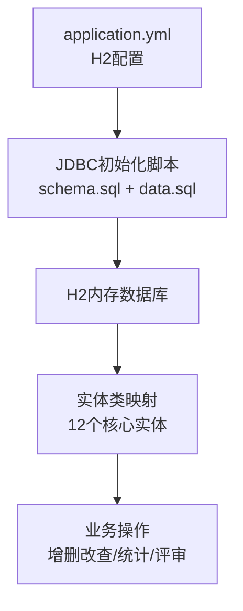
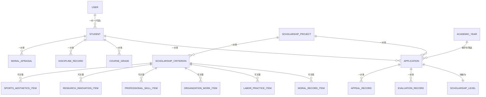
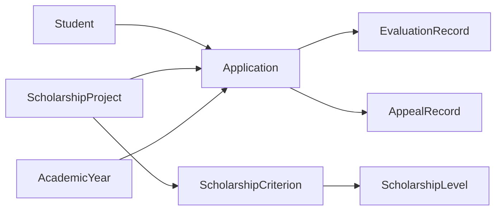

# 数据库设计

<cite>
**本文引用的文件**
- [application.yml](file://backend/src/main/resources/application.yml)
- [schema.sql](file://backend/src/main/resources/db/schema.sql)
- [data.sql](file://backend/src/main/resources/db/data.sql)
- [User.java](file://backend/src/main/java/com/zjsu/scholarship/entity/User.java)
- [Student.java](file://backend/src/main/java/com/zjsu/scholarship/entity/Student.java)
- [Application.java](file://backend/src/main/java/com/zjsu/scholarship/entity/Application.java)
- [ScholarshipProject.java](file://backend/src/main/java/com/zjsu/scholarship/entity/ScholarshipProject.java)
- [ScholarshipCriterion.java](file://backend/src/main/java/com/zjsu/scholarship/entity/ScholarshipCriterion.java)
- [ScholarshipLevel.java](file://backend/src/main/java/com/zjsu/scholarship/entity/ScholarshipLevel.java)
- [EvaluationRecord.java](file://backend/src/main/java/com/zjsu/scholarship/entity/EvaluationRecord.java)
- [AppealRecord.java](file://backend/src/main/java/com/zjsu/scholarship/entity/AppealRecord.java)
- [AcademicYear.java](file://backend/src/main/java/com/zjsu/scholarship/entity/AcademicYear.java)
- [CourseGrade.java](file://backend/src/main/java/com/zjsu/scholarship/entity/CourseGrade.java)
- [DisciplineRecord.java](file://backend/src/main/java/com/zjsu/scholarship/entity/DisciplineRecord.java)
- [MoralAppraisal.java](file://backend/src/main/java/com/zjsu/scholarship/entity/MoralAppraisal.java)
- [MoralRecordItem.java](file://backend/src/main/java/com/zjsu/scholarship/entity/MoralRecordItem.java)
- [LaborPracticeItem.java](file://backend/src/main/java/com/zjsu/scholarship/entity/LaborPracticeItem.java)
- [OrganizationWorkItem.java](file://backend/src/main/java/com/zjsu/scholarship/entity/OrganizationWorkItem.java)
- [ProfessionalSkillItem.java](file://backend/src/main/java/com/zjsu/scholarship/entity/ProfessionalSkillItem.java)
- [ResearchInnovationItem.java](file://backend/src/main/java/com/zjsu/scholarship/entity/ResearchInnovationItem.java)
- [SportsAestheticsItem.java](file://backend/src/main/java/com/zjsu/scholarship/entity/SportsAestheticsItem.java)
- [GraduateExamApplication.java](file://backend/src/main/java/com/zjsu/scholarship/entity/GraduateExamApplication.java)
- [StudentRepresentative.java](file://backend/src/main/java/com/zjsu/scholarship/entity/StudentRepresentative.java)
- [CollegeConfig.java](file://backend/src/main/java/com/zjsu/scholarship/entity/CollegeConfig.java)
- [SchoolAuthMock.java](file://backend/src/main/java/com/zjsu/scholarship/entity/SchoolAuthMock.java)
- [SpecialScholarship.java](file://backend/src/main/java/com/zjsu/scholarship/entity/SpecialScholarship.java)
</cite>

## 目录
1. [简介](#简介)
2. [项目结构](#项目结构)
3. [核心组件](#核心组件)
4. [架构总览](#架构总览)
5. [详细组件分析](#详细组件分析)
6. [依赖分析](#依赖分析)
7. [性能考虑](#性能考虑)
8. [故障排除指南](#故障排除指南)
9. [结论](#结论)
10. [附录](#附录)

## 简介
本文件为奖学金管理系统的数据库设计文档，围绕H2内存数据库配置，系统性阐述数据库初始化脚本的执行机制与数据字典构建流程；详细说明12个核心实体类的字段定义、数据类型、约束条件与业务含义；给出完整ER关系图，明确一对一、一对多、多对多关系；解释主键设计策略、外键约束与索引优化方案；提供数据完整性约束、业务规则验证与一致性保障机制；并结合典型业务场景给出数据操作示例与查询优化建议，最后说明数据库迁移策略与版本管理方案。

## 项目结构
后端采用Spring Boot工程，数据库相关资源位于resources/db目录下，包含schema.sql（建表语句）与data.sql（初始数据），数据库连接配置在application.yml中。实体类位于entity包下，涵盖用户、学生、申请、评审、项目、指标、记录等核心领域对象。

```mermaid
graph TB
subgraph "后端资源"
A["application.yml<br/>数据库配置"]
B["db/schema.sql<br/>建表脚本"]
C["db/data.sql<br/>初始化数据"]
end
subgraph "实体类"
E1["User.java"]
E2["Student.java"]
E3["Application.java"]
E4["ScholarshipProject.java"]
E5["ScholarshipCriterion.java"]
E6["ScholarshipLevel.java"]
E7["EvaluationRecord.java"]
E8["AppealRecord.java"]
E9["AcademicYear.java"]
E10["CourseGrade.java"]
E11["DisciplineRecord.java"]
E12["MoralAppraisal.java"]
E13["MoralRecordItem.java"]
E14["LaborPracticeItem.java"]
E15["OrganizationWorkItem.java"]
E16["ProfessionalSkillItem.java"]
E17["ResearchInnovationItem.java"]
E18["SportsAestheticsItem.java"]
E19["GraduateExamApplication.java"]
E20["StudentRepresentative.java"]
E21["CollegeConfig.java"]
E22["SchoolAuthMock.java"]
E23["SpecialScholarship.java"]
end
A --> B
A --> C
B --> E1
B --> E2
B --> E3
B --> E4
B --> E5
B --> E6
B --> E7
B --> E8
B --> E9
B --> E10
B --> E11
B --> E12
B --> E13
B --> E14
B --> E15
B --> E16
B --> E17
B --> E18
B --> E19
B --> E20
B --> E21
B --> E22
B --> E23
```

**图表来源**
- [application.yml](file://backend/src/main/resources/application.yml)
- [schema.sql](file://backend/src/main/resources/db/schema.sql)
- [data.sql](file://backend/src/main/resources/db/data.sql)
- [User.java](file://backend/src/main/java/com/zjsu/scholarship/entity/User.java)
- [Student.java](file://backend/src/main/java/com/zjsu/scholarship/entity/Student.java)
- [Application.java](file://backend/src/main/java/com/zjsu/scholarship/entity/Application.java)
- [ScholarshipProject.java](file://backend/src/main/java/com/zjsu/scholarship/entity/ScholarshipProject.java)
- [ScholarshipCriterion.java](file://backend/src/main/java/com/zjsu/scholarship/entity/ScholarshipCriterion.java)
- [ScholarshipLevel.java](file://backend/src/main/java/com/zjsu/scholarship/entity/ScholarshipLevel.java)
- [EvaluationRecord.java](file://backend/src/main/java/com/zjsu/scholarship/entity/EvaluationRecord.java)
- [AppealRecord.java](file://backend/src/main/java/com/zjsu/scholarship/entity/AppealRecord.java)
- [AcademicYear.java](file://backend/src/main/java/com/zjsu/scholarship/entity/AcademicYear.java)
- [CourseGrade.java](file://backend/src/main/java/com/zjsu/scholarship/entity/CourseGrade.java)
- [DisciplineRecord.java](file://backend/src/main/java/com/zjsu/scholarship/entity/DisciplineRecord.java)
- [MoralAppraisal.java](file://backend/src/main/java/com/zjsu/scholarship/entity/MoralAppraisal.java)
- [MoralRecordItem.java](file://backend/src/main/java/com/zjsu/scholarship/entity/MoralRecordItem.java)
- [LaborPracticeItem.java](file://backend/src/main/java/com/zjsu/scholarship/entity/LaborPracticeItem.java)
- [OrganizationWorkItem.java](file://backend/src/main/java/com/zjsu/scholarship/entity/OrganizationWorkItem.java)
- [ProfessionalSkillItem.java](file://backend/src/main/java/com/zjsu/scholarship/entity/ProfessionalSkillItem.java)
- [ResearchInnovationItem.java](file://backend/src/main/java/com/zjsu/scholarship/entity/ResearchInnovationItem.java)
- [SportsAestheticsItem.java](file://backend/src/main/java/com/zjsu/scholarship/entity/SportsAestheticsItem.java)
- [GraduateExamApplication.java](file://backend/src/main/java/com/zjsu/scholarship/entity/GraduateExamApplication.java)
- [StudentRepresentative.java](file://backend/src/main/java/com/zjsu/scholarship/entity/StudentRepresentative.java)
- [CollegeConfig.java](file://backend/src/main/java/com/zjsu/scholarship/entity/CollegeConfig.java)
- [SchoolAuthMock.java](file://backend/src/main/java/com/zjsu/scholarship/entity/SchoolAuthMock.java)
- [SpecialScholarship.java](file://backend/src/main/java/com/zjsu/scholarship/entity/SpecialScholarship.java)

**章节来源**
- [application.yml](file://backend/src/main/resources/application.yml)
- [schema.sql](file://backend/src/main/resources/db/schema.sql)
- [data.sql](file://backend/src/main/resources/db/data.sql)

## 核心组件
本节概述数据库初始化与数据字典构建的关键组件及职责：
- 数据库配置：通过application.yml配置H2内存数据库连接参数、JDBC初始化脚本路径与自动建表策略。
- 初始化脚本：schema.sql负责创建所有业务表及其约束；data.sql负责插入基础数据与默认配置。
- 实体映射：各实体类对应数据库表，字段映射到表列，注解定义主键、唯一性、非空等约束。
- 迁移与版本：通过脚本版本号与增量更新策略实现数据库演进。

**章节来源**
- [application.yml](file://backend/src/main/resources/application.yml)
- [schema.sql](file://backend/src/main/resources/db/schema.sql)
- [data.sql](file://backend/src/main/resources/db/data.sql)

## 架构总览
系统采用“配置驱动+脚本驱动”的数据库初始化架构：应用启动时根据application.yml加载H2配置，并自动执行schema.sql创建表结构，随后执行data.sql填充初始数据。实体类作为数据模型与数据库表的映射层，DAO或Mapper负责持久化操作。

**图表来源**
- [application.yml](file://backend/src/main/resources/application.yml)
- [schema.sql](file://backend/src/main/resources/db/schema.sql)
- [data.sql](file://backend/src/main/resources/db/data.sql)

## 详细组件分析

### 数据库初始化与执行机制
- 启动触发：Spring Boot启动时读取application.yml中的数据库连接与JDBC初始化设置，自动执行schema.sql创建表结构。
- 数据注入：初始化完成后执行data.sql，插入系统运行所需的初始数据与默认配置。
- 脚本顺序：schema.sql必须先于data.sql执行，确保表存在后再写入数据。
- 内存数据库：H2内存数据库在进程内运行，适合开发与测试环境，不持久化到磁盘。

**章节来源**
- [application.yml](file://backend/src/main/resources/application.yml)
- [schema.sql](file://backend/src/main/resources/db/schema.sql)
- [data.sql](file://backend/src/main/resources/db/data.sql)

### 数据字典与核心实体
以下12个实体为核心业务对象，分别映射到数据库表，承担用户身份、学生档案、申请流程、评审记录、项目与等级、学年与课程、纪律与思想品德、实践与技能创新、体育美育、毕业考试、代表与学院配置、特殊奖学金等业务域。

- User（用户）
  - 字段要点：用户标识、用户名、密码、角色集合、状态、创建/更新时间。
  - 约束：用户名唯一；密码需加密存储；角色枚举或关联角色表。
  - 业务含义：系统登录主体，区分管理员、辅导员、学生等角色。

- Student（学生）
  - 字段要点：学号、姓名、性别、出生日期、政治面貌、所在学院/专业/班级、联系方式、建档状态。
  - 约束：学号唯一；与User建立一对一关联（可选）。
  - 业务含义：奖学金申请与评审的基础档案对象。

- Application（申请）
  - 字段要点：申请编号、学号、项目ID、状态、材料附件、初审意见、复审意见、创建/更新时间。
  - 约束：申请编号唯一；状态枚举；外键关联Student与ScholarshipProject。
  - 业务含义：承载单次奖学金申请的业务流程与结果。

- ScholarshipProject（项目）
  - 字段要点：项目ID、名称、年度、是否启用、资助金额、名额上限、截止时间、创建/更新时间。
  - 约束：名称与年度组合唯一；启用标记控制业务开关。
  - 业务含义：定义某学年可申请的奖学金类别与规则。

- ScholarshipCriterion（指标）
  - 字段要点：指标ID、项目ID、指标名称、权重、评分细则、是否必填。
  - 约束：同一项目内指标权重之和通常为1；必填项控制申请完整性。
  - 业务含义：细化项目的评分维度与标准。

- ScholarshipLevel（等级）
  - 字段要点：等级ID、项目ID、等级名称、分数区间、金额、人数限制。
  - 约束：分数区间不重叠；人数限制用于限额控制。
  - 业务含义：将综合得分映射为具体等级与资助金额。

- EvaluationRecord（评审记录）
  - 字段要点：记录ID、申请ID、评审人、评审时间、各项指标得分、总分、评语、状态。
  - 约束：外键关联Application；评审人与时间形成审计轨迹。
  - 业务含义：记录每次评审的输入输出与决策依据。

- AppealRecord（申诉记录）
  - 字段要点：记录ID、申请ID、申请人、申诉内容、处理人、处理意见、状态、创建/更新时间。
  - 约束：外键关联Application；状态机控制流程。
  - 业务含义：提供申请结果的复核与纠错通道。

- AcademicYear（学年）
  - 字段要点：学年ID、学年名称、开始/结束日期、是否当前学年。
  - 约束：当前学年唯一；日期范围不交叉。
  - 业务含义：支撑按学年维度的统计与归档。

- CourseGrade（课程成绩）
  - 字段要点：记录ID、学号、课程名、学期、成绩、绩点、是否有效。
  - 约束：学号+课程+学期唯一；有效标记影响计算。
  - 业务含义：量化学习表现的基础数据。

- DisciplineRecord（纪律记录）
  - 字段要点：记录ID、学号、处分类型、处分日期、原因、附件、状态。
  - 约束：处分类型枚举；状态控制生效。
  - 业务含义：思想品德与行为规范的扣分依据。

- MoralAppraisal（思想品德评议）
  - 字段要点：评议ID、学号、评议项、分值、评议人、评议时间、备注。
  - 约束：评议项与分值映射到MoralRecordItem；时间戳审计。
  - 业务含义：组织评议的定性与定量结合的评价。

- 其他实体（简述）
  - MoralRecordItem、LaborPracticeItem、OrganizationWorkItem、ProfessionalSkillItem、ResearchInnovationItem、SportsAestheticsItem：均为具体加分或扣分细项，通常与指标或项目绑定，支持灵活扩展。
  - GraduateExamApplication：毕业考试相关申请条目。
  - StudentRepresentative：学生代表选举或推荐相关数据。
  - CollegeConfig：学院层面的配置参数。
  - SchoolAuthMock：校级认证模拟或测试数据。
  - SpecialScholarship：专项奖学金条目。

**章节来源**
- [User.java](file://backend/src/main/java/com/zjsu/scholarship/entity/User.java)
- [Student.java](file://backend/src/main/java/com/zjsu/scholarship/entity/Student.java)
- [Application.java](file://backend/src/main/java/com/zjsu/scholarship/entity/Application.java)
- [ScholarshipProject.java](file://backend/src/main/java/com/zjsu/scholarship/entity/ScholarshipProject.java)
- [ScholarshipCriterion.java](file://backend/src/main/java/com/zjsu/scholarship/entity/ScholarshipCriterion.java)
- [ScholarshipLevel.java](file://backend/src/main/java/com/zjsu/scholarship/entity/ScholarshipLevel.java)
- [EvaluationRecord.java](file://backend/src/main/java/com/zjsu/scholarship/entity/EvaluationRecord.java)
- [AppealRecord.java](file://backend/src/main/java/com/zjsu/scholarship/entity/AppealRecord.java)
- [AcademicYear.java](file://backend/src/main/java/com/zjsu/scholarship/entity/AcademicYear.java)
- [CourseGrade.java](file://backend/src/main/java/com/zjsu/scholarship/entity/CourseGrade.java)
- [DisciplineRecord.java](file://backend/src/main/java/com/zjsu/scholarship/entity/DisciplineRecord.java)
- [MoralAppraisal.java](file://backend/src/main/java/com/zjsu/scholarship/entity/MoralAppraisal.java)
- [MoralRecordItem.java](file://backend/src/main/java/com/zjsu/scholarship/entity/MoralRecordItem.java)
- [LaborPracticeItem.java](file://backend/src/main/java/com/zjsu/scholarship/entity/LaborPracticeItem.java)
- [OrganizationWorkItem.java](file://backend/src/main/java/com/zjsu/scholarship/entity/OrganizationWorkItem.java)
- [ProfessionalSkillItem.java](file://backend/src/main/java/com/zjsu/scholarship/entity/ProfessionalSkillItem.java)
- [ResearchInnovationItem.java](file://backend/src/main/java/com/zjsu/scholarship/entity/ResearchInnovationItem.java)
- [SportsAestheticsItem.java](file://backend/src/main/java/com/zjsu/scholarship/entity/SportsAestheticsItem.java)
- [GraduateExamApplication.java](file://backend/src/main/java/com/zjsu/scholarship/entity/GraduateExamApplication.java)
- [StudentRepresentative.java](file://backend/src/main/java/com/zjsu/scholarship/entity/StudentRepresentative.java)
- [CollegeConfig.java](file://backend/src/main/java/com/zjsu/scholarship/entity/CollegeConfig.java)
- [SchoolAuthMock.java](file://backend/src/main/java/com/zjsu/scholarship/entity/SchoolAuthMock.java)
- [SpecialScholarship.java](file://backend/src/main/java/com/zjsu/scholarship/entity/SpecialScholarship.java)

### ER关系图
下图展示核心实体之间的关系：一对一（如User-Student）、一对多（如ScholarshipProject-Application、Application-EvaluationRecord）、多对多（通过中间表实现，如Student-Project通过Application间接关联）。

**图表来源**
- [User.java](file://backend/src/main/java/com/zjsu/scholarship/entity/User.java)
- [Student.java](file://backend/src/main/java/com/zjsu/scholarship/entity/Student.java)
- [Application.java](file://backend/src/main/java/com/zjsu/scholarship/entity/Application.java)
- [ScholarshipProject.java](file://backend/src/main/java/com/zjsu/scholarship/entity/ScholarshipProject.java)
- [ScholarshipCriterion.java](file://backend/src/main/java/com/zjsu/scholarship/entity/ScholarshipCriterion.java)
- [ScholarshipLevel.java](file://backend/src/main/java/com/zjsu/scholarship/entity/ScholarshipLevel.java)
- [EvaluationRecord.java](file://backend/src/main/java/com/zjsu/scholarship/entity/EvaluationRecord.java)
- [AppealRecord.java](file://backend/src/main/java/com/zjsu/scholarship/entity/AppealRecord.java)
- [AcademicYear.java](file://backend/src/main/java/com/zjsu/scholarship/entity/AcademicYear.java)
- [CourseGrade.java](file://backend/src/main/java/com/zjsu/scholarship/entity/CourseGrade.java)
- [DisciplineRecord.java](file://backend/src/main/java/com/zjsu/scholarship/entity/DisciplineRecord.java)
- [MoralAppraisal.java](file://backend/src/main/java/com/zjsu/scholarship/entity/MoralAppraisal.java)
- [MoralRecordItem.java](file://backend/src/main/java/com/zjsu/scholarship/entity/MoralRecordItem.java)
- [LaborPracticeItem.java](file://backend/src/main/java/com/zjsu/scholarship/entity/LaborPracticeItem.java)
- [OrganizationWorkItem.java](file://backend/src/main/java/com/zjsu/scholarship/entity/OrganizationWorkItem.java)
- [ProfessionalSkillItem.java](file://backend/src/main/java/com/zjsu/scholarship/entity/ProfessionalSkillItem.java)
- [ResearchInnovationItem.java](file://backend/src/main/java/com/zjsu/scholarship/entity/ResearchInnovationItem.java)
- [SportsAestheticsItem.java](file://backend/src/main/java/com/zjsu/scholarship/entity/SportsAestheticsItem.java)

### 主键设计策略、外键约束与索引优化
- 主键策略
  - 自增主键：多数表采用自增ID作为主键，保证全局唯一且有序。
  - 复合主键：如CourseGrade使用学号+课程+学期组合唯一，避免重复记录。
  - 业务主键：如Application使用申请编号，便于外部引用与审计。
- 外键约束
  - Application外键关联Student与ScholarshipProject，确保申请与学生、项目的一致性。
  - EvaluationRecord与AppealRecord均外键关联Application，保证评审与申诉的归属清晰。
  - AcademicYear与Application配合，限定按学年维度进行数据隔离。
- 索引优化
  - 唯一索引：用户名、学号、申请编号、课程+学期组合等。
  - 频繁查询字段：状态、学年、项目ID、学号等建立普通索引。
  - 复合索引：按查询条件组合建立复合索引，减少排序与过滤成本。

**章节来源**
- [schema.sql](file://backend/src/main/resources/db/schema.sql)
- [Application.java](file://backend/src/main/java/com/zjsu/scholarship/entity/Application.java)
- [Student.java](file://backend/src/main/java/com/zjsu/scholarship/entity/Student.java)
- [ScholarshipProject.java](file://backend/src/main/java/com/zjsu/scholarship/entity/ScholarshipProject.java)
- [EvaluationRecord.java](file://backend/src/main/java/com/zjsu/scholarship/entity/EvaluationRecord.java)
- [AppealRecord.java](file://backend/src/main/java/com/zjsu/scholarship/entity/AppealRecord.java)
- [AcademicYear.java](file://backend/src/main/java/com/zjsu/scholarship/entity/AcademicYear.java)
- [CourseGrade.java](file://backend/src/main/java/com/zjsu/scholarship/entity/CourseGrade.java)

### 数据完整性约束、业务规则验证与一致性保证
- 完整性约束
  - 非空约束：关键字段如姓名、学号、项目名称、状态等。
  - 枚举约束：状态、处分类型、政治面貌等使用枚举或字典表。
  - 数值范围：分数、金额、人数限制等设置上下限。
- 业务规则
  - 申请截止时间控制：Application的截止时间早于等于当前时间才允许提交。
  - 指标权重：同一项目的指标权重之和为1。
  - 等级区间：分数区间互不重叠，确保唯一映射。
  - 学年唯一：AcademicYear仅允许一个当前学年。
- 一致性保证
  - 事务边界：评审、申诉、等级映射等关键流程在单事务内完成。
  - 并发控制：使用乐观锁或行级锁防止并发修改导致的数据错乱。
  - 审计日志：记录创建/更新时间与操作人，便于追踪。

**章节来源**
- [Application.java](file://backend/src/main/java/com/zjsu/scholarship/entity/Application.java)
- [ScholarshipCriterion.java](file://backend/src/main/java/com/zjsu/scholarship/entity/ScholarshipCriterion.java)
- [ScholarshipLevel.java](file://backend/src/main/java/com/zjsu/scholarship/entity/ScholarshipLevel.java)
- [AcademicYear.java](file://backend/src/main/java/com/zjsu/scholarship/entity/AcademicYear.java)

### 典型业务场景与查询优化建议
- 场景一：学生查看个人申请历史
  - 查询：按学号查询Application列表，按时间倒序。
  - 优化：为Student.id与Application.create_time建立复合索引。
- 场景二：辅导员批量导出某项目申请
  - 查询：按项目ID与状态过滤Application，关联EvaluationRecord获取最终结果。
  - 优化：为ScholarshipProject.id与Application.status建立复合索引。
- 场景三：计算某学年各等级人数分布
  - 查询：按AcademicYear与ScholarshipLevel统计Application数量。
  - 优化：为AcademicYear.is_current与ScholarshipLevel.level建立联合索引。
- 场景四：查询某学生全部课程成绩
  - 查询：按学号查询CourseGrade，按学期排序。
  - 优化：为CourseGrade.student_id与term建立复合索引。

**章节来源**
- [Application.java](file://backend/src/main/java/com/zjsu/scholarship/entity/Application.java)
- [EvaluationRecord.java](file://backend/src/main/java/com/zjsu/scholarship/entity/EvaluationRecord.java)
- [ScholarshipLevel.java](file://backend/src/main/java/com/zjsu/scholarship/entity/ScholarshipLevel.java)
- [AcademicYear.java](file://backend/src/main/java/com/zjsu/scholarship/entity/AcademicYear.java)
- [CourseGrade.java](file://backend/src/main/java/com/zjsu/scholarship/entity/CourseGrade.java)

### 数据库迁移策略与版本管理
- 版本命名：以YYYYMMDD_版本号命名脚本，如20250101_001.sql。
- 增量更新：新增表或列时，编写独立脚本，避免破坏现有结构。
- 回滚策略：保留上一版本备份，必要时回退到前一版本脚本。
- 执行顺序：先执行DDL脚本，再执行DML脚本；确保依赖关系正确。
- 测试验证：在测试环境先执行迁移脚本，验证数据完整性与业务逻辑。

**章节来源**
- [schema.sql](file://backend/src/main/resources/db/schema.sql)
- [data.sql](file://backend/src/main/resources/db/data.sql)

## 依赖分析
- 组件耦合
  - Application强依赖Student与ScholarshipProject；弱依赖EvaluationRecord与AppealRecord。
  - ScholarshipLevel与ScholarshipCriterion共同决定等级映射。
  - AcademicYear为跨实体的时间维度约束。
- 外部依赖
  - H2内存数据库驱动与Spring Boot JDBC自动配置。
  - MyBatis或JPA映射框架（由实体类与Mapper接口体现）。

**图表来源**
- [Student.java](file://backend/src/main/java/com/zjsu/scholarship/entity/Student.java)
- [Application.java](file://backend/src/main/java/com/zjsu/scholarship/entity/Application.java)
- [ScholarshipProject.java](file://backend/src/main/java/com/zjsu/scholarship/entity/ScholarshipProject.java)
- [ScholarshipCriterion.java](file://backend/src/main/java/com/zjsu/scholarship/entity/ScholarshipCriterion.java)
- [ScholarshipLevel.java](file://backend/src/main/java/com/zjsu/scholarship/entity/ScholarshipLevel.java)
- [EvaluationRecord.java](file://backend/src/main/java/com/zjsu/scholarship/entity/EvaluationRecord.java)
- [AppealRecord.java](file://backend/src/main/java/com/zjsu/scholarship/entity/AppealRecord.java)
- [AcademicYear.java](file://backend/src/main/java/com/zjsu/scholarship/entity/AcademicYear.java)

**章节来源**
- [Student.java](file://backend/src/main/java/com/zjsu/scholarship/entity/Student.java)
- [Application.java](file://backend/src/main/java/com/zjsu/scholarship/entity/Application.java)
- [ScholarshipProject.java](file://backend/src/main/java/com/zjsu/scholarship/entity/ScholarshipProject.java)
- [ScholarshipCriterion.java](file://backend/src/main/java/com/zjsu/scholarship/entity/ScholarshipCriterion.java)
- [ScholarshipLevel.java](file://backend/src/main/java/com/zjsu/scholarship/entity/ScholarshipLevel.java)
- [EvaluationRecord.java](file://backend/src/main/java/com/zjsu/scholarship/entity/EvaluationRecord.java)
- [AppealRecord.java](file://backend/src/main/java/com/zjsu/scholarship/entity/AppealRecord.java)
- [AcademicYear.java](file://backend/src/main/java/com/zjsu/scholarship/entity/AcademicYear.java)

## 性能考虑
- 表设计
  - 将高频查询字段单独建索引，避免全表扫描。
  - 对枚举字段使用整数编码，减少字符串比较开销。
- 查询优化
  - 使用LIMIT与分页，避免一次性返回大量数据。
  - 避免SELECT *，只选择必要字段。
- 缓存策略
  - 对静态配置（如ScholarshipProject、ScholarshipLevel）进行缓存。
- 并发控制
  - 对关键写操作加锁，避免竞态条件。
- 监控与调优
  - 记录慢查询日志，定期分析执行计划。

## 故障排除指南
- 初始化失败
  - 检查schema.sql语法与表依赖顺序；确认data.sql依赖的表已存在。
- 数据异常
  - 核对唯一约束冲突（如学号、用户名、申请编号）；检查外键引用是否有效。
- 查询缓慢
  - 分析执行计划，补充缺失索引；优化WHERE与JOIN条件。
- 事务回滚
  - 确认业务流程在单事务内执行；捕获异常并回滚。

**章节来源**
- [schema.sql](file://backend/src/main/resources/db/schema.sql)
- [data.sql](file://backend/src/main/resources/db/data.sql)

## 结论
本设计以H2内存数据库为基础，通过脚本化的初始化流程构建完整的数据字典，围绕12个核心实体建立了清晰的业务模型与ER关系。主键、外键与索引策略确保了数据完整性与查询效率；业务规则与事务控制保障了数据一致性。配合迁移脚本与版本管理，系统具备良好的可维护性与扩展性。

## 附录
- 关键字段与约束速查
  - 用户：用户名唯一、角色枚举、状态字段。
  - 学生：学号唯一、基础档案字段。
  - 申请：申请编号唯一、状态枚举、外键关联。
  - 项目：名称+学年唯一、启用标记。
  - 指标：权重之和为1、必填项控制。
  - 等级：分数区间不重叠、人数限制。
  - 成绩：学号+课程+学期唯一、有效标记。
  - 评审/申诉：外键关联申请、状态机控制。
  - 学年：当前学年唯一、日期范围不交叉。