# Mapper接口设计

<cite>
**本文档引用的文件**
- [AcademicYearMapper.java](file://backend/src/main/java/com/zjsu/scholarship/mapper/AcademicYearMapper.java)
- [AppealRecordMapper.java](file://backend/src/main/java/com/zjsu/scholarship/mapper/AppealRecordMapper.java)
- [ApplicationMapper.java](file://backend/src/main/java/com/zjsu/scholarship/mapper/ApplicationMapper.java)
- [CollegeConfigMapper.java](file://backend/src/main/java/com/zjsu/scholarship/mapper/CollegeConfigMapper.java)
- [CourseGradeMapper.java](file://backend/src/main/java/com/zjsu/scholarship/mapper/CourseGradeMapper.java)
- [DisciplineRecordMapper.java](file://backend/src/main/java/com/zjsu/scholarship/mapper/DisciplineRecordMapper.java)
- [EvaluationRecordMapper.java](file://backend/src/main/java/com/zjsu/scholarship/mapper/EvaluationRecordMapper.java)
- [GraduateExamApplicationMapper.java](file://backend/src/main/java/com/zjsu/scholarship/mapper/GraduateExamApplicationMapper.java)
- [LaborPracticeItemMapper.java](file://backend/src/main/java/com/zjsu/scholarship/mapper/LaborPracticeItemMapper.java)
- [MoralAppraisalMapper.java](file://backend/src/main/java/com/zjsu/scholarship/mapper/MoralAppraisalMapper.java)
- [MoralRecordItemMapper.java](file://backend/src/main/java/com/zjsu/scholarship/mapper/MoralRecordItemMapper.java)
- [OrganizationWorkItemMapper.java](file://backend/src/main/java/com/zjsu/scholarship/mapper/OrganizationWorkItemMapper.java)
- [ProfessionalSkillItemMapper.java](file://backend/src/main/java/com/zjsu/scholarship/mapper/ProfessionalSkillItemMapper.java)
- [ResearchInnovationItemMapper.java](file://backend/src/main/java/com/zjsu/scholarship/mapper/ResearchInnovationItemMapper.java)
- [ScholarshipCriterionMapper.java](file://backend/src/main/java/com/zjsu/scholarship/mapper/ScholarshipCriterionMapper.java)
- [ScholarshipLevelMapper.java](file://backend/src/main/java/com/zjsu/scholarship/mapper/ScholarshipLevelMapper.java)
- [ScholarshipProjectMapper.java](file://backend/src/main/java/com/zjsu/scholarship/mapper/ScholarshipProjectMapper.java)
- [SchoolAuthMockMapper.java](file://backend/src/main/java/com/zjsu/scholarship/mapper/SchoolAuthMockMapper.java)
- [SpecialScholarshipMapper.java](file://backend/src/main/java/com/zjsu/scholarship/mapper/SpecialScholarshipMapper.java)
- [SportsAestheticsItemMapper.java](file://backend/src/main/java/com/zjsu/scholarship/mapper/SportsAestheticsItemMapper.java)
- [StudentMapper.java](file://backend/src/main/java/com/zjsu/scholarship/mapper/StudentMapper.java)
- [StudentRepresentativeMapper.java](file://backend/src/main/java/com/zjsu/scholarship/mapper/StudentRepresentativeMapper.java)
- [UserMapper.java](file://backend/src/main/java/com/zjsu/scholarship/mapper/UserMapper.java)
</cite>

## 目录
1. [引言](#引言)
2. [项目结构](#项目结构)
3. [核心组件](#核心组件)
4. [架构总览](#架构总览)
5. [详细组件分析](#详细组件分析)
6. [依赖分析](#依赖分析)
7. [性能考虑](#性能考虑)
8. [故障排查指南](#故障排查指南)
9. [结论](#结论)
10. [附录](#附录)

## 引言
本文件系统性梳理奖学金管理系统中21个Mapper接口的设计理念与实现策略，重点覆盖以下方面：
- 基础CRUD标准实现：统一基于MyBatis-Plus的BaseMapper继承模式，确保标准增删改查能力的一致性。
- 自定义方法设计：在保持统一风格的前提下，为复杂业务场景扩展查询与统计方法。
- 复杂查询模式：条件查询、联表查询与聚合查询的实现技巧与最佳实践。
- 批量操作、分页查询与动态SQL：在不直接编写XML的情况下，通过条件构造器与分页对象实现高效查询。
- 与Service层交互协议：参数传递、返回值处理与异常传播机制的约定。
- 命名规范、方法签名与注释规范：统一的开发标准以提升可维护性与协作效率。

## 项目结构
奖学金管理系统的后端采用典型的分层架构，其中Mapper层位于数据访问层，负责与数据库交互。所有Mapper接口均位于包com.zjsu.scholarship.mapper下，遵循“实体类名+Mapper”的命名规范，且绝大多数直接继承MyBatis-Plus的BaseMapper，以获得标准CRUD能力。

```mermaid
graph TB
subgraph "数据访问层(Mapper)"
A["AcademicYearMapper"]
B["AppealRecordMapper"]
C["ApplicationMapper"]
D["CollegeConfigMapper"]
E["CourseGradeMapper"]
F["DisciplineRecordMapper"]
G["EvaluationRecordMapper"]
H["GraduateExamApplicationMapper"]
I["LaborPracticeItemMapper"]
J["MoralAppraisalMapper"]
K["MoralRecordItemMapper"]
L["OrganizationWorkItemMapper"]
M["ProfessionalSkillItemMapper"]
N["ResearchInnovationItemMapper"]
O["ScholarshipCriterionMapper"]
P["ScholarshipLevelMapper"]
Q["ScholarshipProjectMapper"]
R["SchoolAuthMockMapper"]
S["SpecialScholarshipMapper"]
T["SportsAestheticsItemMapper"]
U["StudentMapper"]
V["StudentRepresentativeMapper"]
W["UserMapper"]
end
subgraph "实体层(Entity)"
X["AcademicYear"]
Y["AppealRecord"]
Z["Application"]
AA["CollegeConfig"]
BB["CourseGrade"]
CC["DisciplineRecord"]
DD["EvaluationRecord"]
EE["GraduateExamApplication"]
FF["LaborPracticeItem"]
GG["MoralAppraisal"]
HH["MoralRecordItem"]
II["OrganizationWorkItem"]
JJ["ProfessionalSkillItem"]
KK["ResearchInnovationItem"]
LL["ScholarshipCriterion"]
MM["ScholarshipLevel"]
NN["ScholarshipProject"]
OO["SchoolAuthMock"]
PP["SpecialScholarship"]
QQ["SportsAestheticsItem"]
RR["Student"]
SS["StudentRepresentative"]
TT["User"]
end
A --- X
B --- Y
C --- Z
D --- AA
E --- BB
F --- CC
G --- DD
H --- EE
I --- FF
J --- GG
K --- HH
L --- II
M --- JJ
N --- KK
O --- LL
P --- MM
Q --- NN
R --- OO
S --- PP
T --- QQ
U --- RR
V --- SS
W --- TT
```

图表来源
- [AcademicYearMapper.java:1-8](file://backend/src/main/java/com/zjsu/scholarship/mapper/AcademicYearMapper.java#L1-L8)
- [AppealRecordMapper.java:1-10](file://backend/src/main/java/com/zjsu/scholarship/mapper/AppealRecordMapper.java#L1-L10)
- [ApplicationMapper.java:1-8](file://backend/src/main/java/com/zjsu/scholarship/mapper/ApplicationMapper.java#L1-L8)
- [CollegeConfigMapper.java:1-10](file://backend/src/main/java/com/zjsu/scholarship/mapper/CollegeConfigMapper.java#L1-L10)
- [CourseGradeMapper.java:1-8](file://backend/src/main/java/com/zjsu/scholarship/mapper/CourseGradeMapper.java#L1-L8)
- [DisciplineRecordMapper.java:1-10](file://backend/src/main/java/com/zjsu/scholarship/mapper/DisciplineRecordMapper.java#L1-L10)
- [EvaluationRecordMapper.java:1-8](file://backend/src/main/java/com/zjsu/scholarship/mapper/EvaluationRecordMapper.java#L1-L8)
- [GraduateExamApplicationMapper.java:1-10](file://backend/src/main/java/com/zjsu/scholarship/mapper/GraduateExamApplicationMapper.java#L1-L10)
- [LaborPracticeItemMapper.java:1-8](file://backend/src/main/java/com/zjsu/scholarship/mapper/LaborPracticeItemMapper.java#L1-L8)
- [MoralAppraisalMapper.java:1-8](file://backend/src/main/java/com/zjsu/scholarship/mapper/MoralAppraisalMapper.java#L1-L8)
- [MoralRecordItemMapper.java:1-8](file://backend/src/main/java/com/zjsu/scholarship/mapper/MoralRecordItemMapper.java#L1-L8)
- [OrganizationWorkItemMapper.java:1-8](file://backend/src/main/java/com/zjsu/scholarship/mapper/OrganizationWorkItemMapper.java#L1-L8)
- [ProfessionalSkillItemMapper.java:1-8](file://backend/src/main/java/com/zjsu/scholarship/mapper/ProfessionalSkillItemMapper.java#L1-L8)
- [ResearchInnovationItemMapper.java:1-8](file://backend/src/main/java/com/zjsu/scholarship/mapper/ResearchInnovationItemMapper.java#L1-L8)
- [ScholarshipCriterionMapper.java:1-8](file://backend/src/main/java/com/zjsu/scholarship/mapper/ScholarshipCriterionMapper.java#L1-L8)
- [ScholarshipLevelMapper.java:1-8](file://backend/src/main/java/com/zjsu/scholarship/mapper/ScholarshipLevelMapper.java#L1-L8)
- [ScholarshipProjectMapper.java](file://backend/src/main/java/com/zjsu/scholarship/mapper/ScholarshipProjectMapper.java)
- [SchoolAuthMockMapper.java](file://backend/src/main/java/com/zjsu/scholarship/mapper/SchoolAuthMockMapper.java)
- [SpecialScholarshipMapper.java](file://backend/src/main/java/com/zjsu/scholarship/mapper/SpecialScholarshipMapper.java)
- [SportsAestheticsItemMapper.java](file://backend/src/main/java/com/zjsu/scholarship/mapper/SportsAestheticsItemMapper.java)
- [StudentMapper.java](file://backend/src/main/java/com/zjsu/scholarship/mapper/StudentMapper.java)
- [StudentRepresentativeMapper.java](file://backend/src/main/java/com/zjsu/scholarship/mapper/StudentRepresentativeMapper.java)
- [UserMapper.java](file://backend/src/main/java/com/zjsu/scholarship/mapper/UserMapper.java)

章节来源
- [AcademicYearMapper.java:1-8](file://backend/src/main/java/com/zjsu/scholarship/mapper/AcademicYearMapper.java#L1-L8)
- [AppealRecordMapper.java:1-10](file://backend/src/main/java/com/zjsu/scholarship/mapper/AppealRecordMapper.java#L1-L10)
- [ApplicationMapper.java:1-8](file://backend/src/main/java/com/zjsu/scholarship/mapper/ApplicationMapper.java#L1-L8)
- [CollegeConfigMapper.java:1-10](file://backend/src/main/java/com/zjsu/scholarship/mapper/CollegeConfigMapper.java#L1-L10)
- [CourseGradeMapper.java:1-8](file://backend/src/main/java/com/zjsu/scholarship/mapper/CourseGradeMapper.java#L1-L8)
- [DisciplineRecordMapper.java:1-10](file://backend/src/main/java/com/zjsu/scholarship/mapper/DisciplineRecordMapper.java#L1-L10)
- [EvaluationRecordMapper.java:1-8](file://backend/src/main/java/com/zjsu/scholarship/mapper/EvaluationRecordMapper.java#L1-L8)
- [GraduateExamApplicationMapper.java:1-10](file://backend/src/main/java/com/zjsu/scholarship/mapper/GraduateExamApplicationMapper.java#L1-L10)
- [LaborPracticeItemMapper.java:1-8](file://backend/src/main/java/com/zjsu/scholarship/mapper/LaborPracticeItemMapper.java#L1-L8)
- [MoralAppraisalMapper.java:1-8](file://backend/src/main/java/com/zjsu/scholarship/mapper/MoralAppraisalMapper.java#L1-L8)
- [MoralRecordItemMapper.java:1-8](file://backend/src/main/java/com/zjsu/scholarship/mapper/MoralRecordItemMapper.java#L1-L8)
- [OrganizationWorkItemMapper.java:1-8](file://backend/src/main/java/com/zjsu/scholarship/mapper/OrganizationWorkItemMapper.java#L1-L8)
- [ProfessionalSkillItemMapper.java:1-8](file://backend/src/main/java/com/zjsu/scholarship/mapper/ProfessionalSkillItemMapper.java#L1-L8)
- [ResearchInnovationItemMapper.java:1-8](file://backend/src/main/java/com/zjsu/scholarship/mapper/ResearchInnovationItemMapper.java#L1-L8)
- [ScholarshipCriterionMapper.java:1-8](file://backend/src/main/java/com/zjsu/scholarship/mapper/ScholarshipCriterionMapper.java#L1-L8)
- [ScholarshipLevelMapper.java:1-8](file://backend/src/main/java/com/zjsu/scholarship/mapper/ScholarshipLevelMapper.java#L1-L8)
- [ScholarshipProjectMapper.java](file://backend/src/main/java/com/zjsu/scholarship/mapper/ScholarshipProjectMapper.java)
- [SchoolAuthMockMapper.java](file://backend/src/main/java/com/zjsu/scholarship/mapper/SchoolAuthMockMapper.java)
- [SpecialScholarshipMapper.java](file://backend/src/main/java/com/zjsu/scholarship/mapper/SpecialScholarshipMapper.java)
- [SportsAestheticsItemMapper.java](file://backend/src/main/java/com/zjsu/scholarship/mapper/SportsAestheticsItemMapper.java)
- [StudentMapper.java](file://backend/src/main/java/com/zjsu/scholarship/mapper/StudentMapper.java)
- [StudentRepresentativeMapper.java](file://backend/src/main/java/com/zjsu/scholarship/mapper/StudentRepresentativeMapper.java)
- [UserMapper.java](file://backend/src/main/java/com/zjsu/scholarship/mapper/UserMapper.java)

## 核心组件
- 统一基类：所有Mapper接口均继承MyBatis-Plus的BaseMapper，从而自动获得标准CRUD、分页查询、条件构造器等能力。
- 注解策略：部分Mapper显式标注@Mapper，用于明确声明为Spring管理的组件；其余通过扫描路径或配置自动注册。
- 实体映射：每个Mapper对应一个实体类，保证类型安全与代码一致性。
- 扩展点：对于复杂查询（条件查询、联表查询、聚合查询），可在现有基础上扩展自定义方法，避免过度依赖XML。

章节来源
- [AcademicYearMapper.java:1-8](file://backend/src/main/java/com/zjsu/scholarship/mapper/AcademicYearMapper.java#L1-L8)
- [AppealRecordMapper.java:1-10](file://backend/src/main/java/com/zjsu/scholarship/mapper/AppealRecordMapper.java#L1-L10)
- [ApplicationMapper.java:1-8](file://backend/src/main/java/com/zjsu/scholarship/mapper/ApplicationMapper.java#L1-L8)
- [CollegeConfigMapper.java:1-10](file://backend/src/main/java/com/zjsu/scholarship/mapper/CollegeConfigMapper.java#L1-L10)
- [CourseGradeMapper.java:1-8](file://backend/src/main/java/com/zjsu/scholarship/mapper/CourseGradeMapper.java#L1-L8)
- [DisciplineRecordMapper.java:1-10](file://backend/src/main/java/com/zjsu/scholarship/mapper/DisciplineRecordMapper.java#L1-L10)
- [EvaluationRecordMapper.java:1-8](file://backend/src/main/java/com/zjsu/scholarship/mapper/EvaluationRecordMapper.java#L1-L8)
- [GraduateExamApplicationMapper.java:1-10](file://backend/src/main/java/com/zjsu/scholarship/mapper/GraduateExamApplicationMapper.java#L1-L10)
- [LaborPracticeItemMapper.java:1-8](file://backend/src/main/java/com/zjsu/scholarship/mapper/LaborPracticeItemMapper.java#L1-L8)
- [MoralAppraisalMapper.java:1-8](file://backend/src/main/java/com/zjsu/scholarship/mapper/MoralAppraisalMapper.java#L1-L8)
- [MoralRecordItemMapper.java:1-8](file://backend/src/main/java/com/zjsu/scholarship/mapper/MoralRecordItemMapper.java#L1-L8)
- [OrganizationWorkItemMapper.java:1-8](file://backend/src/main/java/com/zjsu/scholarship/mapper/OrganizationWorkItemMapper.java#L1-L8)
- [ProfessionalSkillItemMapper.java:1-8](file://backend/src/main/java/com/zjsu/scholarship/mapper/ProfessionalSkillItemMapper.java#L1-L8)
- [ResearchInnovationItemMapper.java:1-8](file://backend/src/main/java/com/zjsu/scholarship/mapper/ResearchInnovationItemMapper.java#L1-L8)
- [ScholarshipCriterionMapper.java:1-8](file://backend/src/main/java/com/zjsu/scholarship/mapper/ScholarshipCriterionMapper.java#L1-L8)
- [ScholarshipLevelMapper.java:1-8](file://backend/src/main/java/com/zjsu/scholarship/mapper/ScholarshipLevelMapper.java#L1-L8)
- [ScholarshipProjectMapper.java](file://backend/src/main/java/com/zjsu/scholarship/mapper/ScholarshipProjectMapper.java)
- [SchoolAuthMockMapper.java](file://backend/src/main/java/com/zjsu/scholarship/mapper/SchoolAuthMockMapper.java)
- [SpecialScholarshipMapper.java](file://backend/src/main/java/com/zjsu/scholarship/mapper/SpecialScholarshipMapper.java)
- [SportsAestheticsItemMapper.java](file://backend/src/main/java/com/zjsu/scholarship/mapper/SportsAestheticsItemMapper.java)
- [StudentMapper.java](file://backend/src/main/java/com/zjsu/scholarship/mapper/StudentMapper.java)
- [StudentRepresentativeMapper.java](file://backend/src/main/java/com/zjsu/scholarship/mapper/StudentRepresentativeMapper.java)
- [UserMapper.java](file://backend/src/main/java/com/zjsu/scholarship/mapper/UserMapper.java)

## 架构总览
下图展示了Mapper层与实体层的关系，以及与Service层的交互边界。Mapper层仅负责数据存取，不包含业务逻辑，业务逻辑由Service层承担。

```mermaid
graph TB
subgraph "表现层(Controller)"
C1["AdminController"]
C2["AuthController"]
C3["CounselorController"]
C4["PublicController"]
C5["StudentController"]
end
subgraph "服务层(Service)"
S1["AuthService"]
S2["EvaluationService"]
S3["RankingService"]
S4["ScholarshipService"]
S5["ScoreCalcService"]
end
subgraph "数据访问层(Mapper)"
M1["UserMapper"]
M2["StudentMapper"]
M3["ApplicationMapper"]
M4["EvaluationRecordMapper"]
M5["ScholarshipProjectMapper"]
M6["ScholarshipLevelMapper"]
M7["ScholarshipCriterionMapper"]
M8["CourseGradeMapper"]
M9["DisciplineRecordMapper"]
M10["AppealRecordMapper"]
M11["GraduateExamApplicationMapper"]
M12["LaborPracticeItemMapper"]
M13["MoralAppraisalMapper"]
M14["MoralRecordItemMapper"]
M15["OrganizationWorkItemMapper"]
M16["ProfessionalSkillItemMapper"]
M17["ResearchInnovationItemMapper"]
M18["SportsAestheticsItemMapper"]
M19["StudentRepresentativeMapper"]
M20["AcademicYearMapper"]
M21["CollegeConfigMapper"]
M22["SchoolAuthMockMapper"]
M23["SpecialScholarshipMapper"]
end
subgraph "实体层(Entity)"
E1["User"]
E2["Student"]
E3["Application"]
E4["EvaluationRecord"]
E5["ScholarshipProject"]
E6["ScholarshipLevel"]
E7["ScholarshipCriterion"]
E8["CourseGrade"]
E9["DisciplineRecord"]
E10["AppealRecord"]
E11["GraduateExamApplication"]
E12["LaborPracticeItem"]
E13["MoralAppraisal"]
E14["MoralRecordItem"]
E15["OrganizationWorkItem"]
E16["ProfessionalSkillItem"]
E17["ResearchInnovationItem"]
E18["SportsAestheticsItem"]
E19["StudentRepresentative"]
E20["AcademicYear"]
E21["CollegeConfig"]
E22["SchoolAuthMock"]
E23["SpecialScholarship"]
end
C1 --> S1
C2 --> S1
C3 --> S2
C4 --> S4
C5 --> S5
S1 --> M1
S2 --> M2
S2 --> M3
S2 --> M4
S2 --> M5
S2 --> M6
S2 --> M7
S2 --> M8
S2 --> M9
S2 --> M10
S2 --> M11
S2 --> M12
S2 --> M13
S2 --> M14
S2 --> M15
S2 --> M16
S2 --> M17
S2 --> M18
S2 --> M19
S2 --> M20
S2 --> M21
S2 --> M22
S2 --> M23
M1 --> E1
M2 --> E2
M3 --> E3
M4 --> E4
M5 --> E5
M6 --> E6
M7 --> E7
M8 --> E8
M9 --> E9
M10 --> E10
M11 --> E11
M12 --> E12
M13 --> E13
M14 --> E14
M15 --> E15
M16 --> E16
M17 --> E17
M18 --> E18
M19 --> E19
M20 --> E20
M21 --> E21
M22 --> E22
M23 --> E23
```

图表来源
- [UserMapper.java](file://backend/src/main/java/com/zjsu/scholarship/mapper/UserMapper.java)
- [StudentMapper.java](file://backend/src/main/java/com/zjsu/scholarship/mapper/StudentMapper.java)
- [ApplicationMapper.java:1-8](file://backend/src/main/java/com/zjsu/scholarship/mapper/ApplicationMapper.java#L1-L8)
- [EvaluationRecordMapper.java:1-8](file://backend/src/main/java/com/zjsu/scholarship/mapper/EvaluationRecordMapper.java#L1-L8)
- [ScholarshipProjectMapper.java](file://backend/src/main/java/com/zjsu/scholarship/mapper/ScholarshipProjectMapper.java)
- [ScholarshipLevelMapper.java:1-8](file://backend/src/main/java/com/zjsu/scholarship/mapper/ScholarshipLevelMapper.java#L1-L8)
- [ScholarshipCriterionMapper.java:1-8](file://backend/src/main/java/com/zjsu/scholarship/mapper/ScholarshipCriterionMapper.java#L1-L8)
- [CourseGradeMapper.java:1-8](file://backend/src/main/java/com/zjsu/scholarship/mapper/CourseGradeMapper.java#L1-L8)
- [DisciplineRecordMapper.java:1-10](file://backend/src/main/java/com/zjsu/scholarship/mapper/DisciplineRecordMapper.java#L1-L10)
- [AppealRecordMapper.java:1-10](file://backend/src/main/java/com/zjsu/scholarship/mapper/AppealRecordMapper.java#L1-L10)
- [GraduateExamApplicationMapper.java:1-10](file://backend/src/main/java/com/zjsu/scholarship/mapper/GraduateExamApplicationMapper.java#L1-L10)
- [LaborPracticeItemMapper.java:1-8](file://backend/src/main/java/com/zjsu/scholarship/mapper/LaborPracticeItemMapper.java#L1-L8)
- [MoralAppraisalMapper.java:1-8](file://backend/src/main/java/com/zjsu/scholarship/mapper/MoralAppraisalMapper.java#L1-L8)
- [MoralRecordItemMapper.java:1-8](file://backend/src/main/java/com/zjsu/scholarship/mapper/MoralRecordItemMapper.java#L1-L8)
- [OrganizationWorkItemMapper.java:1-8](file://backend/src/main/java/com/zjsu/scholarship/mapper/OrganizationWorkItemMapper.java#L1-L8)
- [ProfessionalSkillItemMapper.java:1-8](file://backend/src/main/java/com/zjsu/scholarship/mapper/ProfessionalSkillItemMapper.java#L1-L8)
- [ResearchInnovationItemMapper.java:1-8](file://backend/src/main/java/com/zjsu/scholarship/mapper/ResearchInnovationItemMapper.java#L1-L8)
- [SportsAestheticsItemMapper.java](file://backend/src/main/java/com/zjsu/scholarship/mapper/SportsAestheticsItemMapper.java)
- [StudentRepresentativeMapper.java](file://backend/src/main/java/com/zjsu/scholarship/mapper/StudentRepresentativeMapper.java)
- [AcademicYearMapper.java:1-8](file://backend/src/main/java/com/zjsu/scholarship/mapper/AcademicYearMapper.java#L1-L8)
- [CollegeConfigMapper.java:1-10](file://backend/src/main/java/com/zjsu/scholarship/mapper/CollegeConfigMapper.java#L1-L10)
- [SchoolAuthMockMapper.java](file://backend/src/main/java/com/zjsu/scholarship/mapper/SchoolAuthMockMapper.java)
- [SpecialScholarshipMapper.java](file://backend/src/main/java/com/zjsu/scholarship/mapper/SpecialScholarshipMapper.java)

## 详细组件分析

### 基础CRUD与通用Mapper接口
- 设计理念：所有Mapper接口统一继承BaseMapper，以获得标准CRUD、分页查询、条件构造器等能力，减少重复代码，提升一致性。
- 实现策略：
  - 新增：使用insert(entity)，自动填充主键与时间戳（若实体有相关字段）。
  - 删除：使用deleteById(id)、deleteBatchIds(ids)、按条件删除delete(Wrapper)。
  - 更新：使用update(entity, Wrapper)、updateById(entity)。
  - 查询：使用selectById(id)、selectBatchIds(ids)、selectOne(Wrapper)、selectList(Wrapper)、selectPage(Page, Wrapper)。
- 适用范围：适用于所有实体的常规数据操作，无需额外XML配置。

章节来源
- [AcademicYearMapper.java:1-8](file://backend/src/main/java/com/zjsu/scholarship/mapper/AcademicYearMapper.java#L1-L8)
- [AppealRecordMapper.java:1-10](file://backend/src/main/java/com/zjsu/scholarship/mapper/AppealRecordMapper.java#L1-L10)
- [ApplicationMapper.java:1-8](file://backend/src/main/java/com/zjsu/scholarship/mapper/ApplicationMapper.java#L1-L8)
- [CourseGradeMapper.java:1-8](file://backend/src/main/java/com/zjsu/scholarship/mapper/CourseGradeMapper.java#L1-L8)
- [DisciplineRecordMapper.java:1-10](file://backend/src/main/java/com/zjsu/scholarship/mapper/DisciplineRecordMapper.java#L1-L10)
- [EvaluationRecordMapper.java:1-8](file://backend/src/main/java/com/zjsu/scholarship/mapper/EvaluationRecordMapper.java#L1-L8)
- [GraduateExamApplicationMapper.java:1-10](file://backend/src/main/java/com/zjsu/scholarship/mapper/GraduateExamApplicationMapper.java#L1-L10)
- [LaborPracticeItemMapper.java:1-8](file://backend/src/main/java/com/zjsu/scholarship/mapper/LaborPracticeItemMapper.java#L1-L8)
- [MoralAppraisalMapper.java:1-8](file://backend/src/main/java/com/zjsu/scholarship/mapper/MoralAppraisalMapper.java#L1-L8)
- [MoralRecordItemMapper.java:1-8](file://backend/src/main/java/com/zjsu/scholarship/mapper/MoralRecordItemMapper.java#L1-L8)
- [OrganizationWorkItemMapper.java:1-8](file://backend/src/main/java/com/zjsu/scholarship/mapper/OrganizationWorkItemMapper.java#L1-L8)
- [ProfessionalSkillItemMapper.java:1-8](file://backend/src/main/java/com/zjsu/scholarship/mapper/ProfessionalSkillItemMapper.java#L1-L8)
- [ResearchInnovationItemMapper.java:1-8](file://backend/src/main/java/com/zjsu/scholarship/mapper/ResearchInnovationItemMapper.java#L1-L8)
- [ScholarshipCriterionMapper.java:1-8](file://backend/src/main/java/com/zjsu/scholarship/mapper/ScholarshipCriterionMapper.java#L1-L8)
- [ScholarshipLevelMapper.java:1-8](file://backend/src/main/java/com/zjsu/scholarship/mapper/ScholarshipLevelMapper.java#L1-L8)
- [StudentMapper.java](file://backend/src/main/java/com/zjsu/scholarship/mapper/StudentMapper.java)
- [StudentRepresentativeMapper.java](file://backend/src/main/java/com/zjsu/scholarship/mapper/StudentRepresentativeMapper.java)
- [UserMapper.java](file://backend/src/main/java/com/zjsu/scholarship/mapper/UserMapper.java)

### 复杂查询方法设计模式
- 条件查询：通过Wrapper（如QueryWrapper、UpdateWrapper）构建条件，支持等值、范围、模糊、排序、分组等。
- 联表查询：优先在Service层通过多表关联查询，Mapper层提供独立查询方法，避免在XML中拼接复杂SQL。
- 聚合查询：使用聚合函数（count、sum、avg、max、min）与分组统计，结合条件过滤与排序。
- 动态SQL：通过条件构造器动态拼接where子句，避免手写XML，提高可维护性。

章节来源
- [EvaluationRecordMapper.java:1-8](file://backend/src/main/java/com/zjsu/scholarship/mapper/EvaluationRecordMapper.java#L1-L8)
- [ScholarshipProjectMapper.java](file://backend/src/main/java/com/zjsu/scholarship/mapper/ScholarshipProjectMapper.java)
- [ScholarshipLevelMapper.java:1-8](file://backend/src/main/java/com/zjsu/scholarship/mapper/ScholarshipLevelMapper.java#L1-L8)
- [ScholarshipCriterionMapper.java:1-8](file://backend/src/main/java/com/zjsu/scholarship/mapper/ScholarshipCriterionMapper.java#L1-L8)
- [CourseGradeMapper.java:1-8](file://backend/src/main/java/com/zjsu/scholarship/mapper/CourseGradeMapper.java#L1-L8)
- [DisciplineRecordMapper.java:1-10](file://backend/src/main/java/com/zjsu/scholarship/mapper/DisciplineRecordMapper.java#L1-L10)
- [AppealRecordMapper.java:1-10](file://backend/src/main/java/com/zjsu/scholarship/mapper/AppealRecordMapper.java#L1-L10)
- [GraduateExamApplicationMapper.java:1-10](file://backend/src/main/java/com/zjsu/scholarship/mapper/GraduateExamApplicationMapper.java#L1-L10)
- [LaborPracticeItemMapper.java:1-8](file://backend/src/main/java/com/zjsu/scholarship/mapper/LaborPracticeItemMapper.java#L1-L8)
- [MoralAppraisalMapper.java:1-8](file://backend/src/main/java/com/zjsu/scholarship/mapper/MoralAppraisalMapper.java#L1-L8)
- [MoralRecordItemMapper.java:1-8](file://backend/src/main/java/com/zjsu/scholarship/mapper/MoralRecordItemMapper.java#L1-L8)
- [OrganizationWorkItemMapper.java:1-8](file://backend/src/main/java/com/zjsu/scholarship/mapper/OrganizationWorkItemMapper.java#L1-L8)
- [ProfessionalSkillItemMapper.java:1-8](file://backend/src/main/java/com/zjsu/scholarship/mapper/ProfessionalSkillItemMapper.java#L1-L8)
- [ResearchInnovationItemMapper.java:1-8](file://backend/src/main/java/com/zjsu/scholarship/mapper/ResearchInnovationItemMapper.java#L1-L8)
- [SportsAestheticsItemMapper.java](file://backend/src/main/java/com/zjsu/scholarship/mapper/SportsAestheticsItemMapper.java)
- [StudentRepresentativeMapper.java](file://backend/src/main/java/com/zjsu/scholarship/mapper/StudentRepresentativeMapper.java)
- [AcademicYearMapper.java:1-8](file://backend/src/main/java/com/zjsu/scholarship/mapper/AcademicYearMapper.java#L1-L8)
- [CollegeConfigMapper.java:1-10](file://backend/src/main/java/com/zjsu/scholarship/mapper/CollegeConfigMapper.java#L1-L10)
- [SchoolAuthMockMapper.java](file://backend/src/main/java/com/zjsu/scholarship/mapper/SchoolAuthMockMapper.java)
- [SpecialScholarshipMapper.java](file://backend/src/main/java/com/zjsu/scholarship/mapper/SpecialScholarshipMapper.java)

### 批量操作与分页查询
- 批量操作：使用BaseMapper提供的批量插入、批量更新、批量删除方法，确保事务一致性与性能。
- 分页查询：使用IPage与Page对象进行分页，配合Wrapper构建查询条件，返回分页结果集。
- 性能优化：合理设置分页大小，避免一次性加载大量数据；对高频查询建立索引。

章节来源
- [StudentMapper.java](file://backend/src/main/java/com/zjsu/scholarship/mapper/StudentMapper.java)
- [EvaluationRecordMapper.java:1-8](file://backend/src/main/java/com/zjsu/scholarship/mapper/EvaluationRecordMapper.java#L1-L8)
- [ApplicationMapper.java:1-8](file://backend/src/main/java/com/zjsu/scholarship/mapper/ApplicationMapper.java#L1-L8)

### Mapper与Service层交互协议
- 参数传递：Service层向Mapper传递实体对象、主键ID、条件包装器、分页对象等。
- 返回值处理：Mapper返回单个实体、集合、分页对象或影响行数；Service层根据返回值执行后续逻辑。
- 异常传播：Mapper抛出的数据访问异常由Service层捕获并转换为业务异常，最终由全局异常处理器统一处理。

章节来源
- [UserMapper.java](file://backend/src/main/java/com/zjsu/scholarship/mapper/UserMapper.java)
- [GlobalExceptionHandler.java](file://backend/src/main/java/com/zjsu/scholarship/common/GlobalExceptionHandler.java)
- [BusinessException.java](file://backend/src/main/java/com/zjsu/scholarship/common/BusinessException.java)

### 命名规范、方法签名与注释规范
- 命名规范：接口名采用“实体名+Mapper”，包名采用“com.zjsu.scholarship.mapper”。
- 方法签名：遵循BaseMapper标准方法签名，必要时在接口内新增自定义方法，保持与BaseMapper一致的返回类型与参数风格。
- 注释规范：为关键方法添加简要注释，说明用途、参数含义与返回值语义，便于后续维护。

章节来源
- [AcademicYearMapper.java:1-8](file://backend/src/main/java/com/zjsu/scholarship/mapper/AcademicYearMapper.java#L1-L8)
- [AppealRecordMapper.java:1-10](file://backend/src/main/java/com/zjsu/scholarship/mapper/AppealRecordMapper.java#L1-L10)
- [ApplicationMapper.java:1-8](file://backend/src/main/java/com/zjsu/scholarship/mapper/ApplicationMapper.java#L1-L8)
- [EvaluationRecordMapper.java:1-8](file://backend/src/main/java/com/zjsu/scholarship/mapper/EvaluationRecordMapper.java#L1-L8)
- [ScholarshipProjectMapper.java](file://backend/src/main/java/com/zjsu/scholarship/mapper/ScholarshipProjectMapper.java)
- [UserMapper.java](file://backend/src/main/java/com/zjsu/scholarship/mapper/UserMapper.java)

## 依赖分析
- 内聚性：每个Mapper专注于单一实体的数据访问，内聚性强。
- 耦合度：Mapper之间无直接耦合，仅通过Service层间接协作，降低模块间耦合。
- 外部依赖：统一依赖MyBatis-Plus的BaseMapper与相关工具类，保证跨实体的一致性。

```mermaid
graph TB
subgraph "Mapper接口"
MA["AcademicYearMapper"]
MB["AppealRecordMapper"]
MC["ApplicationMapper"]
MD["EvaluationRecordMapper"]
ME["ScholarshipProjectMapper"]
MF["ScholarshipLevelMapper"]
MG["ScholarshipCriterionMapper"]
MH["CourseGradeMapper"]
MI["DisciplineRecordMapper"]
MJ["AppealRecordMapper"]
MK["GraduateExamApplicationMapper"]
ML["LaborPracticeItemMapper"]
MN["MoralAppraisalMapper"]
MO["MoralRecordItemMapper"]
MP["OrganizationWorkItemMapper"]
MQ["ProfessionalSkillItemMapper"]
MR["ResearchInnovationItemMapper"]
MS["SportsAestheticsItemMapper"]
MT["StudentMapper"]
MU["StudentRepresentativeMapper"]
MV["UserMapper"]
end
subgraph "外部库"
B["MyBatis-Plus BaseMapper"]
end
MA --> B
MB --> B
MC --> B
MD --> B
ME --> B
MF --> B
MG --> B
MH --> B
MI --> B
MJ --> B
MK --> B
ML --> B
MN --> B
MO --> B
MP --> B
MQ --> B
MR --> B
MS --> B
MT --> B
MU --> B
MV --> B
```

图表来源
- [AcademicYearMapper.java:1-8](file://backend/src/main/java/com/zjsu/scholarship/mapper/AcademicYearMapper.java#L1-L8)
- [AppealRecordMapper.java:1-10](file://backend/src/main/java/com/zjsu/scholarship/mapper/AppealRecordMapper.java#L1-L10)
- [ApplicationMapper.java:1-8](file://backend/src/main/java/com/zjsu/scholarship/mapper/ApplicationMapper.java#L1-L8)
- [EvaluationRecordMapper.java:1-8](file://backend/src/main/java/com/zjsu/scholarship/mapper/EvaluationRecordMapper.java#L1-L8)
- [ScholarshipProjectMapper.java](file://backend/src/main/java/com/zjsu/scholarship/mapper/ScholarshipProjectMapper.java)
- [ScholarshipLevelMapper.java:1-8](file://backend/src/main/java/com/zjsu/scholarship/mapper/ScholarshipLevelMapper.java#L1-L8)
- [ScholarshipCriterionMapper.java:1-8](file://backend/src/main/java/com/zjsu/scholarship/mapper/ScholarshipCriterionMapper.java#L1-L8)
- [CourseGradeMapper.java:1-8](file://backend/src/main/java/com/zjsu/scholarship/mapper/CourseGradeMapper.java#L1-L8)
- [DisciplineRecordMapper.java:1-10](file://backend/src/main/java/com/zjsu/scholarship/mapper/DisciplineRecordMapper.java#L1-L10)
- [AppealRecordMapper.java:1-10](file://backend/src/main/java/com/zjsu/scholarship/mapper/AppealRecordMapper.java#L1-L10)
- [GraduateExamApplicationMapper.java:1-10](file://backend/src/main/java/com/zjsu/scholarship/mapper/GraduateExamApplicationMapper.java#L1-L10)
- [LaborPracticeItemMapper.java:1-8](file://backend/src/main/java/com/zjsu/scholarship/mapper/LaborPracticeItemMapper.java#L1-L8)
- [MoralAppraisalMapper.java:1-8](file://backend/src/main/java/com/zjsu/scholarship/mapper/MoralAppraisalMapper.java#L1-L8)
- [MoralRecordItemMapper.java:1-8](file://backend/src/main/java/com/zjsu/scholarship/mapper/MoralRecordItemMapper.java#L1-L8)
- [OrganizationWorkItemMapper.java:1-8](file://backend/src/main/java/com/zjsu/scholarship/mapper/OrganizationWorkItemMapper.java#L1-L8)
- [ProfessionalSkillItemMapper.java:1-8](file://backend/src/main/java/com/zjsu/scholarship/mapper/ProfessionalSkillItemMapper.java#L1-L8)
- [ResearchInnovationItemMapper.java:1-8](file://backend/src/main/java/com/zjsu/scholarship/mapper/ResearchInnovationItemMapper.java#L1-L8)
- [SportsAestheticsItemMapper.java](file://backend/src/main/java/com/zjsu/scholarship/mapper/SportsAestheticsItemMapper.java)
- [StudentMapper.java](file://backend/src/main/java/com/zjsu/scholarship/mapper/StudentMapper.java)
- [StudentRepresentativeMapper.java](file://backend/src/main/java/com/zjsu/scholarship/mapper/StudentRepresentativeMapper.java)
- [UserMapper.java](file://backend/src/main/java/com/zjsu/scholarship/mapper/UserMapper.java)

## 性能考虑
- 索引优化：为常用查询字段（如学号、姓名、项目ID、状态等）建立索引，提升查询性能。
- 分页策略：合理设置每页大小，避免超大偏移量导致的性能问题；必要时使用覆盖索引。
- 缓存策略：对热点数据与统计结果进行缓存，减少数据库压力。
- SQL优化：尽量使用条件构造器生成SQL，避免手写复杂SQL；对频繁使用的复杂查询封装为自定义方法，便于复用与优化。

## 故障排查指南
- 常见问题：
  - 数据库连接失败：检查数据源配置与网络连通性。
  - SQL语法错误：确认条件构造器拼接是否正确，字段名与表名是否匹配。
  - 分页数据为空：检查分页参数与查询条件，确认是否存在数据。
- 排查步骤：
  - 在Service层打印Mapper返回值，定位是查询失败还是数据为空。
  - 使用日志记录SQL执行情况，核对生成的SQL与预期是否一致。
  - 检查全局异常处理器，确认异常是否被正确转换为业务异常。

章节来源
- [GlobalExceptionHandler.java](file://backend/src/main/java/com/zjsu/scholarship/common/GlobalExceptionHandler.java)
- [BusinessException.java](file://backend/src/main/java/com/zjsu/scholarship/common/BusinessException.java)

## 结论
奖学金管理系统中的21个Mapper接口采用统一的BaseMapper继承模式，实现了标准化的CRUD能力与良好的扩展性。通过条件构造器与分页对象，能够高效完成复杂查询、联表查询与聚合统计。配合清晰的命名规范、方法签名与注释规范，以及与Service层的明确交互协议，整体架构具备高内聚、低耦合与强可维护性的特点。建议在后续迭代中持续完善复杂查询的自定义方法，并加强缓存与索引策略以进一步提升性能。

## 附录
- 使用场景示例（以路径代替具体代码）：
  - 条件查询：参考[ApplicationMapper.java:1-8](file://backend/src/main/java/com/zjsu/scholarship/mapper/ApplicationMapper.java#L1-L8)与[CourseGradeMapper.java:1-8](file://backend/src/main/java/com/zjsu/scholarship/mapper/CourseGradeMapper.java#L1-L8)的条件构造器用法。
  - 分页查询：参考[StudentMapper.java](file://backend/src/main/java/com/zjsu/scholarship/mapper/StudentMapper.java)的分页调用方式。
  - 聚合统计：参考[EvaluationRecordMapper.java:1-8](file://backend/src/main/java/com/zjsu/scholarship/mapper/EvaluationRecordMapper.java#L1-L8)的聚合查询方法。
  - 批量操作：参考各Mapper继承的BaseMapper提供的批量方法，如批量插入、批量更新、批量删除。
- 最佳实践清单：
  - 统一使用BaseMapper标准方法，必要时在接口内新增自定义方法。
  - 对复杂查询使用条件构造器，避免手写XML。
  - 合理设置分页大小，避免超大数据量查询。
  - 为高频查询字段建立索引，提升查询性能。
  - 在Service层集中处理异常，确保异常传播的一致性。