# MyBatis-Plus配置

<cite>
**本文档引用的文件**
- [application.yml](file://backend/src/main/resources/application.yml)
- [pom.xml](file://backend/pom.xml)
- [ScholarshipApplication.java](file://backend/src/main/java/com/zjsu/scholarship/ScholarshipApplication.java)
- [CollegeConfig.java](file://backend/src/main/java/com/zjsu/scholarship/entity/CollegeConfig.java)
- [CollegeConfigMapper.java](file://backend/src/main/java/com/zjsu/scholarship/mapper/CollegeConfigMapper.java)
- [AcademicYear.java](file://backend/src/main/java/com/zjsu/scholarship/entity/AcademicYear.java)
- [AppealRecord.java](file://backend/src/main/java/com/zjsu/scholarship/entity/AppealRecord.java)
- [Application.java](file://backend/src/main/java/com/zjsu/scholarship/entity/Application.java)
- [Student.java](file://backend/src/main/java/com/zjsu/scholarship/entity/Student.java)
- [User.java](file://backend/src/main/java/com/zjsu/scholarship/entity/User.java)
- [AcademicYearMapper.java](file://backend/src/main/java/com/zjsu/scholarship/mapper/AcademicYearMapper.java)
- [AppealRecordMapper.java](file://backend/src/main/java/com/zjsu/scholarship/mapper/AppealRecordMapper.java)
- [ApplicationMapper.java](file://backend/src/main/java/com/zjsu/scholarship/mapper/ApplicationMapper.java)
- [StudentMapper.java](file://backend/src/main/java/com/zjsu/scholarship/mapper/StudentMapper.java)
- [UserMapper.java](file://backend/src/main/java/com/zjsu/scholarship/mapper/UserMapper.java)
- [Wrappers.java](file://backend/src/main/java/com/zjsu/scholarship/controller/AdminController.java)
</cite>

## 目录
1. [简介](#简介)
2. [项目结构](#项目结构)
3. [核心组件](#核心组件)
4. [架构概览](#架构概览)
5. [详细组件分析](#详细组件分析)
6. [依赖分析](#依赖分析)
7. [性能考虑](#性能考虑)
8. [故障排除指南](#故障排除指南)
9. [结论](#结论)

## 简介

MyBatis-Plus是MyBatis的增强工具，为简化开发而生。在奖学金管理系统中，MyBatis-Plus提供了以下核心功能：

- **实体类扫描配置**：通过注解驱动的实体类映射
- **自动填充策略**：统一的数据创建和更新时间管理
- **逻辑删除配置**：软删除机制保护数据完整性
- **分页插件设置**：高效的数据分页处理
- **数据库连接配置**：H2内存数据库的开发环境配置

## 项目结构

奖学金管理系统的MyBatis-Plus配置主要分布在以下几个关键位置：

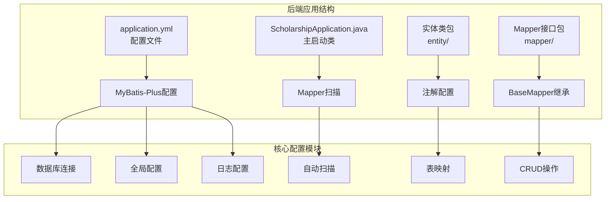

**图表来源**
- [application.yml:34-41](file://backend/src/main/resources/application.yml#L34-L41)
- [ScholarshipApplication.java:2](file://backend/src/main/java/com/zjsu/scholarship/ScholarshipApplication.java#L2)

**章节来源**
- [application.yml:1-51](file://backend/src/main/resources/application.yml#L1-L51)
- [pom.xml:20-40](file://backend/pom.xml#L20-L40)

## 核心组件

### 数据库连接配置

系统使用H2内存数据库进行开发和测试：

| 配置项 | 值 | 说明 |
|--------|-----|------|
| 数据源URL | jdbc:h2:file:./data/scholarship | 文件型H2数据库，支持持久化存储 |
| 驱动类名 | org.h2.Driver | H2数据库驱动程序 |
| 用户名 | sa | 默认管理员用户名 |
| 密码 | 空值 | 开发环境默认无密码 |

### MyBatis-Plus全局配置

系统采用最小化配置策略：

| 配置项 | 值 | 作用 |
|--------|-----|------|
| map-underscore-to-camel-case | true | 下划线到驼峰命名自动转换 |
| id-type | auto | 主键自增策略 |
| 日志实现 | NoLoggingImpl | 生产环境禁用日志输出 |

**章节来源**
- [application.yml:11-41](file://backend/src/main/resources/application.yml#L11-L41)

## 架构概览

MyBatis-Plus在奖学金管理系统中的整体架构：

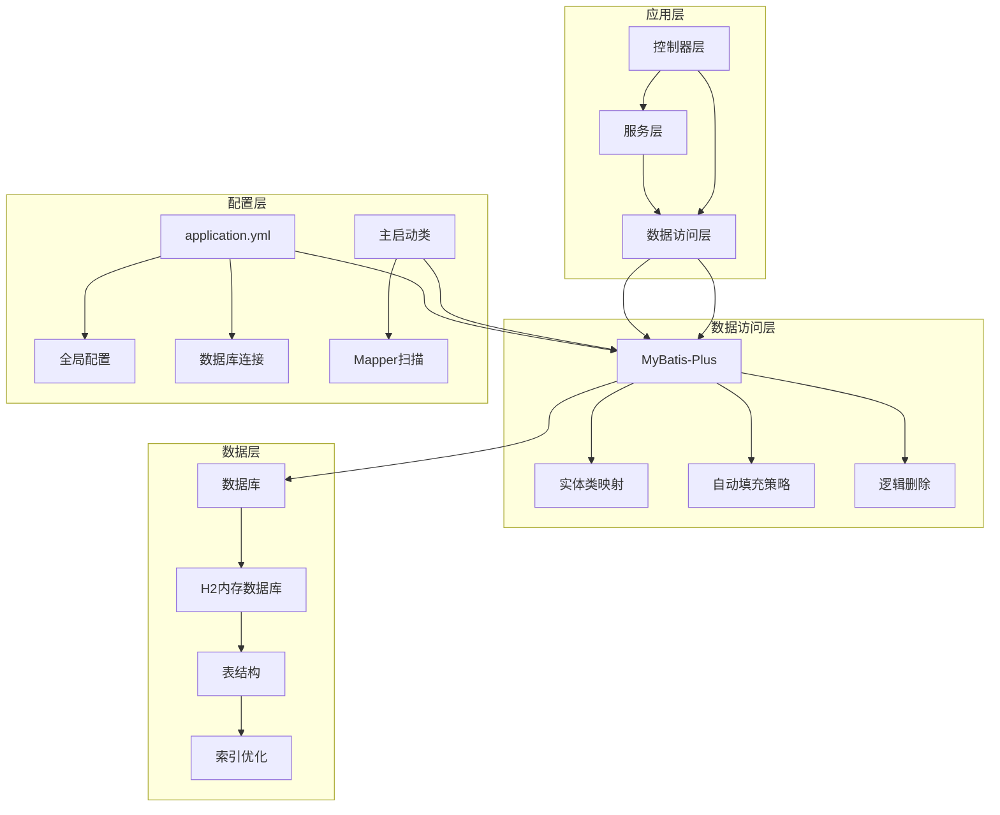

**图表来源**
- [application.yml:34-41](file://backend/src/main/resources/application.yml#L34-L41)
- [ScholarshipApplication.java:2](file://backend/src/main/java/com/zjsu/scholarship/ScholarshipApplication.java#L2)

## 详细组件分析

### 实体类扫描配置

系统通过注解驱动的方式实现实体类的自动扫描和映射：

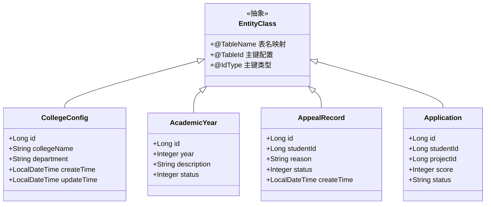

**图表来源**
- [CollegeConfig.java:1-4](file://backend/src/main/java/com/zjsu/scholarship/entity/CollegeConfig.java#L1-L4)
- [AcademicYear.java:1-4](file://backend/src/main/java/com/zjsu/scholarship/entity/AcademicYear.java#L1-L4)
- [AppealRecord.java:1-4](file://backend/src/main/java/com/zjsu/scholarship/entity/AppealRecord.java#L1-L4)
- [Application.java:1-4](file://backend/src/main/java/com/zjsu/scholarship/entity/Application.java#L1-L4)

#### 实体类注解配置要点

每个实体类都使用了MyBatis-Plus的核心注解：

| 注解 | 用途 | 示例 |
|------|------|------|
| @TableName | 指定数据库表名 | @TableName("college_config") |
| @TableId | 定义主键字段 | @TableId(value = "id", type = IdType.AUTO) |
| @IdType | 主键生成策略 | IdType.AUTO 自增 |

**章节来源**
- [CollegeConfig.java:1-4](file://backend/src/main/java/com/zjsu/scholarship/entity/CollegeConfig.java#L1-L4)
- [AcademicYear.java:1-4](file://backend/src/main/java/com/zjsu/scholarship/entity/AcademicYear.java#L1-L4)
- [AppealRecord.java:1-4](file://backend/src/main/java/com/zjsu/scholarship/entity/AppealRecord.java#L1-L4)
- [Application.java:1-4](file://backend/src/main/java/com/zjsu/scholarship/entity/Application.java#L1-L4)

### 自动填充策略配置

系统实现了统一的数据创建和更新时间管理：

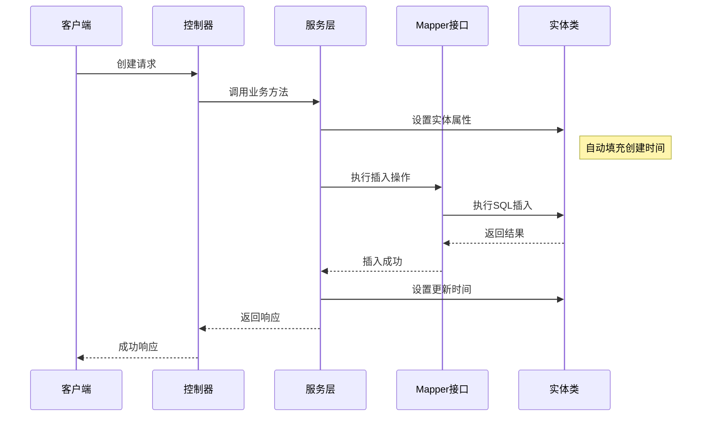

**图表来源**
- [CollegeConfig.java:1-4](file://backend/src/main/java/com/zjsu/scholarship/entity/CollegeConfig.java#L1-L4)

### 逻辑删除配置

系统采用逻辑删除策略保护重要数据：

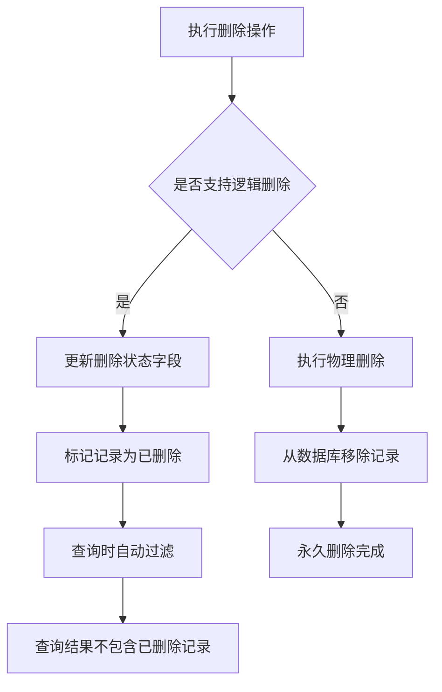

**图表来源**
- [application.yml:38-41](file://backend/src/main/resources/application.yml#L38-L41)

### 分页插件设置

系统配置了基础的分页功能：

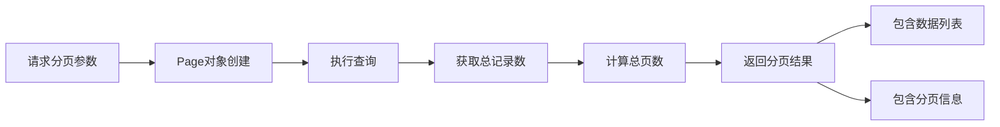

**图表来源**
- [application.yml:34-41](file://backend/src/main/resources/application.yml#L34-L41)

**章节来源**
- [application.yml:34-41](file://backend/src/main/resources/application.yml#L34-L41)

### 数据库连接配置

系统使用H2内存数据库进行开发：

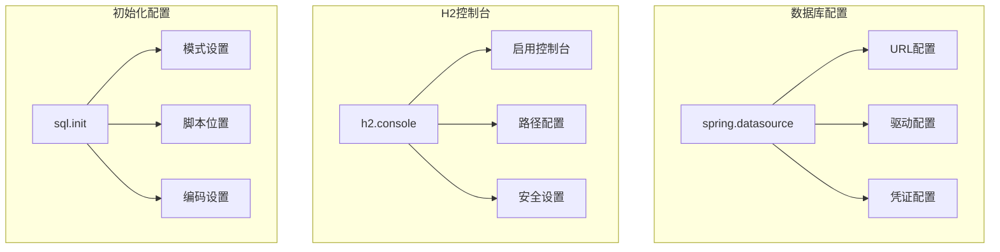

**图表来源**
- [application.yml:11-28](file://backend/src/main/resources/application.yml#L11-L28)

**章节来源**
- [application.yml:11-28](file://backend/src/main/resources/application.yml#L11-L28)

## 依赖分析

### Maven依赖配置

系统使用MyBatis-Plus 3.5.5版本：

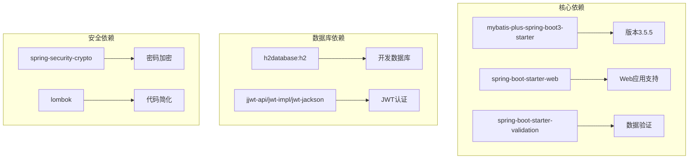

**图表来源**
- [pom.xml:26-76](file://backend/pom.xml#L26-L76)

### Spring Boot集成方式

系统通过自动配置实现MyBatis-Plus集成：

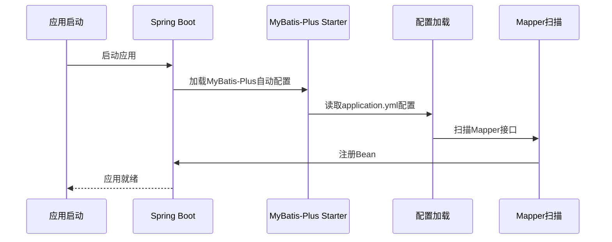

**图表来源**
- [pom.xml:36-40](file://backend/pom.xml#L36-L40)
- [application.yml:34-41](file://backend/src/main/resources/application.yml#L34-L41)

**章节来源**
- [pom.xml:20-40](file://backend/pom.xml#L20-L40)
- [ScholarshipApplication.java:2](file://backend/src/main/java/com/zjsu/scholarship/ScholarshipApplication.java#L2)

## 性能考虑

### 连接池配置建议

虽然当前使用H2内存数据库，但生产环境建议配置连接池：

| 参数 | 建议值 | 说明 |
|------|--------|------|
| maximum-pool-size | 20 | 最大连接数 |
| minimum-idle | 5 | 最小空闲连接 |
| connection-timeout | 30000 | 连接超时时间(ms) |
| idle-timeout | 600000 | 空闲超时时间(ms) |
| max-lifetime | 1800000 | 连接最大生命周期 |

### 批量操作优化

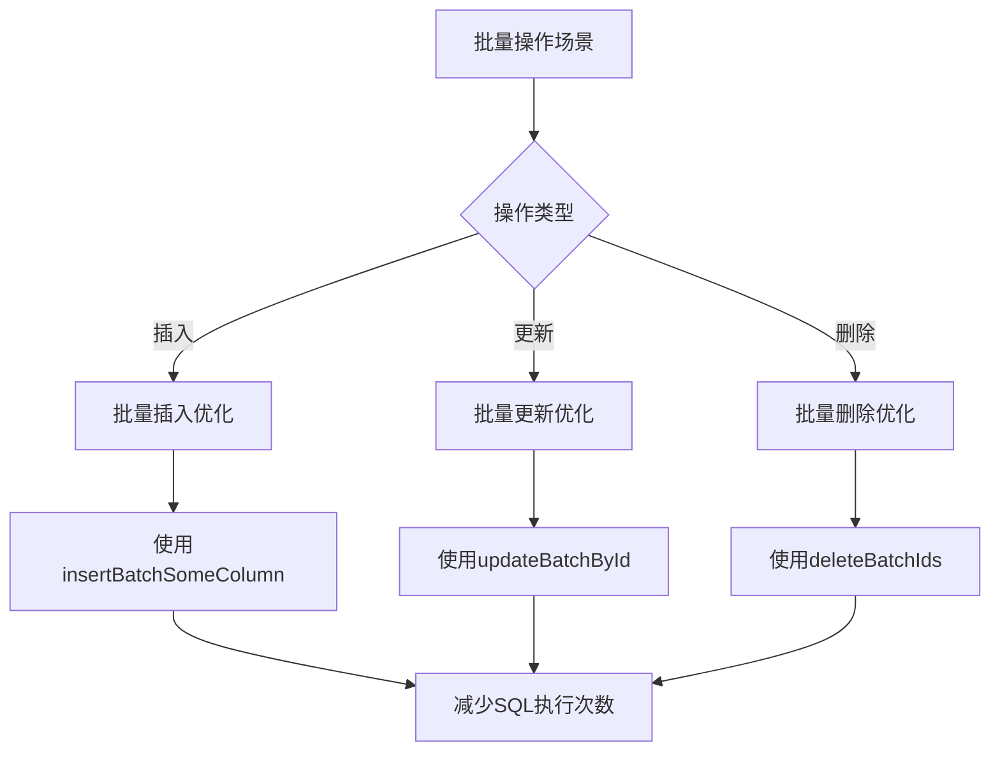

### 查询缓存策略

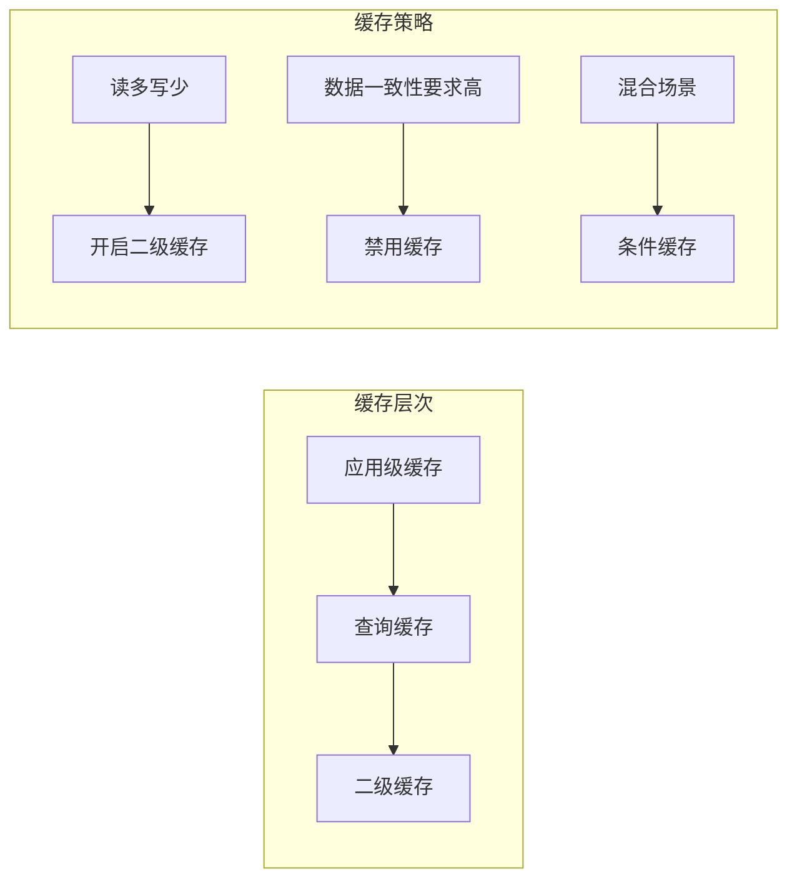

## 故障排除指南

### 常见配置问题

| 问题类型 | 症状 | 解决方案 |
|----------|------|----------|
| Mapper扫描失败 | 实体类无法识别 | 检查@Mapper注解和@TableName配置 |
| 数据库连接异常 | 启动时报连接错误 | 验证H2数据库URL和驱动配置 |
| 自动填充失效 | 创建/更新时间为空 | 确认实体类注解配置正确 |
| 逻辑删除异常 | 删除后仍可查询到数据 | 检查逻辑删除字段配置 |

### 调试技巧

1. **启用MyBatis日志**：将log-impl改为标准日志实现
2. **检查实体类注解**：确保所有实体类都有正确的注解配置
3. **验证Mapper接口**：确认Mapper接口继承BaseMapper并指定实体类型

**章节来源**
- [application.yml:35-37](file://backend/src/main/resources/application.yml#L35-L37)

## 结论

MyBatis-Plus在奖学金管理系统中的配置体现了简洁实用的设计理念：

### 已实现的功能
- **完整的实体类映射**：通过注解实现数据库表的自动映射
- **基础的全局配置**：满足日常开发的基本需求
- **合理的开发环境配置**：使用H2数据库便于开发和测试

### 可改进的方向
- **添加自动填充策略**：实现统一的创建和更新时间管理
- **配置分页插件**：提供完整的分页查询功能
- **优化日志配置**：在开发环境中启用详细的SQL日志
- **扩展连接池配置**：为生产环境准备连接池参数

### 最佳实践建议
1. **保持配置简洁**：遵循最小必要配置原则
2. **注释完整**：为每个配置项添加清晰的说明
3. **环境分离**：区分开发、测试和生产环境的配置
4. **性能监控**：定期评估数据库性能并调整配置

通过以上配置，奖学金管理系统能够稳定运行并为后续功能扩展提供良好的基础。