# 数据库操作实现

<cite>
**本文档引用的文件**
- [schema.sql](file://backend/src/main/resources/db/schema.sql)
- [data.sql](file://backend/src/main/resources/db/data.sql)
- [application.yml](file://backend/src/main/resources/application.yml)
- [AcademicYearMapper.java](file://backend/src/main/java/com/zjsu/scholarship/mapper/AcademicYearMapper.java)
- [ApplicationMapper.java](file://backend/src/main/java/com/zjsu/scholarship/mapper/ApplicationMapper.java)
- [ScholarshipProjectMapper.java](file://backend/src/main/java/com/zjsu/scholarship/mapper/ScholarshipProjectMapper.java)
- [StudentMapper.java](file://backend/src/main/java/com/zjsu/scholarship/mapper/StudentMapper.java)
- [EvaluationService.java](file://backend/src/main/java/com/zjsu/scholarship/service/EvaluationService.java)
- [ScholarshipService.java](file://backend/src/main/java/com/zjsu/scholarship/service/ScholarshipService.java)
- [RankingService.java](file://backend/src/main/java/com/zjsu/scholarship/service/RankingService.java)
- [ScoreCalcService.java](file://backend/src/main/java/com/zjsu/scholarship/service/ScoreCalcService.java)
- [GlobalExceptionHandler.java](file://backend/src/main/java/com/zjsu/scholarship/common/GlobalExceptionHandler.java)
- [R.java](file://backend/src/main/java/com/zjsu/scholarship/common/R.java)
</cite>

## 目录
1. [引言](#引言)
2. [项目结构](#项目结构)
3. [核心组件](#核心组件)
4. [架构概览](#架构概览)
5. [详细组件分析](#详细组件分析)
6. [依赖关系分析](#依赖关系分析)
7. [性能考虑](#性能考虑)
8. [故障排除指南](#故障排除指南)
9. [结论](#结论)

## 引言

本文件深入分析奖学金管理系统中的数据库操作实现，涵盖基础CRUD操作、复杂查询、批量操作、分页查询、条件查询、事务管理、异常处理和数据一致性保证等关键方面。系统采用Spring Boot + MyBatis Plus架构，通过Mapper接口实现数据库访问，结合服务层进行业务逻辑处理。

## 项目结构

奖学金管理系统采用标准的MVC架构模式，数据库相关的核心文件分布如下：

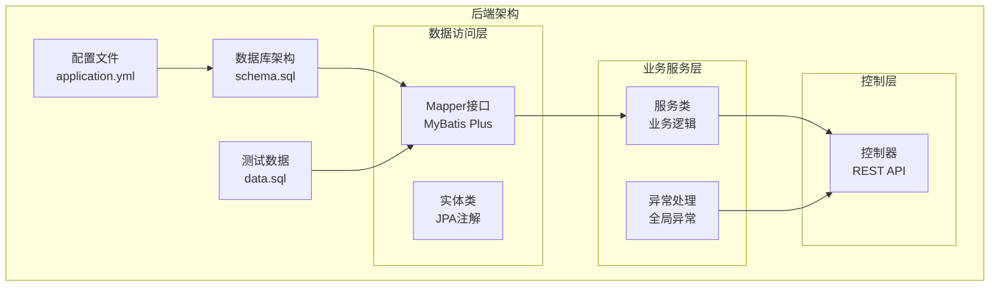

**图表来源**
- [application.yml](file://backend/src/main/resources/application.yml)
- [schema.sql](file://backend/src/main/resources/db/schema.sql)
- [data.sql](file://backend/src/main/resources/db/data.sql)

**章节来源**
- [application.yml](file://backend/src/main/resources/application.yml)
- [schema.sql](file://backend/src/main/resources/db/schema.sql)
- [data.sql](file://backend/src/main/resources/db/data.sql)

## 核心组件

### 数据库连接配置

系统使用MySQL数据库，配置了连接池、事务管理和日志输出功能。主要配置项包括：

- **数据库连接**: 主机地址、端口、数据库名、用户名和密码
- **连接池**: 最大连接数、最小空闲连接、连接超时时间
- **事务管理**: 自动提交、隔离级别、超时设置
- **日志输出**: SQL执行时间和慢查询日志

### 实体模型设计

系统包含18个核心实体类，涵盖学生信息、奖学金项目、申请记录、评审记录等业务领域。每个实体类都标注了相应的数据库映射注解，实现了Java对象与数据库表的自动映射。

**章节来源**
- [application.yml](file://backend/src/main/resources/application.yml)
- [schema.sql](file://backend/src/main/resources/db/schema.sql)

## 架构概览

系统采用分层架构设计，数据库操作通过清晰的层次结构实现：

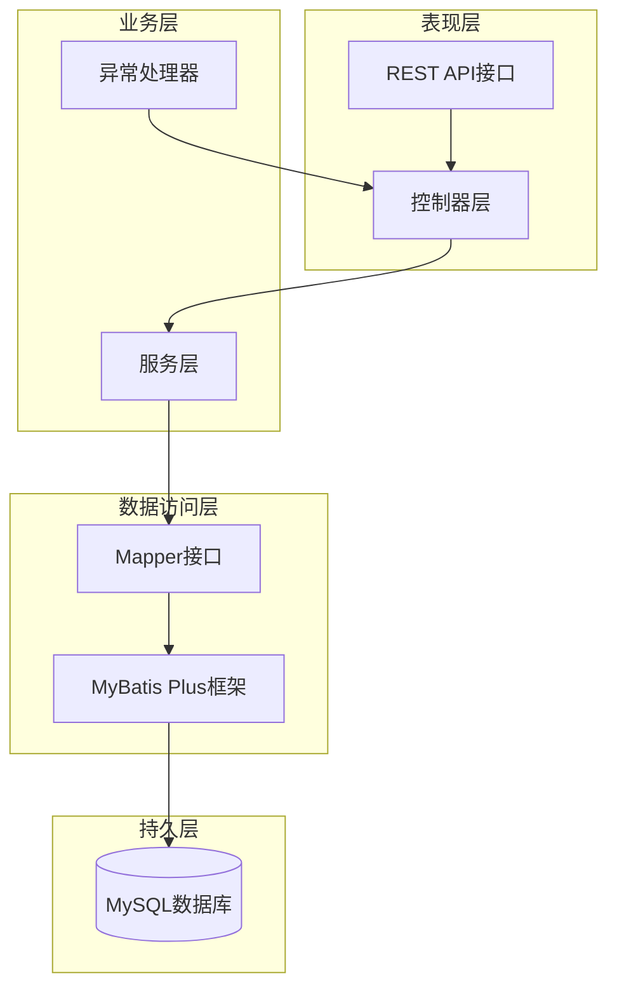

**图表来源**
- [AcademicYearMapper.java](file://backend/src/main/java/com/zjsu/scholarship/mapper/AcademicYearMapper.java)
- [ApplicationMapper.java](file://backend/src/main/java/com/zjsu/scholarship/mapper/ApplicationMapper.java)
- [ScholarshipProjectMapper.java](file://backend/src/main/java/com/zjsu/scholarship/mapper/ScholarshipProjectMapper.java)

## 详细组件分析

### 基础CRUD操作实现

#### 学生信息管理

学生信息管理是系统的基础功能，通过StudentMapper实现完整的CRUD操作：

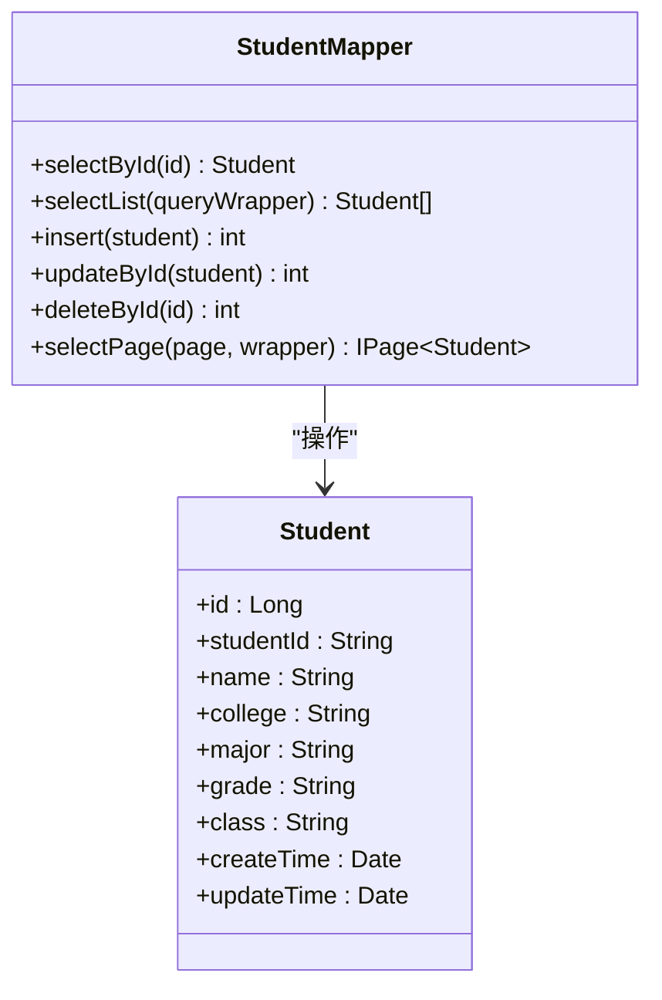

**图表来源**
- [StudentMapper.java](file://backend/src/main/java/com/zjsu/scholarship/mapper/StudentMapper.java)

#### 申请记录管理

申请记录管理涉及复杂的多表关联查询，通过ApplicationMapper实现：

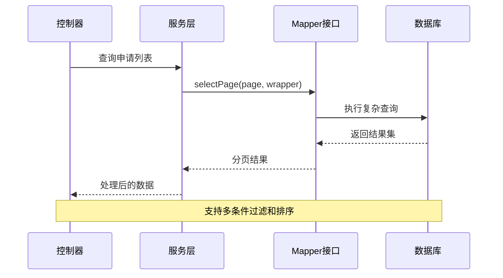

**图表来源**
- [ApplicationMapper.java](file://backend/src/main/java/com/zjsu/scholarship/mapper/ApplicationMapper.java)

**章节来源**
- [StudentMapper.java](file://backend/src/main/java/com/zjsu/scholarship/mapper/StudentMapper.java)
- [ApplicationMapper.java](file://backend/src/main/java/com/zjsu/scholarship/mapper/ApplicationMapper.java)

### 复杂查询实现策略

#### 多表联接查询

系统广泛使用MyBatis Plus的条件构造器实现复杂查询：

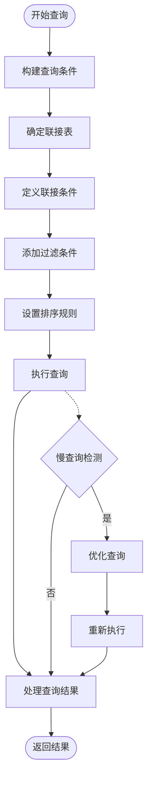

**图表来源**
- [EvaluationService.java](file://backend/src/main/java/com/zjsu/scholarship/service/EvaluationService.java)
- [RankingService.java](file://backend/src/main/java/com/zjsu/scholarship/service/RankingService.java)

#### 聚合函数应用

在评分计算和排名统计中，系统大量使用SQL聚合函数：

- **COUNT**: 统计申请数量和评审人数
- **AVG**: 计算平均分数和加权平均分
- **SUM**: 计算总分和累计分数
- **MAX/MIN**: 获取最高分和最低分

**章节来源**
- [EvaluationService.java](file://backend/src/main/java/com/zjsu/scholarship/service/EvaluationService.java)
- [RankingService.java](file://backend/src/main/java/com/zjsu/scholarship/service/RankingService.java)

### 批量操作实现方案

#### 批量插入优化

系统实现了高效的批量插入机制：

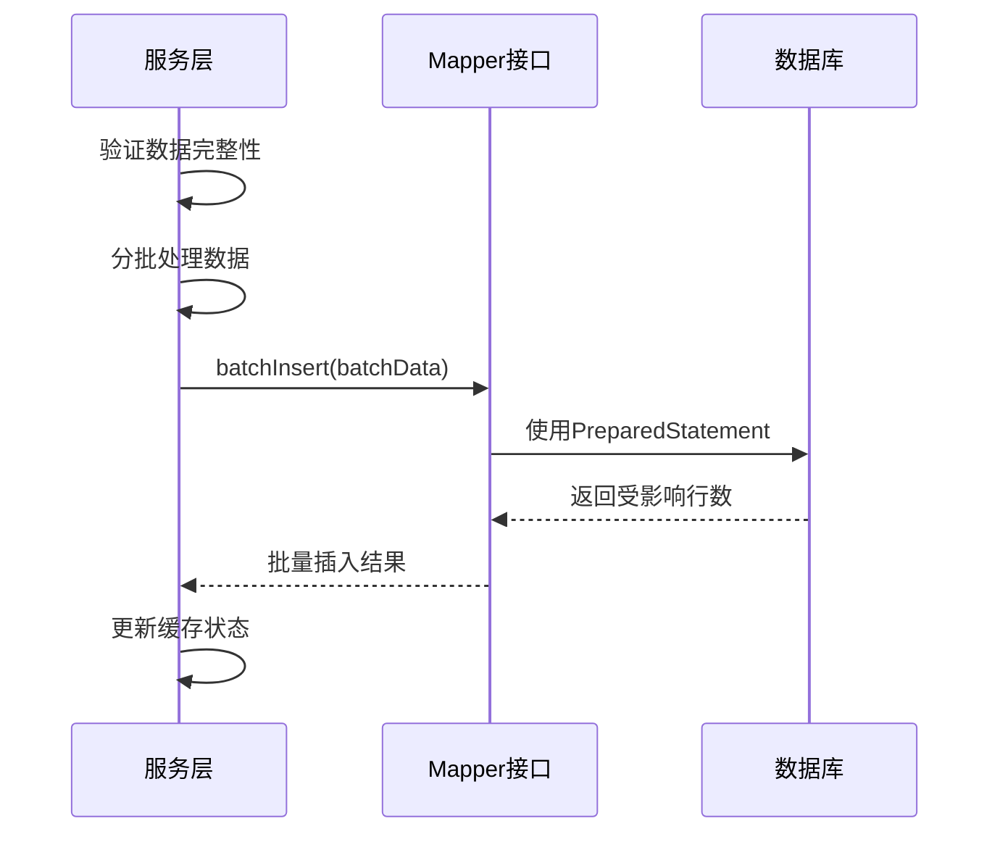

**图表来源**
- [ImportService.java](file://backend/src/main/java/com/zjsu/scholarship/service/ImportService.java)

#### 批量更新和删除

批量更新和删除操作通过条件批量操作实现：

- **批量更新**: 使用set方法和条件构造器
- **批量删除**: 基于ID列表的批量删除
- **事务控制**: 确保批量操作的数据一致性

**章节来源**
- [ImportService.java](file://backend/src/main/java/com/zjsu/scholarship/service/ImportService.java)

### 分页查询实现

#### 物理分页 vs 逻辑分页

系统支持两种分页策略：

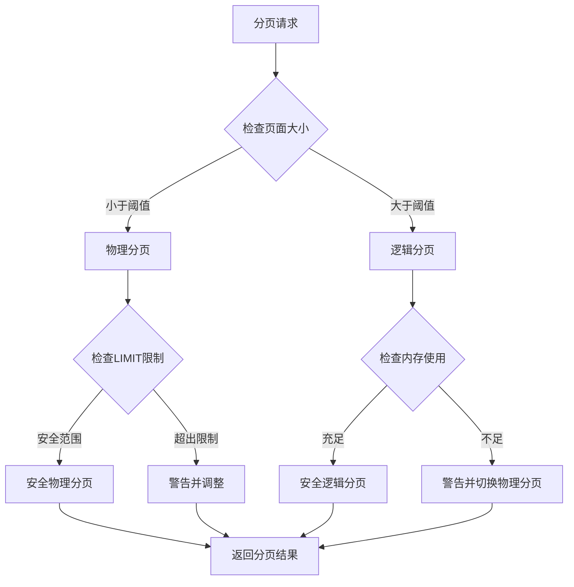

**图表来源**
- [ScholarshipService.java](file://backend/src/main/java/com/zjsu/scholarship/service/ScholarshipService.java)

#### 分页查询优化

- **索引优化**: 为常用查询字段建立合适索引
- **延迟加载**: 对大数据字段采用延迟加载策略
- **结果集缓存**: 缓存热门查询结果

**章节来源**
- [ScholarshipService.java](file://backend/src/main/java/com/zjsu/scholarship/service/ScholarshipService.java)

### 条件查询实现

#### 动态SQL构建

系统通过条件构造器实现动态SQL构建：

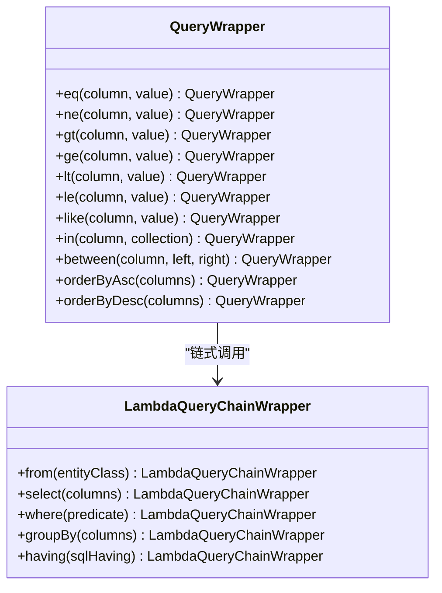

**图表来源**
- [AcademicYearMapper.java](file://backend/src/main/java/com/zjsu/scholarship/mapper/AcademicYearMapper.java)

#### 参数绑定策略

- **预编译语句**: 使用PreparedStatement防止SQL注入
- **参数验证**: 在服务层进行参数合法性验证
- **类型转换**: 自动处理Java类型与数据库类型的转换

**章节来源**
- [AcademicYearMapper.java](file://backend/src/main/java/com/zjsu/scholarship/mapper/AcademicYearMapper.java)

### 事务管理

#### 事务配置

系统采用声明式事务管理：

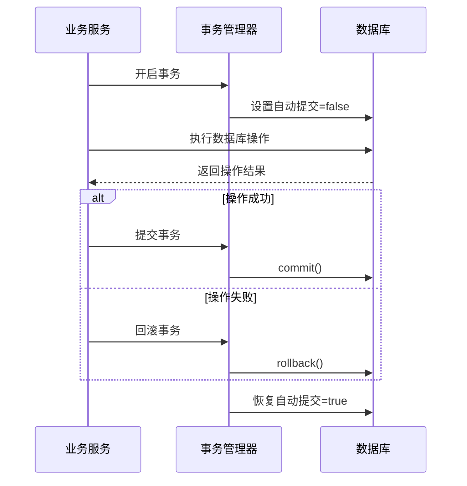

**图表来源**
- [ScholarshipService.java](file://backend/src/main/java/com/zjsu/scholarship/service/ScholarshipService.java)

#### 事务传播行为

- **REQUIRED**: 默认传播行为，如果当前存在事务则加入
- **REQUIRES_NEW**: 总是开启新事务
- **SUPPORTS**: 如果存在事务则加入，否则以非事务方式执行

**章节来源**
- [ScholarshipService.java](file://backend/src/main/java/com/zjsu/scholarship/service/ScholarshipService.java)

### 异常处理和数据一致性

#### 全局异常处理

系统实现了统一的异常处理机制：

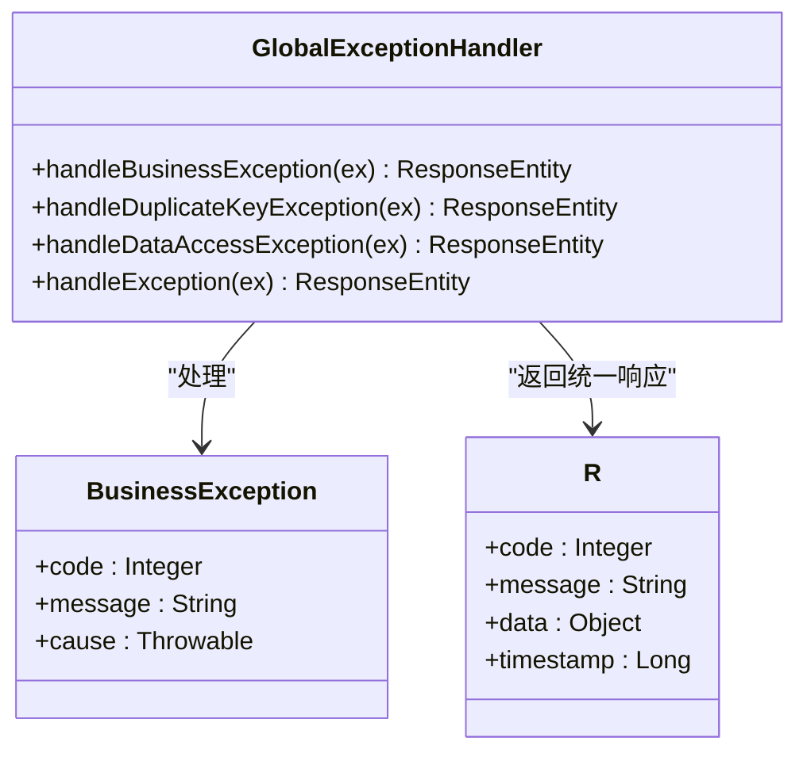

**图表来源**
- [GlobalExceptionHandler.java](file://backend/src/main/java/com/zjsu/scholarship/common/GlobalExceptionHandler.java)
- [R.java](file://backend/src/main/java/com/zjsu/scholarship/common/R.java)

#### 数据一致性保证

- **唯一约束**: 通过数据库唯一索引保证数据唯一性
- **外键约束**: 通过外键关系维护参照完整性
- **触发器**: 在关键业务场景使用触发器确保数据一致性

**章节来源**
- [GlobalExceptionHandler.java](file://backend/src/main/java/com/zjsu/scholarship/common/GlobalExceptionHandler.java)
- [R.java](file://backend/src/main/java/com/zjsu/scholarship/common/R.java)

## 依赖关系分析

### 数据库架构依赖

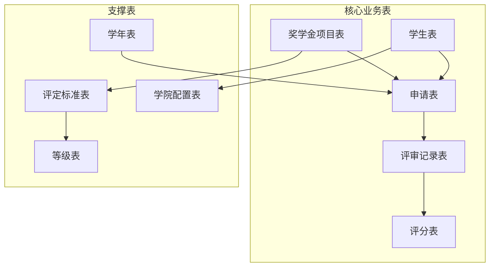

**图表来源**
- [schema.sql](file://backend/src/main/resources/db/schema.sql)

### 服务层依赖关系

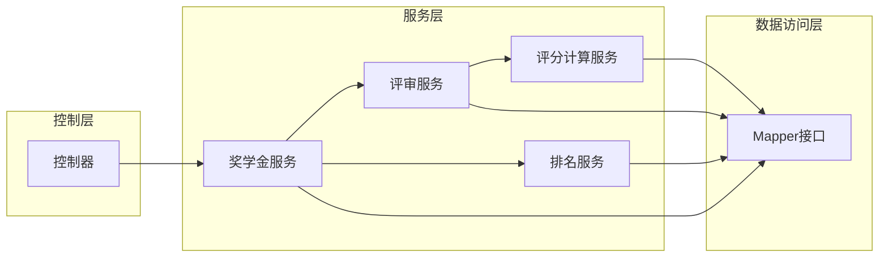

**图表来源**
- [ScholarshipService.java](file://backend/src/main/java/com/zjsu/scholarship/service/ScholarshipService.java)
- [EvaluationService.java](file://backend/src/main/java/com/zjsu/scholarship/service/EvaluationService.java)
- [RankingService.java](file://backend/src/main/java/com/zjsu/scholarship/service/RankingService.java)
- [ScoreCalcService.java](file://backend/src/main/java/com/zjsu/scholarship/service/ScoreCalcService.java)

**章节来源**
- [schema.sql](file://backend/src/main/resources/db/schema.sql)

## 性能考虑

### 查询优化策略

1. **索引优化**
   - 为常用查询字段建立复合索引
   - 定期分析查询执行计划
   - 避免在索引列上使用函数

2. **SQL优化**
   - 使用EXPLAIN分析慢查询
   - 避免SELECT *
   - 合理使用LIMIT限制结果集

3. **缓存策略**
   - 读多写少的数据使用Redis缓存
   - 实现缓存失效和更新策略
   - 避免缓存穿透和缓存雪崩

### 连接池优化

- **连接池配置**: 根据并发量调整最大连接数
- **连接超时**: 设置合理的连接和查询超时时间
- **空闲连接**: 定期清理长时间空闲的连接

### 批量操作优化

- **批处理大小**: 根据内存和数据库性能调整批处理大小
- **事务边界**: 合理划分事务边界，避免过长事务
- **回滚点**: 在大批量操作中设置保存点

## 故障排除指南

### 常见问题诊断

#### 连接问题

1. **连接超时**
   - 检查网络连接稳定性
   - 调整连接池配置参数
   - 监控数据库负载情况

2. **连接池耗尽**
   - 分析慢查询和长事务
   - 优化SQL执行计划
   - 调整连接池大小

#### 查询性能问题

1. **慢查询识别**
   - 使用慢查询日志分析
   - 检查索引使用情况
   - 优化WHERE条件和JOIN顺序

2. **内存溢出**
   - 检查分页参数设置
   - 优化大结果集处理
   - 实施流式查询

#### 事务问题

1. **死锁检测**
   - 分析事务执行顺序
   - 减少事务持有时间
   - 统一资源访问顺序

2. **事务回滚**
   - 检查异常处理逻辑
   - 确保异常正确抛出
   - 验证事务边界设置

**章节来源**
- [GlobalExceptionHandler.java](file://backend/src/main/java/com/zjsu/scholarship/common/GlobalExceptionHandler.java)

## 结论

奖学金管理系统的数据库操作实现体现了现代企业级应用的最佳实践。通过合理的架构设计、完善的异常处理机制、严格的事务管理和持续的性能优化，系统能够稳定高效地支持复杂的奖学金管理业务需求。

关键优势包括：
- **清晰的分层架构**：各层职责明确，便于维护和扩展
- **完善的异常处理**：统一的错误响应格式，提升用户体验
- **高效的查询优化**：通过索引、缓存和SQL优化确保系统性能
- **严格的数据一致性**：通过事务管理和约束保证数据质量

未来可以进一步优化的方向包括：
- 实施更精细的缓存策略
- 增强监控和告警机制
- 优化复杂查询的执行计划
- 实施数据库读写分离