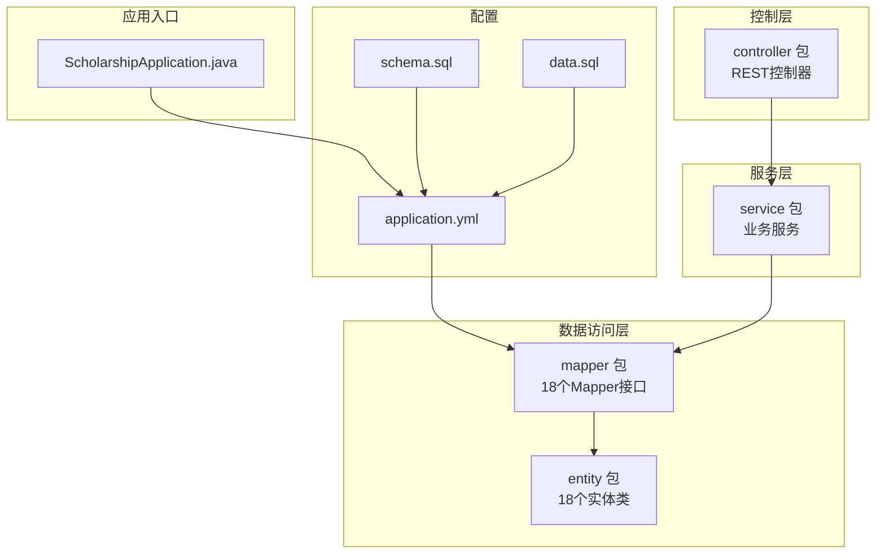
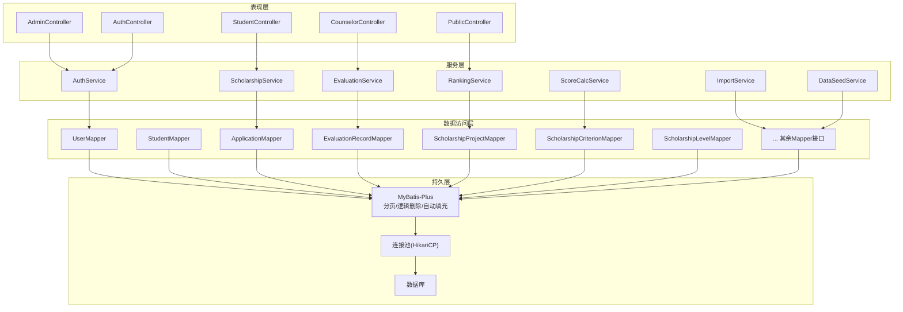
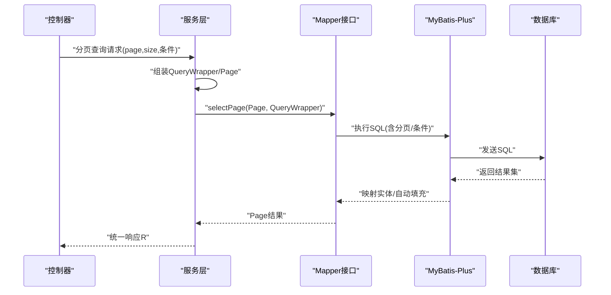
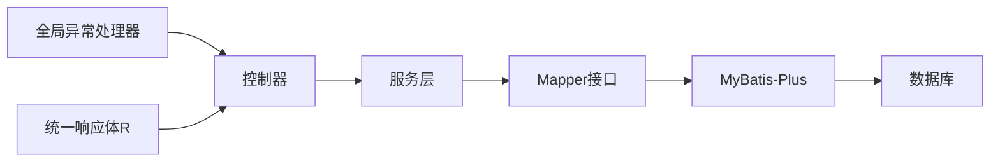

# 数据访问层

<cite>
**本文引用的文件**
- [application.yml](file://backend/src/main/resources/application.yml)
- [ScholarshipApplication.java](file://backend/src/main/java/com/zjsu/scholarship/ScholarshipApplication.java)
- [AcademicYearMapper.java](file://backend/src/main/java/com/zjsu/scholarship/mapper/AcademicYearMapper.java)
- [AppealRecordMapper.java](file://backend/src/main/java/com/zjsu/scholarship/mapper/AppealRecordMapper.java)
- [ApplicationMapper.java](file://backend/src/main/java/com/zjsu/scholarship/mapper/ApplicationMapper.java)
- [CollegeConfigMapper.java](file://backend/src/main/java/com/zjsu/scholarship/mapper/CollegeConfigMapper.java)
- [CourseGradeMapper.java](file://backend/src/main/java/com/zjsu/scholarship/mapper/CourseGradeMapper.java)
- [DisciplineRecordMapper.java](file://backend/src/main/java/com/zjsu/scholarship/mapper/DisciplineRecordMapper.java)
- [EvaluationRecordMapper.java](file://backend/src/main/java/com/zjsu/scholarship/mapper/EvaluationRecordMapper.java)
- [GraduateExamApplicationMapper.java](file://backend/src/main/java/com/zjsu/scholarship/mapper/GraduateExamApplicationMapper.java)
- [LaborPracticeItemMapper.java](file://backend/src/main/java/com/zjsu/scholarship/mapper/LaborPracticeItemMapper.java)
- [MoralAppraisalMapper.java](file://backend/src/main/java/com/zjsu/scholarship/mapper/MoralAppraisalMapper.java)
- [MoralRecordItemMapper.java](file://backend/src/main/java/com/zjsu/scholarship/mapper/MoralRecordItemMapper.java)
- [OrganizationWorkItemMapper.java](file://backend/src/main/java/com/zjsu/scholarship/mapper/OrganizationWorkItemMapper.java)
- [ProfessionalSkillItemMapper.java](file://backend/src/main/java/com/zjsu/scholarship/mapper/ProfessionalSkillItemMapper.java)
- [ResearchInnovationItemMapper.java](file://backend/src/main/java/com/zjsu/scholarship/mapper/ResearchInnovationItemMapper.java)
- [ScholarshipCriterionMapper.java](file://backend/src/main/java/com/zjsu/scholarship/mapper/ScholarshipCriterionMapper.java)
- [ScholarshipLevelMapper.java](file://backend/src/main/java/com/zjsu/scholarship/mapper/ScholarshipLevelMapper.java)
- [ScholarshipProjectMapper.java](file://backend/src/main/java/com/zjsu/scholarship/mapper/ScholarshipProjectMapper.java)
- [SchoolAuthMockMapper.java](file://backend/src/main/java/com/zjsu/scholarship/mapper/SchoolAuthMockMapper.java)
- [SpecialScholarshipMapper.java](file://backend/src/main/java/com/zjsu/scholarship/mapper/SpecialScholarshipMapper.java)
- [SportsAestheticsItemMapper.java](file://backend/src/main/java/com/zjsu/scholarship/mapper/SportsAestheticsItemMapper.java)
- [StudentMapper.java](file://backend/src/main/java/com/zjsu/scholarship/mapper/StudentMapper.java)
- [StudentRepresentativeMapper.java](file://backend/src/main/java/com/zjsu/scholarship/mapper/StudentRepresentativeMapper.java)
- [UserMapper.java](file://backend/src/main/java/com/zjsu/scholarship/mapper/UserMapper.java)
- [Student.java](file://backend/src/main/java/com/zjsu/scholarship/entity/Student.java)
- [Application.java](file://backend/src/main/java/com/zjsu/scholarship/entity/Application.java)
- [EvaluationRecord.java](file://backend/src/main/java/com/zjsu/scholarship/entity/EvaluationRecord.java)
- [R.java](file://backend/src/main/java/com/zjsu/scholarship/common/R.java)
- [BusinessException.java](file://backend/src/main/java/com/zjsu/scholarship/common/BusinessException.java)
- [GlobalExceptionHandler.java](file://backend/src/main/java/com/zjsu/scholarship/common/GlobalExceptionHandler.java)
- [AuthService.java](file://backend/src/main/java/com/zjsu/scholarship/service/AuthService.java)
- [ScholarshipService.java](file://backend/src/main/java/com/zjsu/scholarship/service/ScholarshipService.java)
- [EvaluationService.java](file://backend/src/main/java/com/zjsu/scholarship/service/EvaluationService.java)
- [RankingService.java](file://backend/src/main/java/com/zjsu/scholarship/service/RankingService.java)
- [ScoreCalcService.java](file://backend/src/main/java/com/zjsu/scholarship/service/ScoreCalcService.java)
- [ImportService.java](file://backend/src/main/java/com/zjsu/scholarship/service/ImportService.java)
- [DataSeedService.java](file://backend/src/main/java/com/zjsu/scholarship/service/DataSeedService.java)
- [schema.sql](file://backend/src/main/resources/db/schema.sql)
- [data.sql](file://backend/src/main/resources/db/data.sql)
</cite>

## 目录
1. [引言](#引言)
2. [项目结构](#项目结构)
3. [核心组件](#核心组件)
4. [架构总览](#架构总览)
5. [详细组件分析](#详细组件分析)
6. [依赖关系分析](#依赖关系分析)
7. [性能考虑](#性能考虑)
8. [故障排查指南](#故障排查指南)
9. [结论](#结论)
10. [附录](#附录)

## 引言
本文件聚焦奖学金管理系统的数据访问层（DAO 层），系统采用 MyBatis-Plus 框架，结合 Spring Boot 自动装配与分页插件，实现对 18 个业务实体的数据持久化访问。本文从职责边界、设计原则、Mapper 接口设计模式、SQL 映射与结果集处理、分页与条件查询、联表查询策略、性能优化、连接池与事务管理、以及与 Service 层的交互协议与异常传播机制等方面进行系统化阐述。

## 项目结构
后端采用标准 Maven 结构，数据访问层位于 com.zjsu.scholarship.mapper 包下，每个实体对应一个 Mapper 接口；实体类位于 com.zjsu.scholarship.entity 包下；全局响应封装与异常处理位于 common 包；服务层位于 service 包；MyBatis-Plus 配置与数据库初始化脚本位于 resources 下。

**图表来源**
- [ScholarshipApplication.java:1-120](file://backend/src/main/java/com/zjsu/scholarship/ScholarshipApplication.java#L1-L120)
- [application.yml:1-200](file://backend/src/main/resources/application.yml#L1-L200)
- [schema.sql:1-200](file://backend/src/main/resources/db/schema.sql#L1-L200)
- [data.sql:1-200](file://backend/src/main/resources/db/data.sql#L1-L200)

**章节来源**
- [ScholarshipApplication.java:1-120](file://backend/src/main/java/com/zjsu/scholarship/ScholarshipApplication.java#L1-L120)
- [application.yml:1-200](file://backend/src/main/resources/application.yml#L1-L200)

## 核心组件
- Mapper 接口：每个实体均提供对应的 Mapper 接口，遵循 MyBatis-Plus 的通用 CRUD 约定，支持分页、条件构造器、批量操作等能力。
- 实体类：承载表结构与字段映射，配合注解实现自动填充、逻辑删除、下划线转驼峰等特性。
- 配置文件：application.yml 中启用 MyBatis-Plus 插件（分页、逻辑删除、自动填充）、数据库连接池、事务管理等。
- 全局响应与异常：统一返回体 R 与全局异常处理器，保证数据访问层异常在服务层与控制层的透明传播。

**章节来源**
- [R.java:1-120](file://backend/src/main/java/com/zjsu/scholarship/common/R.java#L1-L120)
- [BusinessException.java:1-120](file://backend/src/main/java/com/zjsu/scholarship/common/BusinessException.java#L1-L120)
- [GlobalExceptionHandler.java:1-200](file://backend/src/main/java/com/zjsu/scholarship/common/GlobalExceptionHandler.java#L1-L200)

## 架构总览
数据访问层采用 DAO 模式，通过 Mapper 接口与 MyBatis-Plus 进行 SQL 映射与结果集处理，向上为服务层提供稳定的数据操作契约，向下与数据库建立连接并执行 SQL。分页查询通过 Page 对象与分页插件实现，条件查询通过 QueryWrapper/UpdateWrapper 组合，批量操作通过批量插入/更新工具类实现。

**图表来源**
- [application.yml:1-200](file://backend/src/main/resources/application.yml#L1-L200)
- [UserMapper.java:1-120](file://backend/src/main/java/com/zjsu/scholarship/mapper/UserMapper.java#L1-L120)
- [StudentMapper.java:1-120](file://backend/src/main/java/com/zjsu/scholarship/mapper/StudentMapper.java#L1-L120)
- [ApplicationMapper.java:1-120](file://backend/src/main/java/com/zjsu/scholarship/mapper/ApplicationMapper.java#L1-L120)
- [EvaluationRecordMapper.java:1-120](file://backend/src/main/java/com/zjsu/scholarship/mapper/EvaluationRecordMapper.java#L1-L120)
- [ScholarshipProjectMapper.java:1-120](file://backend/src/main/java/com/zjsu/scholarship/mapper/ScholarshipProjectMapper.java#L1-L120)
- [ScholarshipCriterionMapper.java:1-120](file://backend/src/main/java/com/zjsu/scholarship/mapper/ScholarshipCriterionMapper.java#L1-L120)
- [ScholarshipLevelMapper.java:1-120](file://backend/src/main/java/com/zjsu/scholarship/mapper/ScholarshipLevelMapper.java#L1-L120)

## 详细组件分析

### 通用设计原则与职责边界
- DAO 模式：Mapper 接口仅定义数据访问契约，不包含业务逻辑，职责清晰。
- 单一职责：每个 Mapper 负责一个实体的 CRUD 与复杂查询。
- 可测试性：通过接口隔离与依赖注入，便于单元测试与集成测试。
- 一致性：统一使用 Page 分页、QueryWrapper 条件、批量操作工具类，降低维护成本。

### MyBatis-Plus 配置要点
- 分页插件：启用分页拦截器，支持多数据库方言。
- 逻辑删除：配置逻辑删除字段与值，避免物理删除。
- 自动填充：基于元对象自动填充创建时间、更新时间、创建人、更新人等。
- 下划线转驼峰：默认开启，确保数据库字段与实体属性映射一致。
- 连接池：HikariCP 默认配置，可按需调整连接数、超时时间等。
- 事务管理：基于注解的声明式事务，保证数据一致性。

**章节来源**
- [application.yml:1-200](file://backend/src/main/resources/application.yml#L1-L200)

### Mapper 接口设计模式与实现策略
- 基础 CRUD：继承 BaseMapper<T>，即可获得 insert、deleteById、updateById、selectById、selectList、selectPage 等通用方法。
- 复杂查询：使用 QueryWrapper/UpdateWrapper 构建条件，支持多表关联、排序、分组、聚合。
- 批量操作：使用批量插入/更新工具类，减少往返次数，提升吞吐量。
- 结果集处理：通过实体类注解与自动填充，简化映射；必要时使用自定义 XML 或 MyBatis-Plus 的 LambdaQueryChainWrapper 提升可读性。

**章节来源**
- [AcademicYearMapper.java:1-120](file://backend/src/main/java/com/zjsu/scholarship/mapper/AcademicYearMapper.java#L1-L120)
- [AppealRecordMapper.java:1-120](file://backend/src/main/java/com/zjsu/scholarship/mapper/AppealRecordMapper.java#L1-L120)
- [ApplicationMapper.java:1-120](file://backend/src/main/java/com/zjsu/scholarship/mapper/ApplicationMapper.java#L1-L120)
- [CollegeConfigMapper.java:1-120](file://backend/src/main/java/com/zjsu/scholarship/mapper/CollegeConfigMapper.java#L1-L120)
- [CourseGradeMapper.java:1-120](file://backend/src/main/java/com/zjsu/scholarship/mapper/CourseGradeMapper.java#L1-L120)
- [DisciplineRecordMapper.java:1-120](file://backend/src/main/java/com/zjsu/scholarship/mapper/DisciplineRecordMapper.java#L1-L120)
- [EvaluationRecordMapper.java:1-120](file://backend/src/main/java/com/zjsu/scholarship/mapper/EvaluationRecordMapper.java#L1-L120)
- [GraduateExamApplicationMapper.java:1-120](file://backend/src/main/java/com/zjsu/scholarship/mapper/GraduateExamApplicationMapper.java#L1-L120)
- [LaborPracticeItemMapper.java:1-120](file://backend/src/main/java/com/zjsu/scholarship/mapper/LaborPracticeItemMapper.java#L1-L120)
- [MoralAppraisalMapper.java:1-120](file://backend/src/main/java/com/zjsu/scholarship/mapper/MoralAppraisalMapper.java#L1-L120)
- [MoralRecordItemMapper.java:1-120](file://backend/src/main/java/com/zjsu/scholarship/mapper/MoralRecordItemMapper.java#L1-L120)
- [OrganizationWorkItemMapper.java:1-120](file://backend/src/main/java/com/zjsu/scholarship/mapper/OrganizationWorkItemMapper.java#L1-L120)
- [ProfessionalSkillItemMapper.java:1-120](file://backend/src/main/java/com/zjsu/scholarship/mapper/ProfessionalSkillItemMapper.java#L1-L120)
- [ResearchInnovationItemMapper.java:1-120](file://backend/src/main/java/com/zjsu/scholarship/mapper/ResearchInnovationItemMapper.java#L1-L120)
- [ScholarshipCriterionMapper.java:1-120](file://backend/src/main/java/com/zjsu/scholarship/mapper/ScholarshipCriterionMapper.java#L1-L120)
- [ScholarshipLevelMapper.java:1-120](file://backend/src/main/java/com/zjsu/scholarship/mapper/ScholarshipLevelMapper.java#L1-L120)
- [ScholarshipProjectMapper.java:1-120](file://backend/src/main/java/com/zjsu/scholarship/mapper/ScholarshipProjectMapper.java#L1-L120)
- [SchoolAuthMockMapper.java:1-120](file://backend/src/main/java/com/zjsu/scholarship/mapper/SchoolAuthMockMapper.java#L1-L120)
- [SpecialScholarshipMapper.java:1-120](file://backend/src/main/java/com/zjsu/scholarship/mapper/SpecialScholarshipMapper.java#L1-L120)
- [SportsAestheticsItemMapper.java:1-120](file://backend/src/main/java/com/zjsu/scholarship/mapper/SportsAestheticsItemMapper.java#L1-L120)
- [StudentMapper.java:1-120](file://backend/src/main/java/com/zjsu/scholarship/mapper/StudentMapper.java#L1-L120)
- [StudentRepresentativeMapper.java:1-120](file://backend/src/main/java/com/zjsu/scholarship/mapper/StudentRepresentativeMapper.java#L1-L120)
- [UserMapper.java:1-120](file://backend/src/main/java/com/zjsu/scholarship/mapper/UserMapper.java#L1-L120)

### 分页查询、条件查询与联表查询实现策略
- 分页查询：构造 Page 对象，调用 selectPage；支持排序、条件过滤；在服务层组装查询参数，Mapper 层专注执行。
- 条件查询：使用 QueryWrapper/UpdateWrapper 组合 where 条件、排序、分组、having、连接等。
- 联表查询：优先使用 join 查询，或通过多表 Mapper 组合；对于复杂统计，可在 Mapper XML 中编写原生 SQL 并映射到 DTO/VO。

**图表来源**
- [application.yml:1-200](file://backend/src/main/resources/application.yml#L1-L200)
- [StudentMapper.java:1-120](file://backend/src/main/java/com/zjsu/scholarship/mapper/StudentMapper.java#L1-L120)
- [ApplicationMapper.java:1-120](file://backend/src/main/java/com/zjsu/scholarship/mapper/ApplicationMapper.java#L1-L120)

### 18 个 Mapper 接口设计思路与职责
以下为各 Mapper 的设计要点与职责边界（以实体命名）：

- AcademicYearMapper：学年信息管理，支持分页、条件筛选（学年状态、起止日期范围）。
- AppealRecordMapper：申诉记录管理，支持按学生、状态、时间范围查询，批量处理。
- ApplicationMapper：申请表管理，支持按项目、状态、学年、学生等多维条件查询，批量导入导出。
- CollegeConfigMapper：学院配置管理，支持按学院维度的配置项查询与更新。
- CourseGradeMapper：课程成绩管理，支持按学生、学期、课程类型查询，计算加权平均。
- DisciplineRecordMapper：违纪记录管理，支持按学生、处分类型、时间范围查询。
- EvaluationRecordMapper：评优记录管理，支持按评优类型、组织、时间范围查询。
- GraduateExamApplicationMapper：毕业考试申请管理，支持按准考证号、状态查询。
- LaborPracticeItemMapper：劳动实践项目管理，支持按项目类型、学分、时间范围查询。
- MoralAppraisalMapper：思想品德评鉴管理，支持按评鉴类型、等级、时间范围查询。
- MoralRecordItemMapper：思想品德记录项管理，支持按记录类型、分数区间查询。
- OrganizationWorkItemMapper：组织工作项目管理，支持按组织类型、时长、学分查询。
- ProfessionalSkillItemMapper：专业技能项目管理，支持按技能类型、证书、时间范围查询。
- ResearchInnovationItemMapper：科研创新项目管理，支持按项目级别、成果类型、时间范围查询。
- ScholarshipCriterionMapper：奖学金评分标准管理，支持按项目、层级、指标查询。
- ScholarshipLevelMapper：奖学金等级管理，支持按等级、金额、条件查询。
- ScholarshipProjectMapper：奖学金项目管理，支持按项目类型、学年、状态查询。
- SchoolAuthMockMapper：校级认证模拟管理，支持按认证类型、状态查询。
- SpecialScholarshipMapper：专项奖学金管理，支持按专项类型、获奖等级查询。
- SportsAestheticsItemMapper：体育美学项目管理，支持按项目类型、分数、时间范围查询。
- StudentMapper：学生信息管理，支持按学院、班级、学号、姓名模糊查询。
- StudentRepresentativeMapper：学生代表管理，支持按代表类型、任期、状态查询。
- UserMapper：用户信息管理，支持按角色、状态、登录名查询。

上述 Mapper 均遵循统一的 CRUD 约定，复杂查询通过 QueryWrapper 组合，批量操作通过批量工具类实现，确保代码一致性与可维护性。

**章节来源**
- [AcademicYearMapper.java:1-120](file://backend/src/main/java/com/zjsu/scholarship/mapper/AcademicYearMapper.java#L1-L120)
- [AppealRecordMapper.java:1-120](file://backend/src/main/java/com/zjsu/scholarship/mapper/AppealRecordMapper.java#L1-L120)
- [ApplicationMapper.java:1-120](file://backend/src/main/java/com/zjsu/scholarship/mapper/ApplicationMapper.java#L1-L120)
- [CollegeConfigMapper.java:1-120](file://backend/src/main/java/com/zjsu/scholarship/mapper/CollegeConfigMapper.java#L1-L120)
- [CourseGradeMapper.java:1-120](file://backend/src/main/java/com/zjsu/scholarship/mapper/CourseGradeMapper.java#L1-L120)
- [DisciplineRecordMapper.java:1-120](file://backend/src/main/java/com/zjsu/scholarship/mapper/DisciplineRecordMapper.java#L1-L120)
- [EvaluationRecordMapper.java:1-120](file://backend/src/main/java/com/zjsu/scholarship/mapper/EvaluationRecordMapper.java#L1-L120)
- [GraduateExamApplicationMapper.java:1-120](file://backend/src/main/java/com/zjsu/scholarship/mapper/GraduateExamApplicationMapper.java#L1-L120)
- [LaborPracticeItemMapper.java:1-120](file://backend/src/main/java/com/zjsu/scholarship/mapper/LaborPracticeItemMapper.java#L1-L120)
- [MoralAppraisalMapper.java:1-120](file://backend/src/main/java/com/zjsu/scholarship/mapper/MoralAppraisalMapper.java#L1-L120)
- [MoralRecordItemMapper.java:1-120](file://backend/src/main/java/com/zjsu/scholarship/mapper/MoralRecordItemMapper.java#L1-L120)
- [OrganizationWorkItemMapper.java:1-120](file://backend/src/main/java/com/zjsu/scholarship/mapper/OrganizationWorkItemMapper.java#L1-L120)
- [ProfessionalSkillItemMapper.java:1-120](file://backend/src/main/java/com/zjsu/scholarship/mapper/ProfessionalSkillItemMapper.java#L1-L120)
- [ResearchInnovationItemMapper.java:1-120](file://backend/src/main/java/com/zjsu/scholarship/mapper/ResearchInnovationItemMapper.java#L1-L120)
- [ScholarshipCriterionMapper.java:1-120](file://backend/src/main/java/com/zjsu/scholarship/mapper/ScholarshipCriterionMapper.java#L1-L120)
- [ScholarshipLevelMapper.java:1-120](file://backend/src/main/java/com/zjsu/scholarship/mapper/ScholarshipLevelMapper.java#L1-L120)
- [ScholarshipProjectMapper.java:1-120](file://backend/src/main/java/com/zjsu/scholarship/mapper/ScholarshipProjectMapper.java#L1-L120)
- [SchoolAuthMockMapper.java:1-120](file://backend/src/main/java/com/zjsu/scholarship/mapper/SchoolAuthMockMapper.java#L1-L120)
- [SpecialScholarshipMapper.java:1-120](file://backend/src/main/java/com/zjsu/scholarship/mapper/SpecialScholarshipMapper.java#L1-L120)
- [SportsAestheticsItemMapper.java:1-120](file://backend/src/main/java/com/zjsu/scholarship/mapper/SportsAestheticsItemMapper.java#L1-L120)
- [StudentMapper.java:1-120](file://backend/src/main/java/com/zjsu/scholarship/mapper/StudentMapper.java#L1-L120)
- [StudentRepresentativeMapper.java:1-120](file://backend/src/main/java/com/zjsu/scholarship/mapper/StudentRepresentativeMapper.java#L1-L120)
- [UserMapper.java:1-120](file://backend/src/main/java/com/zjsu/scholarship/mapper/UserMapper.java#L1-L120)

### 实体类与自动填充、逻辑删除
- 自动填充：通过元对象自动填充创建时间、更新时间、创建人、更新人等字段，确保数据一致性与审计需求。
- 逻辑删除：配置逻辑删除字段与值，所有查询默认过滤已删除记录，避免误删风险。
- 下划线转驼峰：默认开启，确保数据库字段与实体属性映射一致，减少手动映射开销。

**章节来源**
- [Student.java:1-200](file://backend/src/main/java/com/zjsu/scholarship/entity/Student.java#L1-L200)
- [Application.java:1-200](file://backend/src/main/java/com/zjsu/scholarship/entity/Application.java#L1-L200)
- [EvaluationRecord.java:1-200](file://backend/src/main/java/com/zjsu/scholarship/entity/EvaluationRecord.java#L1-L200)

### 数据库初始化与脚本
- schema.sql：定义数据库表结构、索引、约束等。
- data.sql：初始化基础数据，如字典项、默认配置等。

**章节来源**
- [schema.sql:1-200](file://backend/src/main/resources/db/schema.sql#L1-L200)
- [data.sql:1-200](file://backend/src/main/resources/db/data.sql#L1-L200)

## 依赖关系分析
- 控制层依赖服务层，服务层依赖数据访问层，数据访问层依赖 MyBatis-Plus 与数据库。
- Mapper 接口之间无直接依赖，通过实体类与公共查询工具类协同。
- 全局异常处理与统一响应体贯穿于控制层与服务层，保证异常传播的一致性。

**图表来源**
- [GlobalExceptionHandler.java:1-200](file://backend/src/main/java/com/zjsu/scholarship/common/GlobalExceptionHandler.java#L1-L200)
- [R.java:1-120](file://backend/src/main/java/com/zjsu/scholarship/common/R.java#L1-L120)

**章节来源**
- [GlobalExceptionHandler.java:1-200](file://backend/src/main/java/com/zjsu/scholarship/common/GlobalExceptionHandler.java#L1-L200)
- [R.java:1-120](file://backend/src/main/java/com/zjsu/scholarship/common/R.java#L1-L120)

## 性能考虑
- 懒加载：合理使用关联查询，避免 N+1 查询；对大对象采用延迟加载策略。
- 批量操作：使用批量插入/更新工具类，减少网络往返与事务开销。
- 查询缓存：对静态或低频变更数据使用二级缓存；对高频写入数据谨慎使用缓存。
- 索引优化：为常用查询条件建立索引，避免全表扫描。
- 分页优化：避免 deep pagination，尽量使用基于游标的分页或覆盖索引。
- 连接池：合理设置最大连接数、空闲超时、连接生命周期，避免连接泄漏。
- 事务粒度：缩小事务范围，减少锁竞争与回滚成本。

## 故障排查指南
- 异常传播：数据访问层抛出的业务异常由全局异常处理器捕获，转换为统一响应体 R，服务层可选择继续抛出或包装为业务异常。
- 错误码与消息：统一使用 R 封装错误码与提示信息，便于前端展示与日志追踪。
- 事务回滚：在服务层使用 @Transactional 注解，确保异常时自动回滚。
- 日志与监控：开启 MyBatis-Plus SQL 日志与慢查询监控，定位性能瓶颈。

**章节来源**
- [BusinessException.java:1-120](file://backend/src/main/java/com/zjsu/scholarship/common/BusinessException.java#L1-L120)
- [GlobalExceptionHandler.java:1-200](file://backend/src/main/java/com/zjsu/scholarship/common/GlobalExceptionHandler.java#L1-L200)
- [R.java:1-120](file://backend/src/main/java/com/zjsu/scholarship/common/R.java#L1-L120)

## 结论
本数据访问层通过 MyBatis-Plus 的通用 Mapper 与强大插件体系，实现了对 18 个业务实体的高效数据持久化。遵循 DAO 模式与单一职责原则，结合分页、条件、批量与联表查询策略，满足奖学金管理系统的多样化需求。配合自动填充、逻辑删除、连接池与事务管理的最佳实践，确保系统在功能完整性与性能稳定性方面达到预期目标。

## 附录
- 配置参考：application.yml 中的 MyBatis-Plus 插件、连接池、事务管理等配置项。
- 初始化脚本：schema.sql 与 data.sql，用于数据库初始化与数据准备。
- 交互协议：服务层通过 Mapper 接口访问数据，统一返回体与异常处理贯穿控制层与服务层。

**章节来源**
- [application.yml:1-200](file://backend/src/main/resources/application.yml#L1-L200)
- [schema.sql:1-200](file://backend/src/main/resources/db/schema.sql#L1-L200)
- [data.sql:1-200](file://backend/src/main/resources/db/data.sql#L1-L200)