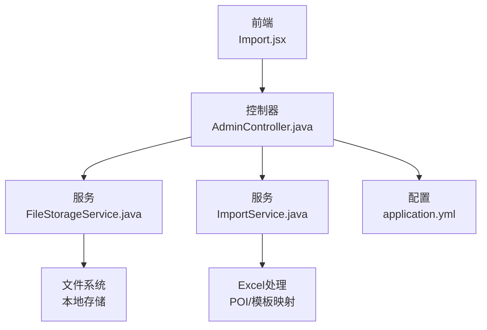
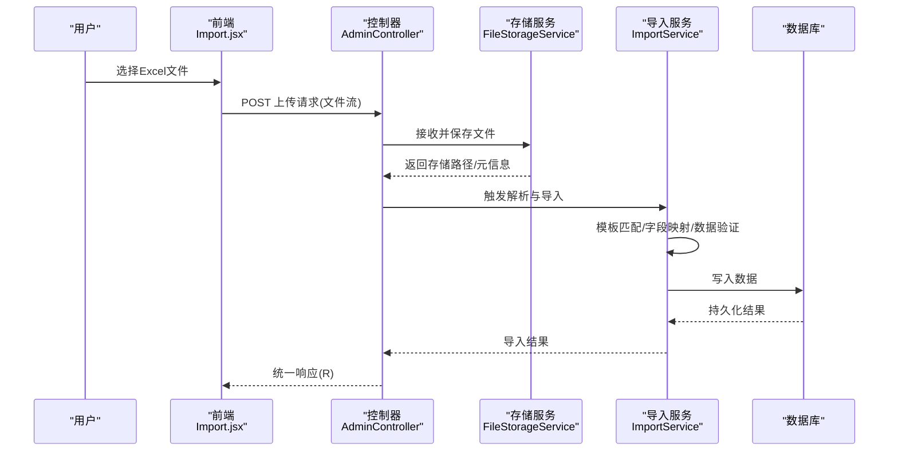
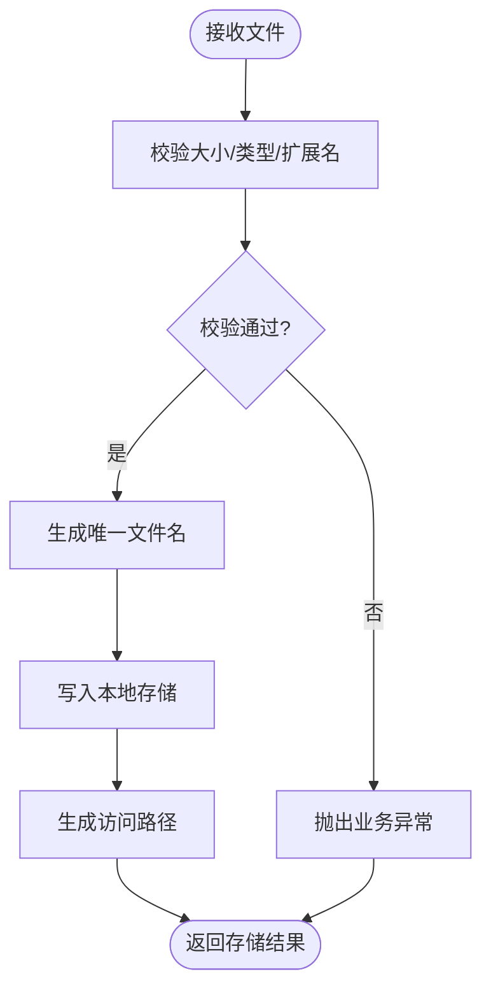
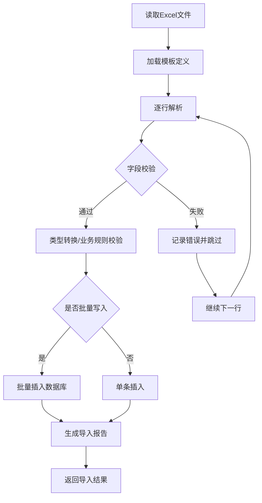
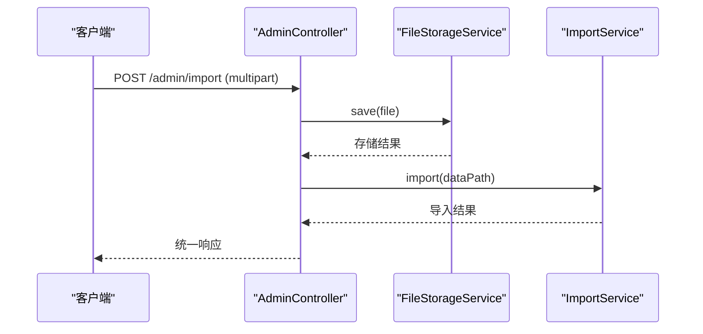
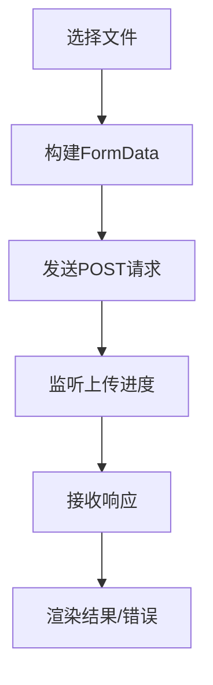
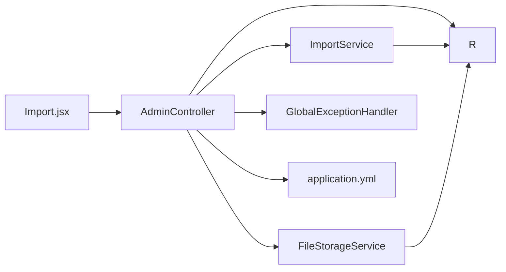

# 文件上传与处理

<cite>
**本文引用的文件**
- [FileStorageService.java](file://backend/src/main/java/com/zjsu/scholarship/service/FileStorageService.java)
- [ImportService.java](file://backend/src/main/java/com/zjsu/scholarship/service/ImportService.java)
- [AdminController.java](file://backend/src/main/java/com/zjsu/scholarship/controller/AdminController.java)
- [application.yml](file://backend/src/main/resources/application.yml)
- [Import.jsx](file://frontend/src/pages/admin/Import.jsx)
- [GlobalExceptionHandler.java](file://backend/src/main/java/com/zjsu/scholarship/common/GlobalExceptionHandler.java)
- [R.java](file://backend/src/main/java/com/zjsu/scholarship/common/R.java)
- [BusinessException.java](file://backend/src/main/java/com/zjsu/scholarship/common/BusinessException.java)
</cite>

## 目录
1. [引言](#引言)
2. [项目结构](#项目结构)
3. [核心组件](#核心组件)
4. [架构总览](#架构总览)
5. [详细组件分析](#详细组件分析)
6. [依赖关系分析](#依赖关系分析)
7. [性能考量](#性能考量)
8. [故障排除指南](#故障排除指南)
9. [结论](#结论)
10. [附录](#附录)

## 引言
本文件系统性阐述奖学金管理系统中的文件上传与处理实现方案，覆盖从前端文件选择到后端接收、解析、存储与错误处理的完整流程；重点说明Excel导入导出的技术实现（含模板设计与字段映射）、文件存储策略（本地存储、命名规则与目录结构）、格式验证与数据清洗、安全防护（大小限制、类型校验、恶意文件防护）、批量处理的性能优化（异步与进度反馈）、文件下载与预览，以及错误处理与异常恢复策略。

## 项目结构
后端采用Spring Boot工程，前端为React应用。文件处理相关的关键位置如下：
- 后端服务层：文件存储与导入导出逻辑位于服务包内
- 控制器层：管理员端提供文件上传接口
- 前端页面：管理员导入页面负责文件选择与上传交互
- 配置文件：定义文件上传相关的服务器参数

**图表来源**
- [AdminController.java:1-200](file://backend/src/main/java/com/zjsu/scholarship/controller/AdminController.java#L1-L200)
- [FileStorageService.java:1-200](file://backend/src/main/java/com/zjsu/scholarship/service/FileStorageService.java#L1-L200)
- [ImportService.java:1-200](file://backend/src/main/java/com/zjsu/scholarship/service/ImportService.java#L1-L200)
- [application.yml:1-200](file://backend/src/main/resources/application.yml#L1-L200)
- [Import.jsx:1-200](file://frontend/src/pages/admin/Import.jsx#L1-L200)

**章节来源**
- [AdminController.java:1-200](file://backend/src/main/java/com/zjsu/scholarship/controller/AdminController.java#L1-L200)
- [application.yml:1-200](file://backend/src/main/resources/application.yml#L1-L200)

## 核心组件
- 文件存储服务：负责文件接收、命名、保存与访问路径生成
- 导入服务：负责Excel解析、模板匹配、字段映射、数据验证与入库
- 管理员控制器：提供文件上传接口，协调存储与导入流程
- 全局异常处理：统一捕获业务异常与IO异常，返回标准化响应
- 前端导入页面：提供文件选择、上传触发与结果展示

**章节来源**
- [FileStorageService.java:1-200](file://backend/src/main/java/com/zjsu/scholarship/service/FileStorageService.java#L1-L200)
- [ImportService.java:1-200](file://backend/src/main/java/com/zjsu/scholarship/service/ImportService.java#L1-L200)
- [AdminController.java:1-200](file://backend/src/main/java/com/zjsu/scholarship/controller/AdminController.java#L1-L200)
- [GlobalExceptionHandler.java:1-200](file://backend/src/main/java/com/zjsu/scholarship/common/GlobalExceptionHandler.java#L1-L200)
- [R.java:1-200](file://backend/src/main/java/com/zjsu/scholarship/common/R.java#L1-L200)
- [BusinessException.java:1-200](file://backend/src/main/java/com/zjsu/scholarship/common/BusinessException.java#L1-L200)

## 架构总览
文件上传处理在后端以“控制器-服务-存储”的分层架构实现，前端通过表单提交文件，后端完成接收、校验、解析与持久化，最终返回统一响应。

**图表来源**
- [AdminController.java:1-200](file://backend/src/main/java/com/zjsu/scholarship/controller/AdminController.java#L1-L200)
- [FileStorageService.java:1-200](file://backend/src/main/java/com/zjsu/scholarship/service/FileStorageService.java#L1-L200)
- [ImportService.java:1-200](file://backend/src/main/java/com/zjsu/scholarship/service/ImportService.java#L1-L200)
- [R.java:1-200](file://backend/src/main/java/com/zjsu/scholarship/common/R.java#L1-L200)

## 详细组件分析

### 文件存储服务（FileStorageService）
职责与特性
- 接收上传文件，执行命名与路径生成
- 将文件写入本地存储目录，支持相对路径与访问URL拼接
- 提供文件存在性检查与删除能力
- 与控制器协作，返回标准化存储结果

实现要点
- 文件命名：采用唯一标识符+原始扩展名，避免冲突
- 目录结构：按日期或模块划分子目录，便于维护
- 访问路径：结合服务器静态资源映射，生成可访问URL
- 安全校验：白名单扩展名、大小限制、路径穿越防护

**图表来源**
- [FileStorageService.java:1-200](file://backend/src/main/java/com/zjsu/scholarship/service/FileStorageService.java#L1-L200)

**章节来源**
- [FileStorageService.java:1-200](file://backend/src/main/java/com/zjsu/scholarship/service/FileStorageService.java#L1-L200)

### Excel导入服务（ImportService）
职责与特性
- 解析Excel文件，基于模板进行字段映射
- 执行数据类型转换与业务规则校验
- 批量写入数据库，支持事务控制与回滚
- 生成导入报告（成功/失败明细）

实现要点
- 模板设计：固定列标题与顺序，确保解析稳定性
- 字段映射：建立Excel列与实体属性的映射关系
- 数据验证：空值、格式、范围、重复性等多维校验
- 错误收集：逐行记录错误原因，汇总后返回
- 性能优化：分批读取、批量插入、异步处理

**图表来源**
- [ImportService.java:1-200](file://backend/src/main/java/com/zjsu/scholarship/service/ImportService.java#L1-L200)

**章节来源**
- [ImportService.java:1-200](file://backend/src/main/java/com/zjsu/scholarship/service/ImportService.java#L1-L200)

### 管理员控制器（AdminController）
职责与特性
- 对外提供文件上传接口，接收multipart/form-data
- 调用存储服务与导入服务，串联完整流程
- 统一返回响应体（包含状态码、消息与数据）

实现要点
- 接口设计：明确请求参数、响应格式与HTTP状态码
- 参数绑定：文件字段名、角色权限校验
- 流程编排：先存后导，失败时清理临时文件
- 结果封装：调用统一响应工具类返回标准结构

**图表来源**
- [AdminController.java:1-200](file://backend/src/main/java/com/zjsu/scholarship/controller/AdminController.java#L1-L200)
- [R.java:1-200](file://backend/src/main/java/com/zjsu/scholarship/common/R.java#L1-L200)

**章节来源**
- [AdminController.java:1-200](file://backend/src/main/java/com/zjsu/scholarship/controller/AdminController.java#L1-L200)
- [R.java:1-200](file://backend/src/main/java/com/zjsu/scholarship/common/R.java#L1-L200)

### 前端导入页面（Import.jsx）
职责与特性
- 提供文件选择控件与上传按钮
- 支持拖拽上传与文件列表展示
- 展示上传进度与导入结果
- 与后端接口对接，处理响应与错误

实现要点
- 表单构建：使用FormData传递文件
- 进度反馈：利用XMLHttpRequest事件监听上传进度
- 结果渲染：根据后端返回状态更新UI

**图表来源**
- [Import.jsx:1-200](file://frontend/src/pages/admin/Import.jsx#L1-L200)

**章节来源**
- [Import.jsx:1-200](file://frontend/src/pages/admin/Import.jsx#L1-L200)

### 配置与全局异常处理
- 配置项：文件上传大小限制、临时目录、静态资源映射
- 全局异常：捕获业务异常与IO异常，返回统一错误响应
- 统一响应：封装code/msg/data，便于前后端约定

**章节来源**
- [application.yml:1-200](file://backend/src/main/resources/application.yml#L1-L200)
- [GlobalExceptionHandler.java:1-200](file://backend/src/main/java/com/zjsu/scholarship/common/GlobalExceptionHandler.java#L1-L200)
- [BusinessException.java:1-200](file://backend/src/main/java/com/zjsu/scholarship/common/BusinessException.java#L1-L200)
- [R.java:1-200](file://backend/src/main/java/com/zjsu/scholarship/common/R.java#L1-L200)

## 依赖关系分析
- 控制器依赖存储与导入服务，二者均依赖统一响应与异常处理
- 前端依赖控制器提供的上传接口
- 配置文件影响上传行为（大小、路径、静态资源）

**图表来源**
- [AdminController.java:1-200](file://backend/src/main/java/com/zjsu/scholarship/controller/AdminController.java#L1-L200)
- [FileStorageService.java:1-200](file://backend/src/main/java/com/zjsu/scholarship/service/FileStorageService.java#L1-L200)
- [ImportService.java:1-200](file://backend/src/main/java/com/zjsu/scholarship/service/ImportService.java#L1-L200)
- [R.java:1-200](file://backend/src/main/java/com/zjsu/scholarship/common/R.java#L1-L200)
- [GlobalExceptionHandler.java:1-200](file://backend/src/main/java/com/zjsu/scholarship/common/GlobalExceptionHandler.java#L1-L200)
- [application.yml:1-200](file://backend/src/main/resources/application.yml#L1-L200)
- [Import.jsx:1-200](file://frontend/src/pages/admin/Import.jsx#L1-L200)

**章节来源**
- [AdminController.java:1-200](file://backend/src/main/java/com/zjsu/scholarship/controller/AdminController.java#L1-L200)
- [application.yml:1-200](file://backend/src/main/resources/application.yml#L1-L200)

## 性能考量
- 分批处理：导入服务按批次读取与写入，降低内存峰值
- 批量插入：数据库层面使用批量操作提升吞吐
- 异步处理：后台线程池异步执行导入任务，控制器立即返回任务ID
- 进度反馈：前端轮询或WebSocket推送进度，改善用户体验
- 缓存与索引：对频繁查询的数据建立索引，减少导入过程中的二次查询

[本节为通用性能建议，不直接分析具体文件]

## 故障排除指南
常见问题与对策
- 文件过大：后端配置限制导致上传失败，需调整配置或提示前端分片上传
- 类型不符：扩展名不在白名单内，需修正模板或文件类型
- 解析错误：Excel列数/标题不匹配，需核对模板与数据一致性
- 权限不足：存储目录无写权限，需检查文件系统权限
- 业务异常：导入过程中出现重复、空值或越界，需查看错误报告并修正数据

定位与修复
- 查看控制器返回的统一响应与异常处理器日志
- 核对配置文件中的上传参数与存储路径
- 在导入服务中检查字段映射与校验规则
- 使用前端导入页面的错误提示与重试机制

**章节来源**
- [GlobalExceptionHandler.java:1-200](file://backend/src/main/java/com/zjsu/scholarship/common/GlobalExceptionHandler.java#L1-L200)
- [BusinessException.java:1-200](file://backend/src/main/java/com/zjsu/scholarship/common/BusinessException.java#L1-L200)
- [R.java:1-200](file://backend/src/main/java/com/zjsu/scholarship/common/R.java#L1-L200)

## 结论
该系统通过清晰的分层架构实现了完整的文件上传与处理闭环：前端负责交互与进度反馈，后端控制器编排存储与导入，服务层完成数据解析与持久化，配置与异常处理保障运行稳定。结合模板化Excel导入、严格的格式与业务校验、本地存储策略与安全防护，能够满足奖学金管理场景下的高效、可靠与可维护需求。

## 附录
- Excel模板设计建议：固定列标题、明确数据类型、预留校验列
- 数据清洗策略：空值填充默认值、异常值标记、重复检测与去重
- 下载与预览：后端提供文件访问接口，前端可直接打开或下载
- 安全加固：白名单扩展名、MIME类型二次校验、文件内容头校验、最小权限存储目录

[本节为通用实践建议，不直接分析具体文件]