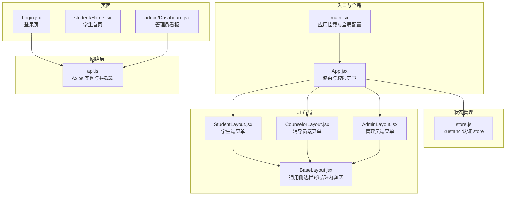
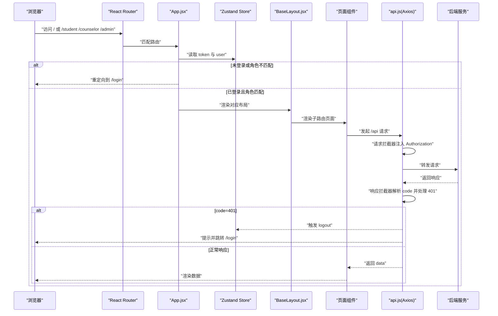
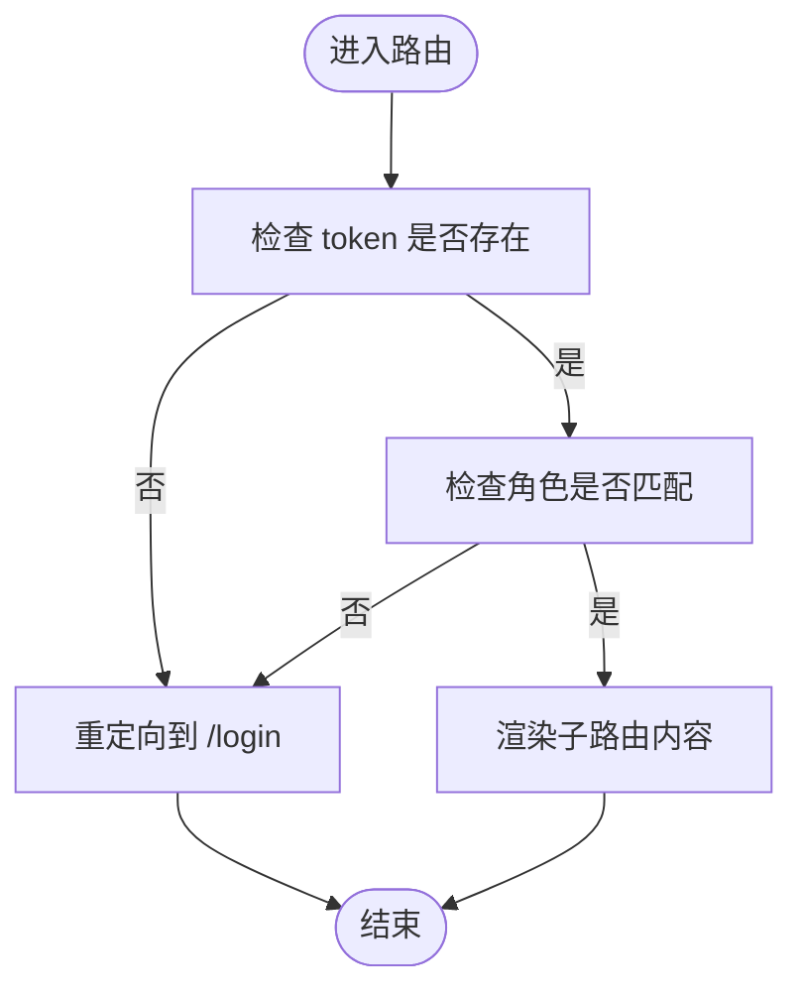
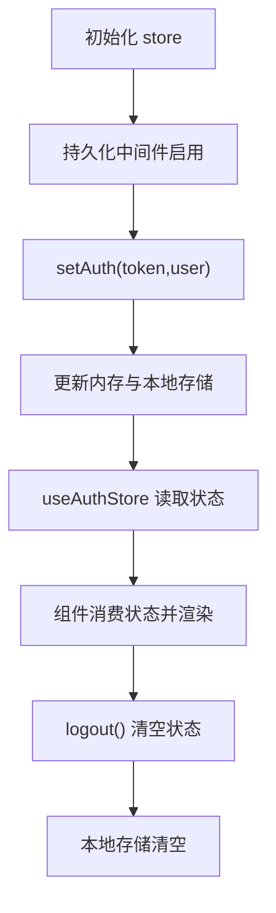
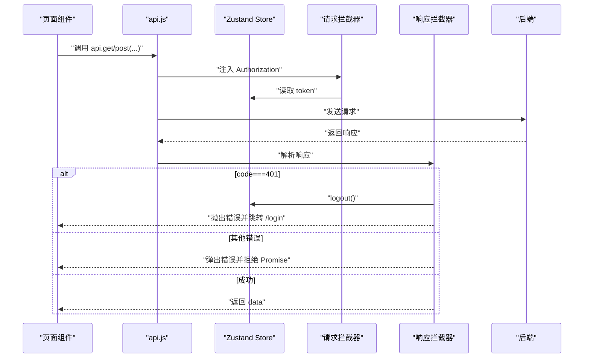
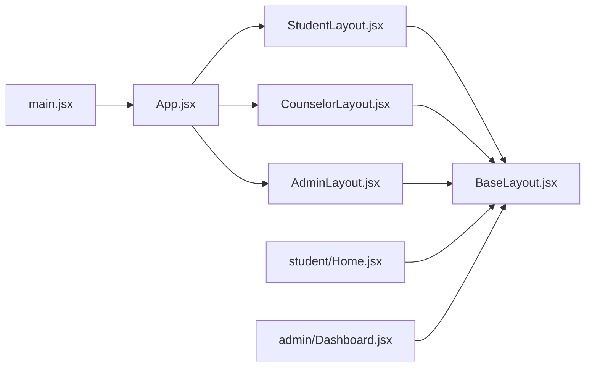
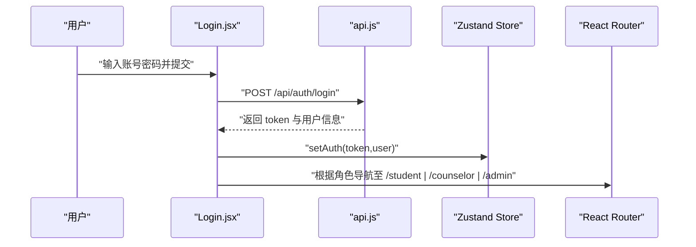
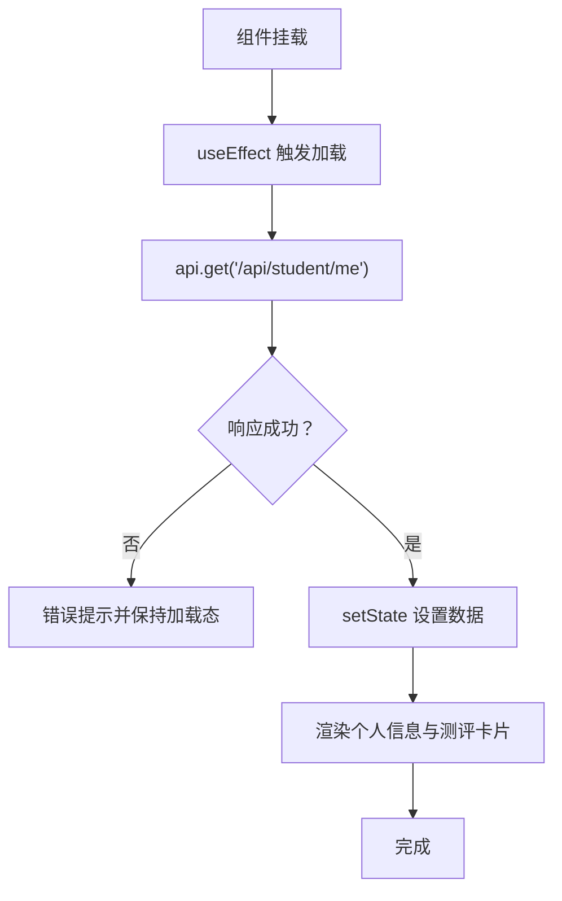
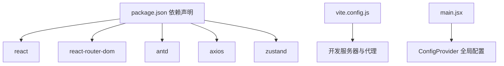

# 前端架构设计

<cite>
**本文引用的文件**
- [frontend/src/main.jsx](file://frontend/src/main.jsx)
- [frontend/src/App.jsx](file://frontend/src/App.jsx)
- [frontend/src/store.js](file://frontend/src/store.js)
- [frontend/src/api.js](file://frontend/src/api.js)
- [frontend/src/layouts/BaseLayout.jsx](file://frontend/src/layouts/BaseLayout.jsx)
- [frontend/src/layouts/StudentLayout.jsx](file://frontend/src/layouts/StudentLayout.jsx)
- [frontend/src/layouts/CounselorLayout.jsx](file://frontend/src/layouts/CounselorLayout.jsx)
- [frontend/src/layouts/AdminLayout.jsx](file://frontend/src/layouts/AdminLayout.jsx)
- [frontend/src/pages/Login.jsx](file://frontend/src/pages/Login.jsx)
- [frontend/src/pages/student/Home.jsx](file://frontend/src/pages/student/Home.jsx)
- [frontend/src/pages/admin/Dashboard.jsx](file://frontend/src/pages/admin/Dashboard.jsx)
- [frontend/package.json](file://frontend/package.json)
- [frontend/vite.config.js](file://frontend/vite.config.js)
- [frontend/src/styles.css](file://frontend/src/styles.css)
</cite>

## 目录
1. [引言](#引言)
2. [项目结构](#项目结构)
3. [核心组件](#核心组件)
4. [架构总览](#架构总览)
5. [详细组件分析](#详细组件分析)
6. [依赖关系分析](#依赖关系分析)
7. [性能考虑](#性能考虑)
8. [故障排查指南](#故障排查指南)
9. [结论](#结论)
10. [附录](#附录)

## 引言
本文件面向前端架构设计，围绕该奖学金申请系统的 React 应用展开，重点阐述以下方面：
- 函数式组件与 Hooks 使用模式（如 useState、useEffect、useNavigate、useLocation、useAuthStore）
- Zustand 状态管理的集成（store 定义、持久化、状态订阅与 action 执行）
- React Router 的路由配置与权限控制（路由守卫、动态路由加载、根路径重定向）
- 组件化设计原则（布局组件、页面组件、功能组件的职责划分）
- Axios 封装与 API 调用模式（请求/响应拦截器、错误处理）
- 组件树结构图与状态流转图，展示数据在组件间传递与状态管理的完整流程

## 项目结构
前端采用基于功能域的目录组织方式，入口文件负责全局配置与渲染，应用主体由路由与多套布局/页面构成，状态与 API 封装分别位于独立模块。

图表来源
- [frontend/src/main.jsx:1-19](file://frontend/src/main.jsx#L1-L19)
- [frontend/src/App.jsx:1-83](file://frontend/src/App.jsx#L1-L83)
- [frontend/src/store.js:1-15](file://frontend/src/store.js#L1-L15)
- [frontend/src/layouts/BaseLayout.jsx:1-66](file://frontend/src/layouts/BaseLayout.jsx#L1-L66)
- [frontend/src/layouts/StudentLayout.jsx:1-17](file://frontend/src/layouts/StudentLayout.jsx#L1-L17)
- [frontend/src/layouts/CounselorLayout.jsx:1-14](file://frontend/src/layouts/CounselorLayout.jsx#L1-L14)
- [frontend/src/layouts/AdminLayout.jsx:1-16](file://frontend/src/layouts/AdminLayout.jsx#L1-L16)
- [frontend/src/pages/Login.jsx:1-76](file://frontend/src/pages/Login.jsx#L1-L76)
- [frontend/src/pages/student/Home.jsx:1-98](file://frontend/src/pages/student/Home.jsx#L1-L98)
- [frontend/src/pages/admin/Dashboard.jsx:1-35](file://frontend/src/pages/admin/Dashboard.jsx#L1-L35)
- [frontend/src/api.js:1-44](file://frontend/src/api.js#L1-L44)

章节来源
- [frontend/src/main.jsx:1-19](file://frontend/src/main.jsx#L1-L19)
- [frontend/src/App.jsx:1-83](file://frontend/src/App.jsx#L1-L83)
- [frontend/package.json:1-26](file://frontend/package.json#L1-L26)

## 核心组件
- 应用入口与全局配置：在入口文件中完成国际化、主题、路由容器与根组件挂载。
- 路由与权限守卫：在路由层实现登录态校验与角色校验，未登录或角色不符时重定向至登录页。
- 状态管理：使用 Zustand 定义认证 store，包含 token、用户信息与 setAuth/logout 方法，并启用本地持久化。
- 网络层：基于 Axios 创建实例，统一设置基础路径与超时，注入请求头 Authorization；统一处理响应码与错误提示，401 自动登出并跳转登录。
- 布局层：抽象 BaseLayout 提供统一侧边栏、头部用户菜单、内容区与提示条，各角色布局仅需传入菜单项与基础路径。
- 页面层：以功能域划分，如学生端、辅导员端、管理员端，页面组件负责数据拉取与展示。

章节来源
- [frontend/src/main.jsx:1-19](file://frontend/src/main.jsx#L1-L19)
- [frontend/src/App.jsx:27-41](file://frontend/src/App.jsx#L27-L41)
- [frontend/src/store.js:4-14](file://frontend/src/store.js#L4-L14)
- [frontend/src/api.js:5-41](file://frontend/src/api.js#L5-L41)
- [frontend/src/layouts/BaseLayout.jsx:8-64](file://frontend/src/layouts/BaseLayout.jsx#L8-L64)
- [frontend/src/layouts/StudentLayout.jsx:4-12](file://frontend/src/layouts/StudentLayout.jsx#L4-L12)
- [frontend/src/layouts/CounselorLayout.jsx:4-9](file://frontend/src/layouts/CounselorLayout.jsx#L4-L9)
- [frontend/src/layouts/AdminLayout.jsx:4-11](file://frontend/src/layouts/AdminLayout.jsx#L4-L11)

## 架构总览
下图展示了从浏览器到后端的请求链路、状态管理与路由守卫的交互关系。

图表来源
- [frontend/src/App.jsx:27-41](file://frontend/src/App.jsx#L27-L41)
- [frontend/src/store.js:4-14](file://frontend/src/store.js#L4-L14)
- [frontend/src/layouts/BaseLayout.jsx:8-64](file://frontend/src/layouts/BaseLayout.jsx#L8-L64)
- [frontend/src/pages/student/Home.jsx:11-15](file://frontend/src/pages/student/Home.jsx#L11-L15)
- [frontend/src/pages/admin/Dashboard.jsx:9](file://frontend/src/pages/admin/Dashboard.jsx#L9)
- [frontend/src/api.js:10-41](file://frontend/src/api.js#L10-L41)

## 详细组件分析

### 路由与权限控制（React Router）
- 根路径与通配符重定向：未登录访问任意受保护路径均被重定向至 /login；根据用户角色重定向至对应角色的首页。
- 路由守卫组件：Protected 组件在渲染子元素前检查 token 与角色，不满足条件则重定向。
- 动态路由加载：通过嵌套路由在不同角色命名空间下组织页面，便于懒加载扩展（当前为即时加载）。

图表来源
- [frontend/src/App.jsx:27-41](file://frontend/src/App.jsx#L27-L41)

章节来源
- [frontend/src/App.jsx:1-83](file://frontend/src/App.jsx#L1-L83)

### Zustand 状态管理（认证 store）
- store 定义：使用 create 定义包含 token、user、setAuth、logout 的状态与动作。
- 持久化：通过 persist 中间件将状态存储于本地，键名为 scholarship-auth，提升用户体验。
- 订阅与使用：页面组件通过 useAuthStore 读取 token 与 user，或调用 setAuth 写入认证信息，logout 清空状态。

图表来源
- [frontend/src/store.js:4-14](file://frontend/src/store.js#L4-L14)

章节来源
- [frontend/src/store.js:1-15](file://frontend/src/store.js#L1-L15)

### Axios 封装与 API 调用模式
- 实例配置：baseURL 为 /api，超时 30 秒，统一走代理转发。
- 请求拦截器：从 Zustand store 读取 token，若存在则在请求头注入 Authorization。
- 响应拦截器：解析后端返回的 code 字段；当 code=401 时触发 logout、提示并跳转 /login；其他错误统一弹出消息并拒绝 Promise；正常响应透传 data.data。
- 错误处理：对网络异常与后端错误进行统一提示，避免组件分散处理。

图表来源
- [frontend/src/api.js:5-41](file://frontend/src/api.js#L5-L41)
- [frontend/src/store.js:4-14](file://frontend/src/store.js#L4-L14)

章节来源
- [frontend/src/api.js:1-44](file://frontend/src/api.js#L1-L44)

### 组件化设计原则
- 布局组件（Layout）：BaseLayout 抽象出统一的侧边栏、头部、内容区与用户菜单；各角色布局仅需传入菜单项与基础路径。
- 页面组件（Page）：按功能域拆分，如 student、counselor、admin 下的多个页面，负责数据拉取与展示。
- 功能组件（Feature）：页面内部使用 Ant Design 的卡片、描述列表、统计组件等组合展示数据。
- 入口与全局（Entry/Global）：main.jsx 注入国际化、主题、路由容器与样式，App.jsx 组织路由与守卫。

图表来源
- [frontend/src/main.jsx:1-19](file://frontend/src/main.jsx#L1-L19)
- [frontend/src/App.jsx:1-83](file://frontend/src/App.jsx#L1-L83)
- [frontend/src/layouts/BaseLayout.jsx:1-66](file://frontend/src/layouts/BaseLayout.jsx#L1-L66)
- [frontend/src/layouts/StudentLayout.jsx:1-17](file://frontend/src/layouts/StudentLayout.jsx#L1-L17)
- [frontend/src/layouts/CounselorLayout.jsx:1-14](file://frontend/src/layouts/CounselorLayout.jsx#L1-L14)
- [frontend/src/layouts/AdminLayout.jsx:1-16](file://frontend/src/layouts/AdminLayout.jsx#L1-L16)
- [frontend/src/pages/student/Home.jsx:1-98](file://frontend/src/pages/student/Home.jsx#L1-L98)
- [frontend/src/pages/admin/Dashboard.jsx:1-35](file://frontend/src/pages/admin/Dashboard.jsx#L1-L35)

章节来源
- [frontend/src/layouts/BaseLayout.jsx:1-66](file://frontend/src/layouts/BaseLayout.jsx#L1-L66)
- [frontend/src/layouts/StudentLayout.jsx:1-17](file://frontend/src/layouts/StudentLayout.jsx#L1-L17)
- [frontend/src/layouts/CounselorLayout.jsx:1-14](file://frontend/src/layouts/CounselorLayout.jsx#L1-L14)
- [frontend/src/layouts/AdminLayout.jsx:1-16](file://frontend/src/layouts/AdminLayout.jsx#L1-L16)
- [frontend/src/pages/student/Home.jsx:1-98](file://frontend/src/pages/student/Home.jsx#L1-L98)
- [frontend/src/pages/admin/Dashboard.jsx:1-35](file://frontend/src/pages/admin/Dashboard.jsx#L1-L35)

### 登录流程与状态流转
- 登录页收集账号密码，调用 /api/auth/login 获取 token 与用户信息，写入 store 并根据角色导航至对应首页。
- 登录页同时提供“演示账号”快速填充，便于测试。

图表来源
- [frontend/src/pages/Login.jsx:16-34](file://frontend/src/pages/Login.jsx#L16-L34)
- [frontend/src/api.js:5-41](file://frontend/src/api.js#L5-L41)
- [frontend/src/store.js:4-14](file://frontend/src/store.js#L4-L14)

章节来源
- [frontend/src/pages/Login.jsx:1-76](file://frontend/src/pages/Login.jsx#L1-L76)

### 数据加载与展示（学生首页）
- 页面组件通过 useState/ useEffect 在挂载时拉取 /api/student/me，使用 Ant Design 组件展示个人信息与测评结果。
- 使用 Spin 在加载期间显示加载指示，避免空白渲染。

图表来源
- [frontend/src/pages/student/Home.jsx:6-15](file://frontend/src/pages/student/Home.jsx#L6-L15)
- [frontend/src/pages/student/Home.jsx:11-15](file://frontend/src/pages/student/Home.jsx#L11-L15)

章节来源
- [frontend/src/pages/student/Home.jsx:1-98](file://frontend/src/pages/student/Home.jsx#L1-L98)

### 管理员看板（数据统计）
- 页面组件在挂载时拉取 /api/admin/stats/dashboard，展示学生总数、项目数、申请总数等关键指标。
- 使用 Ant Design 卡片与统计组件进行可视化展示。

章节来源
- [frontend/src/pages/admin/Dashboard.jsx:1-35](file://frontend/src/pages/admin/Dashboard.jsx#L1-L35)

## 依赖关系分析
- 运行时依赖：React、React DOM、React Router、Ant Design、Day.js、Axios、Zustand。
- 构建工具：Vite，使用 @vitejs/plugin-react，开发服务器端口 5173，配置了 /api 与 /uploads 到后端的代理。
- 国际化与主题：ConfigProvider 注入 zhCN 语言包与主色调，全局生效。

图表来源
- [frontend/package.json:11-19](file://frontend/package.json#L11-L19)
- [frontend/vite.config.js:4-20](file://frontend/vite.config.js#L4-L20)
- [frontend/src/main.jsx:10-18](file://frontend/src/main.jsx#L10-L18)

章节来源
- [frontend/package.json:1-26](file://frontend/package.json#L1-L26)
- [frontend/vite.config.js:1-21](file://frontend/vite.config.js#L1-L21)
- [frontend/src/main.jsx:1-19](file://frontend/src/main.jsx#L1-L19)

## 性能考虑
- 组件懒加载：当前页面为即时加载，后续可结合 React.lazy 与 Suspense 对大型页面进行懒加载，减少首屏体积。
- 状态粒度：store 仅包含认证相关状态，避免过度共享导致不必要的重渲染。
- 请求缓存：对于不频繁变化的数据，可在页面层增加本地缓存策略，减少重复请求。
- 图标与样式：Ant Design 图标按需引入可进一步优化打包体积（当前项目已使用具体图标组件）。
- 代理与跨域：开发环境通过 Vite 代理转发 /api 与 /uploads，生产环境需确保后端 CORS 配置正确。

## 故障排查指南
- 登录后 401 自动跳转：响应拦截器检测到 code=401 会触发 logout 并跳转 /login，检查后端 JWT 是否过期或签名是否正确。
- 请求未携带 Authorization：确认请求拦截器已从 store 读取 token，且 store 中 token 不为空。
- 跨域与代理：开发环境访问 /api 无果时，检查 vite.config.js 代理配置与后端服务是否启动。
- 样式问题：登录背景与字体样式集中在 styles.css，若页面样式异常，优先检查该文件与全局样式是否正确引入。

章节来源
- [frontend/src/api.js:18-41](file://frontend/src/api.js#L18-L41)
- [frontend/vite.config.js:9-18](file://frontend/vite.config.js#L9-L18)
- [frontend/src/styles.css:1-21](file://frontend/src/styles.css#L1-L21)

## 结论
该前端应用采用清晰的分层架构：入口负责全局配置，路由层承担权限守卫，Zustand 管理认证状态，Axios 封装统一网络层，Ant Design 提供 UI 基础设施。组件化设计遵循“布局-页面-功能”的职责划分，具备良好的可维护性与扩展性。后续可在路由懒加载、状态粒度优化与缓存策略上进一步提升性能与体验。

## 附录
- 开发服务器与代理：开发端口 5173，代理 /api 与 /uploads 至 http://localhost:8080。
- 样式规范：全局字体、登录页背景与卡片样式集中管理，保证视觉一致性。

章节来源
- [frontend/vite.config.js:6-20](file://frontend/vite.config.js#L6-L20)
- [frontend/src/styles.css:1-21](file://frontend/src/styles.css#L1-L21)