# 后端架构设计

<cite>
**本文档引用的文件**
- [ScholarshipApplication.java](file://backend/src/main/java/com/zjsu/scholarship/ScholarshipApplication.java)
- [application.yml](file://backend/src/main/resources/application.yml)
- [pom.xml](file://backend/pom.xml)
- [WebMvcConfig.java](file://backend/src/main/java/com/zjsu/scholarship/config/WebMvcConfig.java)
- [JwtUtil.java](file://backend/src/main/java/com/zjsu/scholarship/security/JwtUtil.java)
- [JwtAuthInterceptor.java](file://backend/src/main/java/com/zjsu/scholarship/security/JwtAuthInterceptor.java)
- [AuthController.java](file://backend/src/main/java/com/zjsu/scholarship/controller/AuthController.java)
- [AuthService.java](file://backend/src/main/java/com/zjsu/scholarship/service/AuthService.java)
- [UserMapper.java](file://backend/src/main/java/com/zjsu/scholarship/mapper/UserMapper.java)
- [PublicController.java](file://backend/src/main/java/com/zjsu/scholarship/controller/PublicController.java)
- [ScholarshipService.java](file://backend/src/main/java/com/zjsu/scholarship/service/ScholarshipService.java)
- [GlobalExceptionHandler.java](file://backend/src/main/java/com/zjsu/scholarship/common/GlobalExceptionHandler.java)
- [R.java](file://backend/src/main/java/com/zjsu/scholarship/common/R.java)
- [User.java](file://backend/src/main/java/com/zjsu/scholarship/entity/User.java)
- [schema.sql](file://backend/src/main/resources/db/schema.sql)
</cite>

## 目录
1. [引言](#引言)
2. [项目结构](#项目结构)
3. [核心组件](#核心组件)
4. [架构概览](#架构概览)
5. [详细组件分析](#详细组件分析)
6. [依赖分析](#依赖分析)
7. [性能考虑](#性能考虑)
8. [故障排除指南](#故障排除指南)
9. [结论](#结论)

## 引言

本项目是一个基于Spring Boot的浙江工商大学研究生奖学金评选系统。系统采用现代化的分层架构设计，集成了MyBatis Plus ORM框架、JWT身份认证、H2数据库以及完整的前后端分离架构。本文档将深入分析系统的整体架构模式、核心设计理念以及关键技术实现。

## 项目结构

后端项目采用标准的Spring Boot目录结构，按照功能模块进行组织：

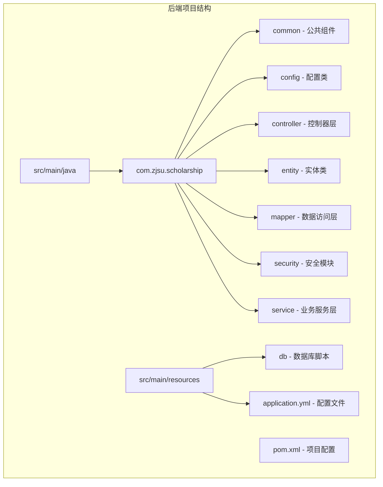

**图表来源**
- [ScholarshipApplication.java:1-14](file://backend/src/main/java/com/zjsu/scholarship/ScholarshipApplication.java#L1-L14)
- [application.yml:1-52](file://backend/src/main/resources/application.yml#L1-L52)

**章节来源**
- [ScholarshipApplication.java:1-14](file://backend/src/main/java/com/zjsu/scholarship/ScholarshipApplication.java#L1-L14)
- [application.yml:1-52](file://backend/src/main/resources/application.yml#L1-L52)

## 核心组件

### Spring Boot启动类

系统的核心启动类位于`ScholarshipApplication`，采用了标准的Spring Boot启动模式：

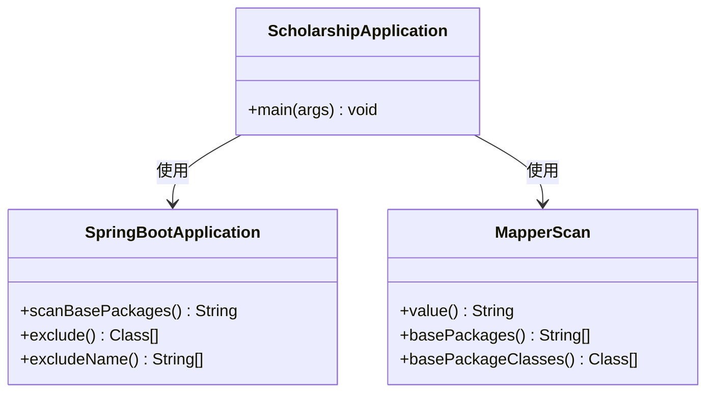

**图表来源**
- [ScholarshipApplication.java:7-8](file://backend/src/main/java/com/zjsu/scholarship/ScholarshipApplication.java#L7-L8)

### MVC分层架构

系统严格遵循MVC设计模式，实现了清晰的职责分离：

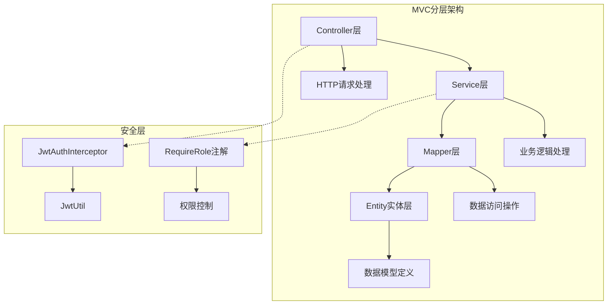

**图表来源**
- [AuthController.java:11-19](file://backend/src/main/java/com/zjsu/scholarship/controller/AuthController.java#L11-L19)
- [AuthService.java:16-30](file://backend/src/main/java/com/zjsu/scholarship/service/AuthService.java#L16-L30)
- [JwtAuthInterceptor.java:12-18](file://backend/src/main/java/com/zjsu/scholarship/security/JwtAuthInterceptor.java#L12-L18)

**章节来源**
- [ScholarshipApplication.java:1-14](file://backend/src/main/java/com/zjsu/scholarship/ScholarshipApplication.java#L1-L14)
- [AuthController.java:1-44](file://backend/src/main/java/com/zjsu/scholarship/controller/AuthController.java#L1-L44)
- [AuthService.java:1-77](file://backend/src/main/java/com/zjsu/scholarship/service/AuthService.java#L1-L77)

## 架构概览

### 整体架构设计

系统采用现代化的企业级应用架构，集成了多种技术栈以实现高性能和可维护性：

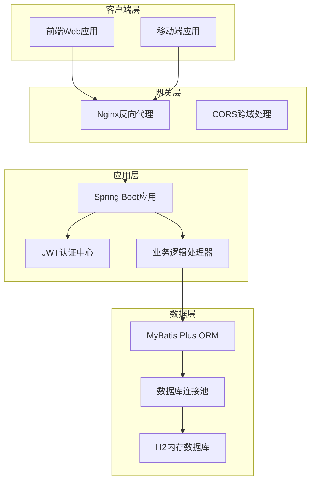

**图表来源**
- [WebMvcConfig.java:34-41](file://backend/src/main/java/com/zjsu/scholarship/config/WebMvcConfig.java#L34-L41)
- [JwtAuthInterceptor.java:20-28](file://backend/src/main/java/com/zjsu/scholarship/security/JwtAuthInterceptor.java#L20-L28)

### 启动流程图

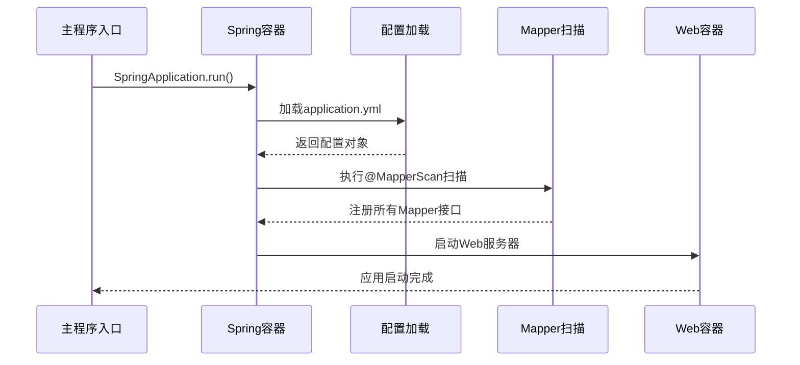

**图表来源**
- [ScholarshipApplication.java:10-12](file://backend/src/main/java/com/zjsu/scholarship/ScholarshipApplication.java#L10-L12)
- [application.yml:8-28](file://backend/src/main/resources/application.yml#L8-L28)

## 详细组件分析

### Spring Boot自动配置机制

#### @SpringBootApplication注解解析

`@SpringBootApplication`是Spring Boot的核心注解，它整合了多个重要注解的功能：

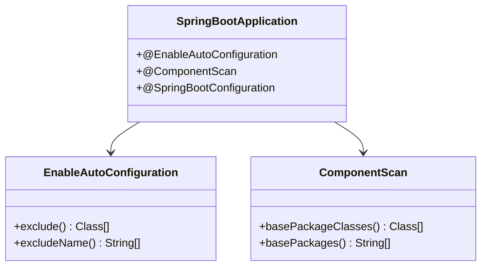

**图表来源**
- [ScholarshipApplication.java:7](file://backend/src/main/java/com/zjsu/scholarship/ScholarshipApplication.java#L7)

#### 组件扫描机制

系统通过`@ComponentScan`实现自动组件发现，扫描范围包括整个应用包结构：

**章节来源**
- [ScholarshipApplication.java:7-8](file://backend/src/main/java/com/zjsu/scholarship/ScholarshipApplication.java#L7-L8)

### MyBatis Plus集成与Mapper自动注册

#### Mapper接口自动注册机制

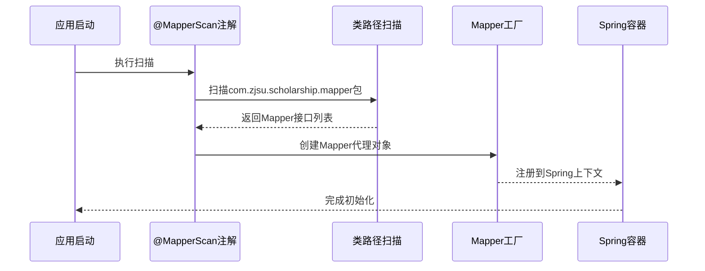

**图表来源**
- [ScholarshipApplication.java:8](file://backend/src/main/java/com/zjsu/scholarship/ScholarshipApplication.java#L8)
- [UserMapper.java:6](file://backend/src/main/java/com/zjsu/scholarship/mapper/UserMapper.java#L6)

#### MyBatis Plus配置详解

系统使用MyBatis Plus作为ORM框架，配置文件中包含以下关键设置：

**章节来源**
- [UserMapper.java:1-8](file://backend/src/main/java/com/zjsu/scholarship/mapper/UserMapper.java#L1-L8)
- [application.yml:34-41](file://backend/src/main/resources/application.yml#L34-L41)

### JWT安全认证系统

#### JWT工具类设计

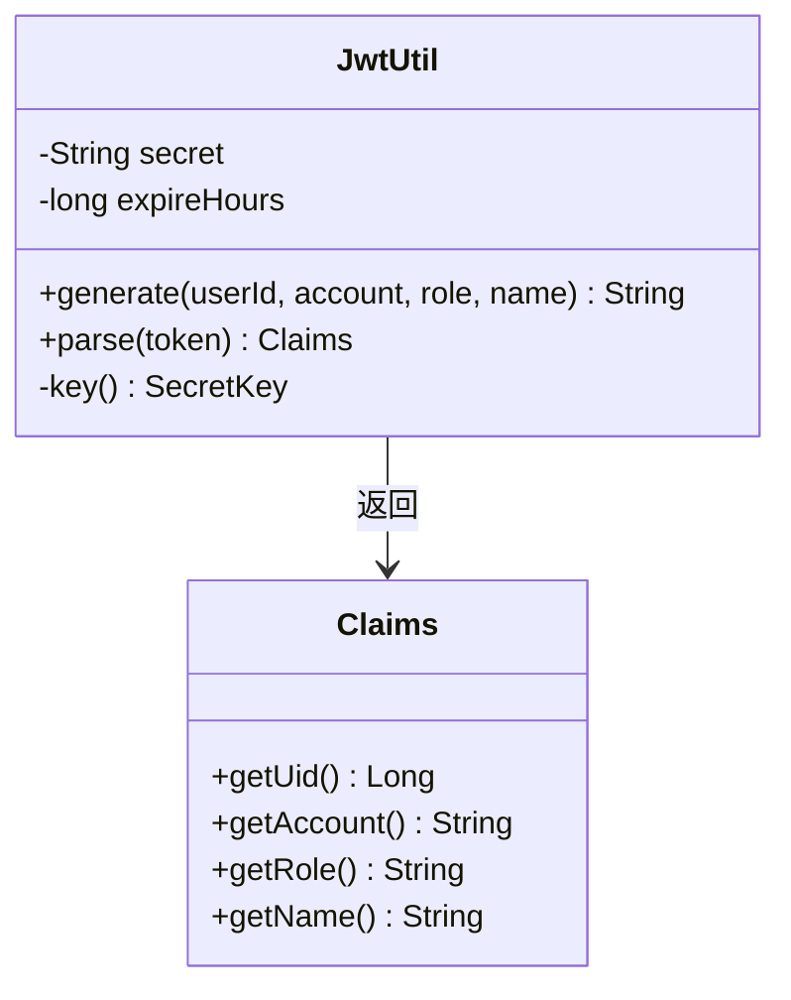

**图表来源**
- [JwtUtil.java:18-26](file://backend/src/main/java/com/zjsu/scholarship/security/JwtUtil.java#L18-L26)
- [JwtUtil.java:44-50](file://backend/src/main/java/com/zjsu/scholarship/security/JwtUtil.java#L44-L50)

#### JWT拦截器实现

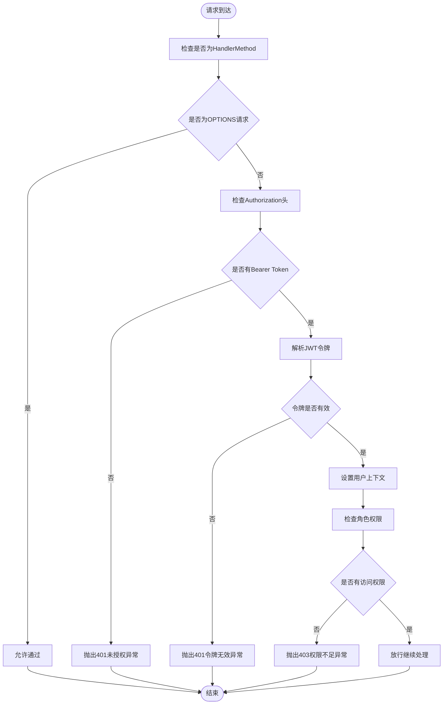

**图表来源**
- [JwtAuthInterceptor.java:21-58](file://backend/src/main/java/com/zjsu/scholarship/security/JwtAuthInterceptor.java#L21-L58)

**章节来源**
- [JwtUtil.java:1-52](file://backend/src/main/java/com/zjsu/scholarship/security/JwtUtil.java#L1-L52)
- [JwtAuthInterceptor.java:1-65](file://backend/src/main/java/com/zjsu/scholarship/security/JwtAuthInterceptor.java#L1-L65)

### MVC控制器层设计

#### 认证控制器实现

系统提供了专门的认证控制器处理用户登录和权限验证：

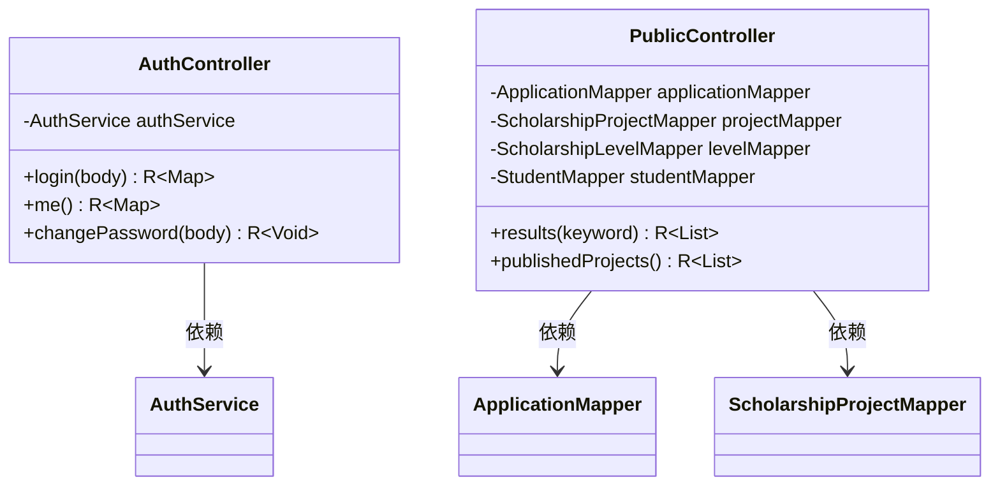

**图表来源**
- [AuthController.java:15-19](file://backend/src/main/java/com/zjsu/scholarship/controller/AuthController.java#L15-L19)
- [PublicController.java:15-26](file://backend/src/main/java/com/zjsu/scholarship/controller/PublicController.java#L15-L26)

#### 业务服务层架构

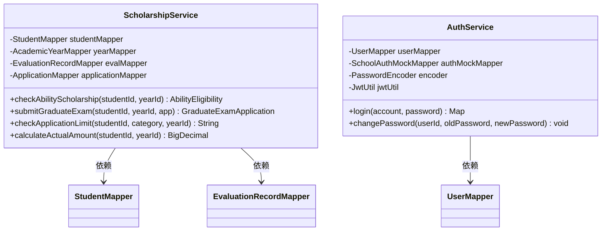

**图表来源**
- [ScholarshipService.java:22-49](file://backend/src/main/java/com/zjsu/scholarship/service/ScholarshipService.java#L22-L49)
- [AuthService.java:19-30](file://backend/src/main/java/com/zjsu/scholarship/service/AuthService.java#L19-L30)

**章节来源**
- [AuthController.java:1-44](file://backend/src/main/java/com/zjsu/scholarship/controller/AuthController.java#L1-L44)
- [PublicController.java:1-78](file://backend/src/main/java/com/zjsu/scholarship/controller/PublicController.java#L1-L78)
- [ScholarshipService.java:1-280](file://backend/src/main/java/com/zjsu/scholarship/service/ScholarshipService.java#L1-L280)
- [AuthService.java:1-77](file://backend/src/main/java/com/zjsu/scholarship/service/AuthService.java#L1-L77)

### 数据模型与实体映射

#### 用户实体设计

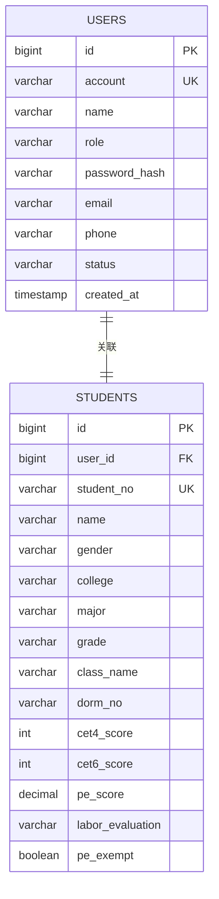

**图表来源**
- [User.java:13-23](file://backend/src/main/java/com/zjsu/scholarship/entity/User.java#L13-L23)
- [schema.sql:7-43](file://backend/src/main/resources/db/schema.sql#L7-L43)

**章节来源**
- [User.java:1-24](file://backend/src/main/java/com/zjsu/scholarship/entity/User.java#L1-L24)
- [schema.sql:1-402](file://backend/src/main/resources/db/schema.sql#L1-L402)

## 依赖分析

### Maven依赖管理

系统采用Maven进行依赖管理，核心依赖包括：

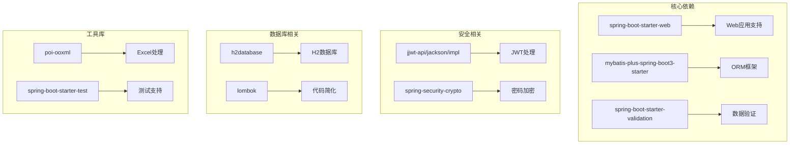

**图表来源**
- [pom.xml:26-87](file://backend/pom.xml#L26-L87)

### 数据访问层设计

#### Mapper接口继承体系

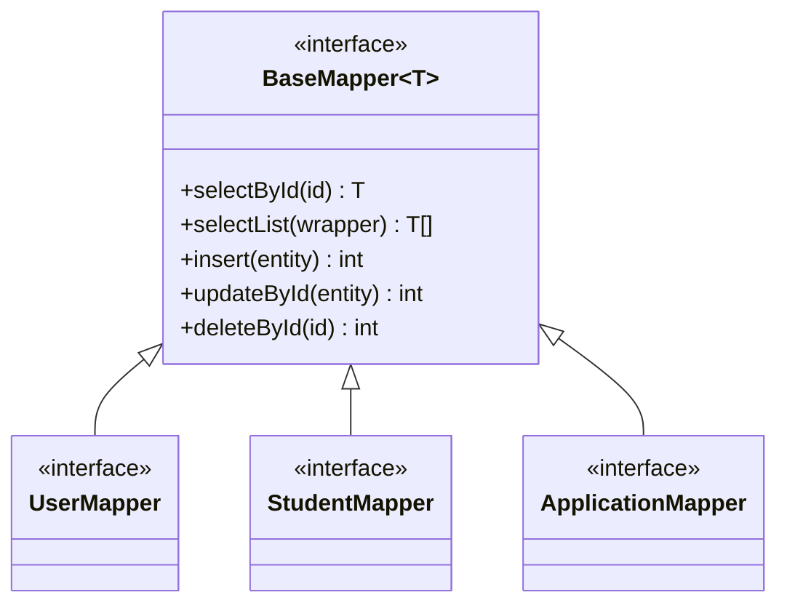

**图表来源**
- [UserMapper.java:6](file://backend/src/main/java/com/zjsu/scholarship/mapper/UserMapper.java#L6)

**章节来源**
- [pom.xml:1-108](file://backend/pom.xml#L1-L108)

## 性能考虑

### 数据库连接优化

系统使用H2内存数据库进行开发和测试，配置了以下优化参数：

- **连接池配置**：通过Spring Boot自动配置实现连接池管理
- **SQL初始化**：使用`schema.sql`和`data.sql`进行数据库初始化
- **缓存策略**：MyBatis Plus配置了NoLogging实现以减少日志开销

### 缓存策略

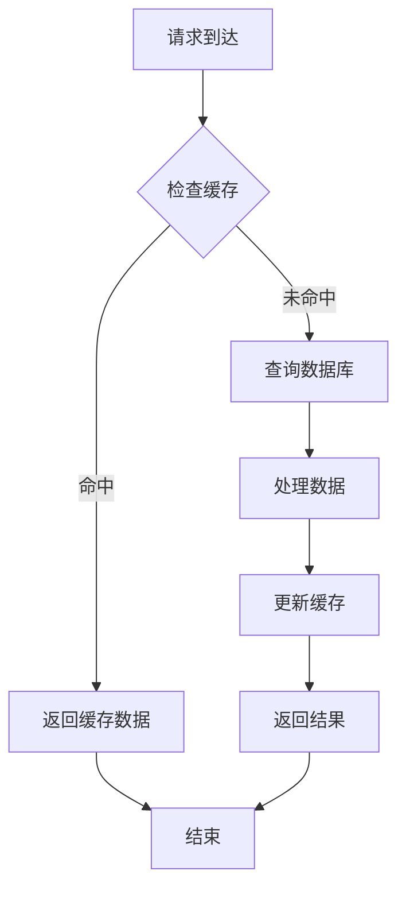

### 并发处理

系统采用以下并发处理策略：
- **线程安全**：所有服务类都是单例且无状态设计
- **事务管理**：关键业务操作使用`@Transactional`注解
- **异常处理**：统一的全局异常处理机制

## 故障排除指南

### 常见问题诊断

#### 启动失败排查

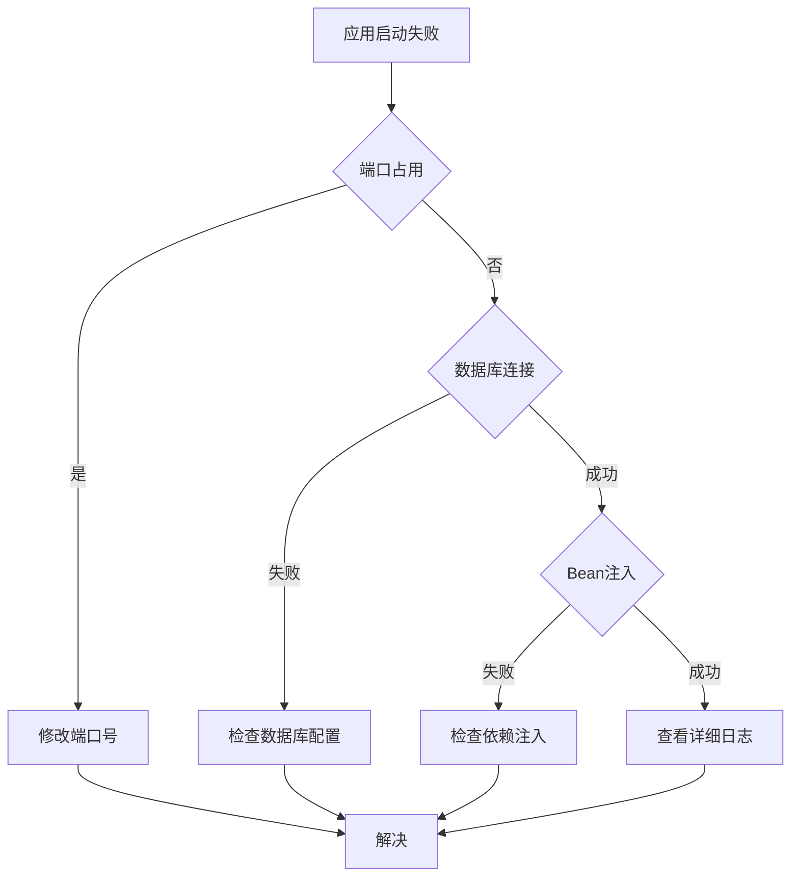

#### 权限认证问题

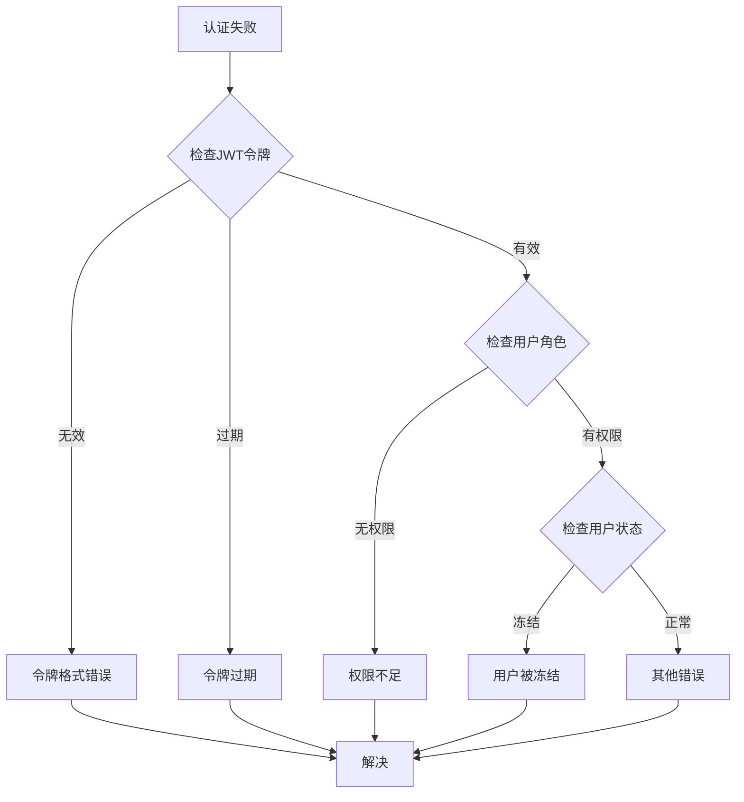

**章节来源**
- [GlobalExceptionHandler.java:12-21](file://backend/src/main/java/com/zjsu/scholarship/common/GlobalExceptionHandler.java#L12-L21)
- [JwtAuthInterceptor.java:26-56](file://backend/src/main/java/com/zjsu/scholarship/security/JwtAuthInterceptor.java#L26-L56)

### 错误响应标准化

系统实现了统一的错误响应格式：

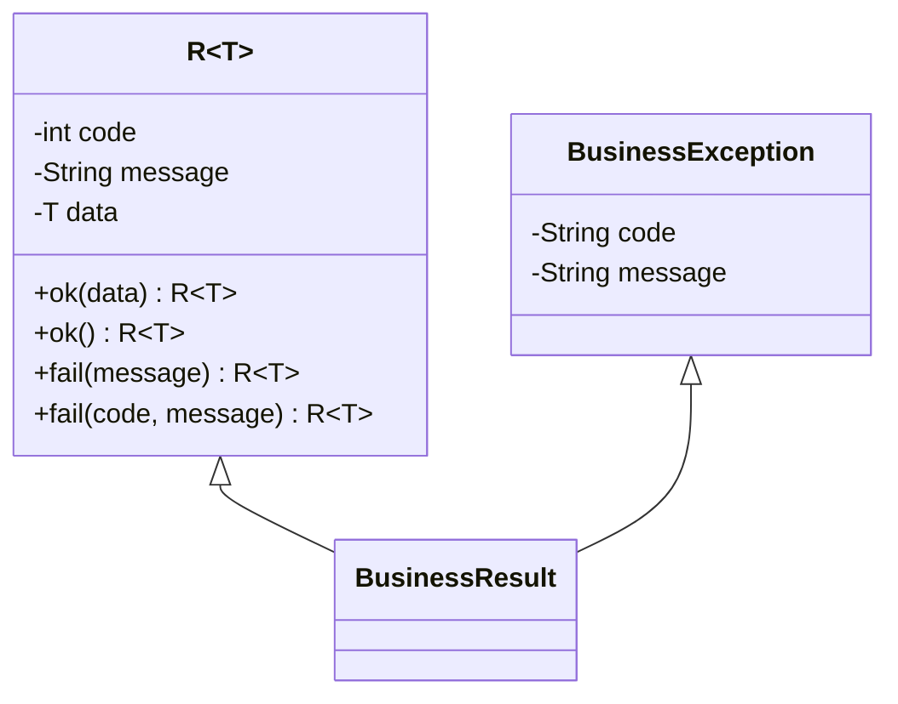

**图表来源**
- [R.java:16-30](file://backend/src/main/java/com/zjsu/scholarship/common/R.java#L16-L30)

**章节来源**
- [R.java:1-39](file://backend/src/main/java/com/zjsu/scholarship/common/R.java#L1-L39)
- [GlobalExceptionHandler.java:1-23](file://backend/src/main/java/com/zjsu/scholarship/common/GlobalExceptionHandler.java#L1-L23)

## 结论

本项目展现了现代Spring Boot应用的最佳实践，通过合理的架构设计和组件分离，实现了高内聚、低耦合的系统结构。主要特点包括：

1. **清晰的分层架构**：严格按照MVC模式设计，职责明确
2. **自动配置机制**：充分利用Spring Boot的约定优于配置原则
3. **安全认证体系**：完善的JWT认证和权限控制机制
4. **ORM集成**：MyBatis Plus提供了强大的数据访问能力
5. **统一异常处理**：标准化的错误响应格式
6. **配置管理**：灵活的YAML配置文件管理

系统在保证功能完整性的同时，注重了可扩展性和可维护性，为后续的功能扩展奠定了良好的基础。通过合理的依赖管理和性能优化策略，确保了系统的稳定运行和良好用户体验。