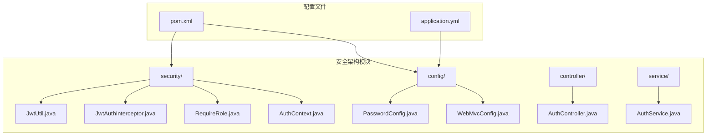
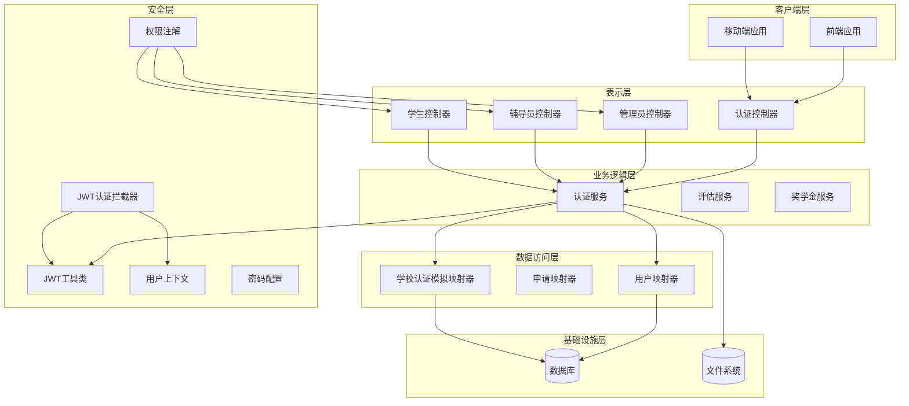
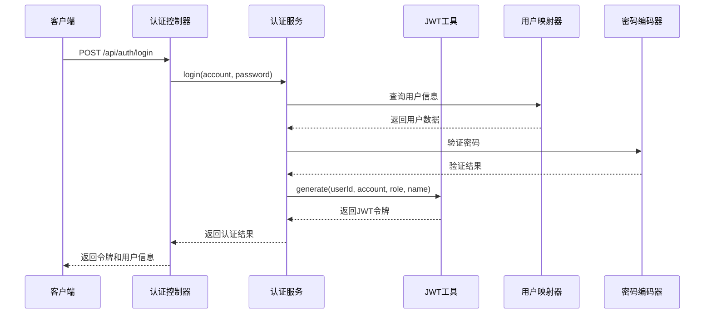
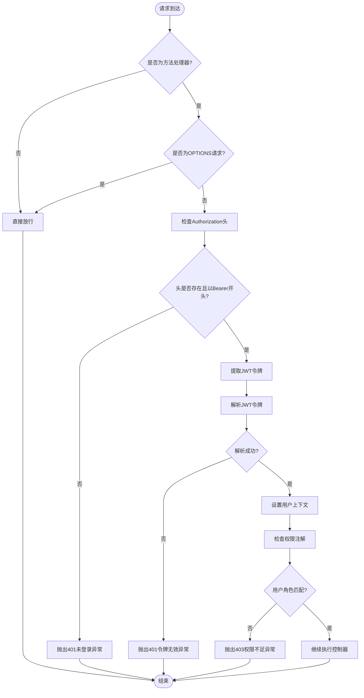
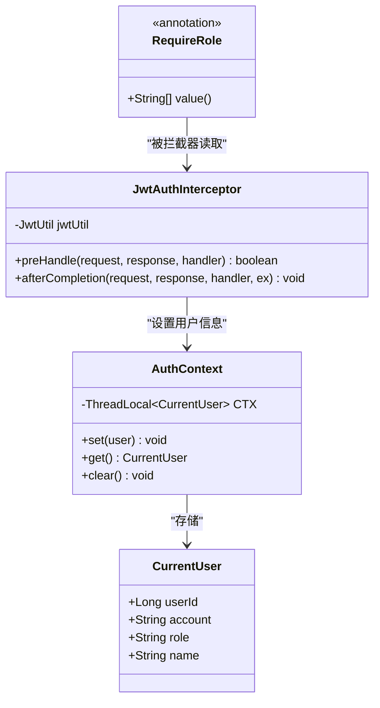
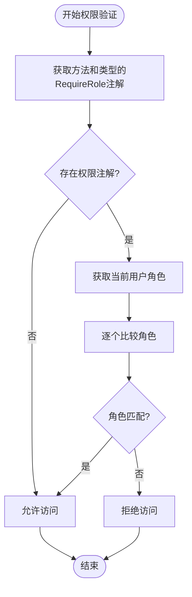
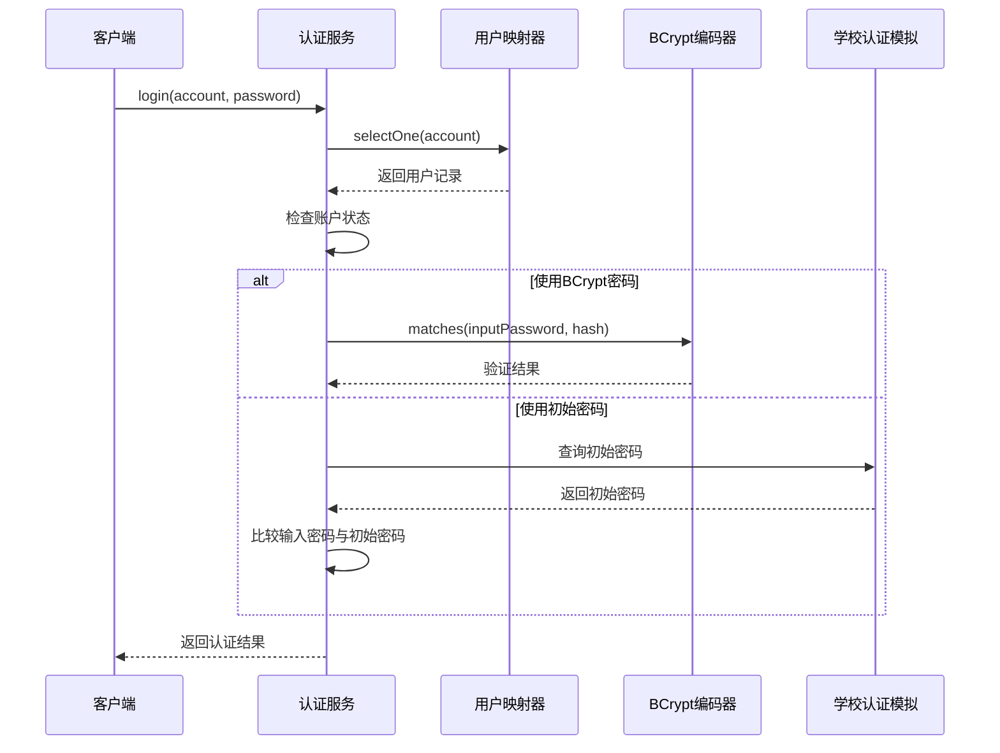
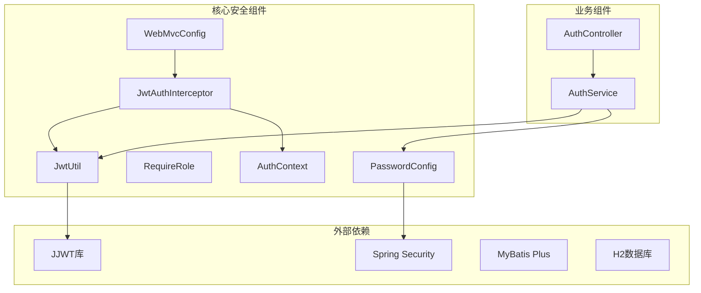

# 安全架构设计

<cite>
**本文档引用的文件**
- [JwtUtil.java](file://backend/src/main/java/com/zjsu/scholarship/security/JwtUtil.java)
- [JwtAuthInterceptor.java](file://backend/src/main/java/com/zjsu/scholarship/security/JwtAuthInterceptor.java)
- [RequireRole.java](file://backend/src/main/java/com/zjsu/scholarship/security/RequireRole.java)
- [AuthContext.java](file://backend/src/main/java/com/zjsu/scholarship/security/AuthContext.java)
- [PasswordConfig.java](file://backend/src/main/java/com/zjsu/scholarship/config/PasswordConfig.java)
- [WebMvcConfig.java](file://backend/src/main/java/com/zjsu/scholarship/config/WebMvcConfig.java)
- [AuthService.java](file://backend/src/main/java/com/zjsu/scholarship/service/AuthService.java)
- [AuthController.java](file://backend/src/main/java/com/zjsu/scholarship/controller/AuthController.java)
- [application.yml](file://backend/src/main/resources/application.yml)
- [pom.xml](file://backend/pom.xml)
</cite>

## 目录
1. [引言](#引言)
2. [项目结构](#项目结构)
3. [核心组件](#核心组件)
4. [架构概览](#架构概览)
5. [详细组件分析](#详细组件分析)
6. [依赖关系分析](#依赖关系分析)
7. [性能考虑](#性能考虑)
8. [故障排除指南](#故障排除指南)
9. [结论](#结论)

## 引言

本项目采用基于JWT（JSON Web Token）的认证机制和基于注解的权限控制系统，构建了一个完整的安全架构。系统通过Spring Security进行密码加密，使用JWT实现无状态认证，并通过自定义拦截器实现统一的权限控制。

## 项目结构

后端安全相关的核心目录结构如下：

**图表来源**
- [JwtUtil.java:1-52](file://backend/src/main/java/com/zjsu/scholarship/security/JwtUtil.java#L1-L52)
- [WebMvcConfig.java:1-49](file://backend/src/main/java/com/zjsu/scholarship/config/WebMvcConfig.java#L1-L49)

**章节来源**
- [JwtUtil.java:1-52](file://backend/src/main/java/com/zjsu/scholarship/security/JwtUtil.java#L1-L52)
- [WebMvcConfig.java:1-49](file://backend/src/main/java/com/zjsu/scholarship/config/WebMvcConfig.java#L1-L49)

## 核心组件

### JWT工具组件

JWT工具组件负责令牌的生成、解析和验证，是整个认证系统的核心。

**章节来源**
- [JwtUtil.java:15-51](file://backend/src/main/java/com/zjsu/scholarship/security/JwtUtil.java#L15-L51)

### 认证拦截器

JwtAuthInterceptor实现了Spring MVC的HandlerInterceptor接口，负责在请求到达控制器之前进行身份验证和权限检查。

**章节来源**
- [JwtAuthInterceptor.java:11-64](file://backend/src/main/java/com/zjsu/scholarship/security/JwtAuthInterceptor.java#L11-L64)

### 权限注解系统

RequireRole注解提供了声明式的权限控制机制，支持方法级和类型级的权限标注。

**章节来源**
- [RequireRole.java:8-12](file://backend/src/main/java/com/zjsu/scholarship/security/RequireRole.java#L8-L12)

### 用户上下文管理

AuthContext使用ThreadLocal实现线程安全的用户信息存储，确保在整个请求处理过程中可以访问当前用户信息。

**章节来源**
- [AuthContext.java:3-18](file://backend/src/main/java/com/zjsu/scholarship/security/AuthContext.java#L3-L18)

### 密码加密配置

PasswordConfig提供了基于BCrypt的密码加密策略，确保用户密码的安全存储。

**章节来源**
- [PasswordConfig.java:8-14](file://backend/src/main/java/com/zjsu/scholarship/config/PasswordConfig.java#L8-L14)

### Web配置管理

WebMvcConfig整合了JWT拦截器和CORS跨域配置，提供统一的Web层安全设置。

**章节/sources**
- [WebMvcConfig.java:11-48](file://backend/src/main/java/com/zjsu/scholarship/config/WebMvcConfig.java#L11-L48)

## 架构概览

系统采用分层架构设计，各组件职责清晰，耦合度低：

**图表来源**
- [JwtAuthInterceptor.java:11-18](file://backend/src/main/java/com/zjsu/scholarship/security/JwtAuthInterceptor.java#L11-L18)
- [AuthService.java:16-30](file://backend/src/main/java/com/zjsu/scholarship/service/AuthService.java#L16-L30)
- [AuthController.java:11-19](file://backend/src/main/java/com/zjsu/scholarship/controller/AuthController.java#L11-L19)

## 详细组件分析

### JWT认证机制

JWT认证机制实现了完整的令牌生命周期管理：

#### 令牌生成流程

**图表来源**
- [AuthService.java:32-55](file://backend/src/main/java/com/zjsu/scholarship/service/AuthService.java#L32-L55)
- [JwtUtil.java:28-42](file://backend/src/main/java/com/zjsu/scholarship/security/JwtUtil.java#L28-L42)

#### 令牌验证流程

**图表来源**
- [JwtAuthInterceptor.java:20-57](file://backend/src/main/java/com/zjsu/scholarship/security/JwtAuthInterceptor.java#L20-L57)

**章节来源**
- [JwtUtil.java:24-50](file://backend/src/main/java/com/zjsu/scholarship/security/JwtUtil.java#L24-L50)
- [AuthService.java:32-55](file://backend/src/main/java/com/zjsu/scholarship/service/AuthService.java#L32-L55)

### 权限控制体系

系统采用基于注解的声明式权限控制，结合拦截器实现运行时权限验证。

#### 权限注解机制

**图表来源**
- [RequireRole.java:8-12](file://backend/src/main/java/com/zjsu/scholarship/security/RequireRole.java#L8-L12)
- [JwtAuthInterceptor.java:11-18](file://backend/src/main/java/com/zjsu/scholarship/security/JwtAuthInterceptor.java#L11-L18)
- [AuthContext.java:3-18](file://backend/src/main/java/com/zjsu/scholarship/security/AuthContext.java#L3-L18)

#### 角色匹配算法

**图表来源**
- [JwtAuthInterceptor.java:40-51](file://backend/src/main/java/com/zjsu/scholarship/security/JwtAuthInterceptor.java#L40-L51)

**章节来源**
- [RequireRole.java:8-12](file://backend/src/main/java/com/zjsu/scholarship/security/RequireRole.java#L8-L12)
- [JwtAuthInterceptor.java:40-51](file://backend/src/main/java/com/zjsu/scholarship/security/JwtAuthInterceptor.java#L40-L51)

### 密码加密策略

系统采用BCrypt算法进行密码加密，确保用户凭据的安全性。

#### 密码验证流程

**图表来源**
- [AuthService.java:32-45](file://backend/src/main/java/com/zjsu/scholarship/service/AuthService.java#L32-L45)

**章节来源**
- [PasswordConfig.java:8-14](file://backend/src/main/java/com/zjsu/scholarship/config/PasswordConfig.java#L8-L14)
- [AuthService.java:38-44](file://backend/src/main/java/com/zjsu/scholarship/service/AuthService.java#L38-L44)

### CORS跨域配置

系统提供了全面的CORS配置，支持多种跨域场景的安全访问。

#### CORS配置参数

| 配置项 | 值 | 说明 |
|--------|-----|------|
| 允许路径 | /** | 对所有路径生效 |
| 允许源模式 | "*" | 允许任意域名 |
| 允许方法 | GET, POST, PUT, DELETE, OPTIONS | 支持RESTful操作 |
| 允许头部 | "*" | 允许任意请求头部 |
| 凭据 | true | 允许携带Cookie和认证头部 |
| 最大预检缓存时间 | 3600秒 | 缓存预检请求结果 |

**章节来源**
- [WebMvcConfig.java:34-41](file://backend/src/main/java/com/zjsu/scholarship/config/WebMvcConfig.java#L34-L41)

## 依赖关系分析

系统依赖关系清晰，主要外部依赖包括JWT库和Spring Security。

**图表来源**
- [pom.xml:35-76](file://backend/pom.xml#L35-L76)

**章节来源**
- [pom.xml:35-76](file://backend/pom.xml#L35-L76)

## 性能考虑

### JWT令牌性能优化

1. **令牌大小控制**：仅包含必要的用户信息，避免冗余数据
2. **过期时间设置**：合理的过期时间平衡安全性与用户体验
3. **内存缓存**：可考虑实现令牌黑名单缓存机制

### 权限检查优化

1. **注解缓存**：Spring会自动缓存注解元数据，减少反射开销
2. **角色匹配优化**：使用Set数据结构提高角色匹配效率
3. **线程本地存储**：ThreadLocal提供快速的用户上下文访问

### 数据库访问优化

1. **查询优化**：用户查询使用索引字段(account)
2. **批量操作**：对于批量数据操作考虑事务优化
3. **连接池配置**：合理配置数据库连接池参数

## 故障排除指南

### 常见认证问题

| 问题类型 | 错误代码 | 可能原因 | 解决方案 |
|----------|----------|----------|----------|
| 未登录访问 | 401 | 缺少Authorization头或格式错误 | 确保请求头格式为"Bearer {token}" |
| 令牌过期 | 401 | JWT令牌超过有效期 | 重新登录获取新令牌 |
| 令牌无效 | 401 | 签名验证失败或格式错误 | 检查服务器密钥配置和令牌完整性 |
| 权限不足 | 403 | 用户角色不满足要求 | 确认用户角色和接口权限配置 |
| 账号冻结 | 400 | 用户状态为非ACTIVE | 联系管理员解锁账号 |

### 调试建议

1. **启用详细日志**：在开发环境启用JWT和安全相关日志
2. **令牌验证**：使用在线JWT解析工具验证令牌结构
3. **权限测试**：编写单元测试验证权限注解行为
4. **网络监控**：使用浏览器开发者工具监控请求响应

**章节来源**
- [JwtAuthInterceptor.java:26-56](file://backend/src/main/java/com/zjsu/scholarship/security/JwtAuthInterceptor.java#L26-L56)

## 结论

本项目构建了一个完整、安全、可扩展的认证授权体系。通过JWT实现无状态认证，通过注解实现声明式权限控制，通过BCrypt确保密码安全，通过CORS配置支持跨域访问。系统架构清晰，组件职责明确，具有良好的可维护性和扩展性。

建议在生产环境中进一步完善以下方面：
1. 实现令牌刷新机制
2. 添加审计日志功能
3. 增强异常处理和监控
4. 考虑实现令牌黑名单机制
5. 添加更多安全防护措施如CSRF保护