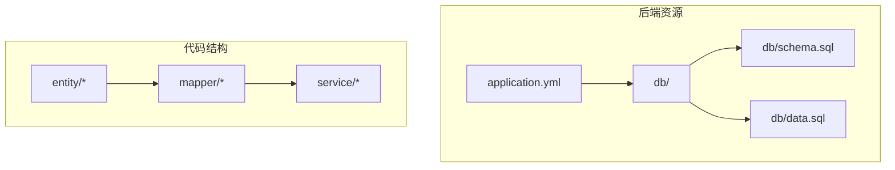
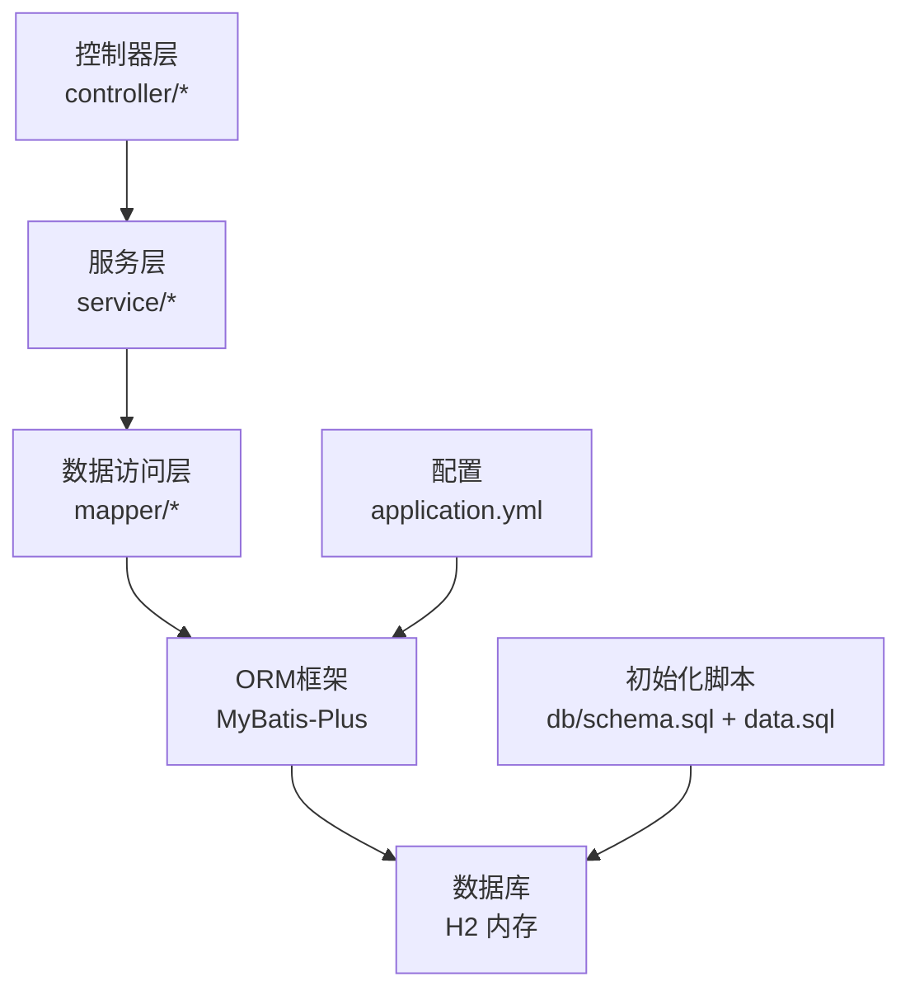
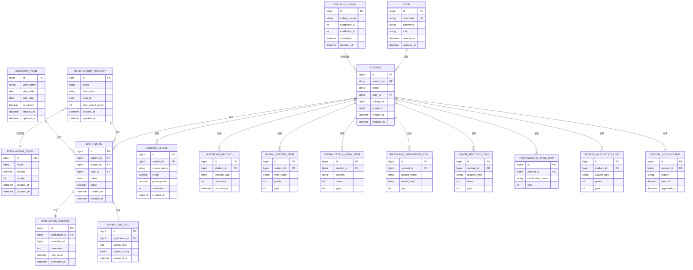
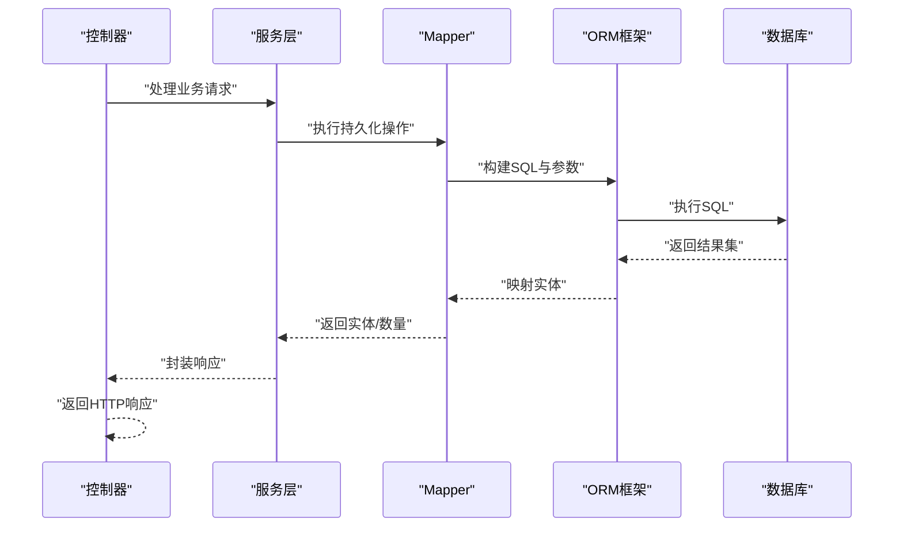
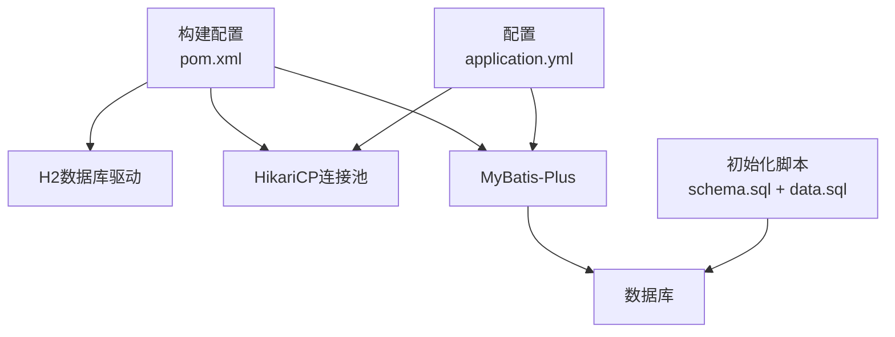

# 数据架构设计

<cite>
**本文档引用的文件**
- [application.yml](file://backend/src/main/resources/application.yml)
- [schema.sql](file://backend/src/main/resources/db/schema.sql)
- [data.sql](file://backend/src/main/resources/db/data.sql)
- [pom.xml](file://backend/pom.xml)
- [ScholarshipApplication.java](file://backend/src/main/java/com/zjsu/scholarship/ScholarshipApplication.java)
- [Student.java](file://backend/src/main/java/com/zjsu/scholarship/entity/Student.java)
- [User.java](file://backend/src/main/java/com/zjsu/scholarship/entity/User.java)
- [StudentMapper.java](file://backend/src/main/java/com/zjsu/scholarship/mapper/StudentMapper.java)
- [UserMapper.java](file://backend/src/main/java/com/zjsu/scholarship/mapper/UserMapper.java)
- [DataSeedService.java](file://backend/src/main/java/com/zjsu/scholarship/service/DataSeedService.java)
</cite>

## 目录
1. [简介](#简介)
2. [项目结构](#项目结构)
3. [核心组件](#核心组件)
4. [架构总览](#架构总览)
5. [详细组件分析](#详细组件分析)
6. [依赖分析](#依赖分析)
7. [性能考虑](#性能考虑)
8. [故障排除指南](#故障排除指南)
9. [结论](#结论)
10. [附录](#附录)

## 简介
本文件系统化梳理奖学金管理系统的数据架构设计，重点覆盖数据库设计与ORM映射策略、H2内存数据库选型与配置、实体-表映射关系、Mapper接口设计模式、数据库初始化脚本与数据字典、数据访问层事务与连接管理机制，并提供ER关系图与数据流图，阐述实体间关系及数据在各层间的流转过程，最后总结数据一致性与并发控制策略。

## 项目结构
后端采用Spring Boot工程，数据相关资源集中在resources目录下，包含数据库初始化脚本与应用配置；实体与Mapper位于entity与mapper包中，服务层负责业务编排与数据种子初始化。

**图表来源**
- [application.yml](file://backend/src/main/resources/application.yml)
- [schema.sql](file://backend/src/main/resources/db/schema.sql)
- [data.sql](file://backend/src/main/resources/db/data.sql)

**章节来源**
- [application.yml](file://backend/src/main/resources/application.yml)
- [schema.sql](file://backend/src/main/resources/db/schema.sql)
- [data.sql](file://backend/src/main/resources/db/data.sql)

## 核心组件
- 数据库与连接配置：通过application.yml中的数据源与MyBatis-Plus配置，启用H2内存数据库与连接池参数。
- 初始化脚本：schema.sql定义表结构与索引，data.sql提供基础数据字典与初始数据。
- ORM映射：实体类使用MyBatis-Plus注解进行表名与主键映射，Mapper接口基于通用Mapper扩展。
- 事务与连接：服务层方法标注事务传播行为，确保数据一致性；底层由Spring声明式事务与连接池协同保障。

**章节来源**
- [application.yml](file://backend/src/main/resources/application.yml)
- [schema.sql](file://backend/src/main/resources/db/schema.sql)
- [data.sql](file://backend/src/main/resources/db/data.sql)
- [Student.java](file://backend/src/main/java/com/zjsu/scholarship/entity/Student.java)
- [User.java](file://backend/src/main/java/com/zjsu/scholarship/entity/User.java)
- [StudentMapper.java](file://backend/src/main/java/com/zjsu/scholarship/mapper/StudentMapper.java)
- [UserMapper.java](file://backend/src/main/java/com/zjsu/scholarship/mapper/UserMapper.java)
- [DataSeedService.java](file://backend/src/main/java/com/zjsu/scholarship/service/DataSeedService.java)

## 架构总览
系统采用分层架构：表现层（控制器）调用服务层，服务层通过Mapper访问数据库，ORM框架完成对象关系映射。数据库为H2内存数据库，初始化脚本在应用启动时执行，连接池参数在配置文件中集中管理。

**图表来源**
- [application.yml](file://backend/src/main/resources/application.yml)
- [schema.sql](file://backend/src/main/resources/db/schema.sql)
- [data.sql](file://backend/src/main/resources/db/data.sql)

## 详细组件分析

### 数据库与连接配置
- H2内存数据库：用于开发与测试环境，避免外部数据库依赖，启动即可用。
- 数据源配置：在application.yml中定义URL、驱动、用户名与密码等基础信息。
- 连接池设置：通过HikariCP参数控制最大连接数、空闲超时、连接生命周期等，提升并发访问性能。
- MyBatis-Plus：启用驼峰映射、分页插件、自动填充等特性，简化CRUD与查询构建。

**章节来源**
- [application.yml](file://backend/src/main/resources/application.yml)

### 实体类与表映射
- 表名映射：实体类通过注解指定对应表名，确保ORM解析准确。
- 主键映射：使用注解标识主键字段与生成策略，支持自增或雪花算法等。
- 字段映射：遵循命名规范，开启驼峰映射以减少显式字段映射。
- 公共字段：如创建时间、更新时间等，结合自动填充策略统一维护。

示例参考路径（不展示具体代码内容）：
- [Student.java](file://backend/src/main/java/com/zjsu/scholarship/entity/Student.java)
- [User.java](file://backend/src/main/java/com/zjsu/scholarship/entity/User.java)

**章节来源**
- [Student.java](file://backend/src/main/java/com/zjsu/scholarship/entity/Student.java)
- [User.java](file://backend/src/main/java/com/zjsu/scholarship/entity/User.java)

### Mapper接口设计模式
- 通用Mapper：Mapper接口继承通用Mapper基类，获得标准CRUD与条件构造器能力，降低重复代码。
- 自定义SQL：通过XML或注解编写复杂查询、联表统计与批量操作，满足业务场景。
- 分页查询：结合分页插件与条件构造器，实现高效分页与排序。
- 批量操作：针对导入与初始化场景，提供批量插入与更新策略。

示例参考路径（不展示具体代码内容）：
- [StudentMapper.java](file://backend/src/main/java/com/zjsu/scholarship/mapper/StudentMapper.java)
- [UserMapper.java](file://backend/src/main/java/com/zjsu/scholarship/mapper/UserMapper.java)

**章节来源**
- [StudentMapper.java](file://backend/src/main/java/com/zjsu/scholarship/mapper/StudentMapper.java)
- [UserMapper.java](file://backend/src/main/java/com/zjsu/scholarship/mapper/UserMapper.java)

### 数据库初始化脚本与数据字典
- schema.sql：定义所有业务表结构、主外键约束与索引，确保数据完整性与查询效率。
- data.sql：提供基础数据字典（如奖学金等级、项目类型、学年配置等）与演示数据，支撑系统快速运行。
- 脚本执行顺序：Spring Boot启动时按约定顺序执行初始化脚本，确保表与数据就绪。

示例参考路径（不展示具体代码内容）：
- [schema.sql](file://backend/src/main/resources/db/schema.sql)
- [data.sql](file://backend/src/main/resources/db/data.sql)

**章节来源**
- [schema.sql](file://backend/src/main/resources/db/schema.sql)
- [data.sql](file://backend/src/main/resources/db/data.sql)

### 数据访问层事务与连接管理
- 事务管理：服务层方法通过事务注解声明传播行为与隔离级别，保证多步骤写操作的原子性。
- 连接管理：底层由Spring声明式事务与HikariCP连接池协作，自动分配与回收连接，减少连接泄漏风险。
- 并发控制：通过数据库锁与事务隔离级别控制并发写冲突；对热点数据采用乐观锁版本号或悲观锁策略。

**章节来源**
- [DataSeedService.java](file://backend/src/main/java/com/zjsu/scholarship/service/DataSeedService.java)

### ER关系图与数据流图

#### ER关系图（实体-关系）
以下图示展示核心实体之间的关系，体现一对多、多对一与一对一映射，以及外键约束方向。

**图表来源**
- [schema.sql](file://backend/src/main/resources/db/schema.sql)

#### 数据流图（请求到持久化的序列）
以下序列图展示一次典型的数据写入流程：控制器接收请求，服务层组织业务逻辑，Mapper执行持久化，ORM完成映射，数据库返回结果。

**图表来源**
- [application.yml](file://backend/src/main/resources/application.yml)
- [StudentMapper.java](file://backend/src/main/java/com/zjsu/scholarship/mapper/StudentMapper.java)

## 依赖分析
- 外部依赖：H2数据库驱动与HikariCP连接池在构建配置中声明，确保运行时具备数据库与连接池能力。
- 框架集成：Spring Boot自动装配MyBatis-Plus与数据源，开发者仅需关注配置与实体映射。
- 脚本依赖：初始化脚本相互依赖，需按顺序执行；数据字典依赖于基础表结构。

**图表来源**
- [pom.xml](file://backend/pom.xml)
- [application.yml](file://backend/src/main/resources/application.yml)
- [schema.sql](file://backend/src/main/resources/db/schema.sql)
- [data.sql](file://backend/src/main/resources/db/data.sql)

**章节来源**
- [pom.xml](file://backend/pom.xml)
- [application.yml](file://backend/src/main/resources/application.yml)

## 性能考虑
- 连接池优化：合理设置最大连接数与空闲超时，避免连接泄露与过度占用。
- SQL优化：利用索引与分页插件，避免全表扫描；对高频查询建立复合索引。
- 批量操作：导入与初始化场景采用批量插入，减少往返次数。
- 缓存策略：对只读数据字典引入缓存，降低数据库压力。

## 故障排除指南
- 启动失败：检查application.yml中数据库URL、驱动与凭证是否正确，确认H2与连接池依赖已添加。
- 初始化异常：核对schema.sql与data.sql语法，确保表结构与数据依赖顺序正确。
- 事务失效：确认服务层方法可见性与调用链路，避免同类内自调用导致事务失效。
- 连接池问题：监控连接池指标，调整最大连接数与超时参数，排查慢查询与未释放连接。

**章节来源**
- [application.yml](file://backend/src/main/resources/application.yml)
- [schema.sql](file://backend/src/main/resources/db/schema.sql)
- [data.sql](file://backend/src/main/resources/db/data.sql)
- [DataSeedService.java](file://backend/src/main/java/com/zjsu/scholarship/service/DataSeedService.java)

## 结论
本系统采用H2内存数据库与MyBatis-Plus ORM框架，结合通用Mapper与自定义SQL，实现了清晰的分层架构与高效的数据库访问。通过初始化脚本与连接池配置，系统在开发与测试环境中具备良好的可移植性与性能表现。建议在生产环境替换为更稳定的持久化存储，并完善索引与事务策略以进一步提升一致性与并发性能。

## 附录
- 应用启动入口：Spring Boot应用入口类负责加载配置与启动容器。
- 初始化服务：服务层提供数据种子初始化能力，确保系统初始状态完整。

**章节来源**
- [ScholarshipApplication.java](file://backend/src/main/java/com/zjsu/scholarship/ScholarshipApplication.java)
- [DataSeedService.java](file://backend/src/main/java/com/zjsu/scholarship/service/DataSeedService.java)