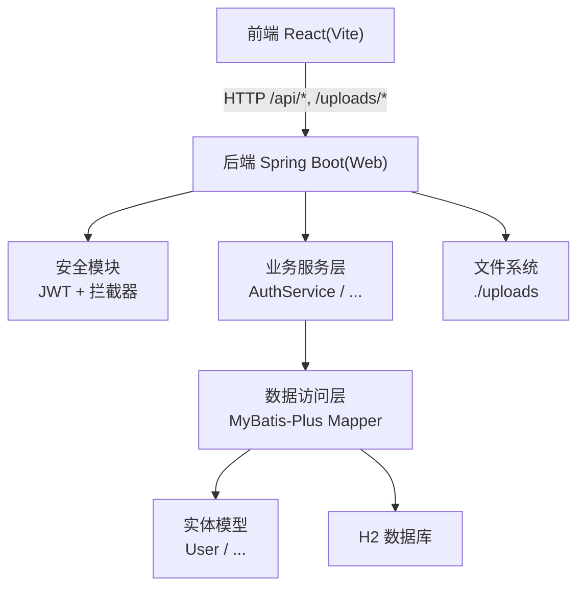
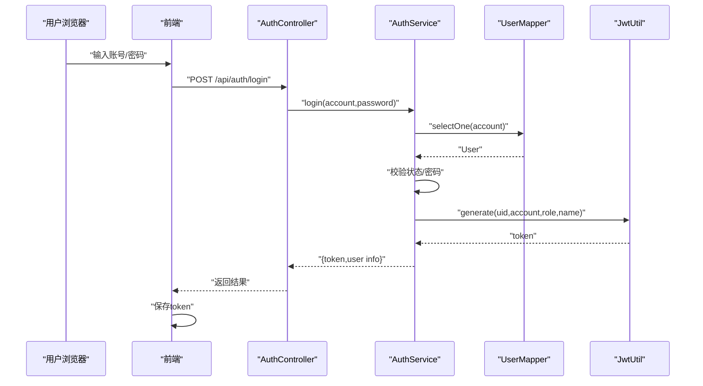
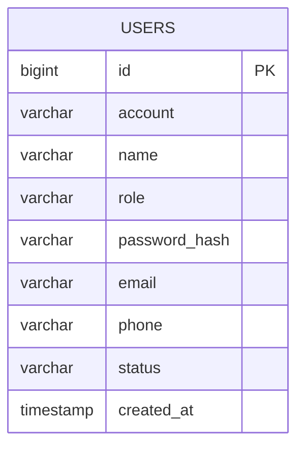
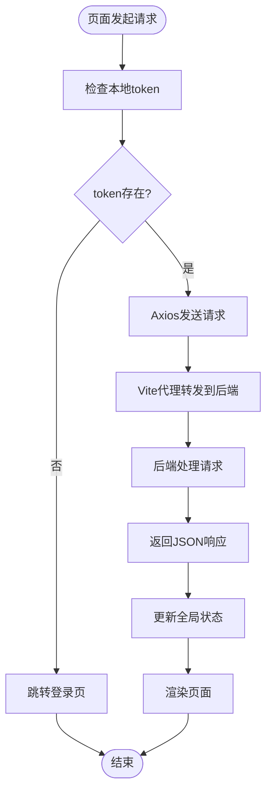
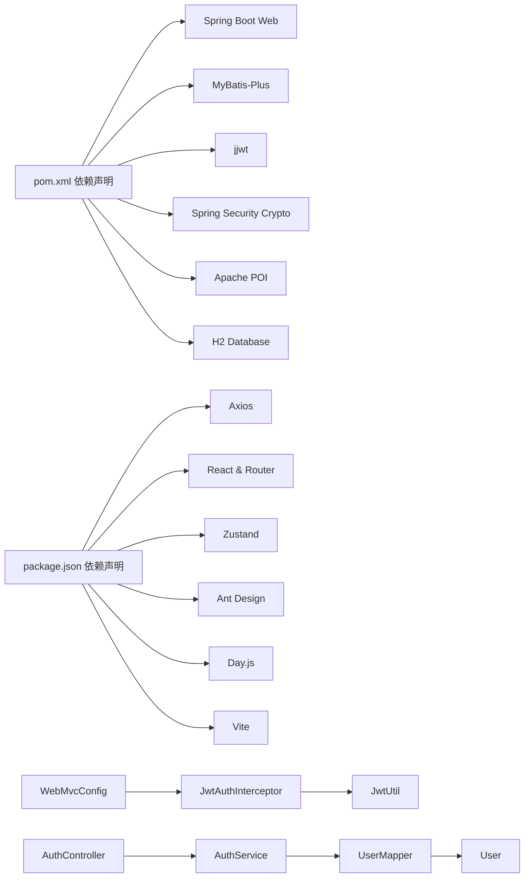

# 系统架构设计

<cite>
**本文引用的文件**
- [ScholarshipApplication.java](file://backend/src/main/java/com/zjsu/scholarship/ScholarshipApplication.java)
- [application.yml](file://backend/src/main/resources/application.yml)
- [pom.xml](file://backend/pom.xml)
- [WebMvcConfig.java](file://backend/src/main/java/com/zjsu/scholarship/config/WebMvcConfig.java)
- [PasswordConfig.java](file://backend/src/main/java/com/zjsu/scholarship/config/PasswordConfig.java)
- [JwtUtil.java](file://backend/src/main/java/com/zjsu/scholarship/security/JwtUtil.java)
- [JwtAuthInterceptor.java](file://backend/src/main/java/com/zjsu/scholarship/security/JwtAuthInterceptor.java)
- [RequireRole.java](file://backend/src/main/java/com/zjsu/scholarship/security/RequireRole.java)
- [R.java](file://backend/src/main/java/com/zjsu/scholarship/common/R.java)
- [AuthController.java](file://backend/src/main/java/com/zjsu/scholarship/controller/AuthController.java)
- [AuthService.java](file://backend/src/main/java/com/zjsu/scholarship/service/AuthService.java)
- [User.java](file://backend/src/main/java/com/zjsu/scholarship/entity/User.java)
- [UserMapper.java](file://backend/src/main/java/com/zjsu/scholarship/mapper/UserMapper.java)
- [package.json](file://frontend/package.json)
- [vite.config.js](file://frontend/vite.config.js)
- [api.js](file://frontend/src/api.js)
- [store.js](file://frontend/src/store.js)
- [README.md](file://README.md)
</cite>

## 目录
1. [引言](#引言)
2. [项目结构](#项目结构)
3. [核心组件](#核心组件)
4. [架构总览](#架构总览)
5. [详细组件分析](#详细组件分析)
6. [依赖关系分析](#依赖关系分析)
7. [性能考量](#性能考量)
8. [故障排查指南](#故障排查指南)
9. [结论](#结论)
10. [附录](#附录)

## 引言
本系统为浙江工业大学研究生奖学金管理系统，采用前后端分离的微服务架构思想：后端基于 Spring Boot 的分层架构（Controller-Service-Mapper），前端基于 React 的组件化架构。系统通过 RESTful API 进行交互，使用 JWT 实现无状态认证与授权，并通过拦截器统一处理权限校验。数据库采用 H2 内嵌数据库，支持文件上传与 Excel 导入导出。

## 项目结构
- 后端（Spring Boot）
  - 应用入口与扫描配置：启动类、MyBatis Mapper 扫描
  - 配置层：Web MVC 拦截器、CORS、静态资源映射、密码编码器
  - 安全模块：JWT 工具、拦截器、注解
  - 控制器层：认证、公共接口、各角色控制器
  - 服务层：认证、评分计算、排名、导入等业务逻辑
  - 数据访问层：MyBatis-Plus Mapper 接口
  - 实体层：用户、申请、评审记录等核心实体
  - 公共工具：统一响应体封装、全局异常处理
- 前端（React + Vite）
  - 路由与布局：按角色划分的布局组件
  - 页面组件：学生、辅导员、管理员功能页面
  - 状态管理：Zustand 状态容器
  - API 封装：Axios 请求封装与拦截器
  - 构建与代理：Vite 开发服务器代理到后端

```mermaid
graph TB
subgraph "后端(Spring Boot)"
A["应用入口<br/>ScholarshipApplication"]
B["配置层<br/>WebMvcConfig"]
C["安全模块<br/>JwtUtil / JwtAuthInterceptor / RequireRole"]
D["控制器层<br/>AuthController / ..."]
E["服务层<br/>AuthService / ..."]
F["数据访问层<br/>UserMapper / ..."]
G["实体层<br/>User / ..."]
H["公共工具<br/>R / 全局异常"]
end
subgraph "前端(React)"
P1["路由与布局<br/>Base/Admin/Counselor/Student"]
P2["页面组件<br/>Dashboard / Applications / ..."]
P3["状态管理<br/>store.js"]
P4["API封装<br/>api.js"]
P5["构建与代理<br/>vite.config.js"]
end
P4 --> |"HTTP请求"| D
D --> |"调用"| E
E --> |"读写"| F
F --> |"ORM映射"| G
C --> |"拦截"/"鉴权"| D
B --> |"CORS"/"拦截器注册"| D
A --> |"启动"| B
```

**图表来源**
- [ScholarshipApplication.java:1-14](file://backend/src/main/java/com/zjsu/scholarship/ScholarshipApplication.java#L1-L14)
- [WebMvcConfig.java:1-49](file://backend/src/main/java/com/zjsu/scholarship/config/WebMvcConfig.java#L1-L49)
- [JwtAuthInterceptor.java:1-65](file://backend/src/main/java/com/zjsu/scholarship/security/JwtAuthInterceptor.java#L1-L65)
- [AuthController.java:1-44](file://backend/src/main/java/com/zjsu/scholarship/controller/AuthController.java#L1-L44)
- [AuthService.java:1-77](file://backend/src/main/java/com/zjsu/scholarship/service/AuthService.java#L1-L77)
- [UserMapper.java:1-8](file://backend/src/main/java/com/zjsu/scholarship/mapper/UserMapper.java#L1-L8)
- [User.java:1-24](file://backend/src/main/java/com/zjsu/scholarship/entity/User.java#L1-L24)
- [vite.config.js:1-21](file://frontend/vite.config.js#L1-L21)
- [api.js](file://frontend/src/api.js)

**章节来源**
- [ScholarshipApplication.java:1-14](file://backend/src/main/java/com/zjsu/scholarship/ScholarshipApplication.java#L1-L14)
- [application.yml:1-52](file://backend/src/main/resources/application.yml#L1-L52)
- [pom.xml:1-108](file://backend/pom.xml#L1-L108)
- [package.json:1-26](file://frontend/package.json#L1-L26)

## 核心组件
- 应用入口与扫描
  - 启动类启用 Spring Boot 并扫描 Mapper 包，确保 MyBatis-Plus 正常工作
- 配置层
  - WebMvcConfig 注册 JWT 拦截器与 CORS 策略，暴露 /uploads 静态资源
  - PasswordConfig 提供 BCrypt 密码编码器 Bean
  - application.yml 配置数据源、SQL 初始化、MyBatis Plus、JWT 秘钥与过期时间、上传目录、日志级别
- 安全模块
  - JwtUtil：生成与解析 JWT，携带用户标识、账号、角色、姓名
  - JwtAuthInterceptor：统一鉴权拦截，提取 Authorization 头，校验令牌有效性与权限注解
  - RequireRole：方法/类型级权限注解
- 控制器层
  - AuthController：登录、个人信息查询、修改密码
  - 其他控制器按角色划分，提供 RESTful 接口
- 服务层
  - AuthService：登录认证、密码修改；结合 UserMapper、SchoolAuthMockMapper、JwtUtil、PasswordEncoder
- 数据访问层
  - UserMapper 继承 BaseMapper，提供基础 CRUD
- 实体层
  - User 实体映射 users 表，包含账户、角色、状态等字段
- 前端
  - api.js 封装 Axios，统一处理响应与错误
  - store.js 使用 Zustand 管理全局状态
  - vite.config.js 配置开发代理，将 /api 与 /uploads 代理至后端

**章节来源**
- [WebMvcConfig.java:1-49](file://backend/src/main/java/com/zjsu/scholarship/config/WebMvcConfig.java#L1-L49)
- [PasswordConfig.java:1-15](file://backend/src/main/java/com/zjsu/scholarship/config/PasswordConfig.java#L1-L15)
- [application.yml:1-52](file://backend/src/main/resources/application.yml#L1-L52)
- [JwtUtil.java:1-52](file://backend/src/main/java/com/zjsu/scholarship/security/JwtUtil.java#L1-L52)
- [JwtAuthInterceptor.java:1-65](file://backend/src/main/java/com/zjsu/scholarship/security/JwtAuthInterceptor.java#L1-L65)
- [RequireRole.java:1-13](file://backend/src/main/java/com/zjsu/scholarship/security/RequireRole.java#L1-L13)
- [AuthController.java:1-44](file://backend/src/main/java/com/zjsu/scholarship/controller/AuthController.java#L1-L44)
- [AuthService.java:1-77](file://backend/src/main/java/com/zjsu/scholarship/service/AuthService.java#L1-L77)
- [UserMapper.java:1-8](file://backend/src/main/java/com/zjsu/scholarship/mapper/UserMapper.java#L1-L8)
- [User.java:1-24](file://backend/src/main/java/com/zjsu/scholarship/entity/User.java#L1-L24)
- [vite.config.js:1-21](file://frontend/vite.config.js#L1-L21)
- [api.js](file://frontend/src/api.js)

## 架构总览
系统采用前后端分离的微服务思想，后端以单体服务形式提供 REST API，前端通过 Axios 发起请求。JWT 用于无状态认证，拦截器统一处理权限校验。数据库为 H2 文件型数据库，支持 SQL 初始化与文件上传。



**图表来源**
- [vite.config.js:1-21](file://frontend/vite.config.js#L1-L21)
- [WebMvcConfig.java:1-49](file://backend/src/main/java/com/zjsu/scholarship/config/WebMvcConfig.java#L1-L49)
- [JwtAuthInterceptor.java:1-65](file://backend/src/main/java/com/zjsu/scholarship/security/JwtAuthInterceptor.java#L1-L65)
- [AuthService.java:1-77](file://backend/src/main/java/com/zjsu/scholarship/service/AuthService.java#L1-L77)
- [UserMapper.java:1-8](file://backend/src/main/java/com/zjsu/scholarship/mapper/UserMapper.java#L1-L8)
- [application.yml:1-52](file://backend/src/main/resources/application.yml#L1-L52)

## 详细组件分析

### 认证与授权组件
- JWT 工具
  - 生成：在签发时设置签发时间与过期时间，载荷包含 uid、account、role、name
  - 解析：使用对称密钥验证签名并提取载荷
- 权限拦截器
  - 从请求头提取 Bearer 令牌，校验格式与有效性
  - 将当前用户信息注入线程上下文，供后续业务使用
  - 读取方法/类上的 RequireRole 注解进行角色匹配
  - 对 OPTIONS 预检请求放行，避免 CORS 影响
- 登录流程
  - 根据账号查询用户，校验状态
  - 若存在密码哈希则使用 BCrypt 校验；否则使用初始密码模拟校验
  - 通过后签发 JWT 返回给客户端
- 修改密码
  - 校验新密码长度
  - 使用现有密码哈希或初始密码进行旧密码校验
  - 成功后对新密码进行加密并更新



**图表来源**
- [AuthController.java:1-44](file://backend/src/main/java/com/zjsu/scholarship/controller/AuthController.java#L1-L44)
- [AuthService.java:1-77](file://backend/src/main/java/com/zjsu/scholarship/service/AuthService.java#L1-L77)
- [UserMapper.java:1-8](file://backend/src/main/java/com/zjsu/scholarship/mapper/UserMapper.java#L1-L8)
- [JwtUtil.java:1-52](file://backend/src/main/java/com/zjsu/scholarship/security/JwtUtil.java#L1-L52)

**章节来源**
- [JwtUtil.java:1-52](file://backend/src/main/java/com/zjsu/scholarship/security/JwtUtil.java#L1-L52)
- [JwtAuthInterceptor.java:1-65](file://backend/src/main/java/com/zjsu/scholarship/security/JwtAuthInterceptor.java#L1-L65)
- [RequireRole.java:1-13](file://backend/src/main/java/com/zjsu/scholarship/security/RequireRole.java#L1-L13)
- [AuthController.java:1-44](file://backend/src/main/java/com/zjsu/scholarship/controller/AuthController.java#L1-L44)
- [AuthService.java:1-77](file://backend/src/main/java/com/zjsu/scholarship/service/AuthService.java#L1-L77)
- [User.java:1-24](file://backend/src/main/java/com/zjsu/scholarship/entity/User.java#L1-L24)
- [UserMapper.java:1-8](file://backend/src/main/java/com/zjsu/scholarship/mapper/UserMapper.java#L1-L8)

### 数据模型与持久化
- 用户实体映射 users 表，包含主键、账号、姓名、角色、密码哈希、邮箱、电话、状态、创建时间等字段
- MyBatis-Plus 自动 ID 策略为自增，驼峰命名自动映射
- H2 数据库初始化脚本在应用启动时执行，支持 schema 与 data 脚本



**图表来源**
- [User.java:1-24](file://backend/src/main/java/com/zjsu/scholarship/entity/User.java#L1-L24)
- [application.yml:22-28](file://backend/src/main/resources/application.yml#L22-L28)

**章节来源**
- [User.java:1-24](file://backend/src/main/java/com/zjsu/scholarship/entity/User.java#L1-L24)
- [UserMapper.java:1-8](file://backend/src/main/java/com/zjsu/scholarship/mapper/UserMapper.java#L1-L8)
- [application.yml:22-28](file://backend/src/main/resources/application.yml#L22-L28)

### 前端组件与数据流
- 路由与布局：按角色划分的布局组件，页面组件按功能模块组织
- 状态管理：使用 Zustand 管理用户信息、加载状态等
- API 封装：Axios 封装统一处理响应与错误，开发环境通过 Vite 代理转发 /api 与 /uploads
- 构建：Vite 提供热更新与生产构建



**图表来源**
- [vite.config.js:1-21](file://frontend/vite.config.js#L1-L21)
- [api.js](file://frontend/src/api.js)
- [store.js](file://frontend/src/store.js)

**章节来源**
- [package.json:1-26](file://frontend/package.json#L1-L26)
- [vite.config.js:1-21](file://frontend/vite.config.js#L1-L21)
- [api.js](file://frontend/src/api.js)

## 依赖关系分析
- 后端依赖
  - Spring Boot Web、Validation、MyBatis-Plus、H2、jjwt、Spring Security Crypto、Apache POI、Lombok
  - Maven 插件：spring-boot-maven-plugin
- 前端依赖
  - React 生态、Ant Design、Axios、Day.js、React Router、Zustand、Vite
- 关键耦合点
  - WebMvcConfig 与 JwtAuthInterceptor 的协作
  - AuthController 与 AuthService 的调用链
  - Mapper 与实体的 ORM 映射关系



**图表来源**
- [pom.xml:1-108](file://backend/pom.xml#L1-L108)
- [package.json:1-26](file://frontend/package.json#L1-L26)
- [WebMvcConfig.java:1-49](file://backend/src/main/java/com/zjsu/scholarship/config/WebMvcConfig.java#L1-L49)
- [JwtAuthInterceptor.java:1-65](file://backend/src/main/java/com/zjsu/scholarship/security/JwtAuthInterceptor.java#L1-L65)
- [JwtUtil.java:1-52](file://backend/src/main/java/com/zjsu/scholarship/security/JwtUtil.java#L1-L52)
- [AuthController.java:1-44](file://backend/src/main/java/com/zjsu/scholarship/controller/AuthController.java#L1-L44)
- [AuthService.java:1-77](file://backend/src/main/java/com/zjsu/scholarship/service/AuthService.java#L1-L77)
- [UserMapper.java:1-8](file://backend/src/main/java/com/zjsu/scholarship/mapper/UserMapper.java#L1-L8)
- [User.java:1-24](file://backend/src/main/java/com/zjsu/scholarship/entity/User.java#L1-L24)

**章节来源**
- [pom.xml:1-108](file://backend/pom.xml#L1-L108)
- [package.json:1-26](file://frontend/package.json#L1-L26)

## 性能考量
- 数据库
  - H2 适合开发与演示场景，生产建议迁移到 MySQL/PostgreSQL
  - SQL 初始化仅在首次运行生效，避免重复开销
- 缓存
  - 当前未引入缓存层，可考虑在热点查询（如用户信息、项目配置）上增加 Redis 缓存
- 并发与限流
  - 可在网关层或 Spring Security 中增加限流策略，防止暴力破解
- 日志
  - 合理控制日志级别，避免生产环境过多 IO

## 故障排查指南
- 认证失败
  - 检查 Authorization 头是否以 Bearer 开头
  - 核对 JWT 秘钥与过期时间配置
  - 确认拦截器排除路径是否正确
- 权限不足
  - 检查控制器方法是否标注 RequireRole
  - 确认用户角色与所需角色匹配
- 文件上传失败
  - 检查上传目录权限与大小限制
  - 确认代理配置是否正确指向后端
- 数据库初始化问题
  - 确认 schema.sql 与 data.sql 路径与编码
  - 查看初始化失败日志定位具体 SQL 错误

**章节来源**
- [JwtAuthInterceptor.java:1-65](file://backend/src/main/java/com/zjsu/scholarship/security/JwtAuthInterceptor.java#L1-L65)
- [WebMvcConfig.java:1-49](file://backend/src/main/java/com/zjsu/scholarship/config/WebMvcConfig.java#L1-L49)
- [application.yml:1-52](file://backend/src/main/resources/application.yml#L1-L52)
- [vite.config.js:1-21](file://frontend/vite.config.js#L1-L21)

## 结论
本系统通过清晰的分层架构与模块化设计，实现了前后端分离的微服务思想。后端以 Spring Boot 为核心，配合 MyBatis-Plus 与 H2，快速完成业务开发；前端以 React 为基础，结合状态管理与 API 封装，提供良好的用户体验。JWT 认证与拦截器保证了安全性与可维护性。建议在生产环境中替换数据库、增加缓存与限流策略，并完善监控与日志体系。

## 附录
- 技术选型对比与演进
  - 后端框架：Spring Boot 相比传统 Spring 更易上手，适合快速迭代；若未来需要拆分为多服务，可引入 Spring Cloud
  - 数据库：H2 适合开发测试；生产建议 MySQL/PostgreSQL，具备更好的稳定性与生态
  - 认证：JWT 适合无状态与跨域场景；若需更细粒度的权限控制，可引入 Spring Security 的方法级安全或 OAuth2
  - 前端：React 生态成熟；若团队熟悉 Vue，也可平滑迁移
- 部署建议
  - 后端打包为可执行 JAR，独立部署；前端构建产物部署至 Nginx 或 CDN
  - 通过反向代理统一处理 CORS 与静态资源
  - 数据库与文件存储建议独立挂载，便于备份与扩容

**章节来源**
- [README.md](file://README.md)