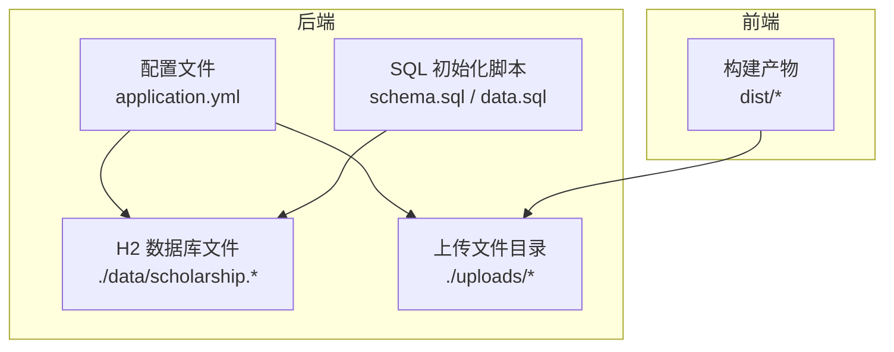
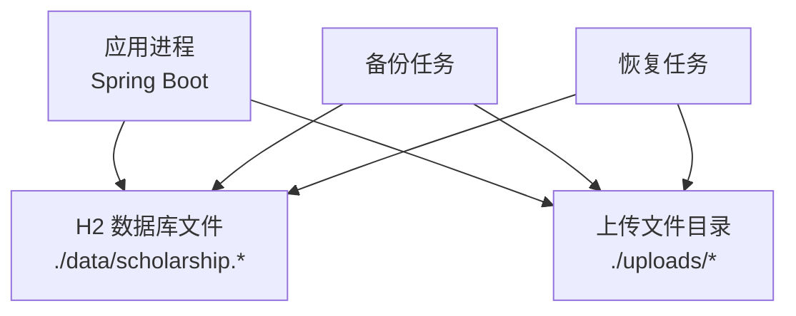
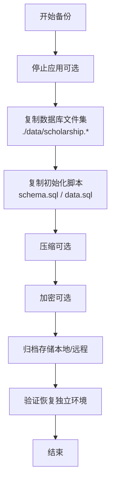
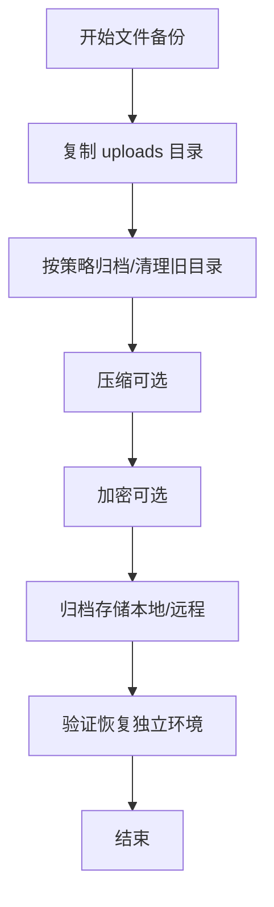
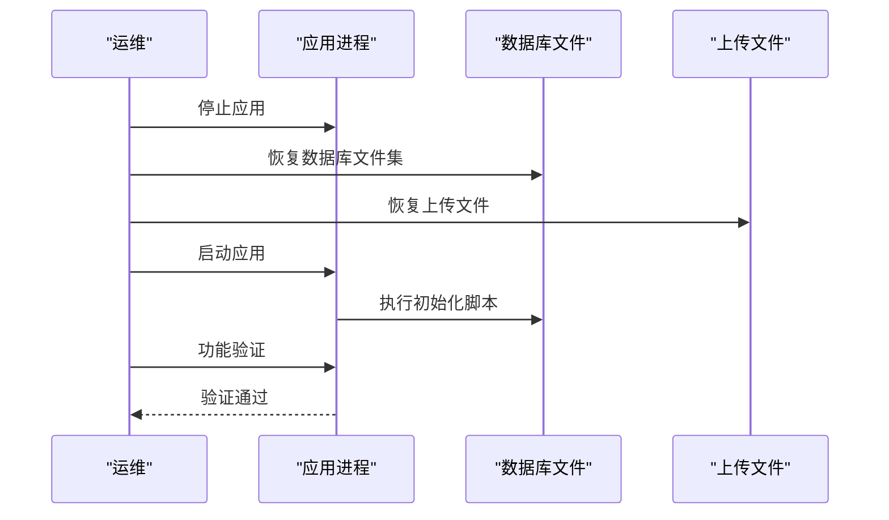
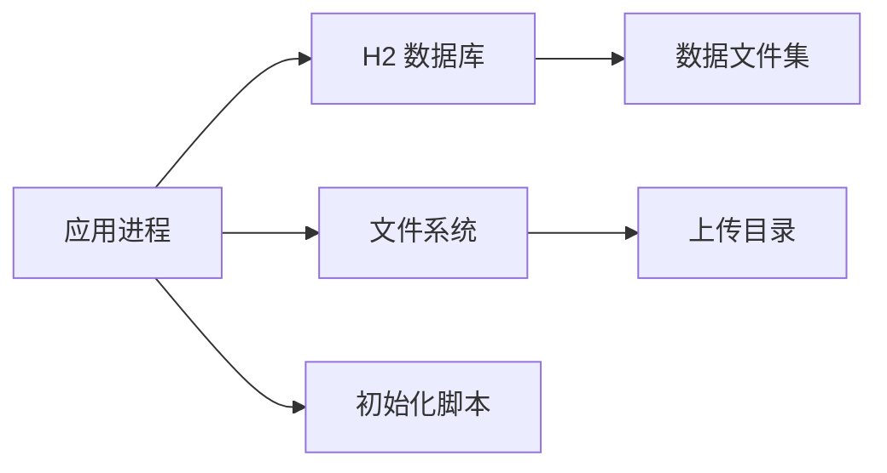

# 备份与恢复

<cite>
**本文引用的文件**
- [application.yml](file://backend/src/main/resources/application.yml)
- [pom.xml](file://backend/pom.xml)
- [FileStorageService.java](file://backend/src/main/java/com/zjsu/scholarship/service/FileStorageService.java)
- [DataSeedService.java](file://backend/src/main/java/com/zjsu/scholarship/service/DataSeedService.java)
- [.gitignore](file://.gitignore)
- [start-backend.ps1](file://start-backend.ps1)
- [README.md](file://README.md)
- [schema.sql](file://backend/src/main/resources/db/schema.sql)
</cite>

## 目录
1. [引言](#引言)
2. [项目结构](#项目结构)
3. [核心组件](#核心组件)
4. [架构总览](#架构总览)
5. [详细组件分析](#详细组件分析)
6. [依赖分析](#依赖分析)
7. [性能考虑](#性能考虑)
8. [故障排查指南](#故障排查指南)
9. [结论](#结论)
10. [附录](#附录)

## 引言
本文件面向奖学金管理系统，提供一套完整的数据保护与灾难恢复方案。系统采用嵌入式数据库与文件存储，备份策略围绕“数据库文件级备份 + 用户上传文件备份”展开，涵盖全量与增量思路、自动化调度、存储位置与安全、恢复流程与验证、灾备与业务连续性保障，以及压缩与加密建议与定期审查机制。

## 项目结构
系统由前后端组成，后端使用 Spring Boot + MyBatis-Plus，数据库为 H2 文件型数据库；前端为静态资源与构建产物。关键运行与配置信息如下：
- 后端配置文件定义了数据库连接、初始化脚本、文件上传目录等
- 数据库存储于应用工作目录下的数据文件
- 上传文件按日期分目录存放于应用工作目录下的 uploads 目录
- 构建与运行通过 Maven 与 PowerShell 脚本进行

图表来源
- [application.yml:11-15](file://backend/src/main/resources/application.yml#L11-L15)
- [application.yml:25-26](file://backend/src/main/resources/application.yml#L25-L26)
- [application.yml:46](file://backend/src/main/resources/application.yml#L46)

章节来源
- [application.yml:1-52](file://backend/src/main/resources/application.yml#L1-L52)
- [pom.xml:1-108](file://backend/pom.xml#L1-L108)
- [.gitignore:4-10](file://.gitignore#L4-L10)
- [start-backend.ps1:1-12](file://start-backend.ps1#L1-L12)

## 核心组件
- 数据库层：H2 文件型数据库，持久化在应用工作目录下，随应用启动自动初始化
- 文件存储层：基于服务的文件上传与落盘，按日期子目录组织，便于备份与清理
- 配置层：集中于 application.yml，包含数据库连接、初始化脚本、上传目录等
- 构建与运行：Maven 构建，PowerShell 启动脚本

章节来源
- [application.yml:11-15](file://backend/src/main/resources/application.yml#L11-L15)
- [application.yml:25-26](file://backend/src/main/resources/application.yml#L25-L26)
- [application.yml:46](file://backend/src/main/resources/application.yml#L46)
- [FileStorageService.java:19-44](file://backend/src/main/java/com/zjsu/scholarship/service/FileStorageService.java#L19-L44)

## 架构总览
系统采用“单机部署 + 文件系统备份”的架构，数据库与上传文件均位于同一主机的工作目录中，便于统一备份与恢复。

图表来源
- [application.yml:11-15](file://backend/src/main/resources/application.yml#L11-L15)
- [application.yml:46](file://backend/src/main/resources/application.yml#L46)

## 详细组件分析

### 数据库备份策略
- 存储位置：H2 数据库文件位于应用工作目录下的 data 目录，文件名以 scholarship 开头
- 初始化方式：应用启动时根据 SQL 脚本初始化表结构与基础数据
- 备份范围：需备份数据库文件集与初始化脚本，确保可独立恢复
- 全量备份：对 data 目录执行一次性完整复制
- 增量备份：由于 H2 文件型数据库不具备原生命增备接口，可采用以下替代方案
  - 时间点恢复：通过保留多个全量备份的时间点镜像，实现近似增量效果
  - 文件级差异：仅复制自上次备份以来变更的数据库文件（需结合文件监控工具）
- 自动化与调度：建议使用系统计划任务或容器内定时器，按日/周/月生成全量备份，并保留最近若干个时间点
- 存储与安全：备份文件应加密存储，限制访问权限，异地存放
- 恢复与验证：恢复后启动应用，检查数据库初始化脚本是否成功执行，确认关键表存在且数据可用

图表来源
- [application.yml:11-15](file://backend/src/main/resources/application.yml#L11-L15)
- [application.yml:25-26](file://backend/src/main/resources/application.yml#L25-L26)
- [schema.sql:366-386](file://backend/src/main/resources/db/schema.sql#L366-L386)

章节来源
- [application.yml:11-15](file://backend/src/main/resources/application.yml#L11-L15)
- [application.yml:25-26](file://backend/src/main/resources/application.yml#L25-L26)
- [schema.sql:366-386](file://backend/src/main/resources/db/schema.sql#L366-L386)
- [README.md:198-200](file://README.md#L198-L200)

### 文件系统备份与归档
- 存储位置：上传文件位于应用工作目录下的 uploads 目录，按日期子目录组织
- 备份范围：备份 uploads 目录全量内容
- 归档策略：按月/季度归档旧目录，清理过期文件；保留最近 N 个月的目录
- 自动化与调度：与数据库备份同步执行，或独立按日/周执行
- 存储与安全：备份文件加密、访问控制、异地存放
- 恢复与验证：恢复后校验文件完整性与可访问性，确保应用能正常读取

图表来源
- [application.yml:46](file://backend/src/main/resources/application.yml#L46)
- [FileStorageService.java:30-40](file://backend/src/main/java/com/zjsu/scholarship/service/FileStorageService.java#L30-L40)

章节来源
- [application.yml:46](file://backend/src/main/resources/application.yml#L46)
- [FileStorageService.java:19-44](file://backend/src/main/java/com/zjsu/scholarship/service/FileStorageService.java#L19-L44)

### 自动化备份脚本与调度
- Windows 环境：可使用 PowerShell 编写备份脚本，调用压缩与加密工具，配合计划任务定时执行
- Linux/Unix 环境：可使用 Bash 脚本，结合 zip/gzip、tar、gpg 等工具，使用 cron 定时执行
- 调度频率建议：数据库每日全量备份，文件系统每周全量+每日增量（文件级差异），保留最近 14 天全量与 30 天增量
- 执行顺序：先备份文件系统，再备份数据库，最后归档与加密
- 失败处理：记录日志、发送告警、回滚至上一次成功备份

章节来源
- [start-backend.ps1:1-12](file://start-backend.ps1#L1-L12)

### 备份数据的存储位置与安全
- 存储位置：备份文件应存放在独立磁盘或网络存储，避免与生产数据同盘
- 访问控制：限制备份目录权限，仅授权人员可访问
- 加密：对备份文件进行加密，密钥单独保管，定期轮换
- 异地存放：至少一份备份异地存储，应对自然灾害等场景

章节来源
- [application.yml:11-15](file://backend/src/main/resources/application.yml#L11-L15)
- [application.yml:46](file://backend/src/main/resources/application.yml#L46)

### 数据恢复流程与验证
- 恢复流程
  - 停止应用
  - 恢复数据库：将备份的数据库文件集还原到 data 目录
  - 恢复文件：将备份的 uploads 目录还原到 uploads 目录
  - 启动应用，等待初始化脚本执行完成
  - 验证关键功能：登录、查询、导入导出等
- 验证方法
  - 校验数据库表是否存在与数据量是否一致
  - 校验上传文件可访问性与完整性
  - 执行端到端功能测试

图表来源
- [application.yml:25-26](file://backend/src/main/resources/application.yml#L25-L26)
- [application.yml:11-15](file://backend/src/main/resources/application.yml#L11-L15)
- [application.yml:46](file://backend/src/main/resources/application.yml#L46)

章节来源
- [application.yml:25-26](file://backend/src/main/resources/application.yml#L25-L26)
- [README.md:198-200](file://README.md#L198-L200)

### 灾难恢复计划与业务连续性
- 灾难场景识别：硬件故障、磁盘损坏、误删除、勒索软件、自然灾害
- RTO/RPO 目标：根据业务需求设定恢复时间与数据丢失容忍度
- 多级备份：本地即时备份 + 远程备份 + 异地备份
- 快速切换：准备备用服务器，预置环境与脚本，缩短切换时间
- 业务连续性：在恢复窗口内优先保证核心功能可用，逐步恢复其他模块

章节来源
- [application.yml:11-15](file://backend/src/main/resources/application.yml#L11-L15)
- [application.yml:46](file://backend/src/main/resources/application.yml#L46)

### 备份数据的压缩与加密方案
- 压缩：使用 zip 或 tar.gz 对备份文件进行压缩，降低存储成本
- 加密：使用 GPG 或系统自带加密工具对压缩包进行加密，密钥与备份分离存储
- 密钥管理：密钥轮换周期建议为每季度一次，密钥存储在安全设备或密钥管理系统中

章节来源
- [application.yml:11-15](file://backend/src/main/resources/application.yml#L11-L15)
- [application.yml:46](file://backend/src/main/resources/application.yml#L46)

### 备份策略的定期审查与更新机制
- 审查周期：每季度对备份策略、工具、脚本与恢复流程进行评审
- 更新机制：根据系统变更（数据库版本、文件结构变化、业务增长）及时调整备份策略
- 文档维护：备份策略、脚本、恢复手册应版本化管理，确保可追溯

章节来源
- [pom.xml:1-108](file://backend/pom.xml#L1-L108)
- [application.yml:11-15](file://backend/src/main/resources/application.yml#L11-L15)

## 依赖分析
- 应用依赖 H2 数据库与 MyBatis-Plus，数据库文件与应用同机部署
- 文件上传依赖 Spring MVC 的文件上传配置，上传目录由配置文件指定
- 初始化脚本用于首次部署或重置场景

图表来源
- [application.yml:11-15](file://backend/src/main/resources/application.yml#L11-L15)
- [application.yml:25-26](file://backend/src/main/resources/application.yml#L25-L26)
- [application.yml:46](file://backend/src/main/resources/application.yml#L46)

章节来源
- [application.yml:11-15](file://backend/src/main/resources/application.yml#L11-L15)
- [application.yml:25-26](file://backend/src/main/resources/application.yml#L25-L26)
- [application.yml:46](file://backend/src/main/resources/application.yml#L46)

## 性能考虑
- 备份窗口：尽量避开业务高峰期，减少对在线服务的影响
- 并发控制：备份数据库时可考虑只读模式或短暂停机窗口
- 存储带宽：本地备份与远程备份应评估网络带宽与延迟
- 验证效率：恢复验证应覆盖关键路径，避免全量回归测试影响恢复窗口

## 故障排查指南
- 数据库无法启动
  - 检查 data 目录权限与磁盘空间
  - 确认数据库文件未被占用或损坏
  - 参考重置数据说明，删除 data 目录后重启
- 上传文件缺失
  - 检查 uploads 目录权限与磁盘空间
  - 核对备份恢复是否完整
- 初始化失败
  - 检查 schema.sql 与 data.sql 是否存在且可读
  - 查看应用日志定位具体错误

章节来源
- [.gitignore:4-5](file://.gitignore#L4-L5)
- [README.md:198-200](file://README.md#L198-L200)

## 结论
本方案针对奖学金管理系统的单机部署特点，提供了数据库文件级与上传文件级的备份与恢复路径，明确了全量与近似增量思路、自动化调度、存储与安全、恢复验证与灾备流程，并给出了策略审查与更新机制。建议在生产环境中结合实际业务负载与合规要求进一步细化与落地。

## 附录
- 关键配置与路径
  - 数据库文件：application.yml 中的数据库 URL 指向 data 目录
  - 初始化脚本：application.yml 中的 schema.sql 与 data.sql
  - 上传目录：application.yml 中的 app.upload-dir
- 参考文件
  - 数据库初始化脚本片段：见 schema.sql 中的关键表定义

章节来源
- [application.yml:11-15](file://backend/src/main/resources/application.yml#L11-L15)
- [application.yml:25-26](file://backend/src/main/resources/application.yml#L25-L26)
- [application.yml:46](file://backend/src/main/resources/application.yml#L46)
- [schema.sql:366-386](file://backend/src/main/resources/db/schema.sql#L366-L386)