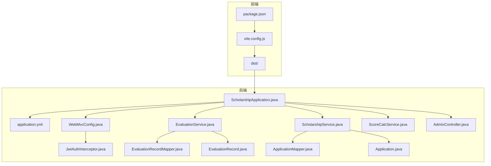
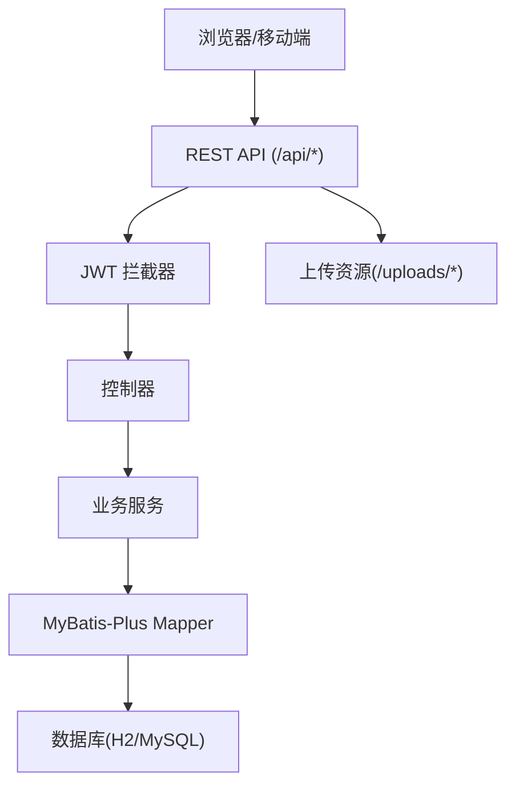
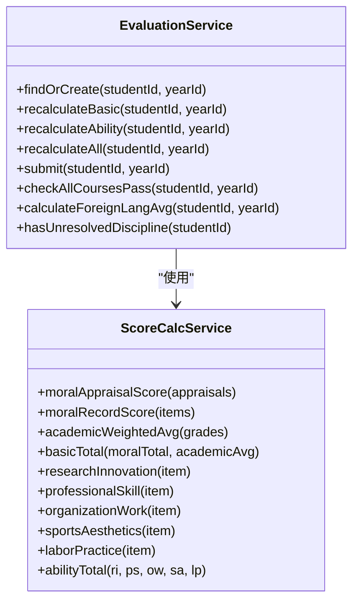
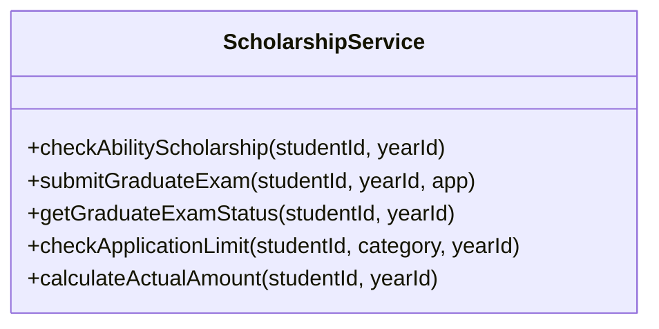
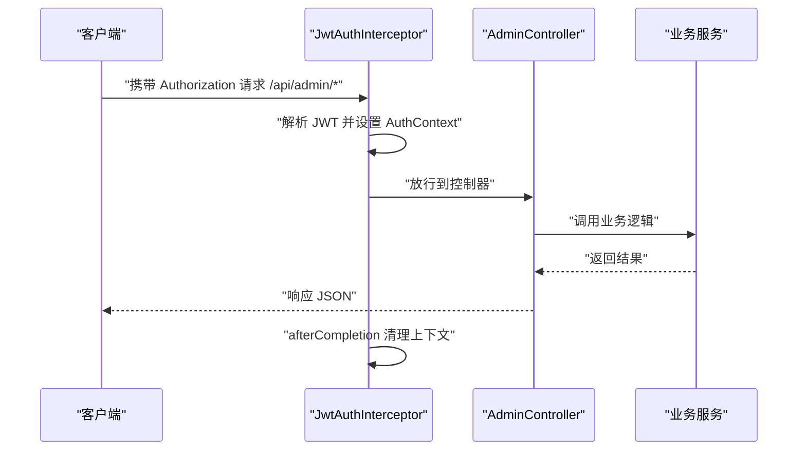
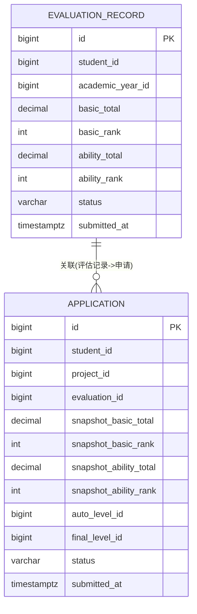
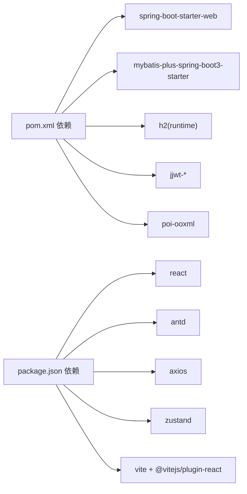

# 性能调优与优化

<cite>
**本文引用的文件**
- [application.yml](file://backend/src/main/resources/application.yml)
- [pom.xml](file://backend/pom.xml)
- [ScholarshipApplication.java](file://backend/src/main/java/com/zjsu/scholarship/ScholarshipApplication.java)
- [WebMvcConfig.java](file://backend/src/main/java/com/zjsu/scholarship/config/WebMvcConfig.java)
- [JwtAuthInterceptor.java](file://backend/src/main/java/com/zjsu/scholarship/security/JwtAuthInterceptor.java)
- [EvaluationService.java](file://backend/src/main/java/com/zjsu/scholarship/service/EvaluationService.java)
- [ScholarshipService.java](file://backend/src/main/java/com/zjsu/scholarship/service/ScholarshipService.java)
- [ScoreCalcService.java](file://backend/src/main/java/com/zjsu/scholarship/service/ScoreCalcService.java)
- [AdminController.java](file://backend/src/main/java/com/zjsu/scholarship/controller/AdminController.java)
- [EvaluationRecord.java](file://backend/src/main/java/com/zjsu/scholarship/entity/EvaluationRecord.java)
- [Application.java](file://backend/src/main/java/com/zjsu/scholarship/entity/Application.java)
- [EvaluationRecordMapper.java](file://backend/src/main/java/com/zjsu/scholarship/mapper/EvaluationRecordMapper.java)
- [ApplicationMapper.java](file://backend/src/main/java/com/zjsu/scholarship/mapper/ApplicationMapper.java)
- [package.json](file://frontend/package.json)
- [vite.config.js](file://frontend/vite.config.js)
</cite>

## 目录
1. [简介](#简介)
2. [项目结构](#项目结构)
3. [核心组件](#核心组件)
4. [架构总览](#架构总览)
5. [详细组件分析](#详细组件分析)
6. [依赖关系分析](#依赖关系分析)
7. [性能考虑](#性能考虑)
8. [故障排查指南](#故障排查指南)
9. [结论](#结论)
10. [附录](#附录)

## 简介
本文件面向奖学金管理系统，提供端到端的性能调优与优化实践指南。内容覆盖后端 Spring Boot 应用的 JVM 参数、日志与线程模型、数据库查询与索引策略、前端构建与运行时优化、CDN 与静态资源优化、负载均衡与集群部署、缓存策略设计与实现，以及性能监控指标与基线建立方法。目标是帮助团队在开发与运维阶段持续提升系统吞吐、降低延迟、增强稳定性。

## 项目结构
系统采用前后端分离架构：
- 后端：Spring Boot + MyBatis-Plus，使用 H2 内嵌数据库进行开发与测试，默认持久化路径为文件型数据库，生产环境建议替换为 MySQL/PostgreSQL 并启用连接池与慢查询日志。
- 前端：React + Vite，开发服务器代理后端接口与上传目录，生产构建产物位于 dist 目录，可由后端统一暴露或由 CDN 分发。

**图表来源**
- [ScholarshipApplication.java:1-14](file://backend/src/main/java/com/zjsu/scholarship/ScholarshipApplication.java#L1-L14)
- [application.yml:1-52](file://backend/src/main/resources/application.yml#L1-L52)
- [WebMvcConfig.java:1-49](file://backend/src/main/java/com/zjsu/scholarship/config/WebMvcConfig.java#L1-L49)
- [JwtAuthInterceptor.java:1-65](file://backend/src/main/java/com/zjsu/scholarship/security/JwtAuthInterceptor.java#L1-L65)
- [EvaluationService.java:1-308](file://backend/src/main/java/com/zjsu/scholarship/service/EvaluationService.java#L1-L308)
- [ScholarshipService.java:1-280](file://backend/src/main/java/com/zjsu/scholarship/service/ScholarshipService.java#L1-L280)
- [ScoreCalcService.java:1-423](file://backend/src/main/java/com/zjsu/scholarship/service/ScoreCalcService.java#L1-L423)
- [AdminController.java:1-528](file://backend/src/main/java/com/zjsu/scholarship/controller/AdminController.java#L1-L528)
- [EvaluationRecordMapper.java:1-8](file://backend/src/main/java/com/zjsu/scholarship/mapper/EvaluationRecordMapper.java#L1-L8)
- [ApplicationMapper.java:1-8](file://backend/src/main/java/com/zjsu/scholarship/mapper/ApplicationMapper.java#L1-L8)
- [EvaluationRecord.java:1-45](file://backend/src/main/java/com/zjsu/scholarship/entity/EvaluationRecord.java#L1-L45)
- [Application.java:1-43](file://backend/src/main/java/com/zjsu/scholarship/entity/Application.java#L1-L43)
- [package.json:1-26](file://frontend/package.json#L1-L26)
- [vite.config.js:1-21](file://frontend/vite.config.js#L1-L21)

**章节来源**
- [ScholarshipApplication.java:1-14](file://backend/src/main/java/com/zjsu/scholarship/ScholarshipApplication.java#L1-L14)
- [application.yml:1-52](file://backend/src/main/resources/application.yml#L1-L52)
- [WebMvcConfig.java:1-49](file://backend/src/main/java/com/zjsu/scholarship/config/WebMvcConfig.java#L1-L49)
- [JwtAuthInterceptor.java:1-65](file://backend/src/main/java/com/zjsu/scholarship/security/JwtAuthInterceptor.java#L1-L65)
- [EvaluationService.java:1-308](file://backend/src/main/java/com/zjsu/scholarship/service/EvaluationService.java#L1-L308)
- [ScholarshipService.java:1-280](file://backend/src/main/java/com/zjsu/scholarship/service/ScholarshipService.java#L1-L280)
- [ScoreCalcService.java:1-423](file://backend/src/main/java/com/zjsu/scholarship/service/ScoreCalcService.java#L1-L423)
- [AdminController.java:1-528](file://backend/src/main/java/com/zjsu/scholarship/controller/AdminController.java#L1-L528)
- [EvaluationRecordMapper.java:1-8](file://backend/src/main/java/com/zjsu/scholarship/mapper/EvaluationRecordMapper.java#L1-L8)
- [ApplicationMapper.java:1-8](file://backend/src/main/java/com/zjsu/scholarship/mapper/ApplicationMapper.java#L1-L8)
- [EvaluationRecord.java:1-45](file://backend/src/main/java/com/zjsu/scholarship/entity/EvaluationRecord.java#L1-L45)
- [Application.java:1-43](file://backend/src/main/java/com/zjsu/scholarship/entity/Application.java#L1-L43)
- [package.json:1-26](file://frontend/package.json#L1-L26)
- [vite.config.js:1-21](file://frontend/vite.config.js#L1-L21)

## 核心组件
- 应用启动与扫描：主类负责组件扫描与 Mapper 扫描，确保 MyBatis-Plus 正常装配。
- Web 层：拦截器负责鉴权与角色校验；跨域配置允许前端域名访问；静态资源映射上传目录。
- 服务层：评估服务与奖学金服务封装业务逻辑，涉及多表聚合与复杂计算。
- 数据层：基于 MyBatis-Plus 的 Mapper 接口，配合实体类完成 CRUD 与查询。
- 前端：Vite 开发代理后端 API 与上传资源，生产构建产物由后端统一暴露。

**章节来源**
- [ScholarshipApplication.java:1-14](file://backend/src/main/java/com/zjsu/scholarship/ScholarshipApplication.java#L1-L14)
- [WebMvcConfig.java:1-49](file://backend/src/main/java/com/zjsu/scholarship/config/WebMvcConfig.java#L1-L49)
- [JwtAuthInterceptor.java:1-65](file://backend/src/main/java/com/zjsu/scholarship/security/JwtAuthInterceptor.java#L1-L65)
- [EvaluationService.java:1-308](file://backend/src/main/java/com/zjsu/scholarship/service/EvaluationService.java#L1-L308)
- [ScholarshipService.java:1-280](file://backend/src/main/java/com/zjsu/scholarship/service/ScholarshipService.java#L1-L280)
- [ScoreCalcService.java:1-423](file://backend/src/main/java/com/zjsu/scholarship/service/ScoreCalcService.java#L1-L423)
- [EvaluationRecordMapper.java:1-8](file://backend/src/main/java/com/zjsu/scholarship/mapper/EvaluationRecordMapper.java#L1-L8)
- [ApplicationMapper.java:1-8](file://backend/src/main/java/com/zjsu/scholarship/mapper/ApplicationMapper.java#L1-L8)
- [package.json:1-26](file://frontend/package.json#L1-L26)
- [vite.config.js:1-21](file://frontend/vite.config.js#L1-L21)

## 架构总览
系统采用经典的三层架构：前端通过 REST API 与后端交互，后端通过 MyBatis-Plus 访问数据库。鉴权通过 JWT 实现，服务层承担业务规则与计算。

**图表来源**
- [WebMvcConfig.java:23-47](file://backend/src/main/java/com/zjsu/scholarship/config/WebMvcConfig.java#L23-L47)
- [JwtAuthInterceptor.java:20-58](file://backend/src/main/java/com/zjsu/scholarship/security/JwtAuthInterceptor.java#L20-L58)
- [AdminController.java:20-61](file://backend/src/main/java/com/zjsu/scholarship/controller/AdminController.java#L20-L61)
- [application.yml:11-18](file://backend/src/main/resources/application.yml#L11-L18)

## 详细组件分析

### 评估服务与计算引擎
评估服务负责生成与更新综测记录，计算基本项与综合能力，并支持提交与全科合格检查等扩展功能。计算引擎提供多项评分算法，涉及大量数值运算与条件分支。

**图表来源**
- [EvaluationService.java:22-61](file://backend/src/main/java/com/zjsu/scholarship/service/EvaluationService.java#L22-L61)
- [ScoreCalcService.java:18-423](file://backend/src/main/java/com/zjsu/scholarship/service/ScoreCalcService.java#L18-L423)

**章节来源**
- [EvaluationService.java:1-308](file://backend/src/main/java/com/zjsu/scholarship/service/EvaluationService.java#L1-L308)
- [ScoreCalcService.java:1-423](file://backend/src/main/java/com/zjsu/scholarship/service/ScoreCalcService.java#L1-L423)

### 奖学金服务与业务规则
奖学金服务包含能力突出奖学金自动判定、考研奖学金申请、申报限制校验与奖金发放规则计算等功能。这些流程涉及多表关联查询与聚合统计。

**图表来源**
- [ScholarshipService.java:21-49](file://backend/src/main/java/com/zjsu/scholarship/service/ScholarshipService.java#L21-L49)

**章节来源**
- [ScholarshipService.java:1-280](file://backend/src/main/java/com/zjsu/scholarship/service/ScholarshipService.java#L1-L280)

### 控制器与鉴权拦截
管理员控制器提供项目、等级、申请、统计、导入导出等管理功能。JWT 拦截器在请求到达控制器前进行身份验证与角色校验，确保受保护接口的安全性。

**图表来源**
- [JwtAuthInterceptor.java:20-63](file://backend/src/main/java/com/zjsu/scholarship/security/JwtAuthInterceptor.java#L20-L63)
- [AdminController.java:20-61](file://backend/src/main/java/com/zjsu/scholarship/controller/AdminController.java#L20-L61)

**章节来源**
- [JwtAuthInterceptor.java:1-65](file://backend/src/main/java/com/zjsu/scholarship/security/JwtAuthInterceptor.java#L1-L65)
- [AdminController.java:1-528](file://backend/src/main/java/com/zjsu/scholarship/controller/AdminController.java#L1-L528)

### 数据模型与查询模式
实体类定义了评估记录与申请记录的关键字段，包括快照分数与排名、状态与时点信息等。服务层通过 MyBatis-Plus 的条件构造器进行查询与聚合。

**图表来源**
- [EvaluationRecord.java:11-44](file://backend/src/main/java/com/zjsu/scholarship/entity/EvaluationRecord.java#L11-L44)
- [Application.java:11-42](file://backend/src/main/java/com/zjsu/scholarship/entity/Application.java#L11-L42)

**章节来源**
- [EvaluationRecord.java:1-45](file://backend/src/main/java/com/zjsu/scholarship/entity/EvaluationRecord.java#L1-L45)
- [Application.java:1-43](file://backend/src/main/java/com/zjsu/scholarship/entity/Application.java#L1-L43)

## 依赖关系分析
- 后端依赖 Spring Boot Starter Web、MyBatis-Plus、H2、JWT 等，构建阶段通过 Maven 插件注入 JVM 参数以保证字符集一致。
- 前端依赖 React、Ant Design、Axios、Zustand、Vite 及其插件，开发服务器通过代理转发后端 API 与上传资源。

**图表来源**
- [pom.xml:26-87](file://backend/pom.xml#L26-L87)
- [package.json:11-24](file://frontend/package.json#L11-L24)

**章节来源**
- [pom.xml:1-108](file://backend/pom.xml#L1-L108)
- [package.json:1-26](file://frontend/package.json#L1-L26)

## 性能考虑

### JVM 调优参数与线程模型
- 字符集与编码：构建插件已设置标准输出与错误流编码，避免多语言环境下的字符问题。
- 建议在生产环境补充以下 JVM 参数（示例说明，需结合硬件与流量压测确定）：
  - 初始堆与最大堆：根据峰值内存占用与对象生命周期设定，避免频繁 Full GC。
  - GC 策略：优先选择 G1 或 ZGC（JDK 17+），关注停顿时间目标与吞吐量平衡。
  - 线程池：Web 线程池大小与 CPU 核数、IO 密集度匹配；业务线程池按任务类型拆分（IO 密集、CPU 密集）。
  - JIT 优化：启用逃逸分析与标量替换，减少堆分配压力。
- 日志级别：生产环境建议将业务包日志级别调整为 INFO，避免过多 DEBUG/TRACE 影响 IO。

**章节来源**
- [pom.xml:90-104](file://backend/pom.xml#L90-L104)
- [application.yml:48-52](file://backend/src/main/resources/application.yml#L48-L52)

### 数据库查询优化与索引策略
- 查询模式特征：
  - 多处使用条件构造器按学年、学生、项目、状态等维度过滤，建议在相关列上建立复合索引。
  - 统计类查询（如 COUNT、排序）较多，需确保排序列与过滤列具备合适索引。
- 建议索引策略（示例，需结合 EXPLAIN 与慢查询日志）：
  - evaluation_records(student_id, academic_year_id)，用于快速定位学生学年记录。
  - applications(student_id, project_id, status)，用于快速查询学生某项目的申请状态。
  - scholarship_project(academic_year_id, type_code)，用于筛选学年与项目类型。
  - 上传与文件相关查询建议对文件名、创建时间建立索引。
- 执行计划优化：
  - 使用 EXPLAIN/ANALYZE 分析慢查询，关注是否存在全表扫描、临时表与排序。
  - 将高频过滤条件前置，避免在 WHERE 中对列进行函数运算导致索引失效。
  - 对于大结果集分页，优先使用基于游标的分页（如 id > lastId ORDER BY id LIMIT N）替代 OFFSET/LIMIT。

**章节来源**
- [EvaluationService.java:64-87](file://backend/src/main/java/com/zjsu/scholarship/service/EvaluationService.java#L64-L87)
- [ScholarshipService.java:72-100](file://backend/src/main/java/com/zjsu/scholarship/service/ScholarshipService.java#L72-L100)
- [AdminController.java:193-209](file://backend/src/main/java/com/zjsu/scholarship/controller/AdminController.java#L193-L209)

### 前端性能优化
- 构建与打包：
  - 生产构建开启代码分割与 Tree Shaking，移除未使用依赖。
  - 图片与字体资源进行压缩与格式优化（WebP/AVIF），按需加载。
- 缓存策略：
  - 浏览器缓存：静态资源设置长缓存，带哈希后缀；HTML 设置短缓存或协商缓存。
  - 应用缓存：对只读列表与字典数据使用内存缓存，结合失效策略。
- 懒加载与虚拟滚动：
  - 列表页面使用虚拟滚动处理大数据集；路由级懒加载减少首屏 JS。
- 网络优化：
  - 启用 Gzip/Brotli 压缩；合理设置 CDN 与边缘缓存。
  - 将上传资源通过独立域名与 CDN 分发，减轻后端压力。

**章节来源**
- [package.json:1-26](file://frontend/package.json#L1-L26)
- [vite.config.js:1-21](file://frontend/vite.config.js#L1-L21)

### CDN 配置与静态资源优化
- 将 dist 目录托管至 CDN，静态资源域名与后端 API 域名分离，减少 Cookie 传输。
- 配置缓存头：CSS/JS 设置强缓存（如一年），图片与媒体资源设置合理缓存周期。
- 启用压缩与 HTTPS，确保资源传输安全与速度。

**章节来源**
- [vite.config.js:1-21](file://frontend/vite.config.js#L1-L21)

### 负载均衡与集群部署
- 集群部署：多实例横向扩展，共享数据库与缓存（如 Redis）。
- 负载均衡：Nginx/HAProxy 健康检查与会话亲和（如需要），后端通过水平扩展提升并发。
- 无状态化：后端保持无状态，上传目录可通过对象存储（OSS/COS）或共享存储统一管理。

**章节来源**
- [application.yml:1-2](file://backend/src/main/resources/application.yml#L1-L2)

### 缓存策略设计与实现
- 本地缓存：对热点只读数据（如项目配置、等级、字典）使用本地缓存，结合过期与容量控制。
- 分布式缓存：Redis 用于跨节点共享缓存，建议：
  - 键命名规范：namespace:key:subkey
  - 过期策略：TTL 与互斥锁防雪崩
  - 读写一致性：写操作先删后写，读取失败再回源
- 上传资源：将上传目录迁移至对象存储，后端仅做元数据管理，静态资源由 CDN 提供。

**章节来源**
- [WebMvcConfig.java:43-47](file://backend/src/main/java/com/zjsu/scholarship/config/WebMvcConfig.java#L43-L47)
- [application.yml:42-46](file://backend/src/main/resources/application.yml#L42-L46)

### 性能监控指标与基线建立
- 指标体系（示例）：
  - 后端：请求 QPS、P95/P99 延迟、错误率、GC 时间/次数、堆使用率、线程池排队长度、数据库连接池活跃数。
  - 前端：首屏渲染时间、资源加载时间、用户可操作时间、重绘重排次数。
- 基线建立：
  - 在稳定环境下进行压测，记录各指标阈值与异常边界。
  - 建立告警阈值（如 P95 延迟超 2s、错误率超 0.1%、GC 时间占比超 10%）。
  - 持续回归：每次发布前后对比指标，确保性能不退化。

**章节来源**
- [application.yml:48-52](file://backend/src/main/resources/application.yml#L48-L52)

## 故障排查指南
- 鉴权失败：
  - 检查 Authorization 头是否正确携带 Bearer Token。
  - 校验 Token 是否过期或签名异常；确认后端密钥与前端一致。
- 跨域问题：
  - 确认 CORS 配置允许前端域名与凭证；后端与前端代理端口需一致。
- 上传失败：
  - 检查上传目录权限与磁盘空间；确认 multipart 大小限制满足需求。
- 数据库慢查询：
  - 使用 EXPLAIN 分析 SQL 执行计划，补充缺失索引；避免 SELECT * 与不必要的排序/分组。
- 前端白屏或资源 404：
  - 确认构建产物已生成；CDN 缓存是否命中；静态资源路径与后端映射一致。

**章节来源**
- [JwtAuthInterceptor.java:20-58](file://backend/src/main/java/com/zjsu/scholarship/security/JwtAuthInterceptor.java#L20-L58)
- [WebMvcConfig.java:33-41](file://backend/src/main/java/com/zjsu/scholarship/config/WebMvcConfig.java#L33-L41)
- [WebMvcConfig.java:43-47](file://backend/src/main/java/com/zjsu/scholarship/config/WebMvcConfig.java#L43-L47)
- [application.yml:29-32](file://backend/src/main/resources/application.yml#L29-L32)

## 结论
本优化文档从 JVM、数据库、前端、CDN、负载均衡与缓存等多个维度提出系统性建议。建议以压测与监控为抓手，持续迭代性能基线，确保系统在高并发场景下稳定高效运行。针对本项目当前使用 H2 的开发特性，建议在预生产与生产环境切换为高性能数据库与分布式缓存，并完善监控与告警体系。

## 附录
- 关键配置参考路径：
  - 后端配置：[application.yml:1-52](file://backend/src/main/resources/application.yml#L1-L52)
  - 构建与 JVM 参数：[pom.xml:90-104](file://backend/pom.xml#L90-L104)
  - 前端依赖与脚本：[package.json:1-26](file://frontend/package.json#L1-L26)
  - 前端开发代理：[vite.config.js:1-21](file://frontend/vite.config.js#L1-L21)
- 业务服务与实体：
  - [EvaluationService.java:1-308](file://backend/src/main/java/com/zjsu/scholarship/service/EvaluationService.java#L1-L308)
  - [ScholarshipService.java:1-280](file://backend/src/main/java/com/zjsu/scholarship/service/ScholarshipService.java#L1-L280)
  - [ScoreCalcService.java:1-423](file://backend/src/main/java/com/zjsu/scholarship/service/ScoreCalcService.java#L1-L423)
  - [EvaluationRecord.java:1-45](file://backend/src/main/java/com/zjsu/scholarship/entity/EvaluationRecord.java#L1-L45)
  - [Application.java:1-43](file://backend/src/main/java/com/zjsu/scholarship/entity/Application.java#L1-L43)
  - [EvaluationRecordMapper.java:1-8](file://backend/src/main/java/com/zjsu/scholarship/mapper/EvaluationRecordMapper.java#L1-L8)
  - [ApplicationMapper.java:1-8](file://backend/src/main/java/com/zjsu/scholarship/mapper/ApplicationMapper.java#L1-L8)