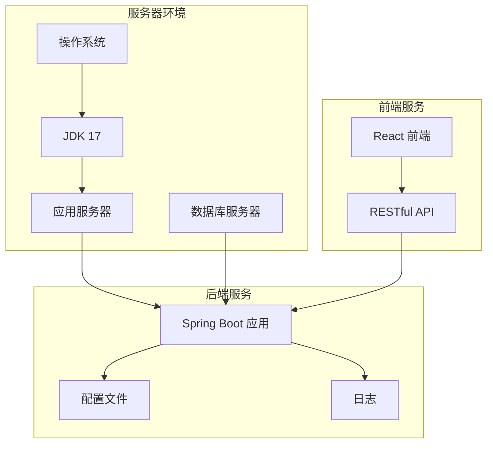
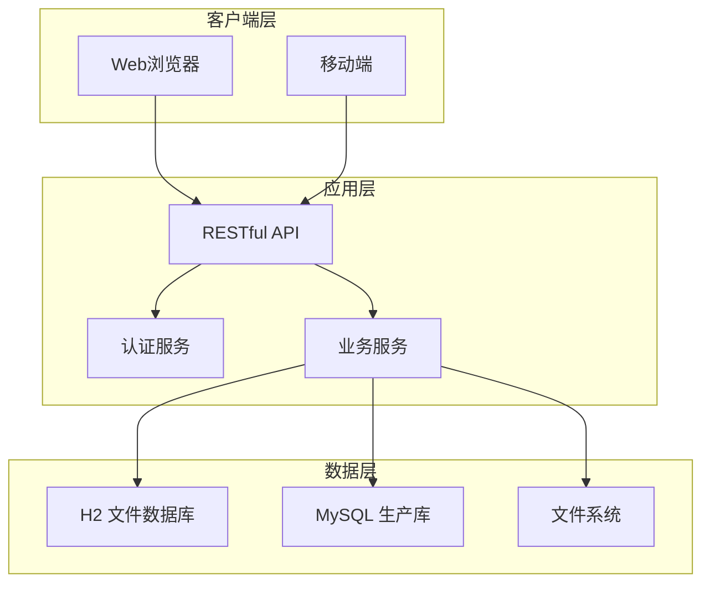
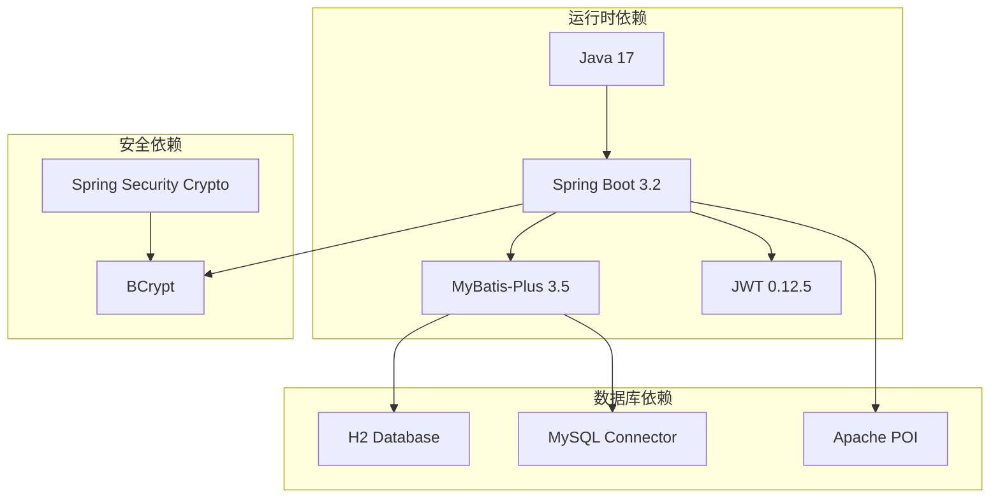

# 服务器环境配置

<cite>
**本文档引用的文件**
- [pom.xml](file://backend/pom.xml)
- [application.yml](file://backend/src/main/resources/application.yml)
- [README.md](file://README.md)
- [start-backend.ps1](file://start-backend.ps1)
- [ScholarshipApplication.java](file://backend/src/main/java/com/zjsu/scholarship/ScholarshipApplication.java)
</cite>

## 目录
1. [简介](#简介)
2. [项目结构](#项目结构)
3. [核心组件](#核心组件)
4. [架构概览](#架构概览)
5. [详细组件分析](#详细组件分析)
6. [依赖关系分析](#依赖关系分析)
7. [性能考虑](#性能考虑)
8. [故障排除指南](#故障排除指南)
9. [结论](#结论)
10. [附录](#附录)

## 简介
本文件为奖学金管理系统服务器环境配置指南，面向生产部署场景，详细说明系统运行所需的服务器环境准备、JDK 17安装配置、内存与JVM参数优化、操作系统兼容性与文件系统权限、数据库服务器安装配置、网络端口与防火墙设置、系统资源监控与性能基准测试方法，以及服务器硬件要求与推荐配置规格。

## 项目结构
奖学金管理系统采用前后端分离架构，后端基于Spring Boot 3.2 + Java 17开发，使用H2数据库进行演示与开发，默认配置下无需额外数据库安装即可运行。生产环境建议替换为MySQL数据库。

**图表来源**
- [pom.xml:1-108](file://backend/pom.xml#L1-L108)
- [application.yml:1-52](file://backend/src/main/resources/application.yml#L1-L52)

**章节来源**
- [pom.xml:1-108](file://backend/pom.xml#L1-L108)
- [application.yml:1-52](file://backend/src/main/resources/application.yml#L1-L52)
- [README.md:123-154](file://README.md#L123-L154)

## 核心组件
系统核心运行组件包括：
- Java运行时环境：JDK 17（必需）
- 应用框架：Spring Boot 3.2
- 数据持久层：MyBatis-Plus 3.5
- 认证授权：JWT + BCrypt
- 数据库：H2（开发/演示）或MySQL（生产）
- 前端：React 18 + Vite 5

**章节来源**
- [pom.xml:20-24](file://backend/pom.xml#L20-L24)
- [pom.xml:26-87](file://backend/pom.xml#L26-L87)
- [README.md:8-16](file://README.md#L8-L16)

## 架构概览
系统采用三层架构：前端Web界面、后端REST API服务、数据库存储。默认使用H2文件模式数据库，支持MySQL迁移。

**图表来源**
- [application.yml:11-15](file://backend/src/main/resources/application.yml#L11-L15)
- [application.yml:12](file://backend/src/main/resources/application.yml#L12)

## 详细组件分析

### JDK 17安装与配置
系统要求Java 17作为运行时环境，Spring Boot 3.2与Java 17完全兼容。

#### 安装步骤
1. 下载JDK 17安装包
2. 安装到标准路径（如`C:\tools\jdk`）
3. 配置环境变量：
   - JAVA_HOME指向JDK安装目录
   - PATH包含%JAVA_HOME%\bin
4. 验证安装：`java -version`

#### 环境变量设置
- JAVA_HOME：JDK安装根目录
- PATH：包含JAVA_HOME/bin
- MAVEN_HOME：Maven安装目录（如需构建）

**章节来源**
- [pom.xml:21](file://backend/pom.xml#L21)
- [start-backend.ps1:1-8](file://start-backend.ps1#L1-L8)

### 内存配置与JVM参数优化
系统默认使用Spring Boot内置的JVM参数，可通过以下方式优化：

#### JVM参数配置
- 建议添加参数：`-Xms2g -Xmx4g -XX:+UseG1GC`
- 文件编码：`-Dfile.encoding=UTF-8`
- 输出编码：`-Dstdout.encoding=UTF-8 -Dstderr.encoding=UTF-8`

#### 垃圾回收器选择
- G1GC适合大堆内存应用
- ZGC适合超低延迟需求
- Shenandoah适合中等堆内存

**章节来源**
- [pom.xml:102](file://backend/pom.xml#L102)

### 操作系统兼容性
系统在Windows环境下提供一键启动脚本，在Linux/Unix环境下可手动配置。

#### Windows环境
- 使用PowerShell脚本启动
- 支持C:\tools标准化安装路径
- 自动配置JAVA_HOME和MAVEN_HOME

#### Linux/Unix环境
- 需要手动设置环境变量
- 使用`./mvnw spring-boot:run`启动
- 确保有执行权限

**章节来源**
- [start-backend.ps1:1-13](file://start-backend.ps1#L1-L13)
- [README.md:20-30](file://README.md#L20-L30)

### 文件系统权限配置
系统需要对以下目录具有相应权限：

#### 必需目录
- `backend/data/`：H2数据库文件写入
- `backend/uploads/`：文件上传目录
- `backend/target/`：构建输出目录

#### 权限要求
- 读取权限：数据库文件、配置文件
- 写入权限：上传目录、日志目录
- 执行权限：启动脚本

**章节来源**
- [application.yml:46](file://backend/src/main/resources/application.yml#L46)

### 数据库服务器安装与配置

#### H2数据库（开发/演示）
系统默认使用H2文件模式，无需额外安装：
- 自动创建数据库文件：`backend/data/scholarship.mv.db`
- 自动初始化schema和数据
- 提供H2控制台：`http://localhost:8080/h2`

#### MySQL数据库（生产）
如需使用MySQL，需进行以下配置：

1. 安装MySQL服务器
2. 创建数据库和用户
3. 修改application.yml配置：
   - datasource.url：MySQL连接URL
   - datasource.driver-class-name：`com.mysql.cj.jdbc.Driver`
   - datasource.username/password：数据库凭据

**章节来源**
- [application.yml:11-15](file://backend/src/main/resources/application.yml#L11-L15)
- [README.md:195-196](file://README.md#L195-L196)

### 网络端口配置与防火墙设置
系统默认监听8080端口，需要相应的网络配置。

#### 端口配置
- 默认HTTP端口：8080
- H2控制台端口：8080（与主服务同端口）
- 前端开发端口：5173

#### 防火墙设置
- 开放8080端口用于外部访问
- 限制H2控制台仅本地访问
- 配置反向代理（如Nginx）转发请求

**章节来源**
- [application.yml:1-2](file://backend/src/main/resources/application.yml#L1-L2)
- [application.yml:16-21](file://backend/src/main/resources/application.yml#L16-L21)

### 系统资源监控
建议配置以下监控指标：

#### JVM监控
- 堆内存使用率
- GC频率和停顿时间
- 线程数和线程状态
- 类加载数量

#### 应用监控
- API响应时间
- 请求成功率
- 数据库连接池状态
- 文件上传大小限制

#### 系统监控
- CPU使用率
- 内存使用情况
- 磁盘空间
- 网络IO

**章节来源**
- [application.yml:30-32](file://backend/src/main/resources/application.yml#L30-L32)

## 依赖关系分析

**图表来源**
- [pom.xml:26-87](file://backend/pom.xml#L26-L87)

**章节来源**
- [pom.xml:26-87](file://backend/pom.xml#L26-L87)

## 性能考虑

### 内存配置建议
- 最小堆大小：2GB
- 最大堆大小：4GB
- 垃圾回收器：G1GC
- 新生代比例：30-40%

### 数据库性能优化
- 连接池配置：最大连接数10-20
- 查询超时：30秒
- 批量操作：100条记录
- 索引优化：常用查询字段建立索引

### 缓存策略
- Redis缓存热点数据
- HTTP缓存静态资源
- 数据库查询结果缓存

## 故障排除指南

### 常见启动问题
1. **JDK版本错误**
   - 症状：启动失败，提示Java版本不兼容
   - 解决：确保使用JDK 17

2. **端口占用**
   - 症状：端口8080被占用
   - 解决：修改application.yml中的server.port

3. **数据库连接失败**
   - 症状：启动时报数据库连接错误
   - 解决：检查MySQL连接配置或切换到H2

### 性能问题诊断
1. **内存不足**
   - 症状：频繁Full GC，响应缓慢
   - 解决：增加堆内存，优化GC参数

2. **数据库慢查询**
   - 症状：API响应时间过长
   - 解决：分析慢查询日志，优化SQL语句

3. **文件上传失败**
   - 症状：文件上传报错
   - 解决：检查上传目录权限和大小限制

**章节来源**
- [README.md:190-200](file://README.md#L190-L200)

## 结论
奖学金管理系统的服务器环境配置相对简单，主要依赖JDK 17和Spring Boot框架。开发阶段可直接使用H2数据库，生产环境建议迁移到MySQL并配置相应的安全和性能参数。通过合理的内存配置、数据库优化和监控设置，可以确保系统稳定高效运行。

## 附录

### 服务器硬件要求
- **最低配置**：CPU 2核，内存4GB，存储50GB
- **推荐配置**：CPU 4核，内存8GB，存储100GB
- **数据库服务器**：独立部署，至少2核4GB内存

### 系统要求清单
- 操作系统：Windows Server/Linux/Unix
- JDK：17或更高版本
- 数据库：H2（开发）或MySQL（生产）
- 网络：开放8080端口
- 存储：足够的磁盘空间用于数据库和文件上传

### 部署最佳实践
1. 使用Docker容器化部署
2. 配置负载均衡和高可用
3. 设置SSL证书和HTTPS
4. 定期备份数据库和重要文件
5. 监控系统性能和安全日志