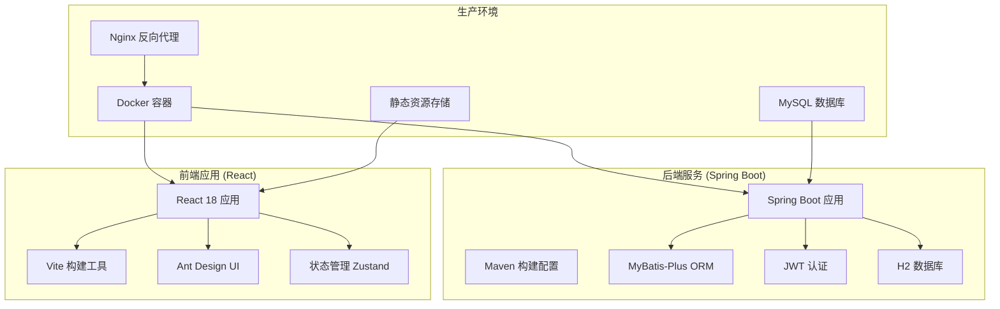
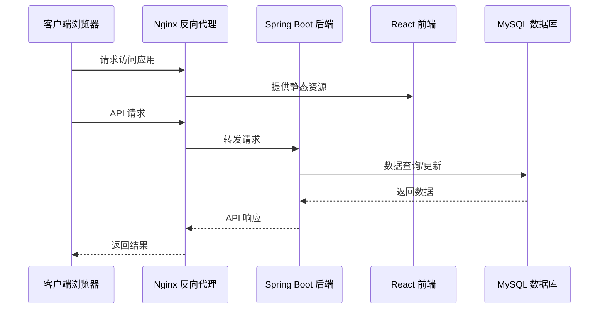
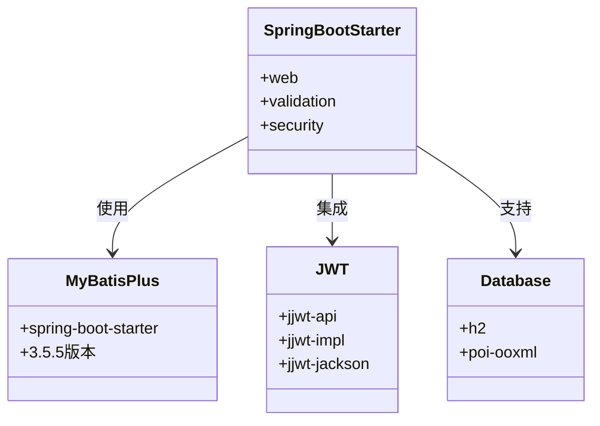
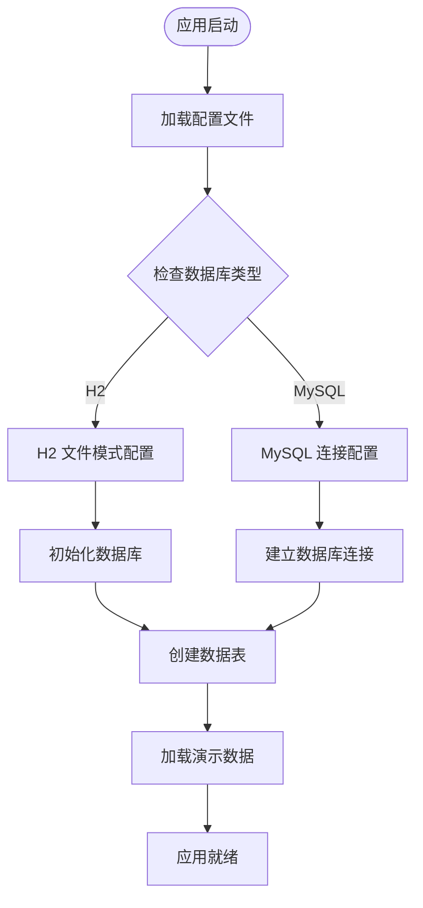
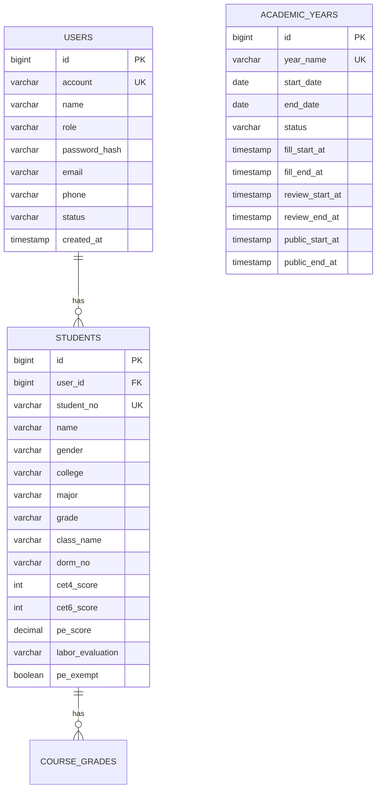
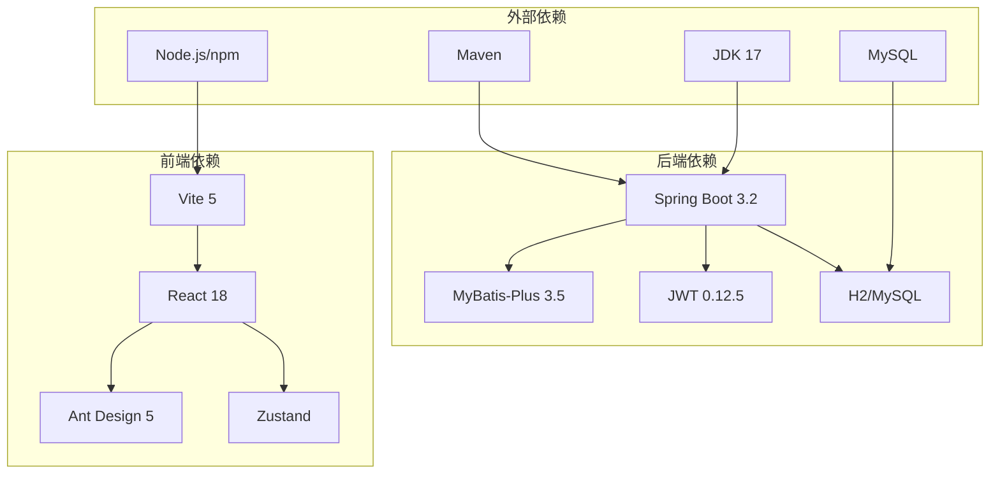

# 生产环境部署

<cite>
**本文档引用的文件**
- [pom.xml](file://backend/pom.xml)
- [application.yml](file://backend/src/main/resources/application.yml)
- [schema.sql](file://backend/src/main/resources/db/schema.sql)
- [data.sql](file://backend/src/main/resources/db/data.sql)
- [package.json](file://frontend/package.json)
- [vite.config.js](file://frontend/vite.config.js)
- [start-backend.ps1](file://start-backend.ps1)
- [start-frontend.ps1](file://start-frontend.ps1)
- [README.md](file://README.md)
</cite>

## 目录
1. [简介](#简介)
2. [项目结构](#项目结构)
3. [核心组件](#核心组件)
4. [架构概览](#架构概览)
5. [详细组件分析](#详细组件分析)
6. [依赖关系分析](#依赖关系分析)
7. [性能考虑](#性能考虑)
8. [故障排除指南](#故障排除指南)
9. [结论](#结论)
10. [附录](#附录)

## 简介

奖学金管理系统是一个基于Spring Boot和React技术栈开发的全栈应用，用于管理浙江工商大学本科生奖学金评选流程。该系统实现了完整的奖学金评选生命周期，包括学生基本信息管理、综合测评计算、申请审核、排名分配和结果公示等功能。

本部署文档专注于生产环境的完整部署流程，涵盖后端Spring Boot应用的Maven构建配置、前端React应用的Vite构建优化、数据库从H2迁移到MySQL的配置变更，以及容器化部署方案。

## 项目结构

项目采用前后端分离的架构设计，主要包含以下核心组件：



**图表来源**
- [pom.xml:1-108](file://backend/pom.xml#L1-L108)
- [package.json:1-26](file://frontend/package.json#L1-L26)

**章节来源**
- [README.md:123-154](file://README.md#L123-L154)

## 核心组件

### 后端服务架构

后端采用Spring Boot 3.2框架，使用Java 17开发，集成了MyBatis-Plus ORM框架和JWT安全认证机制。系统支持多角色权限管理，包括学生、辅导员和管理员三个角色。

### 前端应用架构

前端基于React 18构建，使用Vite作为开发服务器和构建工具，集成Ant Design UI组件库和Zustand状态管理。应用采用模块化设计，支持响应式布局和现代化用户体验。

### 数据库设计

系统采用关系型数据库设计，包含用户管理、学生信息、学年管理、综合测评、奖学金项目等多个核心业务表。数据库设计遵循第三范式，确保数据一致性和完整性。

**章节来源**
- [README.md:8-16](file://README.md#L8-L16)
- [schema.sql:1-402](file://backend/src/main/resources/db/schema.sql#L1-L402)

## 架构概览

系统采用微服务化的单体架构，前后端完全分离，通过RESTful API进行通信。生产环境采用容器化部署，通过Nginx进行反向代理和负载均衡。



**图表来源**
- [application.yml:1-52](file://backend/src/main/resources/application.yml#L1-L52)
- [vite.config.js:1-21](file://frontend/vite.config.js#L1-L21)

## 详细组件分析

### Maven 构建配置

后端应用使用Maven进行依赖管理和构建，配置了Spring Boot插件和必要的依赖项。

#### 核心依赖分析



**图表来源**
- [pom.xml:26-87](file://backend/pom.xml#L26-L87)

#### JVM 参数配置

构建配置中设置了UTF-8编码相关的JVM参数，确保应用程序在生产环境中正确处理中文字符。

**章节来源**
- [pom.xml:90-106](file://backend/pom.xml#L90-L106)

### Spring Boot 应用配置

应用配置文件包含了服务器端口、数据库连接、JWT配置、文件上传等关键设置。

#### 数据库配置详解



**图表来源**
- [application.yml:8-28](file://backend/src/main/resources/application.yml#L8-L28)

#### 关键配置项说明

- **服务器配置**: 端口8080，UTF-8编码强制启用
- **数据库配置**: 默认H2文件模式，支持MySQL兼容模式
- **JWT配置**: 秘钥长度256位，有效期24小时
- **文件上传**: 最大20MB文件大小限制
- **MyBatis-Plus**: 下划线转驼峰命名，禁用日志输出

**章节来源**
- [application.yml:1-52](file://backend/src/main/resources/application.yml#L1-L52)

### React 前端构建配置

前端使用Vite作为构建工具，提供了开发服务器和生产环境优化配置。

#### Vite 构建优化


**图表来源**
- [vite.config.js:1-21](file://frontend/vite.config.js#L1-L21)

#### 开发服务器配置

- **端口**: 5173
- **主机**: 0.0.0.0 (允许外部访问)
- **代理**: 将/api和/uploads路径转发到后端
- **热更新**: 支持快速开发迭代

**章节来源**
- [vite.config.js:1-21](file://frontend/vite.config.js#L1-L21)

### 数据库迁移方案

系统支持从H2数据库迁移到MySQL数据库，需要进行以下配置变更：

#### 迁移步骤

1. **添加MySQL依赖**: 在pom.xml中添加mysql-connector-java依赖
2. **修改数据库配置**: 更新application.yml中的datasource配置
3. **更新驱动类**: 修改driver-class-name为com.mysql.cj.jdbc.Driver
4. **调整URL格式**: 更新JDBC URL为MySQL标准格式
5. **测试连接**: 验证数据库连接和数据迁移

#### 数据库表结构



**图表来源**
- [schema.sql:6-43](file://backend/src/main/resources/db/schema.sql#L6-L43)

**章节来源**
- [schema.sql:1-402](file://backend/src/main/resources/db/schema.sql#L1-L402)
- [data.sql:1-66](file://backend/src/main/resources/db/data.sql#L1-L66)

## 依赖关系分析

系统各组件之间的依赖关系如下：



**图表来源**
- [pom.xml:20-24](file://backend/pom.xml#L20-L24)
- [package.json:11-24](file://frontend/package.json#L11-L24)

**章节来源**
- [pom.xml:1-108](file://backend/pom.xml#L1-L108)
- [package.json:1-26](file://frontend/package.json#L1-L26)

## 性能考虑

### 后端性能优化

- **JVM参数**: 设置UTF-8编码参数确保国际化支持
- **数据库连接**: 使用H2文件模式减少配置复杂度
- **缓存策略**: 可根据实际需求添加Redis缓存
- **日志配置**: 生产环境建议调整日志级别

### 前端性能优化

- **代码分割**: Vite自动进行代码分割和懒加载
- **资源压缩**: 生产构建自动压缩CSS和JavaScript
- **图片优化**: 建议使用WebP格式和适当的尺寸
- **CDN加速**: 静态资源可通过CDN分发

## 故障排除指南

### 常见问题及解决方案

#### 数据库连接问题

**症状**: 应用启动时报数据库连接错误
**解决方案**: 
1. 检查MySQL服务是否正常运行
2. 验证数据库凭据和连接字符串
3. 确认防火墙设置允许端口访问

#### 文件上传失败

**症状**: 上传文件时返回413或500错误
**解决方案**:
1. 检查application.yml中的文件大小限制
2. 验证上传目录权限
3. 确认磁盘空间充足

#### JWT认证失败

**症状**: 登录后无法访问受保护的API
**解决方案**:
1. 检查JWT密钥配置
2. 验证令牌过期时间设置
3. 确认客户端正确处理令牌刷新

**章节来源**
- [README.md:190-200](file://README.md#L190-L200)

## 结论

奖学金管理系统提供了完整的生产环境部署方案，包括：

1. **完整的构建流程**: 从Maven构建到Docker容器化
2. **灵活的数据库支持**: 支持H2和MySQL两种模式
3. **现代化的前端架构**: 基于React和Vite的高性能应用
4. **完善的配置管理**: 环境变量和敏感信息的安全处理
5. **可扩展的部署方案**: 支持容器化和传统部署方式

该系统具备良好的可维护性和扩展性，能够满足高校奖学金管理的实际需求。

## 附录

### 部署清单

#### 系统要求
- JDK 17 或更高版本
- Maven 3.6+
- Node.js 16+
- MySQL 8.0+ (生产环境)
- Docker 20+ (可选)

#### 环境变量配置

| 变量名 | 描述 | 默认值 | 生产环境建议 |
|--------|------|--------|-------------|
| SPRING_PROFILES_ACTIVE | 应用配置文件 | development | production |
| DATABASE_URL | 数据库连接URL | jdbc:h2:file:./data/scholarship | MySQL URL |
| DATABASE_USERNAME | 数据库用户名 | sa | 自定义用户名 |
| DATABASE_PASSWORD | 数据库密码 | 空 | 强密码 |
| JWT_SECRET | JWT密钥 | zjsu-scholarship-secret-key-2026-please-change-in-production-zjsu | 长随机字符串 |

#### 关键配置文件位置

- **后端配置**: `backend/src/main/resources/application.yml`
- **前端配置**: `frontend/vite.config.js`
- **构建脚本**: `start-backend.ps1`, `start-frontend.ps1`
- **数据库脚本**: `backend/src/main/resources/db/schema.sql`, `backend/src/main/resources/db/data.sql`

### 自动化部署脚本示例

#### Docker Compose 配置

```yaml
version: '3.8'
services:
  backend:
    build: ./backend
    ports:
      - "8080:8080"
    environment:
      - SPRING_PROFILES_ACTIVE=production
      - DATABASE_URL=jdbc:mysql://mysql:3306/scholarship
      - DATABASE_USERNAME=root
      - DATABASE_PASSWORD=password
    depends_on:
      - mysql
  
  frontend:
    build: ./frontend
    ports:
      - "80:80"
    depends_on:
      - backend
  
  mysql:
    image: mysql:8.0
    environment:
      - MYSQL_ROOT_PASSWORD=password
      - MYSQL_DATABASE=scholarship
    volumes:
      - mysql_data:/var/lib/mysql
    ports:
      - "3306:3306"

volumes:
  mysql_data:
```

#### Nginx 反向代理配置

```nginx
upstream backend {
    server backend:8080;
}

server {
    listen 80;
    server_name scholarship.example.com;
    
    location / {
        proxy_pass http://frontend:80;
        proxy_set_header Host $host;
        proxy_set_header X-Real-IP $remote_addr;
    }
    
    location /api/ {
        proxy_pass http://backend/api/;
        proxy_set_header Host $host;
        proxy_set_header X-Real-IP $remote_addr;
        proxy_set_header X-Forwarded-For $proxy_add_x_forwarded_for;
    }
    
    location /uploads/ {
        proxy_pass http://backend/uploads/;
        proxy_set_header Host $host;
        proxy_set_header X-Real-IP $remote_addr;
        proxy_set_header X-Forwarded-For $proxy_add_x_forwarded_for;
    }
}
```

**章节来源**
- [README.md:195-196](file://README.md#L195-L196)