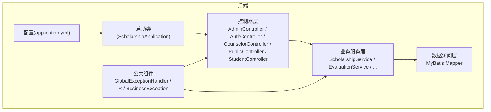
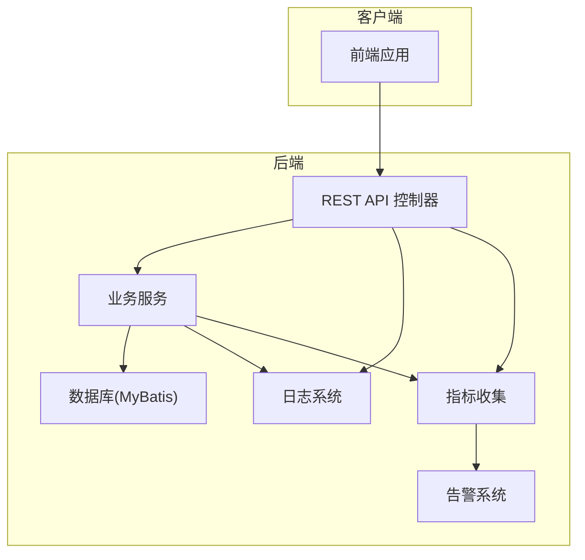
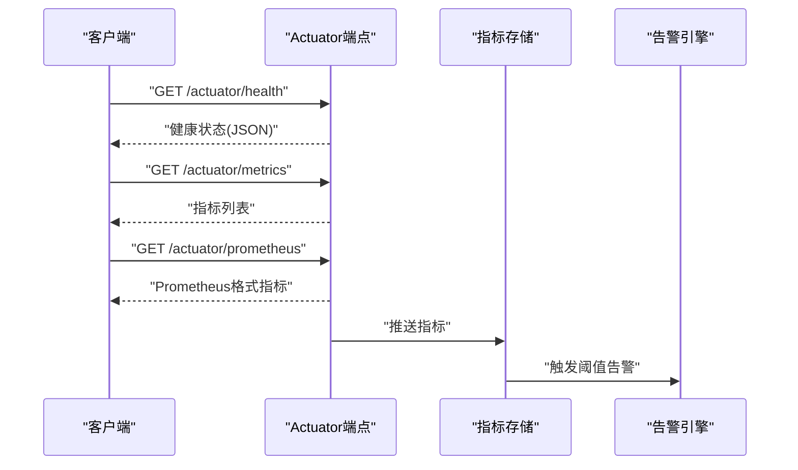
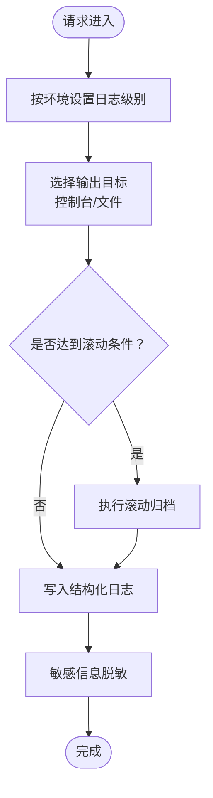
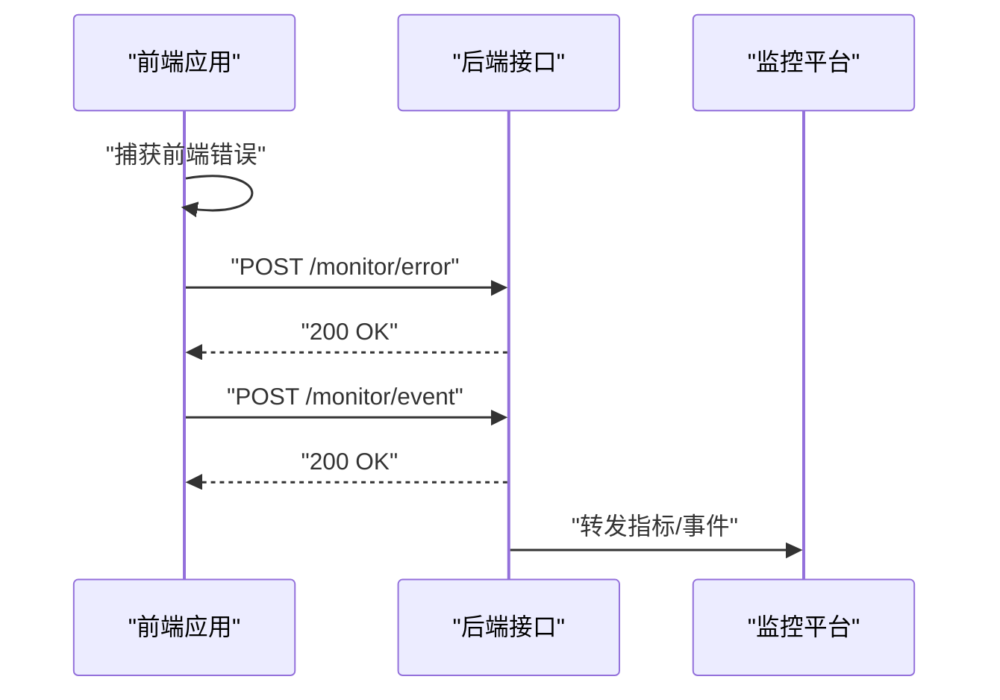
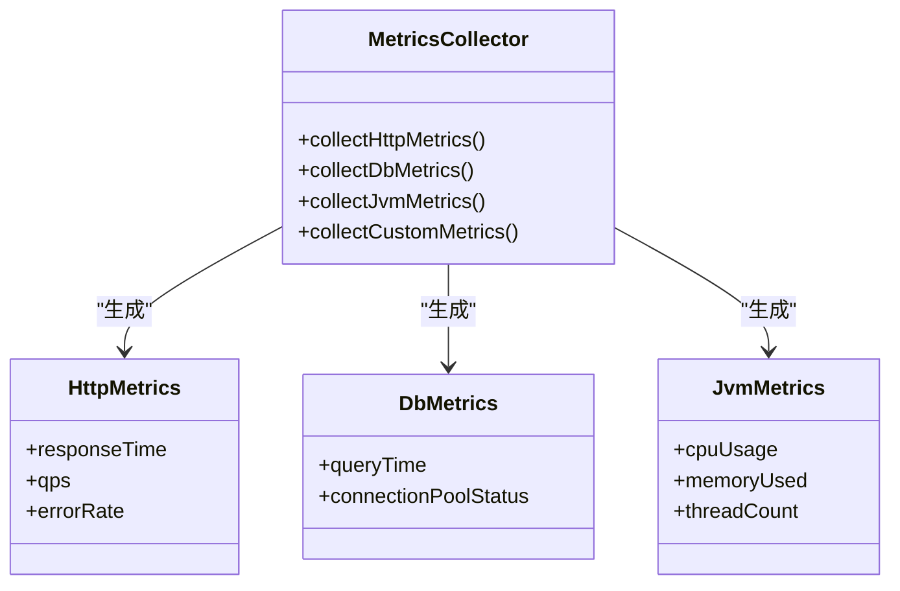
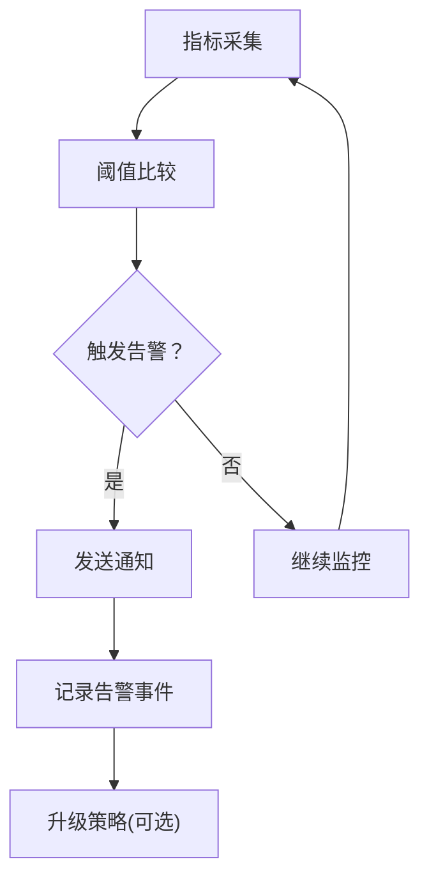
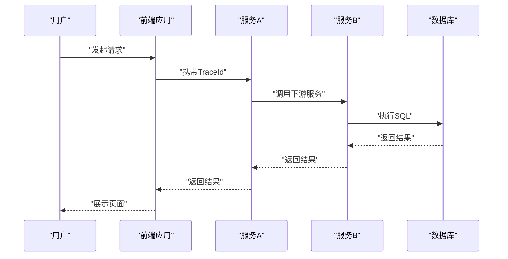
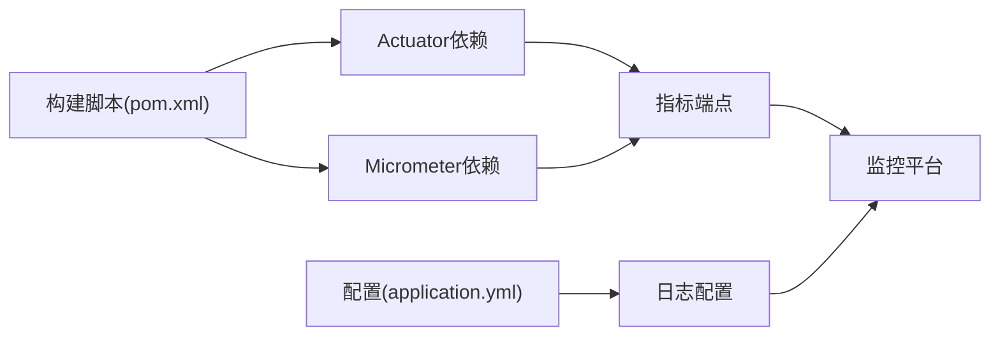

# 监控与日志管理

<cite>
**本文档引用的文件**
- [application.yml](file://backend/src/main/resources/application.yml)
- [pom.xml](file://backend/pom.xml)
- [GlobalExceptionHandler.java](file://backend/src/main/java/com/zjsu/scholarship/common/GlobalExceptionHandler.java)
- [R.java](file://backend/src/main/java/com/zjsu/scholarship/common/R.java)
- [ScholarshipApplication.java](file://backend/src/main/java/com/zjsu/scholarship/ScholarshipApplication.java)
- [AdminController.java](file://backend/src/main/java/com/zjsu/scholarship/controller/AdminController.java)
- [AuthController.java](file://backend/src/main/java/com/zjsu/scholarship/controller/AuthController.java)
- [CounselorController.java](file://backend/src/main/java/com/zjsu/scholarship/controller/CounselorController.java)
- [PublicController.java](file://backend/src/main/java/com/zjsu/scholarship/controller/PublicController.java)
- [StudentController.java](file://backend/src/main/java/com/zjsu/scholarship/controller/StudentController.java)
</cite>

## 目录
1. [简介](#简介)
2. [项目结构](#项目结构)
3. [核心组件](#核心组件)
4. [架构总览](#架构总览)
5. [详细组件分析](#详细组件分析)
6. [依赖关系分析](#依赖关系分析)
7. [性能考虑](#性能考虑)
8. [故障排查指南](#故障排查指南)
9. [结论](#结论)
10. [附录](#附录)

## 简介
本文件为奖学金管理系统的监控与日志管理方案，涵盖运行监控（Spring Boot Actuator）、日志级别与文件管理、前端错误监控与用户行为追踪、性能指标定义与采集、告警机制配置、分布式追踪与链路监控集成，以及日志分析与故障排查的方法与工具建议。由于当前仓库未包含Actuator、监控与日志相关依赖及配置，本文在现有代码基础上提出可落地的实施建议与最佳实践。

## 项目结构
后端采用Spring Boot标准目录结构，主要模块包括：
- 配置层：application.yml（应用配置）
- 控制器层：各角色控制器（管理员、辅导员、学生、公共接口等）
- 业务层：服务类（如奖学金计算、评估、导入等）
- 数据访问层：MyBatis Mapper接口
- 公共组件：全局异常处理、统一响应封装、安全与拦截器
- 启动类：ScholarshipApplication

**图表来源**
- [application.yml](file://backend/src/main/resources/application.yml)
- [ScholarshipApplication.java](file://backend/src/main/java/com/zjsu/scholarship/ScholarshipApplication.java)
- [GlobalExceptionHandler.java](file://backend/src/main/java/com/zjsu/scholarship/common/GlobalExceptionHandler.java)

**章节来源**
- [application.yml](file://backend/src/main/resources/application.yml)
- [ScholarshipApplication.java](file://backend/src/main/java/com/zjsu/scholarship/ScholarshipApplication.java)

## 核心组件
- 全局异常处理：通过统一异常处理器捕获系统异常，结合统一响应封装返回标准化错误信息，便于监控系统识别错误事件与错误率。
- 统一响应封装：对外输出一致的数据结构，简化前端与监控系统的解析。
- 控制器层：各角色控制器负责业务入口与参数校验，是性能指标与错误统计的关键节点。
- 日志配置：application.yml中已存在logging配置段落，可用于集中管理日志级别与输出策略。

**章节来源**
- [GlobalExceptionHandler.java](file://backend/src/main/java/com/zjsu/scholarship/common/GlobalExceptionHandler.java)
- [R.java](file://backend/src/main/java/com/zjsu/scholarship/common/R.java)
- [application.yml](file://backend/src/main/resources/application.yml)

## 架构总览
下图展示监控与日志在系统中的位置与交互关系：

[此图为概念性架构示意，不对应具体源码文件，故无图表来源]

## 详细组件分析

### Spring Boot Actuator 集成方案
- 依赖引入：在构建脚本中添加Actuator依赖，启用健康检查、指标暴露与管理端点。
- 健康检查：使用默认健康指示器，可扩展自定义健康检查逻辑（如数据库连通性、外部服务可用性）。
- 指标收集：启用Micrometer指标，自动收集JVM、内存、线程、HTTP请求等基础指标；可扩展自定义指标（如业务计数器、分布摘要）。
- 管理端点：生产环境谨慎开放敏感端点，仅允许必要端点，并通过认证授权保护。

[此图为概念性流程示意，不对应具体源码文件，故无图表来源]

**章节来源**
- [pom.xml](file://backend/pom.xml)

### 日志级别配置与日志文件管理
- 日志级别：根据环境设定不同级别（开发：DEBUG，测试/预发：INFO，生产：WARN+），确保关键问题可被及时发现。
- 日志输出：控制台与文件输出分离，生产环境优先文件输出并开启滚动策略。
- 日志切面：在控制器与服务层关键路径增加结构化日志，记录请求ID、用户标识、操作类型、耗时、结果状态。
- 日志脱敏：对敏感字段（如密码、身份证号）进行脱敏处理，避免泄露。

[此图为概念性流程示意，不对应具体源码文件，故无图表来源]

**章节来源**
- [application.yml](file://backend/src/main/resources/application.yml)

### 前端错误监控与用户行为追踪
- 前端错误上报：在前端应用中集成错误监控SDK，捕获JS异常、资源加载失败、网络错误，并上报到后端或独立监控平台。
- 用户行为追踪：埋点记录关键操作（登录、提交申请、查看结果等），结合会话ID与用户ID进行关联分析。
- 性能指标：采集首屏渲染时间、接口响应时间、页面切换耗时等，用于性能优化与告警阈值设定。

[此图为概念性流程示意，不对应具体源码文件，故无图表来源]

### 性能监控指标定义与采集
- 响应时间：HTTP请求总耗时、数据库查询耗时、第三方服务调用耗时。
- 吞吐量：每秒请求数（QPS）、每秒事务数（TPS）。
- 错误率：HTTP 5xx错误占比、业务异常占比、超时占比。
- 资源指标：CPU使用率、内存占用、线程池排队长度、数据库连接池状态。

[此图为概念性类图示意，不对应具体源码文件，故无图表来源]

**章节来源**
- [pom.xml](file://backend/pom.xml)

### 告警机制配置
- 阈值设定：基于历史数据与SLA设定阈值（如响应时间>500ms、错误率>1%、QPS骤降等）。
- 通知渠道：邮件、企业微信、钉钉机器人、短信等多通道并存。
- 分级告警：P0（系统不可用）、P1（严重性能下降）、P2（一般异常）分级处理。
- 自愈联动：结合运维自动化能力，在满足条件时自动扩容或回滚。

[此图为概念性流程示意，不对应具体源码文件，故无图表来源]

### 分布式追踪与链路监控
- 追踪ID：为每个请求生成唯一Trace ID与Span ID，贯穿所有服务调用。
- 上报格式：支持OpenTelemetry、Jaeger、Zipkin等标准格式，便于统一接入。
- 可视化：在链路图中展示请求路径、耗时分布、错误节点定位。

[此图为概念性序列示意，不对应具体源码文件，故无图表来源]

### 日志分析与故障排查
- 结构化日志：统一字段（时间戳、级别、服务名、TraceId、用户ID、URI、耗时、状态码、错误信息）。
- 查询与聚合：使用日志平台进行关键字检索、时间范围过滤、错误率聚合、TopN异常分析。
- 故障定位：结合链路追踪ID快速定位问题服务与调用栈，配合慢查询与错误堆栈进行根因分析。

[此部分为通用方法论说明，不直接分析具体文件，故无章节来源]

## 依赖关系分析
- Actuator与Micrometer：用于暴露健康检查与指标，需在构建脚本中引入相应依赖。
- 日志框架：结合application.yml中的logging配置，统一管理日志输出与级别。
- 监控平台：Prometheus、Grafana、Alertmanager或云监控平台对接，实现指标可视化与告警。

**图表来源**
- [pom.xml](file://backend/pom.xml)
- [application.yml](file://backend/src/main/resources/application.yml)

**章节来源**
- [pom.xml](file://backend/pom.xml)
- [application.yml](file://backend/src/main/resources/application.yml)

## 性能考虑
- 指标采样：对高频接口进行采样，降低指标收集开销。
- 异步上报：指标与日志采用异步缓冲队列，避免阻塞主线程。
- 缓存与限流：在网关或服务层加入缓存与限流，防止突发流量导致系统过载。
- 资源监控：持续监控JVM堆外内存、GC频率、线程池饱和度，提前预警。

[本节为通用性能建议，不直接分析具体文件，故无章节来源]

## 故障排查指南
- 快速定位：利用统一异常处理与结构化日志，快速定位异常类型与发生位置。
- 指标诊断：结合QPS、错误率、响应时间、资源使用率判断问题性质（流量洪峰、代码缺陷、资源瓶颈）。
- 回溯验证：通过请求ID与Trace ID串联前后端日志，复现问题场景。
- 复盘改进：建立问题复盘机制，完善监控阈值与告警策略。

**章节来源**
- [GlobalExceptionHandler.java](file://backend/src/main/java/com/zjsu/scholarship/common/GlobalExceptionHandler.java)
- [R.java](file://backend/src/main/java/com/zjsu/scholarship/common/R.java)

## 结论
本方案在现有奖学金管理系统基础上，提供了从日志管理、指标采集、告警到分布式追踪的完整监控体系建议。建议优先完成Actuator与日志配置的落地，再逐步引入指标与告警平台，最终打通链路追踪，形成闭环的可观测性体系，保障系统稳定运行与快速故障恢复。

[本节为总结性内容，不直接分析具体文件，故无章节来源]

## 附录
- 建议的依赖与配置清单可在构建脚本中新增Actuator与Micrometer依赖，并在配置文件中完善日志与监控相关参数。
- 前端监控SDK与后端上报接口可参考业界成熟方案，确保与后端统一规范。

[本节为补充建议，不直接分析具体文件，故无章节来源]