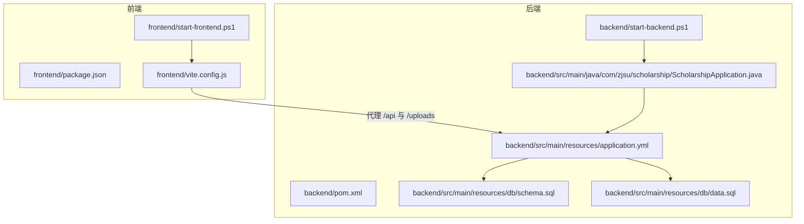
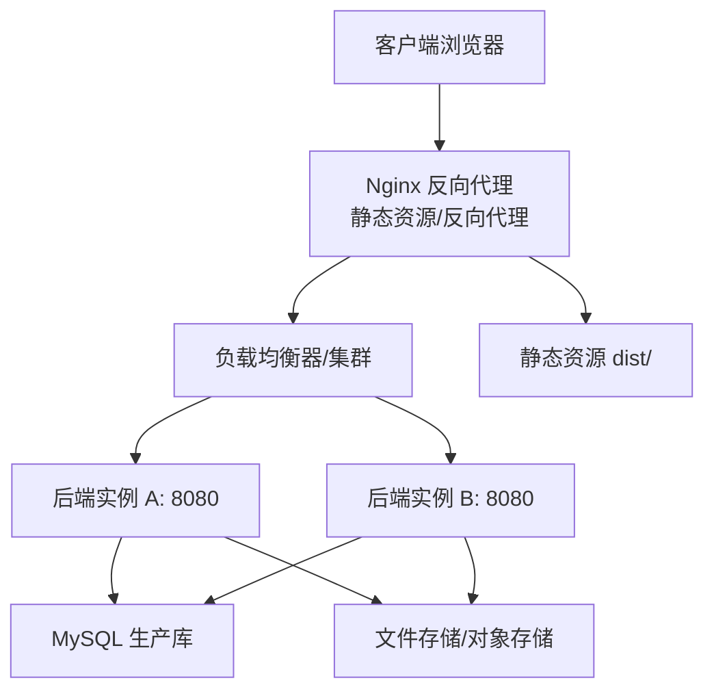
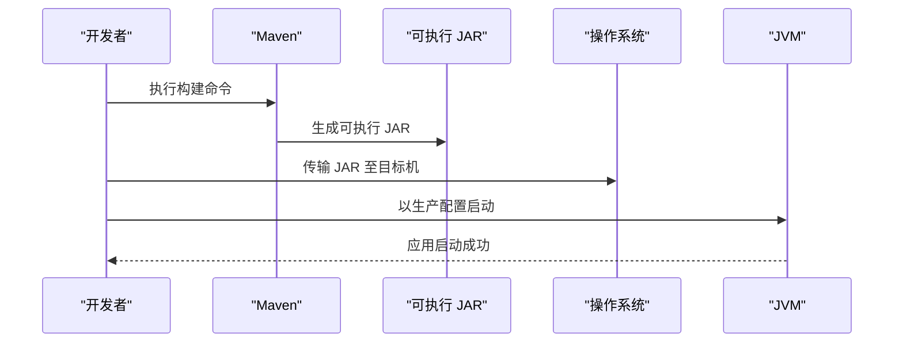
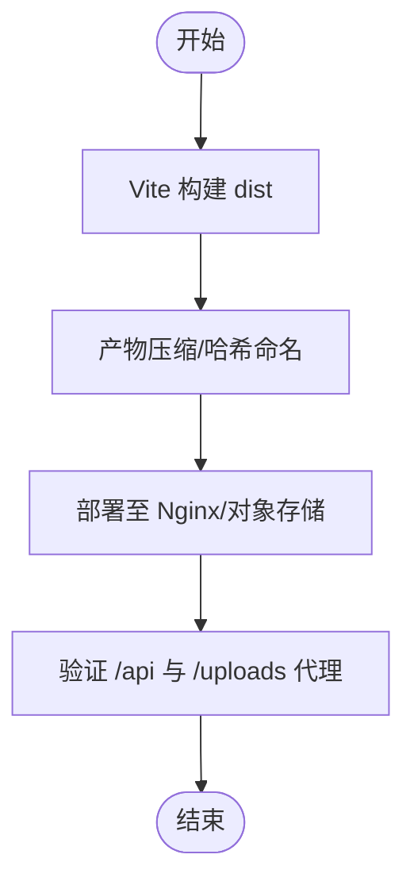
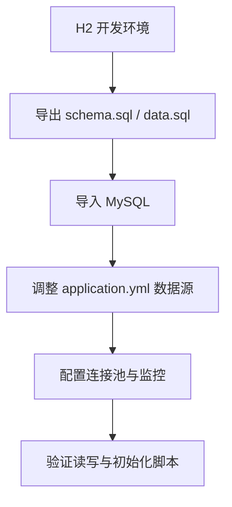
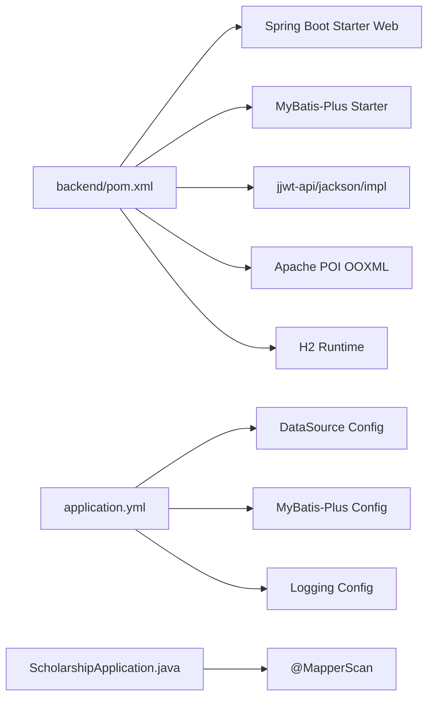

# 部署与运维

<cite>
**本文引用的文件**
- [backend/pom.xml](file://backend/pom.xml)
- [backend/src/main/resources/application.yml](file://backend/src/main/resources/application.yml)
- [backend/src/main/resources/db/schema.sql](file://backend/src/main/resources/db/schema.sql)
- [backend/src/main/resources/db/data.sql](file://backend/src/main/resources/db/data.sql)
- [backend/src/main/java/com/zjsu/scholarship/ScholarshipApplication.java](file://backend/src/main/java/com/zjsu/scholarship/ScholarshipApplication.java)
- [backend/start-backend.ps1](file://backend/start-backend.ps1)
- [frontend/package.json](file://frontend/package.json)
- [frontend/vite.config.js](file://frontend/vite.config.js)
- [frontend/start-frontend.ps1](file://frontend/start-frontend.ps1)
- [README.md](file://README.md)
</cite>

## 目录
1. [简介](#简介)
2. [项目结构](#项目结构)
3. [核心组件](#核心组件)
4. [架构总览](#架构总览)
5. [详细组件分析](#详细组件分析)
6. [依赖关系分析](#依赖关系分析)
7. [性能考虑](#性能考虑)
8. [故障排查指南](#故障排查指南)
9. [结论](#结论)
10. [附录](#附录)

## 简介
本文件面向生产环境，提供奖学金管理系统的部署与运维方案。内容涵盖：
- Spring Boot 应用的打包与部署流程（Maven 构建配置）
- Docker 容器化建议（基于现有配置的适配思路）
- React 前端构建优化与静态资源部署策略
- 数据库生产环境适配（MySQL 迁移与连接池优化）
- 服务器环境准备与系统要求（JDK 版本、内存、磁盘）
- 负载均衡与高可用部署方案
- 监控与日志（Spring Boot Actuator 与前端错误监控）
- 备份与恢复策略（数据库与文件）
- 性能调优与容量规划
- 常见运维问题排查与解决

## 项目结构
系统采用前后端分离架构：
- 后端：Spring Boot 3.2（Java 17）+ MyBatis-Plus，使用 H2 文件模式作为开发数据库，支持初始化脚本与演示数据。
- 前端：React 18 + Vite 5，本地开发通过代理转发到后端 8080 端口。

图表来源
- [frontend/vite.config.js:1-21](file://frontend/vite.config.js#L1-L21)
- [backend/src/main/resources/application.yml:1-52](file://backend/src/main/resources/application.yml#L1-L52)
- [backend/src/main/java/com/zjsu/scholarship/ScholarshipApplication.java:1-14](file://backend/src/main/java/com/zjsu/scholarship/ScholarshipApplication.java#L1-L14)
- [backend/start-backend.ps1:1-13](file://backend/start-backend.ps1#L1-L13)
- [frontend/start-frontend.ps1:1-8](file://frontend/start-frontend.ps1#L1-L8)

章节来源
- [README.md:123-154](file://README.md#L123-L154)

## 核心组件
- 后端应用入口与扫描路径
  - 应用主类位于包路径 com.zjsu.scholarship，启用 @SpringBootApplication 并通过 @MapperScan 指定 MyBatis-Plus Mapper 扫描范围。
- 数据源与初始化
  - 默认使用 H2 文件模式（零配置），自动执行 schema.sql 与 data.sql，并开启 H2 Console。
  - 支持上传文件大小限制与上传目录配置。
- 前端开发与代理
  - Vite 开发服务器默认监听 5173，通过代理将 /api 与 /uploads 转发至后端 8080。
- 构建与运行
  - 后端使用 Maven 插件 spring-boot-maven-plugin，排除 Lombok 并设置 JVM 参数编码。
  - 提供 Windows PowerShell 启动脚本，自动设置 JAVA_HOME/MVN 并运行后端。

章节来源
- [backend/src/main/java/com/zjsu/scholarship/ScholarshipApplication.java:1-14](file://backend/src/main/java/com/zjsu/scholarship/ScholarshipApplication.java#L1-L14)
- [backend/src/main/resources/application.yml:1-52](file://backend/src/main/resources/application.yml#L1-L52)
- [backend/pom.xml:90-106](file://backend/pom.xml#L90-L106)
- [frontend/vite.config.js:1-21](file://frontend/vite.config.js#L1-L21)
- [backend/start-backend.ps1:1-13](file://backend/start-backend.ps1#L1-L13)
- [frontend/start-frontend.ps1:1-8](file://frontend/start-frontend.ps1#L1-L8)

## 架构总览
生产环境建议采用“Nginx 反向代理 + 多实例后端 + MySQL + 文件存储”的架构。前端构建产物部署至 Nginx 或对象存储，后端通过连接池访问 MySQL，上传文件可落盘或对象存储。

说明
- Nginx 负责静态资源分发、Gzip 压缩、HTTPS 终止与 /api、/uploads 的反向代理。
- 后端实例通过连接池连接 MySQL，避免直接暴露数据库。
- 文件上传建议使用对象存储（如 OSS/COS/OBS）提升扩展性与可靠性。

## 详细组件分析

### 后端：Spring Boot 应用打包与部署
- 构建与打包
  - 使用 Maven 插件 spring-boot-maven-plugin，排除 Lombok，设置 JVM 编码参数，生成可执行 JAR。
  - 建议在 CI 中缓存 Maven 依赖，缩短构建时间。
- 运行与配置
  - 默认端口 8080，H2 文件数据库，自动初始化 schema 与 data。
  - 生产环境需替换为 MySQL，并配置连接池（建议 HikariCP）。
- 日志与编码
  - 设置 UTF-8 编码参数，日志级别按包设置，便于生产排障。

图表来源
- [backend/pom.xml:90-106](file://backend/pom.xml#L90-L106)
- [backend/src/main/resources/application.yml:1-52](file://backend/src/main/resources/application.yml#L1-L52)

章节来源
- [backend/pom.xml:20-24](file://backend/pom.xml#L20-L24)
- [backend/pom.xml:90-106](file://backend/pom.xml#L90-L106)
- [backend/src/main/resources/application.yml:1-52](file://backend/src/main/resources/application.yml#L1-L52)

### 前端：React 构建与静态资源部署
- 构建优化
  - 使用 Vite 构建，支持按需加载与 Tree-shaking；建议开启产物压缩与哈希命名。
- 静态资源部署
  - 将 dist 目录部署至 Nginx 或对象存储；确保 /uploads 与 /api 的代理正确。
- 开发与生产差异
  - 开发时通过 /api 与 /uploads 代理到后端；生产环境应将 API 域名固定并配置跨域。

图表来源
- [frontend/package.json:1-26](file://frontend/package.json#L1-L26)
- [frontend/vite.config.js:1-21](file://frontend/vite.config.js#L1-L21)

章节来源
- [frontend/package.json:1-26](file://frontend/package.json#L1-L26)
- [frontend/vite.config.js:1-21](file://frontend/vite.config.js#L1-L21)

### 数据库：从 H2 迁移到 MySQL
- 迁移步骤
  - 在 pom.xml 添加 MySQL Connector 依赖；在 application.yml 中替换 datasource.url 与 driver-class-name。
  - 将 schema.sql 与 data.sql 导入 MySQL，或在 Spring Boot 初始化阶段使用 SQL 脚本。
- 连接池优化
  - 建议使用 HikariCP，合理设置连接池大小、超时与健康检查。
- 文件存储
  - uploads 目录建议迁移到对象存储，或使用共享存储挂载到多实例后端。

图表来源
- [backend/src/main/resources/db/schema.sql:1-402](file://backend/src/main/resources/db/schema.sql#L1-L402)
- [backend/src/main/resources/db/data.sql:1-66](file://backend/src/main/resources/db/data.sql#L1-L66)
- [backend/src/main/resources/application.yml:11-15](file://backend/src/main/resources/application.yml#L11-L15)

章节来源
- [README.md:195-196](file://README.md#L195-L196)
- [backend/src/main/resources/application.yml:11-15](file://backend/src/main/resources/application.yml#L11-L15)
- [backend/src/main/resources/db/schema.sql:1-402](file://backend/src/main/resources/db/schema.sql#L1-L402)
- [backend/src/main/resources/db/data.sql:1-66](file://backend/src/main/resources/db/data.sql#L1-L66)

### 服务器环境准备与系统要求
- JDK 与构建工具
  - 后端使用 Java 17；Windows 环境可通过脚本设置 JAVA_HOME 与 MAVEN_HOME。
- 内存与磁盘
  - 建议至少 2GB 内存运行后端；磁盘需容纳数据库文件与上传目录。
- 端口
  - 后端默认 8080；Nginx 建议 80/443；H2 Console 默认 /h2（生产关闭）。

章节来源
- [backend/pom.xml:20-24](file://backend/pom.xml#L20-L24)
- [backend/start-backend.ps1:1-8](file://backend/start-backend.ps1#L1-L8)
- [backend/src/main/resources/application.yml:1-7](file://backend/src/main/resources/application.yml#L1-L7)

### 负载均衡与高可用
- 多实例部署
  - 后端部署多个实例，结合 Nginx 或云负载均衡器进行流量分发。
- 无状态设计
  - 后端保持无状态，上传文件与静态资源集中存储，避免粘性会话。
- 健康检查
  - Nginx/LB 对后端进行健康检查，异常节点摘除。

章节来源
- [README.md:184-186](file://README.md#L184-L186)

### 监控与日志
- Spring Boot Actuator
  - 建议引入 Actuator，暴露健康检查、指标与进程信息端点，配合 Prometheus/Grafana 监控。
- 前端错误监控
  - 建议集成前端错误上报（如 Sentry），收集运行时异常与用户行为。
- 日志管理
  - 后端日志输出到标准输出，结合容器日志收集（如 Fluent Bit/Fluentd）统一采集。

章节来源
- [backend/src/main/resources/application.yml:48-52](file://backend/src/main/resources/application.yml#L48-L52)

### 备份与恢复
- 数据库备份
  - MySQL 建议定时快照（逻辑/物理均可），并验证恢复流程。
- 文件备份
  - 上传目录建议同步到对象存储或共享存储，定期校验。
- 恢复演练
  - 定期进行恢复演练，验证备份完整性与恢复时效。

章节来源
- [backend/src/main/resources/application.yml:46](file://backend/src/main/resources/application.yml#L46)

### 性能调优与容量规划
- 连接池与数据库
  - 合理设置连接池大小与超时，监控慢查询与锁等待。
- 缓存与索引
  - 对热点查询建立合适索引，必要时引入 Redis 缓存。
- 前端优化
  - 启用 Gzip/Brotli 压缩、CDN 分发、懒加载与图片优化。
- 容量规划
  - 基于 QPS/并发与资源占用趋势，预留 30%-50% 的弹性空间。

## 依赖关系分析
后端应用的依赖与配置关系如下：

图表来源
- [backend/pom.xml:26-87](file://backend/pom.xml#L26-L87)
- [backend/src/main/resources/application.yml:8-46](file://backend/src/main/resources/application.yml#L8-L46)
- [backend/src/main/java/com/zjsu/scholarship/ScholarshipApplication.java:7-8](file://backend/src/main/java/com/zjsu/scholarship/ScholarshipApplication.java#L7-L8)

章节来源
- [backend/pom.xml:26-87](file://backend/pom.xml#L26-L87)
- [backend/src/main/resources/application.yml:8-46](file://backend/src/main/resources/application.yml#L8-L46)
- [backend/src/main/java/com/zjsu/scholarship/ScholarshipApplication.java:7-8](file://backend/src/main/java/com/zjsu/scholarship/ScholarshipApplication.java#L7-L8)

## 性能考虑
- JVM 参数
  - 建议设置合适的堆大小与 GC 策略，结合容器内存限制。
- 数据库
  - 合理设置连接池大小、查询超时与慢查询阈值；对高频表建立索引。
- 前端
  - 产物压缩、CDN 分发、缓存策略与骨架屏优化。
- 运维
  - 通过监控指标（CPU/内存/连接数/QPS/错误率）进行容量评估与预警。

## 故障排查指南
- 启动失败
  - 检查 JAVA_HOME 与 Maven 是否正确配置；确认端口未被占用。
- 数据库连接异常
  - 核对 application.yml 中的数据库 URL、用户名与密码；确认网络连通与防火墙。
- 初始化脚本失败
  - 检查 schema.sql 与 data.sql 是否可执行；确认编码与 SQL 语法。
- 上传失败
  - 检查上传目录权限与磁盘空间；确认 Nginx 代理 /uploads 是否正确。
- H2 控制台
  - 默认仅本地可用，生产关闭控制台以降低风险。

章节来源
- [backend/start-backend.ps1:1-13](file://backend/start-backend.ps1#L1-L13)
- [backend/src/main/resources/application.yml:11-28](file://backend/src/main/resources/application.yml#L11-L28)
- [backend/src/main/resources/db/schema.sql:1-402](file://backend/src/main/resources/db/schema.sql#L1-L402)
- [backend/src/main/resources/db/data.sql:1-66](file://backend/src/main/resources/db/data.sql#L1-L66)
- [README.md:184-186](file://README.md#L184-L186)

## 结论
本方案基于现有配置，提供了从开发到生产的完整路径：后端使用 Spring Boot 与 Maven 构建，前端使用 Vite 构建与代理；生产环境建议替换数据库为 MySQL，启用连接池与监控，通过 Nginx 实现静态资源与 API 代理，并结合对象存储与负载均衡实现高可用。同时配套监控、日志与备份策略，确保系统稳定运行。

## 附录
- API 概览（节选）
  - 认证与权限：/api/auth/*
  - 学生侧：/api/student/*
  - 辅导员侧：/api/counselor/*
  - 管理员侧：/api/admin/*
  - 公开结果：/api/public/results
- 常用命令
  - 后端启动：使用提供的 PowerShell 脚本或直接执行 Maven 插件运行。
  - 前端启动：使用提供的 PowerShell 脚本或 npm run dev。
- 安全建议
  - 生产关闭 H2 Console；启用 HTTPS；严格控制 CORS 与上传类型；定期更新依赖与补丁。

章节来源
- [README.md:158-182](file://README.md#L158-L182)
- [backend/start-backend.ps1:1-13](file://backend/start-backend.ps1#L1-L13)
- [frontend/start-frontend.ps1:1-8](file://frontend/start-frontend.ps1#L1-L8)