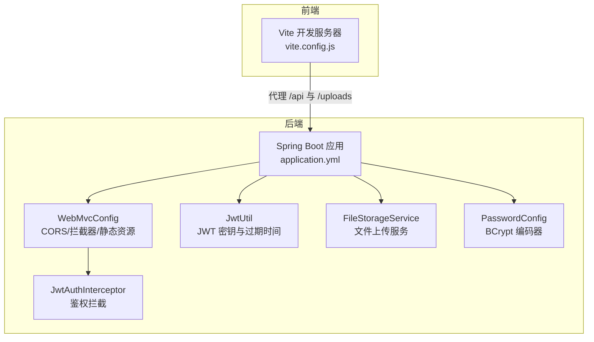
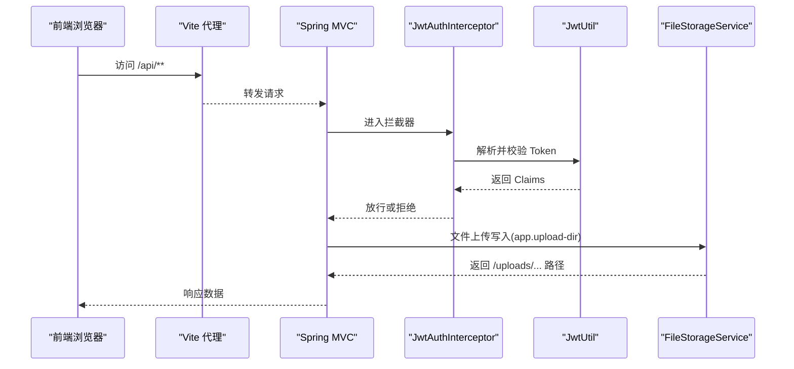
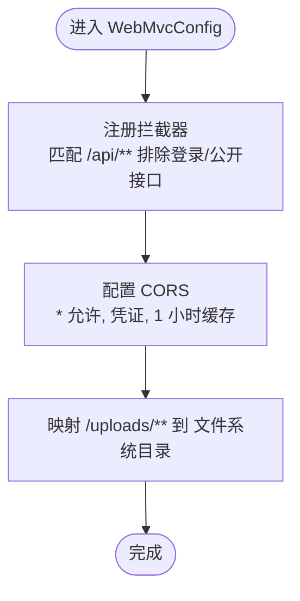
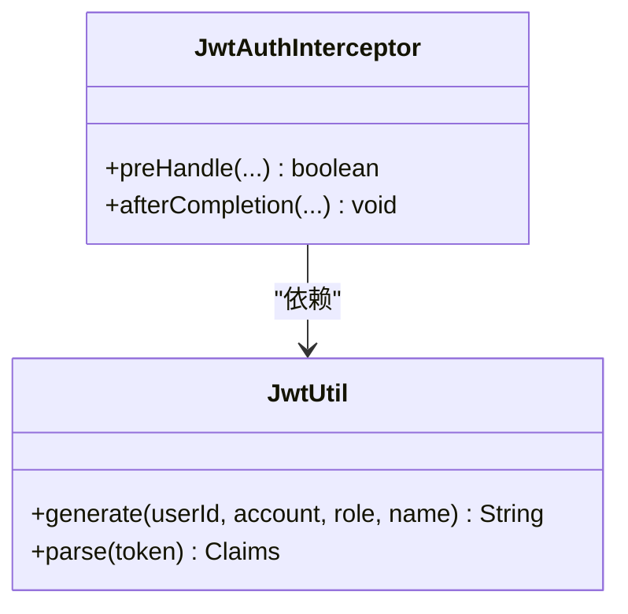
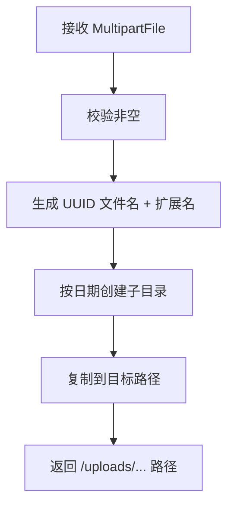
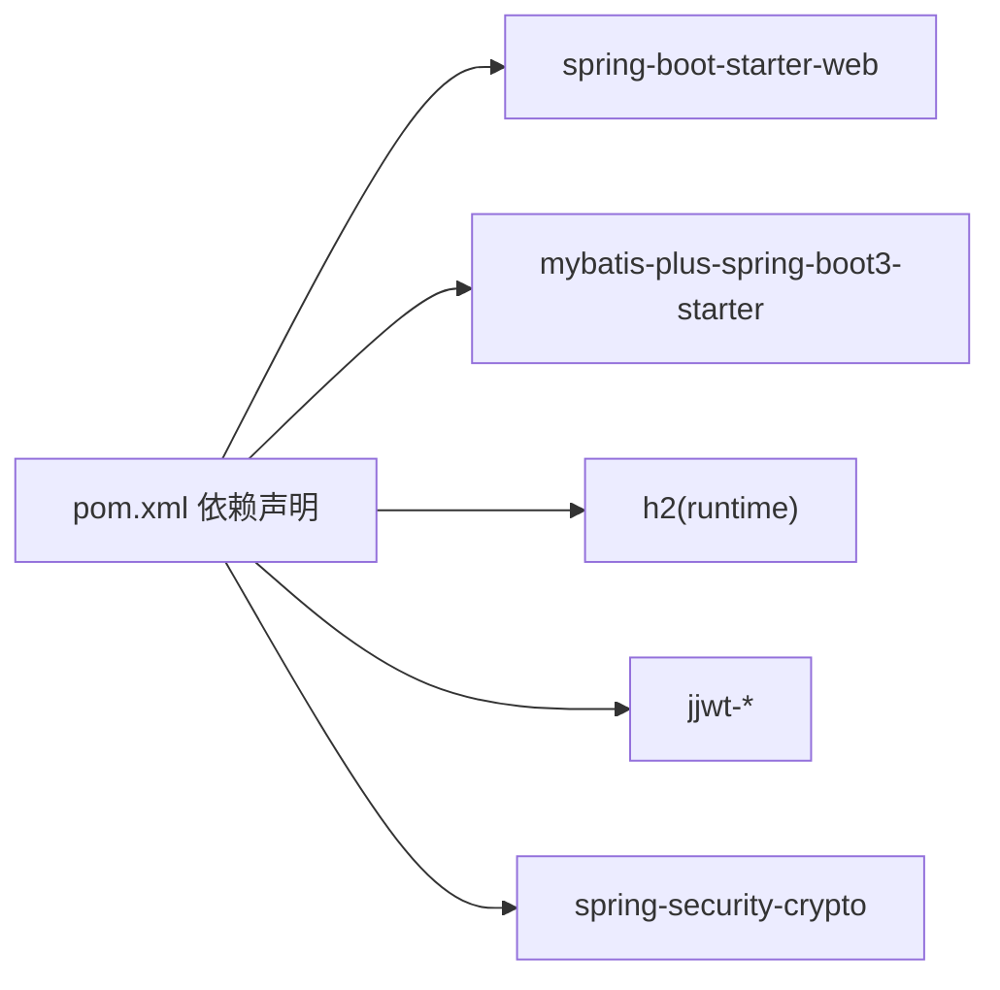

# 配置管理

<cite>
**本文引用的文件**
- [application.yml](file://backend/src/main/resources/application.yml)
- [WebMvcConfig.java](file://backend/src/main/java/com/zjsu/scholarship/config/WebMvcConfig.java)
- [PasswordConfig.java](file://backend/src/main/java/com/zjsu/scholarship/config/PasswordConfig.java)
- [JwtUtil.java](file://backend/src/main/java/com/zjsu/scholarship/security/JwtUtil.java)
- [JwtAuthInterceptor.java](file://backend/src/main/java/com/zjsu/scholarship/security/JwtAuthInterceptor.java)
- [FileStorageService.java](file://backend/src/main/java/com/zjsu/scholarship/service/FileStorageService.java)
- [pom.xml](file://backend/pom.xml)
- [vite.config.js](file://frontend/vite.config.js)
- [start-backend.ps1](file://start-backend.ps1)
- [start-frontend.ps1](file://start-frontend.ps1)
- [.gitignore](file://.gitignore)
</cite>

## 目录
1. [简介](#简介)
2. [项目结构](#项目结构)
3. [核心组件](#核心组件)
4. [架构总览](#架构总览)
5. [详细组件分析](#详细组件分析)
6. [依赖分析](#依赖分析)
7. [性能考虑](#性能考虑)
8. [故障排查指南](#故障排查指南)
9. [结论](#结论)
10. [附录](#附录)

## 简介
本文件系统性梳理奖学金管理系统的配置管理设计与实践，覆盖以下方面：
- application.yml 的关键配置项说明（数据库、服务器、JWT、文件上传、日志等）
- WebMvcConfig 的 CORS、静态资源映射与拦截器策略
- PasswordConfig 的密码加密策略（BCrypt）
- 不同环境的配置管理建议（开发/测试/生产）
- 配置的安全与加密策略
- 动态更新与热加载能力评估
- 配置验证与故障排查方法
- 配置版本管理与变更追踪建议

## 项目结构
后端采用 Spring Boot 标准结构，配置集中在 resources/application.yml；前端通过 Vite 开发服务器代理后端接口与上传资源。

图表来源
- [application.yml:1-52](file://backend/src/main/resources/application.yml#L1-L52)
- [WebMvcConfig.java:1-49](file://backend/src/main/java/com/zjsu/scholarship/config/WebMvcConfig.java#L1-L49)
- [JwtUtil.java:1-52](file://backend/src/main/java/com/zjsu/scholarship/security/JwtUtil.java#L1-L52)
- [JwtAuthInterceptor.java:1-65](file://backend/src/main/java/com/zjsu/scholarship/security/JwtAuthInterceptor.java#L1-L65)
- [FileStorageService.java:1-45](file://backend/src/main/java/com/zjsu/scholarship/service/FileStorageService.java#L1-L45)
- [PasswordConfig.java:1-15](file://backend/src/main/java/com/zjsu/scholarship/config/PasswordConfig.java#L1-L15)
- [vite.config.js:1-20](file://frontend/vite.config.js#L1-L20)

章节来源
- [application.yml:1-52](file://backend/src/main/resources/application.yml#L1-L52)
- [WebMvcConfig.java:1-49](file://backend/src/main/java/com/zjsu/scholarship/config/WebMvcConfig.java#L1-L49)
- [JwtUtil.java:1-52](file://backend/src/main/java/com/zjsu/scholarship/security/JwtUtil.java#L1-L52)
- [JwtAuthInterceptor.java:1-65](file://backend/src/main/java/com/zjsu/scholarship/security/JwtAuthInterceptor.java#L1-L65)
- [FileStorageService.java:1-45](file://backend/src/main/java/com/zjsu/scholarship/service/FileStorageService.java#L1-L45)
- [PasswordConfig.java:1-15](file://backend/src/main/java/com/zjsu/scholarship/config/PasswordConfig.java#L1-L15)
- [vite.config.js:1-20](file://frontend/vite.config.js#L1-L20)

## 核心组件
- application.yml：集中定义服务器端口、数据库连接、H2 控制台、SQL 初始化、文件上传大小限制、MyBatis-Plus 行为、应用自定义配置（JWT 密钥与过期时间、上传目录）、日志级别。
- WebMvcConfig：统一配置 CORS、拦截器（JWT 鉴权）与静态资源映射（上传目录）。
- JwtUtil：基于 application.yml 中的 app.jwt.* 配置生成与解析 JWT。
- JwtAuthInterceptor：拦截 /api/** 请求，校验 Authorization 头部与角色注解。
- FileStorageService：读取 app.upload-dir，按日期子目录保存上传文件。
- PasswordConfig：注册 BCryptPasswordEncoder Bean，用于密码编码。

章节来源
- [application.yml:1-52](file://backend/src/main/resources/application.yml#L1-L52)
- [WebMvcConfig.java:1-49](file://backend/src/main/java/com/zjsu/scholarship/config/WebMvcConfig.java#L1-L49)
- [JwtUtil.java:1-52](file://backend/src/main/java/com/zjsu/scholarship/security/JwtUtil.java#L1-L52)
- [JwtAuthInterceptor.java:1-65](file://backend/src/main/java/com/zjsu/scholarship/security/JwtAuthInterceptor.java#L1-L65)
- [FileStorageService.java:1-45](file://backend/src/main/java/com/zjsu/scholarship/service/FileStorageService.java#L1-L45)
- [PasswordConfig.java:1-15](file://backend/src/main/java/com/zjsu/scholarship/config/PasswordConfig.java#L1-L15)

## 架构总览
下图展示配置如何贯穿请求生命周期：前端通过代理访问后端，后端经由 WebMvcConfig 注册的拦截器进行鉴权，鉴权依赖 JwtUtil 读取 JWT 配置，文件上传由 FileStorageService 读取上传目录配置。

图表来源
- [vite.config.js:1-20](file://frontend/vite.config.js#L1-L20)
- [WebMvcConfig.java:1-49](file://backend/src/main/java/com/zjsu/scholarship/config/WebMvcConfig.java#L1-L49)
- [JwtAuthInterceptor.java:1-65](file://backend/src/main/java/com/zjsu/scholarship/security/JwtAuthInterceptor.java#L1-L65)
- [JwtUtil.java:1-52](file://backend/src/main/java/com/zjsu/scholarship/security/JwtUtil.java#L1-L52)
- [FileStorageService.java:1-45](file://backend/src/main/java/com/zjsu/scholarship/service/FileStorageService.java#L1-L45)

## 详细组件分析

### application.yml 配置详解
- 服务器与字符集
  - server.port：后端监听端口
  - server.servlet.encoding：强制 UTF-8
- 数据库与 H2 控制台
  - spring.datasource.*：H2 文件数据库配置（驱动、URL、凭据）
  - h2.console.*：控制台开关、路径与安全设置
- SQL 初始化
  - sql.init.*：启动时执行 schema.sql 与 data.sql，编码为 UTF-8
- 文件上传
  - multipart.*：单文件与总请求大小限制
- MyBatis-Plus
  - configuration.*：下划线转驼峰、关闭日志实现
  - global_config.db_config.id-type：主键策略
- 应用自定义配置
  - app.jwt.*：JWT 密钥与过期小时数
  - app.upload-dir：上传目录（相对路径）
- 日志
  - logging.level.*：包级日志级别

章节来源
- [application.yml:1-52](file://backend/src/main/resources/application.yml#L1-L52)

### WebMvcConfig 配置策略
- 拦截器
  - 对 /api/** 生效，排除登录与公开接口
  - 使用 JwtAuthInterceptor 完成鉴权与角色检查
- CORS
  - 允许所有源、方法、头，允许凭证，缓存 1 小时
- 静态资源映射
  - /uploads/** 映射到 app.upload-dir 指定的文件系统路径

图表来源
- [WebMvcConfig.java:23-47](file://backend/src/main/java/com/zjsu/scholarship/config/WebMvcConfig.java#L23-L47)

章节来源
- [WebMvcConfig.java:1-49](file://backend/src/main/java/com/zjsu/scholarship/config/WebMvcConfig.java#L1-L49)

### PasswordConfig 密码加密配置
- 注册 BCryptPasswordEncoder Bean，用于用户密码编码与校验
- 未显式设置轮数参数，默认使用框架推荐值

章节来源
- [PasswordConfig.java:1-15](file://backend/src/main/java/com/zjsu/scholarship/config/PasswordConfig.java#L1-L15)

### JWT 配置与使用
- 配置项
  - app.jwt.secret：HMAC 密钥字符串
  - app.jwt.expire-hours：Token 过期小时数
- 生成与解析
  - JwtUtil 从配置注入密钥与过期时间，生成与解析 JWT
- 拦截器
  - JwtAuthInterceptor 从 Authorization 头提取 Bearer Token，解析并放入上下文，同时校验方法/类上的 RequireRole 注解

图表来源
- [JwtUtil.java:1-52](file://backend/src/main/java/com/zjsu/scholarship/security/JwtUtil.java#L1-L52)
- [JwtAuthInterceptor.java:1-65](file://backend/src/main/java/com/zjsu/scholarship/security/JwtAuthInterceptor.java#L1-L65)

章节来源
- [JwtUtil.java:1-52](file://backend/src/main/java/com/zjsu/scholarship/security/JwtUtil.java#L1-L52)
- [JwtAuthInterceptor.java:1-65](file://backend/src/main/java/com/zjsu/scholarship/security/JwtAuthInterceptor.java#L1-L65)

### 文件上传与存储
- 配置
  - app.upload-dir：上传根目录
  - multipart.max-file-size / max-request-size：上传大小限制
- 存储策略
  - FileStorageService 按日期创建子目录，UUID 命名文件，返回 /uploads/... 路径
  - WebMvcConfig 将 /uploads/** 映射到文件系统

图表来源
- [FileStorageService.java:22-44](file://backend/src/main/java/com/zjsu/scholarship/service/FileStorageService.java#L22-L44)
- [WebMvcConfig.java:44-47](file://backend/src/main/java/com/zjsu/scholarship/config/WebMvcConfig.java#L44-L47)

章节来源
- [FileStorageService.java:1-45](file://backend/src/main/java/com/zjsu/scholarship/service/FileStorageService.java#L1-L45)
- [WebMvcConfig.java:1-49](file://backend/src/main/java/com/zjsu/scholarship/config/WebMvcConfig.java#L1-L49)

### 前端代理与本地启动
- 前端 Vite 代理
  - /api 与 /uploads 代理至后端 8080 端口
- 后端启动脚本
  - start-backend.ps1 使用 Maven 启动 Spring Boot 应用
  - start-frontend.ps1 安装依赖并运行前端

章节来源
- [vite.config.js:1-20](file://frontend/vite.config.js#L1-L20)
- [start-backend.ps1:1-12](file://start-backend.ps1#L1-L12)
- [start-frontend.ps1:1-7](file://start-frontend.ps1#L1-L7)

## 依赖分析
- Spring Boot 3.2.5 与 MyBatis-Plus 3.5.5
- jjwt 0.12.5（API/IMPL/JACKSON）
- H2 数据库（运行时）
- Spring Security Crypto（用于对称加密工具）

图表来源
- [pom.xml:26-87](file://backend/pom.xml#L26-L87)

章节来源
- [pom.xml:1-108](file://backend/pom.xml#L1-L108)

## 性能考虑
- CORS 配置允许通配符与凭证，便于开发但生产需收敛允许源与头以降低预检开销。
- 文件上传大小限制已设置，建议结合 Nginx/网关做统一限流与超时控制。
- MyBatis-Plus 关闭日志实现可减少日志输出开销，适合生产环境。
- JWT 过期时间较长（24 小时），建议根据业务风险调整。

## 故障排查指南
- 无法访问上传文件
  - 检查 app.upload-dir 是否存在且可写
  - 确认 WebMvcConfig 的 /uploads/** 映射是否生效
  - 参考：[WebMvcConfig.java:44-47](file://backend/src/main/java/com/zjsu/scholarship/config/WebMvcConfig.java#L44-L47)，[FileStorageService.java:32-44](file://backend/src/main/java/com/zjsu/scholarship/service/FileStorageService.java#L32-L44)
- 登录后仍提示未登录或无权限
  - 检查 Authorization 头是否为 Bearer Token
  - 校验 app.jwt.secret 与 app.jwt.expire-hours 是否一致
  - 参考：[JwtAuthInterceptor.java:25-28](file://backend/src/main/java/com/zjsu/scholarship/security/JwtAuthInterceptor.java#L25-L28)，[JwtUtil.java:18-22](file://backend/src/main/java/com/zjsu/scholarship/security/JwtUtil.java#L18-L22)
- CORS 报错
  - 生产环境请缩小 allowedOriginPatterns，避免 * 导致的安全问题
  - 参考：[WebMvcConfig.java:34-40](file://backend/src/main/java/com/zjsu/scholarship/config/WebMvcConfig.java#L34-L40)
- 启动失败或数据库初始化异常
  - 检查 schema.sql 与 data.sql 路径与编码
  - 参考：[application.yml:22-28](file://backend/src/main/resources/application.yml#L22-L28)

章节来源
- [WebMvcConfig.java:34-47](file://backend/src/main/java/com/zjsu/scholarship/config/WebMvcConfig.java#L34-L47)
- [JwtAuthInterceptor.java:25-28](file://backend/src/main/java/com/zjsu/scholarship/security/JwtAuthInterceptor.java#L25-L28)
- [JwtUtil.java:18-22](file://backend/src/main/java/com/zjsu/scholarship/security/JwtUtil.java#L18-L22)
- [FileStorageService.java:32-44](file://backend/src/main/java/com/zjsu/scholarship/service/FileStorageService.java#L32-L44)
- [application.yml:22-28](file://backend/src/main/resources/application.yml#L22-L28)

## 结论
本系统通过 application.yml 统一管理关键配置，配合 WebMvcConfig 实现跨域、鉴权与静态资源映射，使用 JwtUtil 与 JwtAuthInterceptor 提供细粒度的认证与授权，FileStorageService 与上传目录配置保障文件服务能力。建议在生产环境收紧 CORS、替换默认 JWT 密钥、启用配置加密与审计，并建立配置版本化与变更追踪流程。

## 附录

### 不同环境的配置管理方案
- 开发环境
  - 使用默认 H2 文件库与 H2 控制台，便于本地调试
  - 允许通配 CORS，便于前端代理联调
- 测试环境
  - 使用独立数据库实例，开启 SQL 初始化
  - 收敛 CORS 至测试域名
- 生产环境
  - 切换为 MySQL 或兼容的生产数据库
  - 替换 app.jwt.secret 为强随机密钥，缩短过期时间
  - 严格限制 CORS 源与头，启用 HTTPS
  - 上传目录使用独立磁盘与只读挂载策略

### 配置加密与安全管理
- JWT 密钥
  - 使用强随机字符串，定期轮换
  - 通过环境变量注入，避免硬编码
- 数据库凭据
  - 使用环境变量或外部密管（如 Vault/KMS）
- 文件存储
  - 上传目录权限最小化，避免执行权限
  - 参考：[application.yml](file://backend/src/main/resources/application.yml#L46)，[FileStorageService.java:32-44](file://backend/src/main/java/com/zjsu/scholarship/service/FileStorageService.java#L32-L44)，[.gitignore](file://.gitignore#L10)

### 动态更新与热加载
- 当前实现不包含 Spring Cloud Config 或 Actuator 的配置刷新端点
- 建议：引入 actuator 并使用 /actuator/refresh 或外部配置中心实现热加载

### 配置验证与故障排查清单
- 启动阶段
  - 检查数据库连接与 SQL 初始化日志
  - 核对 server.port 与防火墙开放情况
- 运行阶段
  - 验证 /h2 控制台可用性（开发）
  - 校验 /uploads/** 资源可访问
  - 确认 CORS 预检通过
- 安全阶段
  - 更换默认 JWT 密钥
  - 限制 CORS 源与头
  - 审计敏感操作日志

### 配置版本管理与变更追踪
- 将 application.yml 与各环境覆盖文件纳入版本控制
- 使用分支或标签区分环境配置
- 在 CI/CD 中对敏感配置进行加密注入，记录变更历史