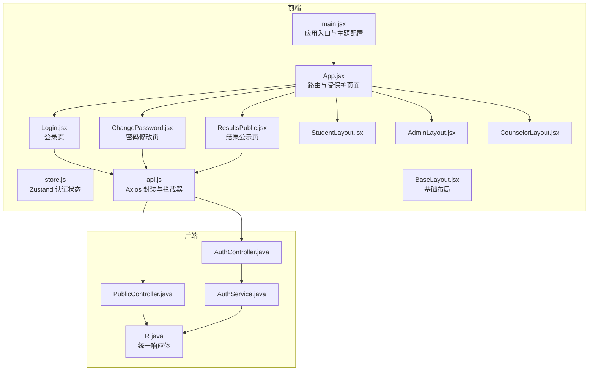
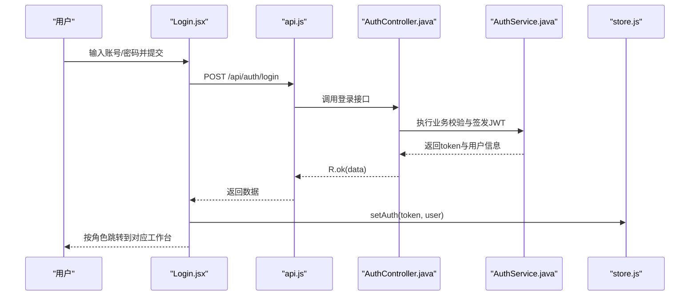
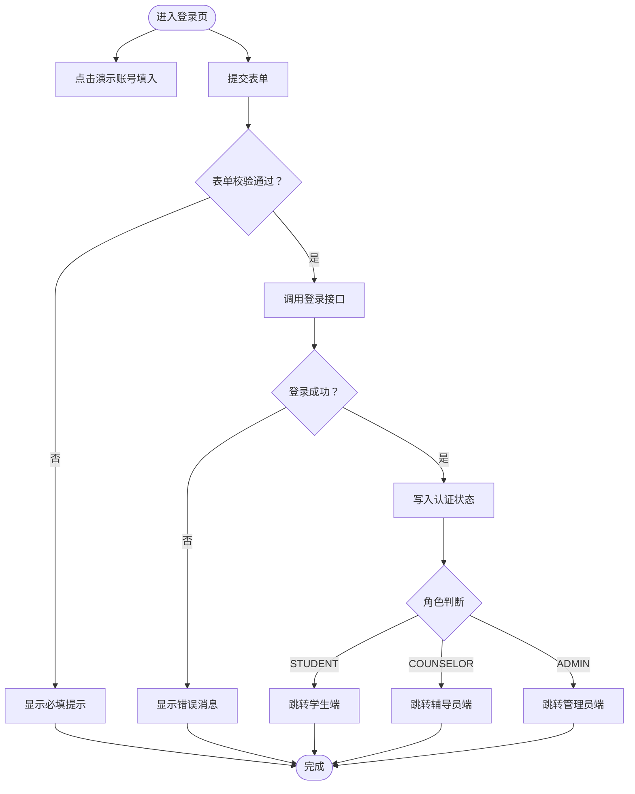
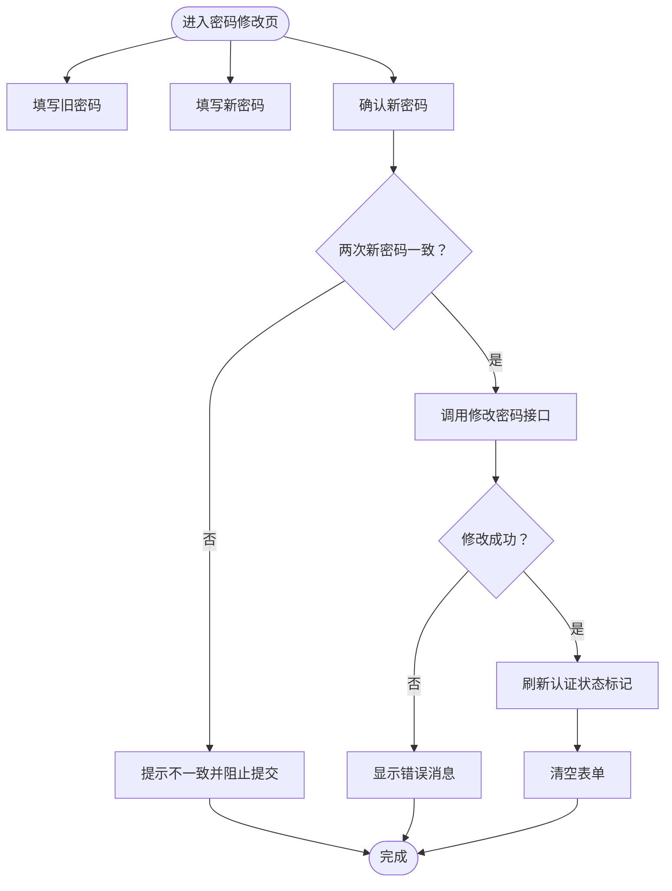
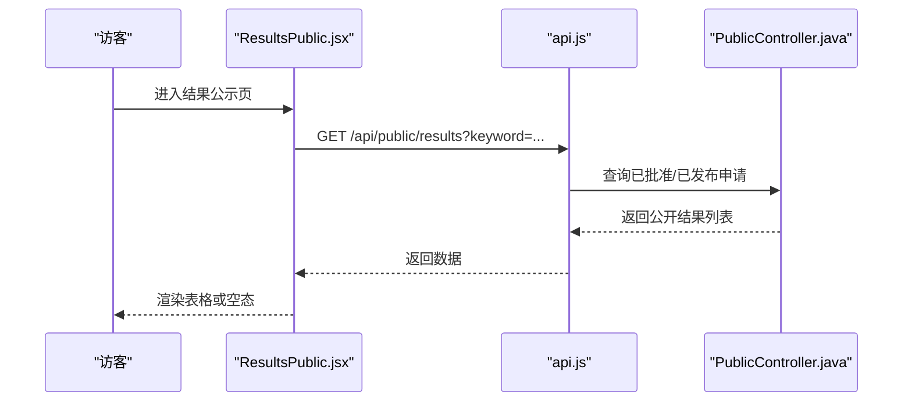
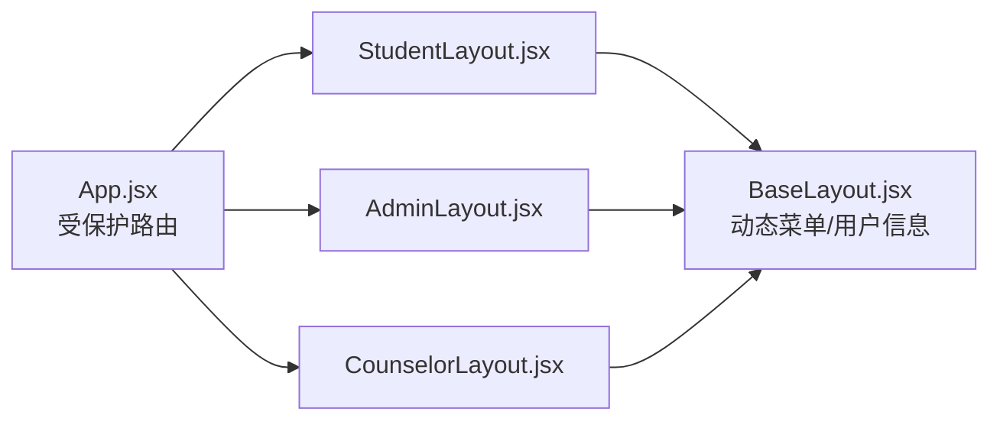
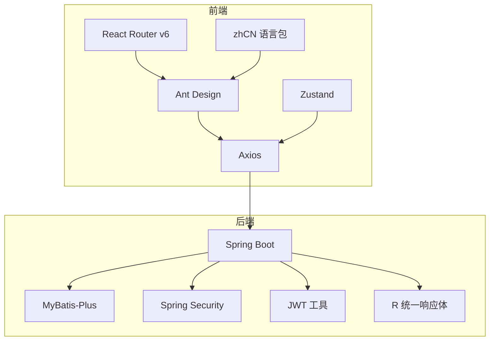

# 共享页面组件

<cite>
**本文引用的文件**
- [frontend/src/pages/Login.jsx](file://frontend/src/pages/Login.jsx)
- [frontend/src/pages/ChangePassword.jsx](file://frontend/src/pages/ChangePassword.jsx)
- [frontend/src/pages/ResultsPublic.jsx](file://frontend/src/pages/ResultsPublic.jsx)
- [frontend/src/App.jsx](file://frontend/src/App.jsx)
- [frontend/src/main.jsx](file://frontend/src/main.jsx)
- [frontend/src/store.js](file://frontend/src/store.js)
- [frontend/src/api.js](file://frontend/src/api.js)
- [frontend/src/layouts/BaseLayout.jsx](file://frontend/src/layouts/BaseLayout.jsx)
- [frontend/src/layouts/StudentLayout.jsx](file://frontend/src/layouts/StudentLayout.jsx)
- [frontend/src/layouts/AdminLayout.jsx](file://frontend/src/layouts/AdminLayout.jsx)
- [frontend/src/layouts/CounselorLayout.jsx](file://frontend/src/layouts/CounselorLayout.jsx)
- [backend/src/main/java/com/zjsu/scholarship/controller/AuthController.java](file://backend/src/main/java/com/zjsu/scholarship/controller/AuthController.java)
- [backend/src/main/java/com/zjsu/scholarship/controller/PublicController.java](file://backend/src/main/java/com/zjsu/scholarship/controller/PublicController.java)
- [backend/src/main/java/com/zjsu/scholarship/service/AuthService.java](file://backend/src/main/java/com/zjsu/scholarship/service/AuthService.java)
- [backend/src/main/java/com/zjsu/scholarship/common/R.java](file://backend/src/main/java/com/zjsu/scholarship/common/R.java)
</cite>

## 目录
1. [简介](#简介)
2. [项目结构](#项目结构)
3. [核心组件](#核心组件)
4. [架构总览](#架构总览)
5. [详细组件分析](#详细组件分析)
6. [依赖分析](#依赖分析)
7. [性能考虑](#性能考虑)
8. [故障排查指南](#故障排查指南)
9. [结论](#结论)
10. [附录](#附录)

## 简介
本文件聚焦于系统中“共享页面组件”的设计与实现，涵盖以下通用页面：
- 登录页面（Login）：统一的身份验证入口，支持多角色跳转与演示账号快速填充。
- 密码修改页面（ChangePassword）：面向所有角色的密码安全更新流程。
- 结果公示页面（ResultsPublic）：面向公众的获奖结果查询与展示。

文档将从架构、数据流、处理逻辑、错误处理、性能与体验优化、权限动态渲染、国际化与本地化等方面进行系统性阐述，并提供可视化图示帮助理解。

## 项目结构
前端采用 React + Ant Design + Zustand + Axios 构建，路由通过 React Router v6 管理；后端基于 Spring Boot，统一响应体封装在 R<T> 中，控制器按角色划分，公共接口由 PublicController 提供。

图表来源
- [frontend/src/main.jsx:1-19](file://frontend/src/main.jsx#L1-L19)
- [frontend/src/App.jsx:1-83](file://frontend/src/App.jsx#L1-L83)
- [frontend/src/pages/Login.jsx:1-76](file://frontend/src/pages/Login.jsx#L1-L76)
- [frontend/src/pages/ChangePassword.jsx:1-35](file://frontend/src/pages/ChangePassword.jsx#L1-L35)
- [frontend/src/pages/ResultsPublic.jsx:1-41](file://frontend/src/pages/ResultsPublic.jsx#L1-L41)
- [frontend/src/store.js:1-15](file://frontend/src/store.js#L1-L15)
- [frontend/src/api.js:1-44](file://frontend/src/api.js#L1-L44)
- [frontend/src/layouts/BaseLayout.jsx:1-66](file://frontend/src/layouts/BaseLayout.jsx#L1-L66)
- [frontend/src/layouts/StudentLayout.jsx:1-17](file://frontend/src/layouts/StudentLayout.jsx#L1-L17)
- [frontend/src/layouts/AdminLayout.jsx:1-16](file://frontend/src/layouts/AdminLayout.jsx#L1-L16)
- [frontend/src/layouts/CounselorLayout.jsx:1-14](file://frontend/src/layouts/CounselorLayout.jsx#L1-L14)
- [backend/src/main/java/com/zjsu/scholarship/controller/AuthController.java:1-44](file://backend/src/main/java/com/zjsu/scholarship/controller/AuthController.java#L1-L44)
- [backend/src/main/java/com/zjsu/scholarship/controller/PublicController.java:1-78](file://backend/src/main/java/com/zjsu/scholarship/controller/PublicController.java#L1-L78)
- [backend/src/main/java/com/zjsu/scholarship/service/AuthService.java:1-77](file://backend/src/main/java/com/zjsu/scholarship/service/AuthService.java#L1-L77)
- [backend/src/main/java/com/zjsu/scholarship/common/R.java:1-39](file://backend/src/main/java/com/zjsu/scholarship/common/R.java#L1-L39)

章节来源
- [frontend/src/main.jsx:1-19](file://frontend/src/main.jsx#L1-L19)
- [frontend/src/App.jsx:1-83](file://frontend/src/App.jsx#L1-L83)

## 核心组件
- 登录页面（Login）
  - 表单字段：账号、密码；支持自动填充与演示账号一键填入。
  - 流程：提交后调用后端登录接口，成功后写入认证状态并按角色跳转至对应工作台。
  - 错误处理：统一通过全局消息提示与 401 自动登出。
- 密码修改页面（ChangePassword）
  - 表单字段：旧密码、新密码、确认新密码；包含最小长度校验。
  - 流程：前后端双重校验，成功后刷新认证状态中的初始密码标记并清空表单。
- 结果公示页面（ResultsPublic）
  - 功能：关键词检索、表格展示、空态提示；返回登录页导航。
  - 数据：后端聚合申请、学生、项目与等级信息，仅返回公开字段。

章节来源
- [frontend/src/pages/Login.jsx:16-34](file://frontend/src/pages/Login.jsx#L16-L34)
- [frontend/src/pages/ChangePassword.jsx:5-16](file://frontend/src/pages/ChangePassword.jsx#L5-L16)
- [frontend/src/pages/ResultsPublic.jsx:6-12](file://frontend/src/pages/ResultsPublic.jsx#L6-L12)

## 架构总览
系统采用“前端路由 + 受保护页面 + 公共接口”的模式：
- 路由层：App.jsx 定义受保护路径与根重定向，按角色渲染对应布局。
- 页面层：Login、ChangePassword、ResultsPublic 作为共享组件独立存在。
- 布局层：BaseLayout 为各角色提供统一头部、侧边菜单与用户下拉菜单。
- 通信层：api.js 统一封装请求头注入与响应拦截，后端以 R<T> 统一返回结构。
- 权限层：AuthController 提供登录与个人信息，PublicController 提供公开结果查询。

图表来源
- [frontend/src/pages/Login.jsx:22-34](file://frontend/src/pages/Login.jsx#L22-L34)
- [frontend/src/api.js:10-16](file://frontend/src/api.js#L10-L16)
- [backend/src/main/java/com/zjsu/scholarship/controller/AuthController.java:21-24](file://backend/src/main/java/com/zjsu/scholarship/controller/AuthController.java#L21-L24)
- [backend/src/main/java/com/zjsu/scholarship/service/AuthService.java:32-55](file://backend/src/main/java/com/zjsu/scholarship/service/AuthService.java#L32-L55)
- [frontend/src/store.js:6-11](file://frontend/src/store.js#L6-L11)

## 详细组件分析

### 登录页面（Login）分析
- 表单与规则
  - 使用 Ant Design 表单组件，必填校验覆盖账号与密码。
  - 支持自动填充属性，提升可用性。
- 演示账号
  - 内置示例账号列表，点击可直接填充表单，便于测试。
- 提交流程
  - 调用后端登录接口，成功后写入 token 与用户信息，随后根据角色跳转。
- 错误处理
  - 全局消息提示；后端 401 时触发自动登出与跳转。

图表来源
- [frontend/src/pages/Login.jsx:8-14](file://frontend/src/pages/Login.jsx#L8-L14)
- [frontend/src/pages/Login.jsx:22-34](file://frontend/src/pages/Login.jsx#L22-L34)
- [frontend/src/store.js:6-11](file://frontend/src/store.js#L6-L11)

章节来源
- [frontend/src/pages/Login.jsx:16-34](file://frontend/src/pages/Login.jsx#L16-L34)
- [frontend/src/api.js:18-31](file://frontend/src/api.js#L18-L31)

### 密码修改页面（ChangePassword）分析
- 表单与规则
  - 旧密码、新密码、确认新密码三段式；新密码最小长度约束。
- 提交流程
  - 前端先比对两次新密码一致性；通过后调用后端变更接口。
- 状态更新
  - 成功后刷新认证状态中的“使用初始密码”标记，提示用户尽快更换密码。
- 错误处理
  - 统一消息提示；后端业务异常会返回错误信息。

图表来源
- [frontend/src/pages/ChangePassword.jsx:10-16](file://frontend/src/pages/ChangePassword.jsx#L10-L16)
- [frontend/src/store.js:6-11](file://frontend/src/store.js#L6-L11)

章节来源
- [frontend/src/pages/ChangePassword.jsx:5-16](file://frontend/src/pages/ChangePassword.jsx#L5-L16)
- [backend/src/main/java/com/zjsu/scholarship/service/AuthService.java:57-75](file://backend/src/main/java/com/zjsu/scholarship/service/AuthService.java#L57-L75)

### 结果公示页面（ResultsPublic）分析
- 搜索与加载
  - 支持关键词搜索，调用后端公开接口获取结果列表。
- 展示逻辑
  - 列表为空时显示空状态；启用横向滚动以适配宽表。
- 字段与脱敏
  - 返回字段包含学号、姓名、学院、专业、项目、等级、金额、分数与排名等；未包含敏感隐私字段。
- 导航
  - 提供返回登录页的快捷按钮。

图表来源
- [frontend/src/pages/ResultsPublic.jsx:11-12](file://frontend/src/pages/ResultsPublic.jsx#L11-L12)
- [backend/src/main/java/com/zjsu/scholarship/controller/PublicController.java:28-59](file://backend/src/main/java/com/zjsu/scholarship/controller/PublicController.java#L28-L59)

章节来源
- [frontend/src/pages/ResultsPublic.jsx:6-25](file://frontend/src/pages/ResultsPublic.jsx#L6-L25)
- [backend/src/main/java/com/zjsu/scholarship/controller/PublicController.java:28-59](file://backend/src/main/java/com/zjsu/scholarship/controller/PublicController.java#L28-L59)

### 跨角色权限与动态内容渲染
- 受保护路由
  - App.jsx 中通过受保护组件对路径进行角色校验，未登录或角色不符则重定向至登录页。
- 布局与菜单
  - BaseLayout 作为基础容器，结合各角色布局（Student/Admin/Counselor）动态生成菜单与标题。
- 用户上下文
  - BaseLayout 展示当前用户信息，并提供“修改密码”与“退出登录”入口，均基于 basePath 动态拼接。

图表来源
- [frontend/src/App.jsx:27-41](file://frontend/src/App.jsx#L27-L41)
- [frontend/src/layouts/BaseLayout.jsx:8-21](file://frontend/src/layouts/BaseLayout.jsx#L8-L21)
- [frontend/src/layouts/StudentLayout.jsx:4-12](file://frontend/src/layouts/StudentLayout.jsx#L4-L12)
- [frontend/src/layouts/AdminLayout.jsx:4-11](file://frontend/src/layouts/AdminLayout.jsx#L4-L11)
- [frontend/src/layouts/CounselorLayout.jsx:4-9](file://frontend/src/layouts/CounselorLayout.jsx#L4-L9)

章节来源
- [frontend/src/App.jsx:27-41](file://frontend/src/App.jsx#L27-L41)
- [frontend/src/layouts/BaseLayout.jsx:8-21](file://frontend/src/layouts/BaseLayout.jsx#L8-L21)

### 表单组件统一验证与错误提示
- 前端验证
  - Login.jsx：账号/密码必填。
  - ChangePassword.jsx：新密码最小长度约束；前端二次确认。
- 后端验证
  - AuthService 对新密码长度、旧密码正确性进行严格校验。
- 统一错误处理
  - api.js 的响应拦截器对非 0 code 的业务错误与 401 进行统一处理，保证错误提示一致性。

章节来源
- [frontend/src/pages/Login.jsx:52-58](file://frontend/src/pages/Login.jsx#L52-L58)
- [frontend/src/pages/ChangePassword.jsx:24-29](file://frontend/src/pages/ChangePassword.jsx#L24-L29)
- [backend/src/main/java/com/zjsu/scholarship/service/AuthService.java:57-75](file://backend/src/main/java/com/zjsu/scholarship/service/AuthService.java#L57-L75)
- [frontend/src/api.js:18-31](file://frontend/src/api.js#L18-L31)

### 页面加载状态管理与用户体验优化
- 加载状态
  - Login.jsx 在提交过程中显示加载态，避免重复提交。
- 国际化与本地化
  - main.jsx 使用 Ant Design 的 zhCN 语言包与主题定制，确保界面语言与视觉风格一致。
- 初始密码提醒
  - BaseLayout 在检测到初始密码时显示横幅提示，引导用户尽快修改密码。

章节来源
- [frontend/src/pages/Login.jsx:18-34](file://frontend/src/pages/Login.jsx#L18-L34)
- [frontend/src/main.jsx:4-18](file://frontend/src/main.jsx#L4-L18)
- [frontend/src/layouts/BaseLayout.jsx:51-58](file://frontend/src/layouts/BaseLayout.jsx#L51-L58)

## 依赖分析
- 前端依赖
  - React 生态：React Router v6（路由）、Ant Design（UI 组件库）、Axios（HTTP 客户端）、Zustand（状态管理）。
  - 本地化：Ant Design zhCN 语言包。
- 后端依赖
  - Spring Boot、MyBatis-Plus、Spring Security（密码编码器）、JWT 工具类。
- 接口契约
  - 统一响应体 R<T>，约定 code=0 表示成功，其余为业务错误；401 触发前端自动登出。

图表来源
- [frontend/src/main.jsx:4-18](file://frontend/src/main.jsx#L4-L18)
- [frontend/src/api.js:1-44](file://frontend/src/api.js#L1-L44)
- [backend/src/main/java/com/zjsu/scholarship/common/R.java:1-39](file://backend/src/main/java/com/zjsu/scholarship/common/R.java#L1-L39)

章节来源
- [frontend/src/main.jsx:4-18](file://frontend/src/main.jsx#L4-L18)
- [frontend/src/api.js:1-44](file://frontend/src/api.js#L1-L44)
- [backend/src/main/java/com/zjsu/scholarship/common/R.java:1-39](file://backend/src/main/java/com/zjsu/scholarship/common/R.java#L1-L39)

## 性能考虑
- 请求超时与并发
  - Axios 设置合理超时时间，避免长时间阻塞；避免在登录页发起不必要的并发请求。
- 列表渲染
  - ResultsPublic 使用小尺寸表格与横向滚动，减少 DOM 节点数量；关键词为空时不发起查询。
- 状态持久化
  - 使用持久化 Zustand 存储 token 与用户信息，减少刷新后的重复登录成本。
- 主题与国际化
  - Ant Design 语言包与主题在入口处一次性配置，避免重复渲染开销。

章节来源
- [frontend/src/api.js:5-8](file://frontend/src/api.js#L5-L8)
- [frontend/src/pages/ResultsPublic.jsx:34-36](file://frontend/src/pages/ResultsPublic.jsx#L34-L36)
- [frontend/src/store.js:4-14](file://frontend/src/store.js#L4-L14)
- [frontend/src/main.jsx:10-18](file://frontend/src/main.jsx#L10-L18)

## 故障排查指南
- 登录失败
  - 检查账号是否存在、是否被冻结；确认密码正确；查看后端业务异常信息。
- 401 未授权
  - 前端拦截器会自动清除本地认证状态并跳转登录页；确认网络请求头 Authorization 是否正确注入。
- 修改密码失败
  - 新密码长度不足或旧密码错误会导致业务异常；确认两次新密码一致且满足长度要求。
- 公示数据为空
  - 确认关键字是否匹配；检查后端筛选逻辑与数据状态（仅 APPROVED/PUBLISHED）。

章节来源
- [backend/src/main/java/com/zjsu/scholarship/service/AuthService.java:32-55](file://backend/src/main/java/com/zjsu/scholarship/service/AuthService.java#L32-L55)
- [backend/src/main/java/com/zjsu/scholarship/service/AuthService.java:57-75](file://backend/src/main/java/com/zjsu/scholarship/service/AuthService.java#L57-L75)
- [frontend/src/api.js:18-31](file://frontend/src/api.js#L18-L31)
- [backend/src/main/java/com/zjsu/scholarship/controller/PublicController.java:38-44](file://backend/src/main/java/com/zjsu/scholarship/controller/PublicController.java#L38-L44)

## 结论
该共享页面组件体系以 Login、ChangePassword、ResultsPublic 为核心，配合受保护路由、统一状态管理与拦截器，实现了跨角色的一致体验与安全控制。通过明确的表单规则、后端严格校验与统一响应体，系统在易用性与安全性之间取得良好平衡。后续可在国际化扩展、表单复杂规则与缓存策略方面进一步优化。

## 附录
- 关键流程回顾
  - 登录：表单校验 → 调用后端 → 写入状态 → 角色跳转。
  - 密码修改：前端二次确认与长度校验 → 后端旧/新密码校验 → 更新成功 → 刷新状态。
  - 结果查询：关键词过滤 → 聚合查询 → 公开字段返回 → 表格渲染。
- 最佳实践
  - 表单规则尽量前置校验，减少无效请求。
  - 对敏感操作（如密码修改）增加二次确认与强校验。
  - 公开数据遵循最小化原则，避免泄露隐私字段。