# 学生端页面

<cite>
**本文引用的文件**
- [Home.jsx](file://frontend/src/pages/student/Home.jsx)
- [Applications.jsx](file://frontend/src/pages/student/Applications.jsx)
- [Scholarships.jsx](file://frontend/src/pages/student/Scholarships.jsx)
- [AbilityEvaluation.jsx](file://frontend/src/pages/student/AbilityEvaluation.jsx)
- [BasicEvaluation.jsx](file://frontend/src/pages/student/BasicEvaluation.jsx)
- [Appeal.jsx](file://frontend/src/pages/student/Appeal.jsx)
- [GraduateExam.jsx](file://frontend/src/pages/student/GraduateExam.jsx)
- [ResultsPublic.jsx](file://frontend/src/pages/ResultsPublic.jsx)
- [StudentLayout.jsx](file://frontend/src/layouts/StudentLayout.jsx)
- [App.jsx](file://frontend/src/App.jsx)
- [api.js](file://frontend/src/api.js)
- [store.js](file://frontend/src/store.js)
- [main.jsx](file://frontend/src/main.jsx)
</cite>

## 目录
1. [简介](#简介)
2. [项目结构](#项目结构)
3. [核心组件](#核心组件)
4. [架构概览](#架构概览)
5. [详细组件分析](#详细组件分析)
6. [依赖分析](#依赖分析)
7. [性能考虑](#性能考虑)
8. [故障排查指南](#故障排查指南)
9. [结论](#结论)
10. [附录](#附录)

## 简介
本文件面向学生端页面组件，系统性梳理奖学金管理系统中学生用户的各项功能页面实现，包括首页信息展示与导航、申请流程与表单处理、奖学金查询与筛选、能力评价与基础评价的评分计算与展示、申诉的状态跟踪、研究生考试专项功能、以及结果公示的公开信息展示与数据安全控制。文档同时覆盖表单验证、数据绑定、异步加载策略，并提供页面间的数据传递与状态同步方案。

## 项目结构
学生端页面位于前端工程的 pages/student 目录下，配合布局组件 StudentLayout 实现统一导航菜单与路由嵌套。全局 API 封装与认证状态管理贯穿所有页面，确保请求拦截、鉴权与错误处理的一致性。

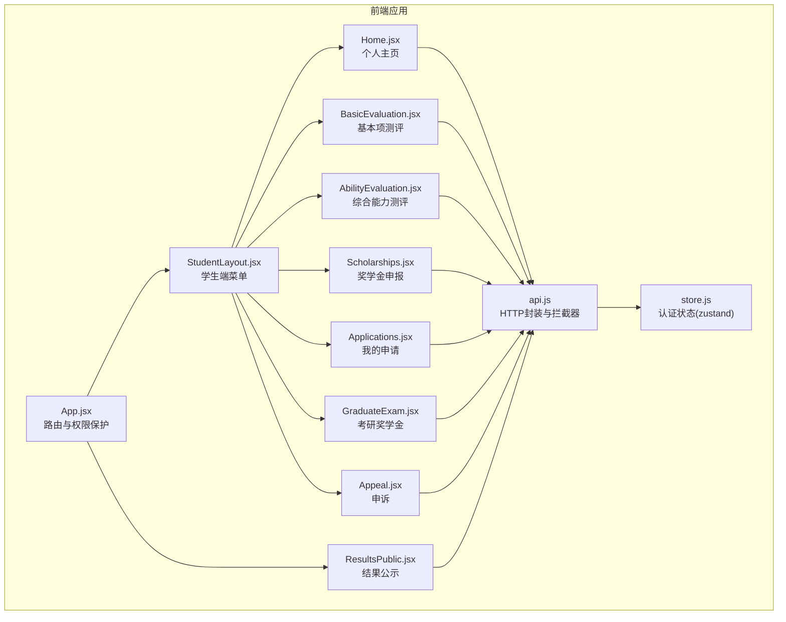

**图表来源**
- [App.jsx:43-82](file://frontend/src/App.jsx#L43-L82)
- [StudentLayout.jsx:14-16](file://frontend/src/layouts/StudentLayout.jsx#L14-L16)
- [Home.jsx:6-97](file://frontend/src/pages/student/Home.jsx#L6-L97)
- [BasicEvaluation.jsx:21-214](file://frontend/src/pages/student/BasicEvaluation.jsx#L21-L214)
- [AbilityEvaluation.jsx:20-152](file://frontend/src/pages/student/AbilityEvaluation.jsx#L20-L152)
- [Scholarships.jsx:12-80](file://frontend/src/pages/student/Scholarships.jsx#L12-L80)
- [Applications.jsx:11-41](file://frontend/src/pages/student/Applications.jsx#L11-L41)
- [GraduateExam.jsx:6-94](file://frontend/src/pages/student/GraduateExam.jsx#L6-L94)
- [Appeal.jsx:6-95](file://frontend/src/pages/student/Appeal.jsx#L6-L95)
- [ResultsPublic.jsx:6-40](file://frontend/src/pages/ResultsPublic.jsx#L6-L40)
- [api.js:1-44](file://frontend/src/api.js#L1-L44)
- [store.js:1-15](file://frontend/src/store.js#L1-L15)

**章节来源**
- [App.jsx:43-82](file://frontend/src/App.jsx#L43-L82)
- [StudentLayout.jsx:4-12](file://frontend/src/layouts/StudentLayout.jsx#L4-L12)
- [api.js:5-16](file://frontend/src/api.js#L5-L16)
- [store.js:4-14](file://frontend/src/store.js#L4-L14)

## 核心组件
- 首页 Home：展示个人信息、基本项与综合能力测评得分、排名与状态，并提供跳转入口。
- 基础评价 BasicEvaluation：品德评议、品德记实、课程成绩展示与评分计算逻辑。
- 能力评价 AbilityEvaluation：研究创新、专业技能、组织工作、体育美育、劳动实践等维度的评分与附件上传。
- 奖学金查询 Scholarships：可申报项目列表、系统推荐等级、申请按钮与条件校验。
- 我的申请 Applications：申请列表、状态标签、撤回操作。
- 申诉 Appeal：关联申请选择、申诉级别、理由输入与状态跟踪。
- 研究生考试 GraduateExam：考研/申研类型、学校专业、复试资格与录取状态的判定。
- 结果公示 ResultsPublic：关键词搜索、获奖名单展示与返回登录。

**章节来源**
- [Home.jsx:6-97](file://frontend/src/pages/student/Home.jsx#L6-L97)
- [BasicEvaluation.jsx:21-214](file://frontend/src/pages/student/BasicEvaluation.jsx#L21-L214)
- [AbilityEvaluation.jsx:20-152](file://frontend/src/pages/student/AbilityEvaluation.jsx#L20-L152)
- [Scholarships.jsx:12-80](file://frontend/src/pages/student/Scholarships.jsx#L12-L80)
- [Applications.jsx:11-41](file://frontend/src/pages/student/Applications.jsx#L11-L41)
- [Appeal.jsx:6-95](file://frontend/src/pages/student/Appeal.jsx#L6-L95)
- [GraduateExam.jsx:6-94](file://frontend/src/pages/student/GraduateExam.jsx#L6-L94)
- [ResultsPublic.jsx:6-40](file://frontend/src/pages/ResultsPublic.jsx#L6-L40)

## 架构概览
学生端采用“路由嵌套 + 布局菜单 + API 封装 + 认证状态”的架构模式。路由在 App.jsx 中定义，受 Protected 包裹以进行角色校验；StudentLayout 提供统一导航；api.js 统一封装请求与响应拦截，自动注入 JWT；store.js 使用 zustand 持久化存储认证信息。

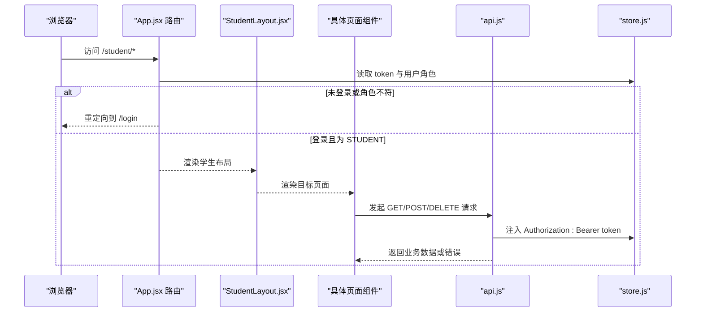

**图表来源**
- [App.jsx:27-41](file://frontend/src/App.jsx#L27-L41)
- [StudentLayout.jsx:14-16](file://frontend/src/layouts/StudentLayout.jsx#L14-L16)
- [api.js:10-16](file://frontend/src/api.js#L10-L16)
- [store.js:4-14](file://frontend/src/store.js#L4-L14)

## 详细组件分析

### 首页（Home）
- 数据加载：进入页面即拉取当前学生与测评快照数据，使用 Spin 展示加载态。
- 信息展示：
  - 个人信息卡片：学号、姓名、学院、专业、年级、班级、CET 成绩、体育、劳动教育状态。
  - 基本项测评卡片：品德评议分、品德记实分、品德总分、加权平均分、基本项总分与排名。
  - 综合能力测评卡片：各维度得分与权重、综合能力总分与排名、状态标签、查看可申报奖学金按钮。
- 导航与交互：提供“填报基本项”“填报综合能力”“查看可申报奖学金”等跳转入口，公式提示辅助理解评分构成。

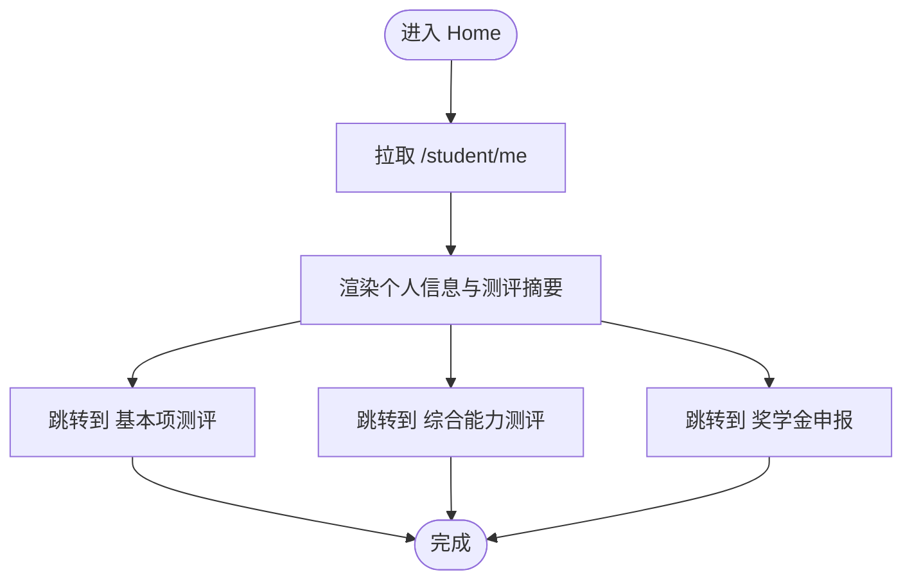

**图表来源**
- [Home.jsx:11-15](file://frontend/src/pages/student/Home.jsx#L11-L15)
- [Home.jsx:22-96](file://frontend/src/pages/student/Home.jsx#L22-L96)

**章节来源**
- [Home.jsx:6-97](file://frontend/src/pages/student/Home.jsx#L6-L97)

### 基础评价（BasicEvaluation）
- 数据结构：从 /student/evaluation/items 获取，包含品德评议、品德记实、课程成绩与综合评分。
- 表单与表格：
  - 品德评议：多维打分（政治素养、法治观念、心理素质、诚实守信、团队协作、社会责任），合计显示。
  - 品德记实：支持志愿服务、处分扣分、荣誉、集体荣誉等类型，按规则动态计算加分/扣分，支持附件上传。
  - 课程成绩：仅展示，不可修改。
- 评分计算：
  - 品德总分 = 评议分 × 70% + 记实分 × 30%。
  - 基本项总分 = 品德总分 × 30% + 加权平均分 × 70%。
- 提交与状态：支持提交测评，提交后状态更新为“已提交”。

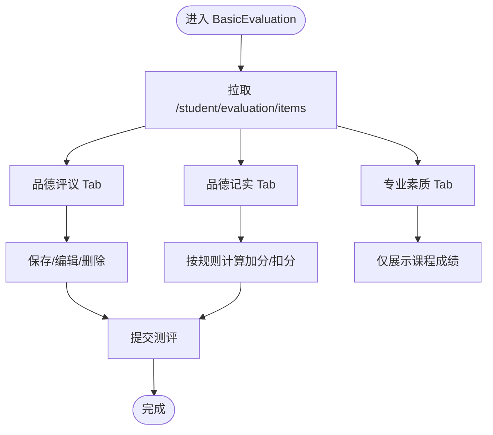

**图表来源**
- [BasicEvaluation.jsx:27-28](file://frontend/src/pages/student/BasicEvaluation.jsx#L27-L28)
- [BasicEvaluation.jsx:90-204](file://frontend/src/pages/student/BasicEvaluation.jsx#L90-L204)
- [BasicEvaluation.jsx:134-172](file://frontend/src/pages/student/BasicEvaluation.jsx#L134-L172)

**章节来源**
- [BasicEvaluation.jsx:21-214](file://frontend/src/pages/student/BasicEvaluation.jsx#L21-L214)

### 能力评价（AbilityEvaluation）
- 数据结构：从 /student/evaluation/items 获取，包含研究创新、专业技能、组织工作、体育美育、劳动实践五类条目与综合评分。
- 表单与表格：
  - 研究创新：竞赛、论文、专利、科研项目等类型，按级别/奖项/作者排序等规则计算得分。
  - 专业技能：英语四六级、计算机等级、资格证书、考研等类型，按分数/等级计算加分。
  - 组织工作：岗位分、考核等级、任期等，按规则计算得分。
  - 体育美育/劳动实践：按级别/奖项/类型计算得分。
- 附件上传：统一上传接口，支持图片/PDF，限制单文件。
- 提交与状态：支持提交测评，提交后状态更新为“已提交”。

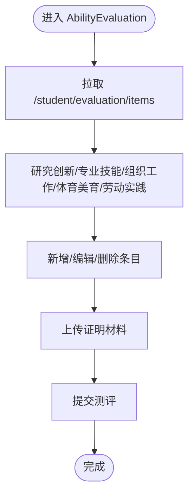

**图表来源**
- [AbilityEvaluation.jsx:26-27](file://frontend/src/pages/student/AbilityEvaluation.jsx#L26-L27)
- [AbilityEvaluation.jsx:102-127](file://frontend/src/pages/student/AbilityEvaluation.jsx#L102-L127)
- [AbilityEvaluation.jsx:29-35](file://frontend/src/pages/student/AbilityEvaluation.jsx#L29-L35)

**章节来源**
- [AbilityEvaluation.jsx:20-152](file://frontend/src/pages/student/AbilityEvaluation.jsx#L20-L152)

### 奖学金查询（Scholarships）
- 数据加载：拉取 /student/scholarships/eligible 获取可申报项目列表。
- 展示逻辑：
  - 项目卡片：名称、类型标签、状态、排名、最低均分/体育要求、系统推荐等级与金额、等级与比例。
  - 条件校验：若不符合条件，禁用“立即申报”，弹出提示。
- 申请流程：
  - 点击“立即申报”弹出确认框，展示系统推荐等级与金额说明。
  - 提交后刷新列表，标记“已申报”。

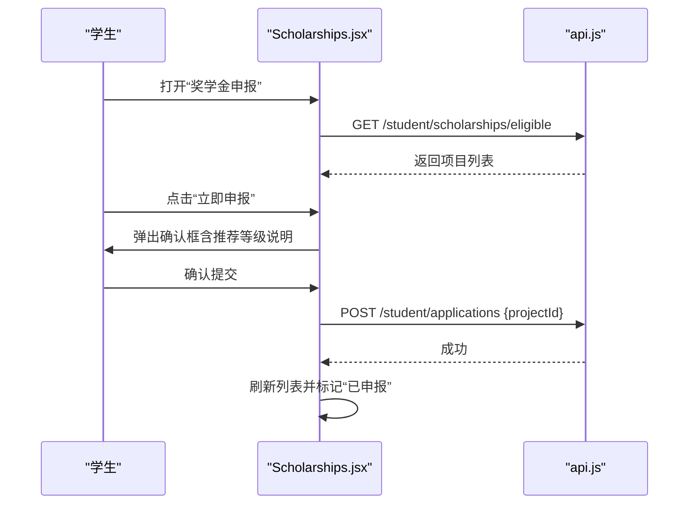

**图表来源**
- [Scholarships.jsx:14-15](file://frontend/src/pages/student/Scholarships.jsx#L14-L15)
- [Scholarships.jsx:17-33](file://frontend/src/pages/student/Scholarships.jsx#L17-L33)
- [Scholarships.jsx:28-30](file://frontend/src/pages/student/Scholarships.jsx#L28-L30)

**章节来源**
- [Scholarships.jsx:12-80](file://frontend/src/pages/student/Scholarships.jsx#L12-L80)

### 我的申请（Applications）
- 数据加载：拉取 /student/applications 获取申请列表。
- 表格列：项目名称、类型、基本分、能力分、能力排名、系统推荐、最终授予、状态、退回原因。
- 状态标签：待审核、审核中、已通过、已退回、已撤回、已公示。
- 撤回操作：仅当状态为“已提交”时显示“撤回”，确认后调用 DELETE 并刷新。

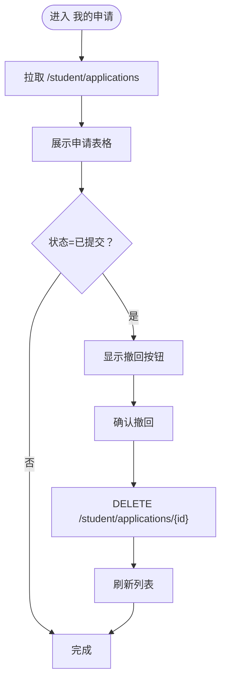

**图表来源**
- [Applications.jsx:13-14](file://frontend/src/pages/student/Applications.jsx#L13-L14)
- [Applications.jsx:21-35](file://frontend/src/pages/student/Applications.jsx#L21-L35)
- [Applications.jsx:16-19](file://frontend/src/pages/student/Applications.jsx#L16-L19)

**章节来源**
- [Applications.jsx:11-41](file://frontend/src/pages/student/Applications.jsx#L11-L41)

### 申诉（Appeal）
- 数据加载：并发拉取 /student/appeals 与 /student/applications，保证申诉记录与可关联申请的完整性。
- 表单字段：关联申请、申诉级别（学院/学工部）、申诉理由。
- 状态跟踪：PENDING/PROCESSING/RESOLVED/REJECTED，展示回复与提交时间。
- 提交流程：提交后重置表单并刷新数据。

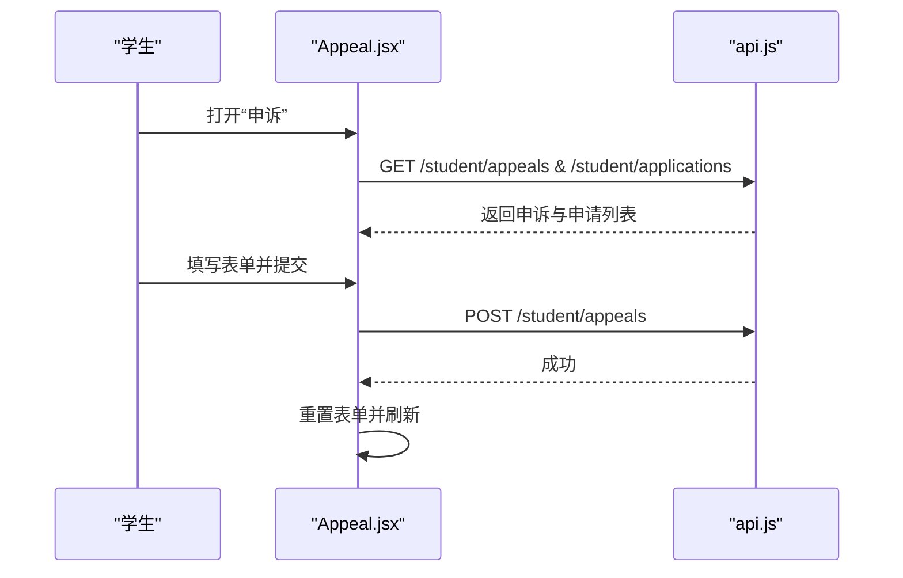

**图表来源**
- [Appeal.jsx:13-25](file://frontend/src/pages/student/Appeal.jsx#L13-L25)
- [Appeal.jsx:27-35](file://frontend/src/pages/student/Appeal.jsx#L27-L35)
- [Appeal.jsx:59-84](file://frontend/src/pages/student/Appeal.jsx#L59-L84)

**章节来源**
- [Appeal.jsx:6-95](file://frontend/src/pages/student/Appeal.jsx#L6-L95)

### 研究生考试（GraduateExam）
- 数据加载：拉取 /student/graduate-exam 获取已有申请与学生信息。
- 表单字段：考试类型（国内/国外）、报考学校、专业、是否获得复试资格、是否已被录取。
- 状态展示：若已存在申请，展示考试类型、学校、专业、资格/录取状态、系统判定等级与审核状态。
- 提交流程：提交后刷新并提示成功。

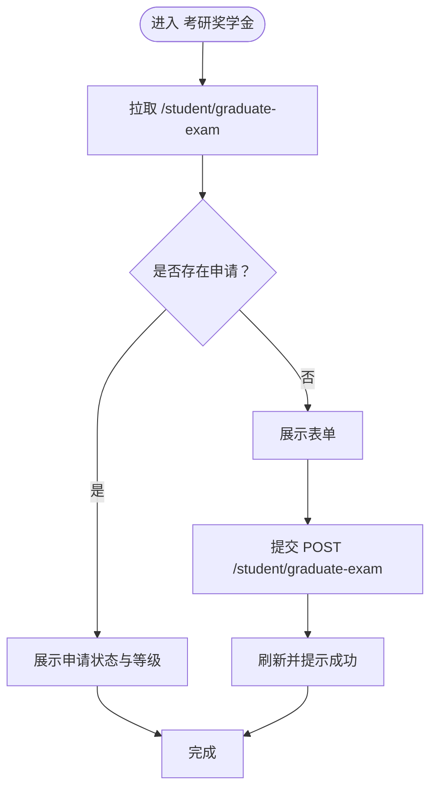

**图表来源**
- [GraduateExam.jsx:13-22](file://frontend/src/pages/student/GraduateExam.jsx#L13-L22)
- [GraduateExam.jsx:24-31](file://frontend/src/pages/student/GraduateExam.jsx#L24-L31)
- [GraduateExam.jsx:36-54](file://frontend/src/pages/student/GraduateExam.jsx#L36-L54)

**章节来源**
- [GraduateExam.jsx:6-94](file://frontend/src/pages/student/GraduateExam.jsx#L6-L94)

### 结果公示（ResultsPublic）
- 数据加载：GET /public/results，支持关键词搜索（学号/姓名/奖学金名称）。
- 展示逻辑：表格列包含学号、姓名、学院、专业、奖学金、等级、金额、基本分、能力分、能力排名。
- 安全控制：该接口为公开端点，仅展示获奖结果，不涉及敏感操作。

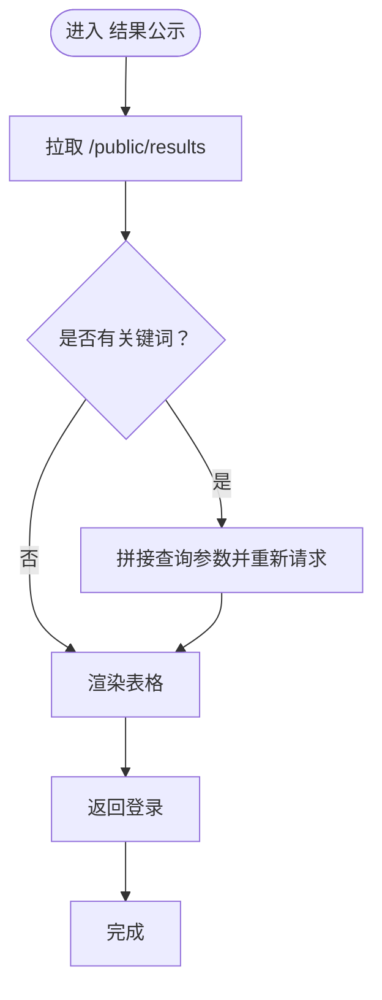

**图表来源**
- [ResultsPublic.jsx:11-12](file://frontend/src/pages/ResultsPublic.jsx#L11-L12)
- [ResultsPublic.jsx:14-25](file://frontend/src/pages/ResultsPublic.jsx#L14-L25)
- [ResultsPublic.jsx:29-39](file://frontend/src/pages/ResultsPublic.jsx#L29-L39)

**章节来源**
- [ResultsPublic.jsx:6-40](file://frontend/src/pages/ResultsPublic.jsx#L6-L40)

## 依赖分析
- 路由与权限：App.jsx 定义路由与 Protected 保护，根据角色重定向至对应布局。
- 布局与菜单：StudentLayout.jsx 提供统一菜单项，与路由路径一一对应。
- API 封装：api.js 统一设置 baseURL、超时、请求头注入 Authorization、响应拦截与错误提示。
- 认证状态：store.js 使用 zustand/persist 存储 token 与用户信息，拦截器在 401 时触发登出与跳转。

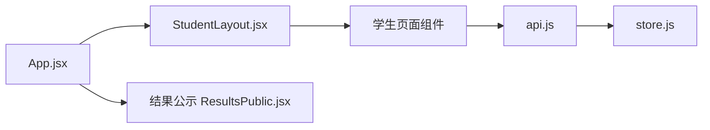

**图表来源**
- [App.jsx:43-82](file://frontend/src/App.jsx#L43-L82)
- [StudentLayout.jsx:14-16](file://frontend/src/layouts/StudentLayout.jsx#L14-L16)
- [api.js:5-16](file://frontend/src/api.js#L5-L16)
- [store.js:4-14](file://frontend/src/store.js#L4-L14)

**章节来源**
- [App.jsx:27-41](file://frontend/src/App.jsx#L27-L41)
- [api.js:18-41](file://frontend/src/api.js#L18-L41)

## 性能考虑
- 异步加载：各页面均采用 useEffect 在挂载时发起请求，避免阻塞首屏渲染。
- 并发请求：申诉页面使用 Promise.all 并行拉取申诉与申请列表，减少等待时间。
- 表格滚动：能力评价与基础评价表格开启横向滚动，提升大数据量下的可读性。
- 文件上传：上传组件限制单文件，避免大体积附件导致请求超时。
- 缓存与持久化：认证状态持久化，减少重复登录成本。

[本节为通用建议，无需特定文件引用]

## 故障排查指南
- 登录过期：响应拦截器检测 401 自动登出并跳转登录页，检查 token 是否正确注入与后端签发策略。
- 请求失败：统一错误提示与日志输出，检查网络状态与接口返回 message。
- 表单校验：必填字段与规则（如 0.5 步长、范围限制）需满足，避免提交失败。
- 上传失败：确认文件类型与大小限制，检查上传接口可用性。
- 页面空白：确认路由与菜单项匹配，检查组件是否正确导出与引入。

**章节来源**
- [api.js:18-41](file://frontend/src/api.js#L18-L41)
- [BasicEvaluation.jsx:326-347](file://frontend/src/pages/student/BasicEvaluation.jsx#L326-L347)
- [AbilityEvaluation.jsx:155-165](file://frontend/src/pages/student/AbilityEvaluation.jsx#L155-L165)

## 结论
学生端页面围绕“信息展示—表单填报—申请提交—状态跟踪—结果公示”的完整闭环构建，结合统一的路由、布局与 API 封装，实现了良好的用户体验与可维护性。基础评价与能力评价分别承担品德与能力两大评分体系，既保证了评分的可解释性，也提供了灵活的条目管理与附件支撑。申诉与考研专项功能进一步完善了系统的公平性与多样性。

## 附录
- 页面间数据传递与状态同步：
  - 首页作为入口，通过导航跳转至各子页面，子页面在提交后刷新列表或状态，保持首页评分与状态同步。
  - 申诉页面通过关联申请 ID 与申请列表联动，确保申诉有据可依。
  - 结果公示为只读公开页面，不参与状态变更。
- 表单验证与数据绑定：
  - 使用 Ant Design Form 的 rules 与 initialValue，结合 watch 控制联动字段。
  - 上传组件统一使用自定义请求函数，成功回调回填 URL。
- 异步加载策略：
  - 单请求页面使用 useEffect 单次加载；多源数据页面使用 Promise.all 并行加载。

[本节为概念性总结，无需特定文件引用]