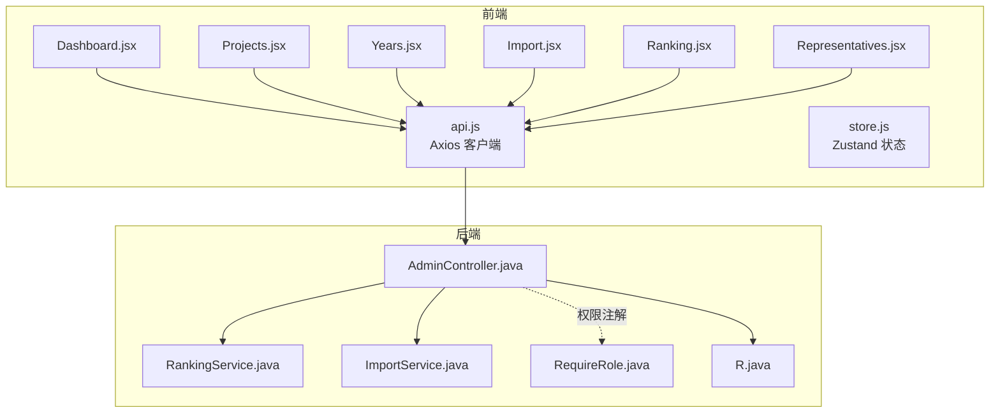
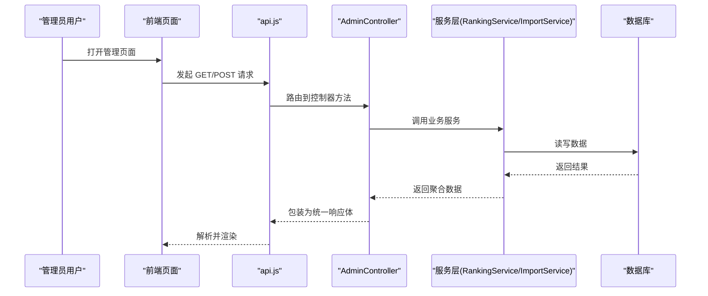
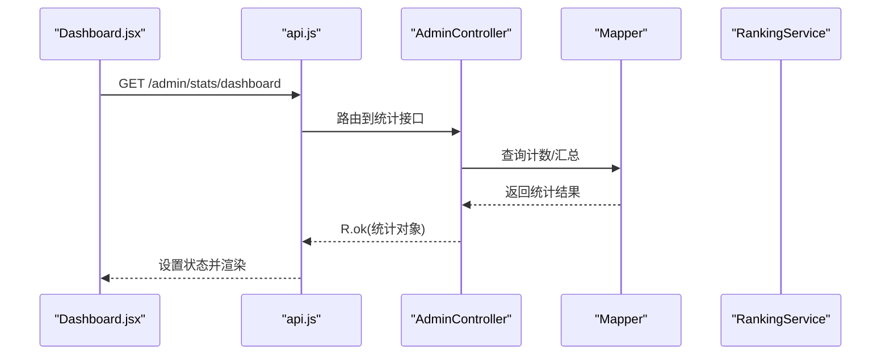
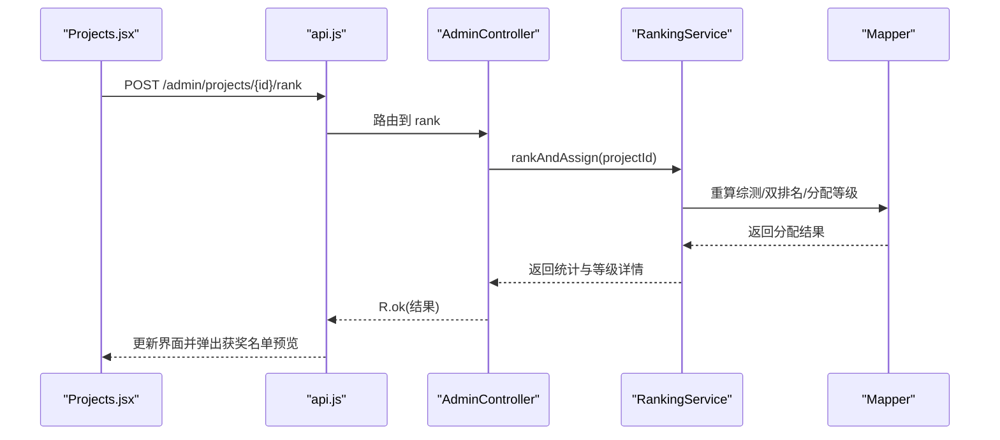
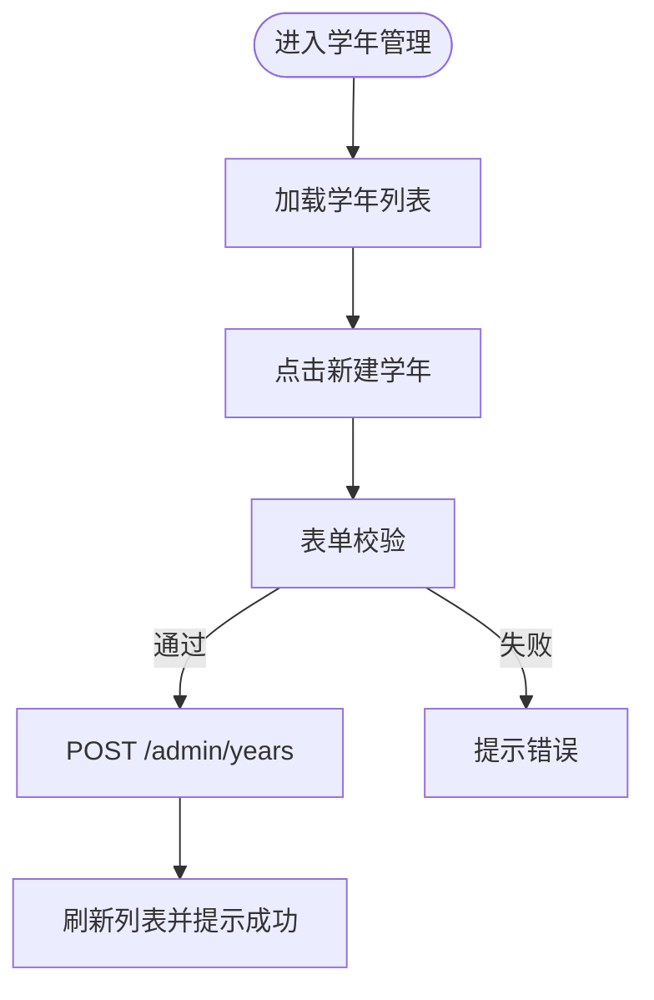
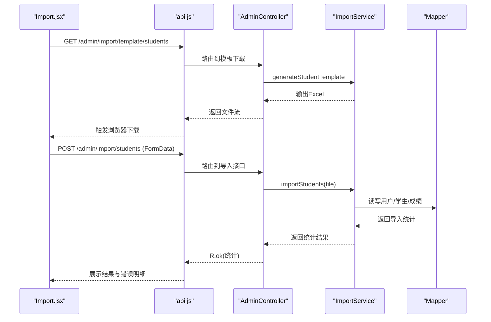
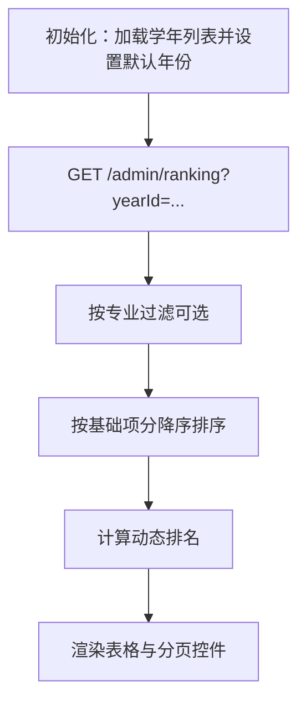
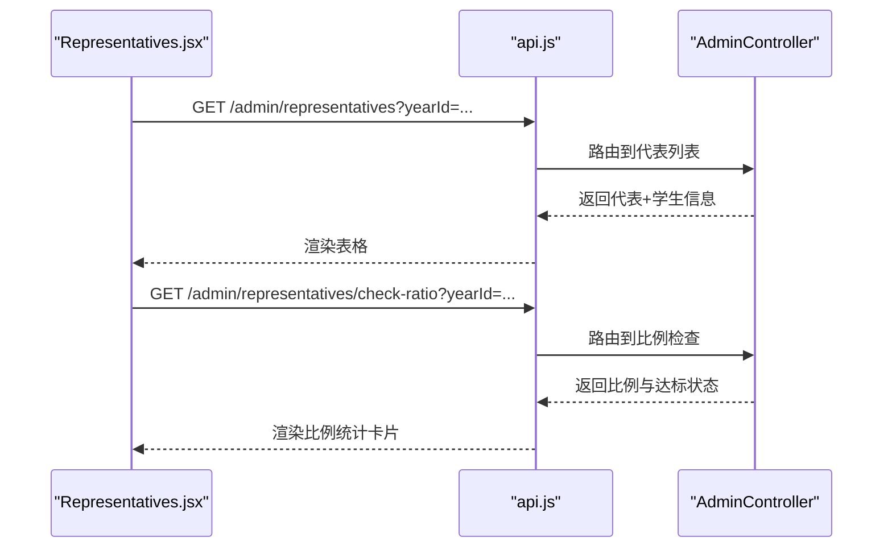
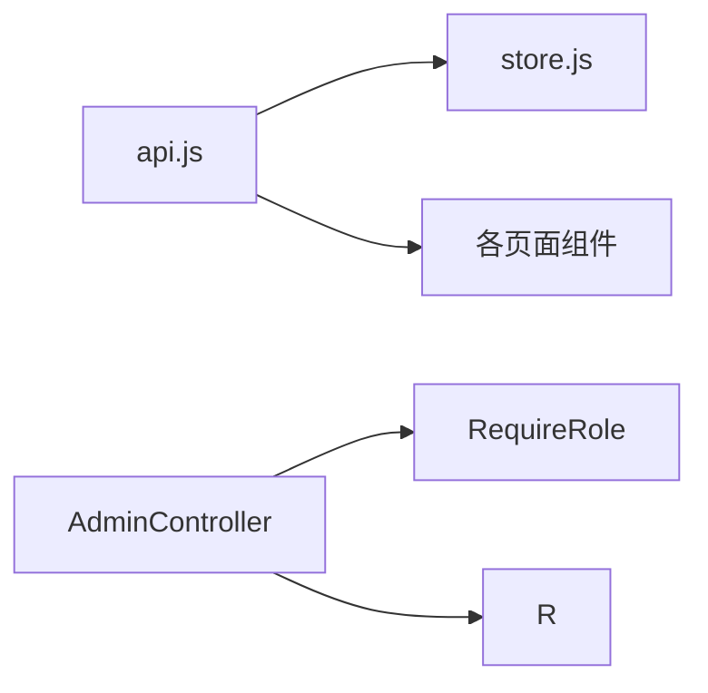

# 管理员页面

<cite>
**本文引用的文件**
- [Dashboard.jsx](file://frontend/src/pages/admin/Dashboard.jsx)
- [Projects.jsx](file://frontend/src/pages/admin/Projects.jsx)
- [Years.jsx](file://frontend/src/pages/admin/Years.jsx)
- [Import.jsx](file://frontend/src/pages/admin/Import.jsx)
- [Ranking.jsx](file://frontend/src/pages/admin/Ranking.jsx)
- [Representatives.jsx](file://frontend/src/pages/admin/Representatives.jsx)
- [AdminController.java](file://backend/src/main/java/com/zjsu/scholarship/controller/AdminController.java)
- [RankingService.java](file://backend/src/main/java/com/zjsu/scholarship/service/RankingService.java)
- [ImportService.java](file://backend/src/main/java/com/zjsu/scholarship/service/ImportService.java)
- [RequireRole.java](file://backend/src/main/java/com/zjsu/scholarship/security/RequireRole.java)
- [R.java](file://backend/src/main/java/com/zjsu/scholarship/common/R.java)
- [api.js](file://frontend/src/api.js)
- [store.js](file://frontend/src/store.js)
</cite>

## 目录
1. [简介](#简介)
2. [项目结构](#项目结构)
3. [核心组件](#核心组件)
4. [架构总览](#架构总览)
5. [详细组件分析](#详细组件分析)
6. [依赖分析](#依赖分析)
7. [性能考虑](#性能考虑)
8. [故障排查指南](#故障排查指南)
9. [结论](#结论)
10. [附录](#附录)

## 简介
本文件面向管理员角色，系统化梳理后台管理页面的功能实现与技术细节，覆盖仪表盘、奖学金项目管理、学年管理、数据导入、排名统计、学生代表管理等模块。文档同时阐述权限控制、数据验证、日志与审计建议、以及大数据量场景下的性能优化策略。

## 项目结构
前端采用 React + Ant Design，后端基于 Spring Boot + MyBatis-Plus，前后端通过统一响应体进行交互。管理员页面位于前端 pages/admin 目录，后端控制器位于 AdminController，核心业务逻辑由 RankingService、ImportService 等服务承担。

**图示来源**
- [api.js:1-44](file://frontend/src/api.js#L1-L44)
- [store.js:1-15](file://frontend/src/store.js#L1-L15)
- [Dashboard.jsx:1-35](file://frontend/src/pages/admin/Dashboard.jsx#L1-L35)
- [Projects.jsx:1-416](file://frontend/src/pages/admin/Projects.jsx#L1-L416)
- [Years.jsx:1-53](file://frontend/src/pages/admin/Years.jsx#L1-L53)
- [Import.jsx:1-203](file://frontend/src/pages/admin/Import.jsx#L1-L203)
- [Ranking.jsx:1-105](file://frontend/src/pages/admin/Ranking.jsx#L1-L105)
- [Representatives.jsx:1-148](file://frontend/src/pages/admin/Representatives.jsx#L1-L148)
- [AdminController.java:1-528](file://backend/src/main/java/com/zjsu/scholarship/controller/AdminController.java#L1-L528)
- [RankingService.java:1-437](file://backend/src/main/java/com/zjsu/scholarship/service/RankingService.java#L1-L437)
- [ImportService.java:1-195](file://backend/src/main/java/com/zjsu/scholarship/service/ImportService.java#L1-L195)
- [RequireRole.java:1-13](file://backend/src/main/java/com/zjsu/scholarship/security/RequireRole.java#L1-L13)
- [R.java:1-39](file://backend/src/main/java/com/zjsu/scholarship/common/R.java#L1-L39)

**章节来源**
- [Dashboard.jsx:1-35](file://frontend/src/pages/admin/Dashboard.jsx#L1-L35)
- [Projects.jsx:1-416](file://frontend/src/pages/admin/Projects.jsx#L1-L416)
- [Years.jsx:1-53](file://frontend/src/pages/admin/Years.jsx#L1-L53)
- [Import.jsx:1-203](file://frontend/src/pages/admin/Import.jsx#L1-L203)
- [Ranking.jsx:1-105](file://frontend/src/pages/admin/Ranking.jsx#L1-L105)
- [Representatives.jsx:1-148](file://frontend/src/pages/admin/Representatives.jsx#L1-L148)
- [AdminController.java:1-528](file://backend/src/main/java/com/zjsu/scholarship/controller/AdminController.java#L1-L528)

## 核心组件
- 仪表盘页面：展示学生总数、项目数、申请总数、待审数量、已通过/公示数量、综测记录数等关键指标。
- 奖学金项目页面：支持项目创建/编辑、等级与比例配置、申请条件设置、一键执行排名与等级分配、获奖名单预览、发布公示。
- 年度管理页面：创建/维护学年，设置起止日期与状态。
- 数据导入页面：下载模板、批量导入学生名单与课程成绩，展示导入结果与错误明细。
- 排名统计页面：按学年筛选，支持专业过滤，动态计算排名并展示基础项分、加权均分、能力分等。
- 学生代表管理页面：按学年筛选代表，检查代表比例是否达到≥30%，支持新增与移除代表。

**章节来源**
- [Dashboard.jsx:1-35](file://frontend/src/pages/admin/Dashboard.jsx#L1-L35)
- [Projects.jsx:1-416](file://frontend/src/pages/admin/Projects.jsx#L1-L416)
- [Years.jsx:1-53](file://frontend/src/pages/admin/Years.jsx#L1-L53)
- [Import.jsx:1-203](file://frontend/src/pages/admin/Import.jsx#L1-L203)
- [Ranking.jsx:1-105](file://frontend/src/pages/admin/Ranking.jsx#L1-L105)
- [Representatives.jsx:1-148](file://frontend/src/pages/admin/Representatives.jsx#L1-L148)

## 架构总览
管理员页面通过统一的 Axios 客户端发起请求，后端控制器负责鉴权与路由转发，服务层承载业务逻辑，通用响应体封装返回数据。权限控制通过自定义注解实现。

**图示来源**
- [api.js:1-44](file://frontend/src/api.js#L1-L44)
- [AdminController.java:1-528](file://backend/src/main/java/com/zjsu/scholarship/controller/AdminController.java#L1-L528)
- [RankingService.java:1-437](file://backend/src/main/java/com/zjsu/scholarship/service/RankingService.java#L1-L437)
- [ImportService.java:1-195](file://backend/src/main/java/com/zjsu/scholarship/service/ImportService.java#L1-L195)
- [R.java:1-39](file://backend/src/main/java/com/zjsu/scholarship/common/R.java#L1-L39)

## 详细组件分析

### 仪表盘页面（Dashboard）
- 功能要点
  - 首次加载时调用后端仪表盘统计接口，聚合学生、项目、申请、综测等指标。
  - 使用 Ant Design 的 Statistic 展示数值，配合图标与颜色区分状态。
- 数据流
  - 前端组件在挂载时异步获取统计数据，若无数据则显示加载指示器。
- 可视化
  - 四个卡片统计指标，两行布局，便于快速掌握全局状态。

**图示来源**
- [Dashboard.jsx:1-35](file://frontend/src/pages/admin/Dashboard.jsx#L1-L35)
- [AdminController.java:178-190](file://backend/src/main/java/com/zjsu/scholarship/controller/AdminController.java#L178-L190)

**章节来源**
- [Dashboard.jsx:1-35](file://frontend/src/pages/admin/Dashboard.jsx#L1-L35)
- [AdminController.java:178-190](file://backend/src/main/java/com/zjsu/scholarship/controller/AdminController.java#L178-L190)

### 奖学金项目管理（Projects）
- 功能要点
  - 学年联动：创建/编辑时从后端获取学年列表，确保项目绑定有效学年。
  - 等级配置：支持“按比例”和“固定名额”两种分配方式，自动清理冗余字段以保证后端接收单一分配策略。
  - 申请条件：可选的多条规则（如总分排名前 N%、智育下限、无处分等），用于筛选候选人。
  - 排名与等级分配：一键触发后端双排名与等级分配，自动更新项目状态为“评审中”，并生成获奖名单预览。
  - 发布公示：将符合条件的申请状态更新为“已公示”。
  - 删除项目：级联删除等级配置与申请记录。
- 数据模型与流程
  - 前端表单提交时，根据分配方式清理另一字段，避免后端混淆。
  - 后端服务执行双排名与等级分配，写回申请快照分数与推荐等级，更新项目状态。
  - 获奖名单预览按等级分组展示，未获奖者单独列出并标注原因。

**图示来源**
- [Projects.jsx:79-85](file://frontend/src/pages/admin/Projects.jsx#L79-L85)
- [AdminController.java:156-159](file://backend/src/main/java/com/zjsu/scholarship/controller/AdminController.java#L156-L159)
- [RankingService.java:62-227](file://backend/src/main/java/com/zjsu/scholarship/service/RankingService.java#L62-L227)

**章节来源**
- [Projects.jsx:1-416](file://frontend/src/pages/admin/Projects.jsx#L1-L416)
- [AdminController.java:78-175](file://backend/src/main/java/com/zjsu/scholarship/controller/AdminController.java#L78-L175)
- [RankingService.java:1-437](file://backend/src/main/java/com/zjsu/scholarship/service/RankingService.java#L1-L437)

### 年度管理（Years）
- 功能要点
  - 新建学年：填写学年名称与起止日期，默认状态设为“活跃”，供后续项目使用。
  - 列表展示：学年名称、起止日期、状态标签。
- 数据验证
  - 前端表单校验必填项；后端创建接口设置默认状态。

**图示来源**
- [Years.jsx:1-53](file://frontend/src/pages/admin/Years.jsx#L1-L53)
- [AdminController.java:64-76](file://backend/src/main/java/com/zjsu/scholarship/controller/AdminController.java#L64-L76)

**章节来源**
- [Years.jsx:1-53](file://frontend/src/pages/admin/Years.jsx#L1-L53)
- [AdminController.java:64-76](file://backend/src/main/java/com/zjsu/scholarship/controller/AdminController.java#L64-L76)

### 数据导入（Import）
- 功能要点
  - 下载模板：支持学生名单与课程成绩模板下载。
  - 批量导入：
    - 学生名单：逐行解析，缺失关键字段则跳过，异常行记录错误信息。
    - 课程成绩：按学年覆盖更新，异常行记录错误信息。
  - 结果反馈：展示成功/跳过/错误数量及错误明细表格。
- 性能与体验
  - 使用 FormData 上传，支持进度提示与并发控制。
  - 错误明细滚动查看，提升大数据量下的可读性。

**图示来源**
- [Import.jsx:40-79](file://frontend/src/pages/admin/Import.jsx#L40-L79)
- [AdminController.java:292-313](file://backend/src/main/java/com/zjsu/scholarship/controller/AdminController.java#L292-L313)
- [ImportService.java:36-181](file://backend/src/main/java/com/zjsu/scholarship/service/ImportService.java#L36-L181)

**章节来源**
- [Import.jsx:1-203](file://frontend/src/pages/admin/Import.jsx#L1-L203)
- [AdminController.java:292-313](file://backend/src/main/java/com/zjsu/scholarship/controller/AdminController.java#L292-L313)
- [ImportService.java:1-195](file://backend/src/main/java/com/zjsu/scholarship/service/ImportService.java#L1-L195)

### 排名统计（Ranking）
- 功能要点
  - 学年筛选：默认选择“活跃”学年，支持切换。
  - 专业过滤：可按人工智能/通信工程/电子信息工程筛选。
  - 动态排名：基于基础项分降序排序，实时计算动态排名。
  - 字段展示：学号、姓名、专业、培养类型、基本项分、加权均分、能力分。
- 性能优化
  - 前端 useMemo 过滤与排序，减少重复计算。
  - 分页与固定列宽，提升大数据量下的表格性能。

**图示来源**
- [Ranking.jsx:15-40](file://frontend/src/pages/admin/Ranking.jsx#L15-L40)
- [AdminController.java:193-209](file://backend/src/main/java/com/zjsu/scholarship/controller/AdminController.java#L193-L209)

**章节来源**
- [Ranking.jsx:1-105](file://frontend/src/pages/admin/Ranking.jsx#L1-L105)
- [AdminController.java:193-209](file://backend/src/main/java/com/zjsu/scholarship/controller/AdminController.java#L193-L209)

### 学生代表管理（Representatives）
- 功能要点
  - 按学年筛选代表列表，展示学号、姓名、专业、班级。
  - 检查代表比例：统计总数、代表人数、比例与是否≥30%。
  - 新增代表：从当学年排名数据中筛选未当选学生，添加后刷新比例。
  - 移除代表：支持一键移除并刷新统计。
- 数据来源
  - 代表列表与学生列表均来自后端接口，比例通过独立接口计算。

**图示来源**
- [Representatives.jsx:16-46](file://frontend/src/pages/admin/Representatives.jsx#L16-L46)
- [AdminController.java:317-376](file://backend/src/main/java/com/zjsu/scholarship/controller/AdminController.java#L317-L376)

**章节来源**
- [Representatives.jsx:1-148](file://frontend/src/pages/admin/Representatives.jsx#L1-L148)
- [AdminController.java:317-376](file://backend/src/main/java/com/zjsu/scholarship/controller/AdminController.java#L317-L376)

## 依赖分析
- 前端依赖
  - api.js：统一请求拦截、认证头注入、响应体解析与错误处理。
  - store.js：持久化存储 token 与用户信息，支撑权限与登出。
- 后端依赖
  - RequireRole：方法/类级别权限注解，限定 ADMIN/COUNSELOR。
  - R：统一响应体包装，约定 code/message/data 结构，便于前端一致处理。

**图示来源**
- [api.js:1-44](file://frontend/src/api.js#L1-L44)
- [store.js:1-15](file://frontend/src/store.js#L1-L15)
- [RequireRole.java:1-13](file://backend/src/main/java/com/zjsu/scholarship/security/RequireRole.java#L1-L13)
- [R.java:1-39](file://backend/src/main/java/com/zjsu/scholarship/common/R.java#L1-L39)

**章节来源**
- [api.js:1-44](file://frontend/src/api.js#L1-L44)
- [store.js:1-15](file://frontend/src/store.js#L1-L15)
- [RequireRole.java:1-13](file://backend/src/main/java/com/zjsu/scholarship/security/RequireRole.java#L1-L13)
- [R.java:1-39](file://backend/src/main/java/com/zjsu/scholarship/common/R.java#L1-L39)

## 性能考虑
- 前端
  - 大表格：固定列宽、分页、虚拟滚动（可选）、按需加载与缓存。
  - 异步加载：并发请求合并（如学年与项目列表），减少往返次数。
  - 计算优化：对复杂排序/过滤使用 useMemo/useCallback，避免重复计算。
- 后端
  - 排名计算：批量重算综测、双排名、等级分配应使用事务与批量更新，降低 IO。
  - 导入处理：Excel 解析采用流式读取，异常行收集与错误提示分离，避免阻塞主线程。
  - 缓存策略：热点查询（如学年列表、项目列表）可引入缓存，降低数据库压力。

[本节为通用指导，无需具体文件分析]

## 故障排查指南
- 登录过期
  - 前端拦截器检测到 401，清空本地 token 并跳转登录页。
- 导入失败
  - 检查模板格式与必填字段；查看错误明细定位问题行。
  - 成绩导入需先选择学年，否则会提示未选择学年。
- 排名未生效
  - 确认项目已执行“执行排名与等级分配”，项目状态应为“评审中”。
  - 检查是否存在基本项/能力项排名阈值导致部分学生未获奖。
- 代表比例不达标
  - 比例不足时卡片会以红色标识，需补充代表直至达到≥30%。

**章节来源**
- [api.js:18-41](file://frontend/src/api.js#L18-L41)
- [Import.jsx:65-66](file://frontend/src/pages/admin/Import.jsx#L65-L66)
- [Projects.jsx:79-85](file://frontend/src/pages/admin/Projects.jsx#L79-L85)
- [Representatives.jsx:109-119](file://frontend/src/pages/admin/Representatives.jsx#L109-L119)

## 结论
管理员页面围绕“统计-配置-导入-计算-发布”的闭环设计，从前端交互到后端服务形成清晰职责划分。通过统一响应体与权限注解保障一致性与安全性；通过服务层封装复杂的计算与导入逻辑，提升可维护性。建议在生产环境中进一步完善日志与审计、缓存与分页策略，以应对更大规模的数据与更高的并发需求。

## 附录
- 权限控制
  - 控制器方法通过 RequireRole 注解限定角色范围，部分敏感操作仅 ADMIN 可见。
- 数据验证
  - 前端 Form 校验与后端业务校验相结合，导入流程对异常行进行收集与提示。
- 日志与审计
  - 建议在关键操作（创建/更新/删除/导入/排名/发布）增加审计日志，记录操作人、时间、参数与结果，便于追踪与合规。

**章节来源**
- [RequireRole.java:1-13](file://backend/src/main/java/com/zjsu/scholarship/security/RequireRole.java#L1-L13)
- [R.java:1-39](file://backend/src/main/java/com/zjsu/scholarship/common/R.java#L1-L39)