# 辅导员页面

<cite>
**本文档引用的文件**
- [Students.jsx](file://frontend/src/pages/counselor/Students.jsx)
- [Review.jsx](file://frontend/src/pages/counselor/Review.jsx)
- [Appraisal.jsx](file://frontend/src/pages/counselor/Appraisal.jsx)
- [Applications.jsx](file://frontend/src/pages/counselor/Applications.jsx)
- [CounselorController.java](file://backend/src/main/java/com/zjsu/scholarship/controller/CounselorController.java)
- [CounselorLayout.jsx](file://frontend/src/layouts/CounselorLayout.jsx)
- [api.js](file://frontend/src/api.js)
- [RequireRole.java](file://backend/src/main/java/com/zjsu/scholarship/security/RequireRole.java)
- [AuthContext.java](file://backend/src/main/java/com/zjsu/scholarship/security/AuthContext.java)
- [EvaluationService.java](file://backend/src/main/java/com/zjsu/scholarship/service/EvaluationService.java)
- [ScoreCalcService.java](file://backend/src/main/java/com/zjsu/scholarship/service/ScoreCalcService.java)
- [Application.java](file://backend/src/main/java/com/zjsu/scholarship/entity/Application.java)
- [application.yml](file://backend/src/main/resources/application.yml)
</cite>

## 目录
1. [简介](#简介)
2. [项目结构](#项目结构)
3. [核心组件](#核心组件)
4. [架构概览](#架构概览)
5. [详细组件分析](#详细组件分析)
6. [依赖关系分析](#依赖关系分析)
7. [性能考虑](#性能考虑)
8. [故障排除指南](#故障排除指南)
9. [结论](#结论)

## 简介

本文档详细介绍了奖学金评审系统中辅导员页面组件的功能实现。该系统为辅导员提供了完整的奖学金评审工作流，包括学生信息管理、申请材料审核、综合评价以及申请管理等功能。系统采用前后端分离架构，前端使用React技术栈，后端基于Spring Boot框架，实现了严格的权限控制和数据同步机制。

## 项目结构

奖学金评审系统采用模块化设计，主要分为前端和后端两个部分：

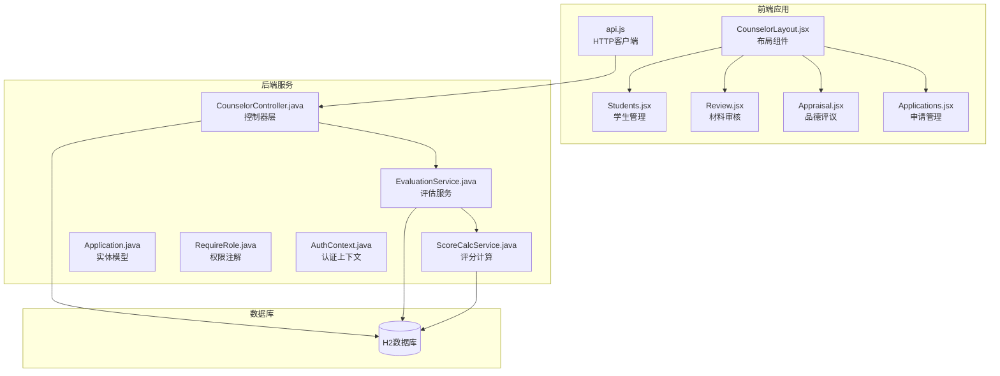

**图表来源**
- [CounselorLayout.jsx:1-14](file://frontend/src/layouts/CounselorLayout.jsx#L1-L14)
- [CounselorController.java:18-65](file://backend/src/main/java/com/zjsu/scholarship/controller/CounselorController.java#L18-L65)

**章节来源**
- [CounselorLayout.jsx:1-14](file://frontend/src/layouts/CounselorLayout.jsx#L1-L14)
- [application.yml:1-52](file://backend/src/main/resources/application.yml#L1-L52)

## 核心组件

系统为辅导员提供了四个核心功能页面，每个页面都针对特定的评审任务进行了专门优化：

### 页面导航结构

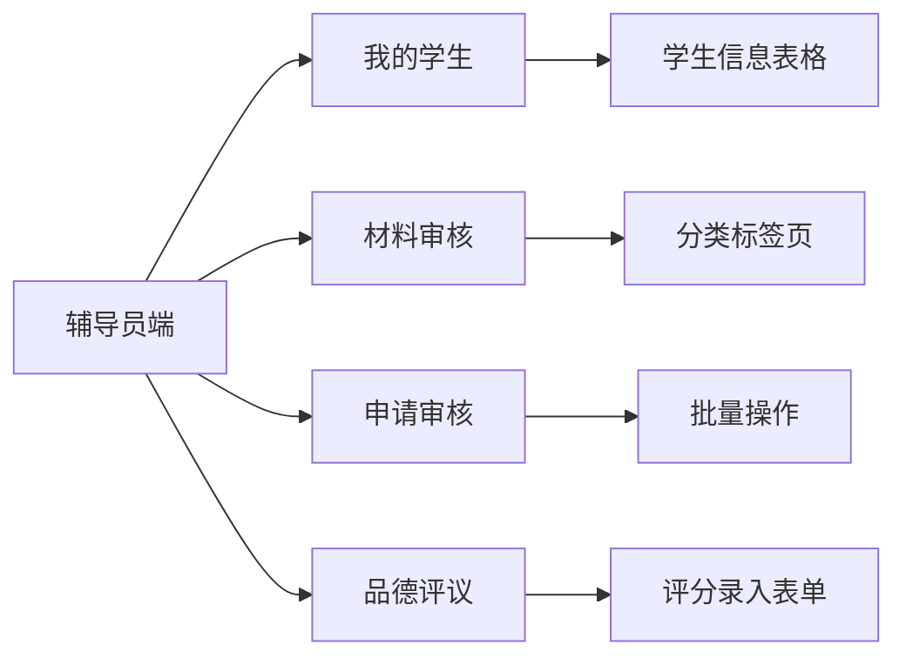

**图表来源**
- [CounselorLayout.jsx:4-9](file://frontend/src/layouts/CounselorLayout.jsx#L4-L9)

### 数据权限控制

系统实现了严格的数据访问范围控制，确保辅导员只能访问自己负责的学生数据：

- **学生数据访问**：仅限于辅导员所带专业的学生
- **申请数据访问**：基于学生归属关系的过滤
- **审核权限**：根据材料类型和状态进行权限控制

**章节来源**
- [CounselorController.java:67-70](file://backend/src/main/java/com/zjsu/scholarship/controller/CounselorController.java#L67-L70)
- [CounselorController.java:234-242](file://backend/src/main/java/com/zjsu/scholarship/controller/CounselorController.java#L234-L242)

## 架构概览

系统采用经典的三层架构模式，结合现代化的前后端分离设计理念：

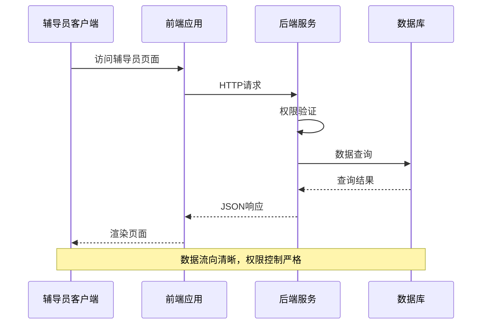

**图表来源**
- [api.js:5-16](file://frontend/src/api.js#L5-L16)
- [RequireRole.java:8-12](file://backend/src/main/java/com/zjsu/scholarship/security/RequireRole.java#L8-L12)

### 技术栈特点

- **前端**：React + Ant Design，提供丰富的UI组件和良好的用户体验
- **后端**：Spring Boot + MyBatis Plus，支持快速开发和数据库操作
- **安全**：基于JWT的认证授权机制，支持角色权限控制
- **数据存储**：H2内存数据库，便于开发和测试

**章节来源**
- [application.yml:8-46](file://backend/src/main/resources/application.yml#L8-L46)

## 详细组件分析

### 学生管理页面（Students）

学生管理页面是辅导员工作的基础界面，提供学生信息的集中展示和批量操作功能。

#### 数据表格设计

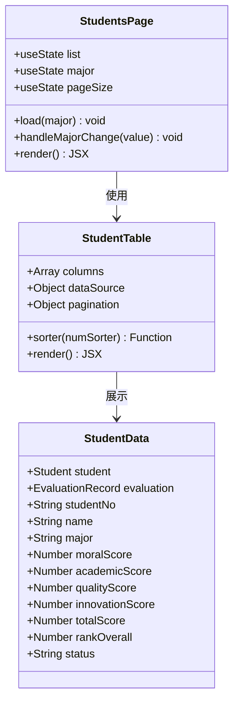

**图表来源**
- [Students.jsx:12-111](file://frontend/src/pages/counselor/Students.jsx#L12-L111)

#### 排序、筛选和分页功能

页面实现了完整的数据表格功能：

- **专业筛选**：通过下拉选择器实现按专业的数据过滤
- **多字段排序**：支持学号、姓名、专业、年级等字段的排序
- **数值字段排序**：通过自定义排序函数实现分数字段的精确排序
- **分页控制**：支持10/20/50条每页的切换

#### 批量操作功能

虽然学生管理页面主要用于信息展示，但为后续功能扩展预留了批量操作接口。

**章节来源**
- [Students.jsx:7-111](file://frontend/src/pages/counselor/Students.jsx#L7-L111)

### 材料审核页面（Review）

材料审核页面是辅导员的核心工作界面，负责处理各类申请材料的审查和审批。

#### 多标签页架构

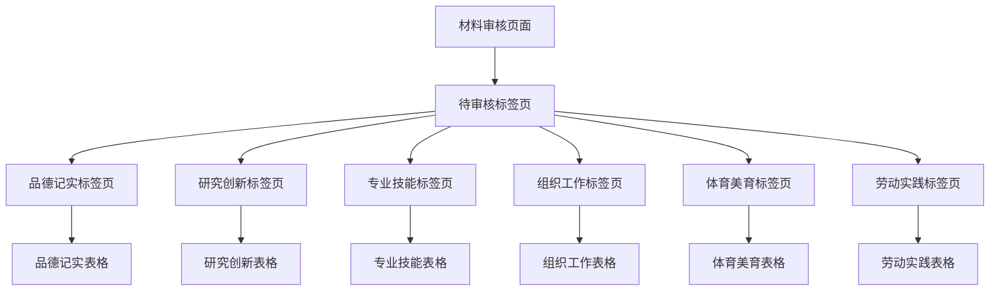

**图表来源**
- [Review.jsx:21-97](file://frontend/src/pages/counselor/Review.jsx#L21-L97)

#### 审核流程处理

系统实现了完整的审核工作流：

1. **待审核数据加载**：自动获取所有待审核的材料记录
2. **材料预览**：支持图片和文档的在线预览
3. **审核操作**：提供通过和驳回两种审核结果
4. **驳回原因**：强制输入驳回原因，确保审核质量
5. **状态更新**：实时更新材料状态并刷新数据

#### 权重设置和评分计算

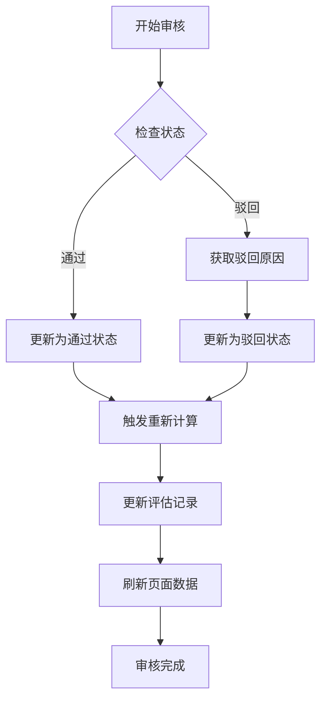

**图表来源**
- [Review.jsx:29-45](file://frontend/src/pages/counselor/Review.jsx#L29-L45)
- [CounselorController.java:160-230](file://backend/src/main/java/com/zjsu/scholarship/controller/CounselorController.java#L160-L230)

**章节来源**
- [Review.jsx:1-97](file://frontend/src/pages/counselor/Review.jsx#L1-L97)
- [CounselorController.java:91-135](file://backend/src/main/java/com/zjsu/scholarship/controller/CounselorController.java#L91-L135)

### 品德评议页面（Appraisal）

品德评议页面专注于辅导员对学生的六维品德评分录入和管理。

#### 六维评分体系

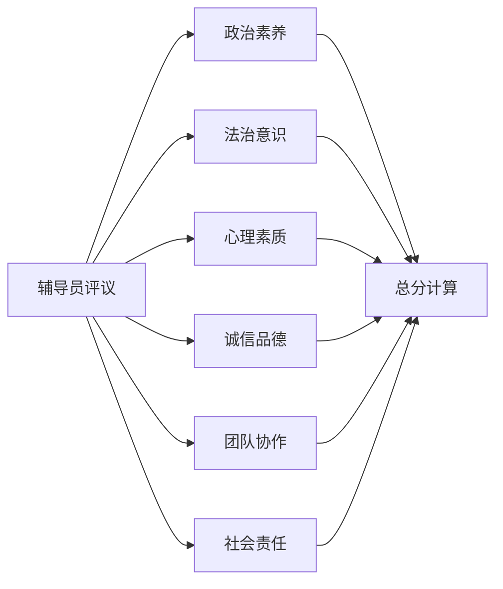

**图表来源**
- [Appraisal.jsx:6-13](file://frontend/src/pages/counselor/Appraisal.jsx#L6-L13)

#### 评分录入和权重设置

页面实现了灵活的评分录入功能：

- **批量评分**：支持同时对多个学生进行评分
- **实时计算**：输入评分时自动计算总分
- **筛选功能**：支持按专业和班级进行筛选
- **一键保存**：提供批量保存和单个保存两种方式

#### 数据同步策略

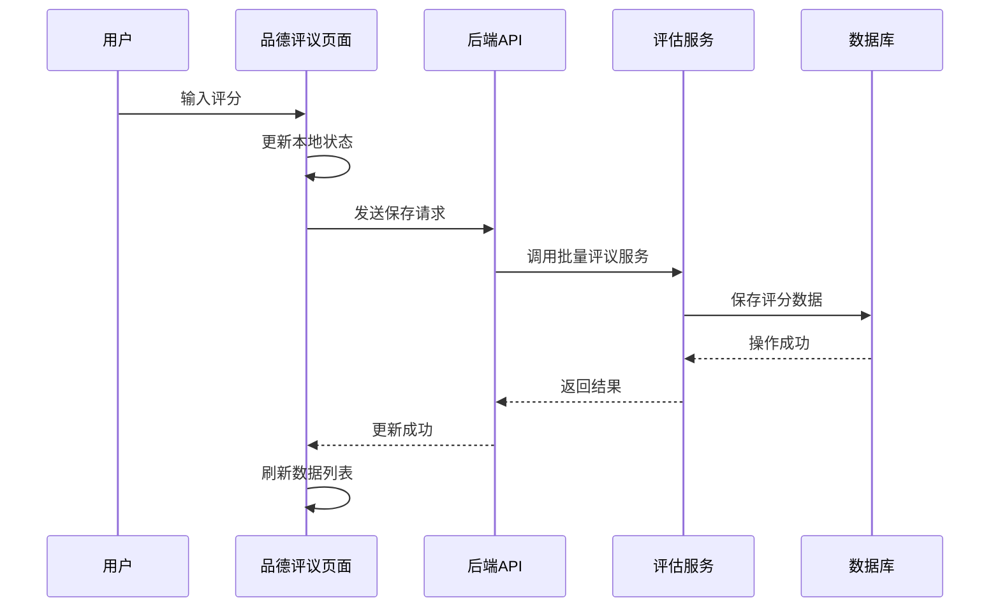

**图表来源**
- [Appraisal.jsx:55-74](file://frontend/src/pages/counselor/Appraisal.jsx#L55-L74)
- [CounselorController.java:308-348](file://backend/src/main/java/com/zjsu/scholarship/controller/CounselorController.java#L308-L348)

**章节来源**
- [Appraisal.jsx:1-156](file://frontend/src/pages/counselor/Appraisal.jsx#L1-L156)
- [CounselorController.java:301-375](file://backend/src/main/java/com/zjsu/scholarship/controller/CounselorController.java#L301-L375)

### 申请管理页面（Applications）

申请管理页面负责处理学生的奖学金申请审核和状态管理。

#### 批量处理和状态更新

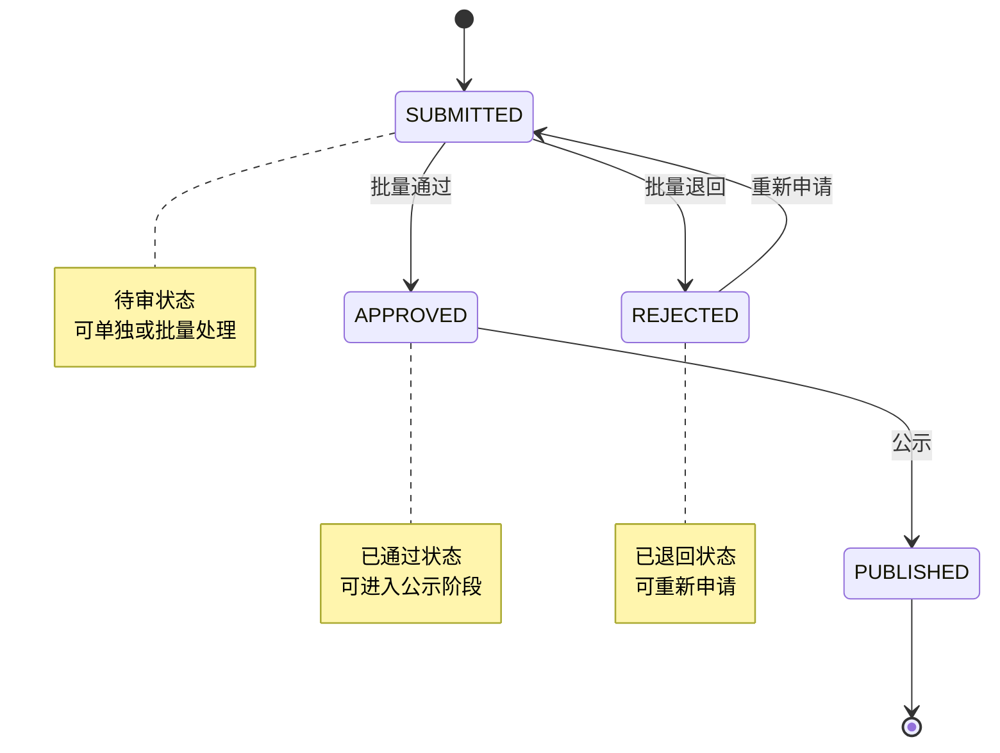

**图表来源**
- [Applications.jsx:5-10](file://frontend/src/pages/counselor/Applications.jsx#L5-L10)

#### 状态管理机制

页面实现了完整的申请状态管理：

- **状态筛选**：支持按不同状态进行数据筛选
- **批量操作**：支持多条记录的批量通过操作
- **单条操作**：支持单个申请的通过和退回操作
- **状态显示**：使用颜色标签直观显示申请状态

#### 错误处理机制

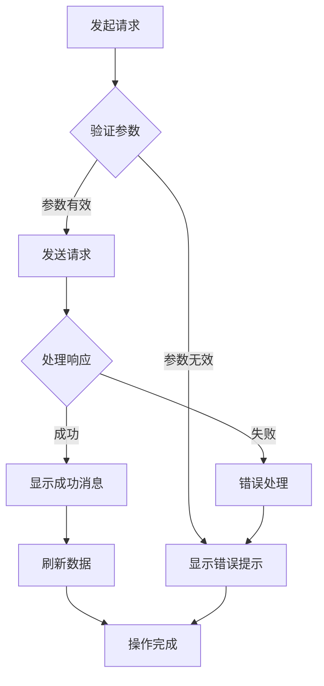

**图表来源**
- [Applications.jsx:20-43](file://frontend/src/pages/counselor/Applications.jsx#L20-L43)

**章节来源**
- [Applications.jsx:1-100](file://frontend/src/pages/counselor/Applications.jsx#L1-L100)
- [CounselorController.java:233-299](file://backend/src/main/java/com/zjsu/scholarship/controller/CounselorController.java#L233-L299)

## 依赖关系分析

系统各组件之间的依赖关系清晰明确，遵循单一职责原则：

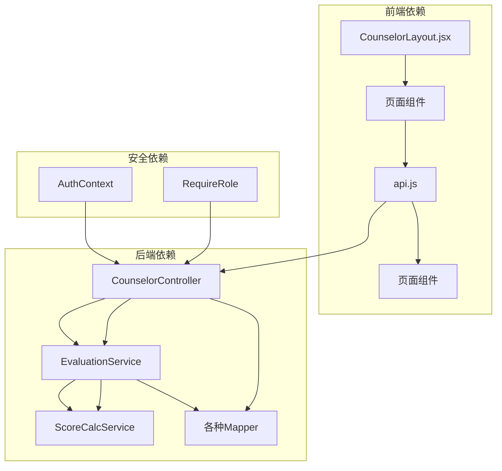

**图表来源**
- [CounselorController.java:18-65](file://backend/src/main/java/com/zjsu/scholarship/controller/CounselorController.java#L18-L65)
- [EvaluationService.java:22-61](file://backend/src/main/java/com/zjsu/scholarship/service/EvaluationService.java#L22-L61)

### 权限控制实现

系统通过注解驱动的方式实现权限控制：

- **角色注解**：`@RequireRole({"COUNSELOR", "ADMIN"})` 确保只有辅导员和管理员可以访问
- **认证上下文**：`AuthContext` 提供当前用户信息的全局访问
- **拦截器链**：JWT认证和权限验证贯穿整个请求处理流程

**章节来源**
- [RequireRole.java:8-12](file://backend/src/main/java/com/zjsu/scholarship/security/RequireRole.java#L8-L12)
- [AuthContext.java:3-19](file://backend/src/main/java/com/zjsu/scholarship/security/AuthContext.java#L3-L19)

## 性能考虑

系统在设计时充分考虑了性能优化：

### 前端性能优化

- **虚拟滚动**：大数据量时使用虚拟滚动减少DOM节点数量
- **懒加载**：页面组件按需加载，减少初始包体积
- **状态缓存**：合理使用React状态提升渲染性能
- **防抖节流**：输入框和筛选操作使用防抖机制

### 后端性能优化

- **批量操作**：支持批量数据处理，减少数据库往返次数
- **事务管理**：关键操作使用事务保证数据一致性
- **连接池**：数据库连接池配置优化并发性能
- **缓存策略**：热点数据使用缓存减少数据库压力

### 数据同步策略

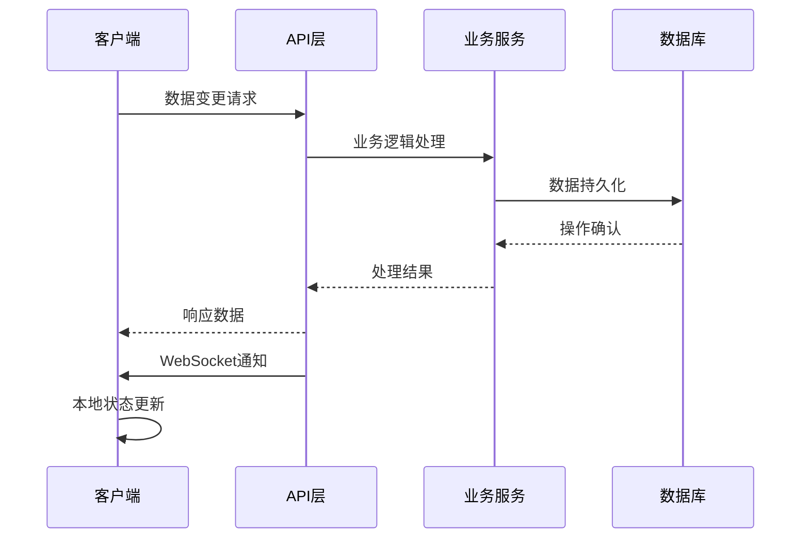

**图表来源**
- [api.js:18-41](file://frontend/src/api.js#L18-L41)

## 故障排除指南

### 常见问题及解决方案

#### 登录认证问题

**问题现象**：页面跳转到登录页或出现认证错误

**可能原因**：
- JWT令牌过期
- 用户权限不足
- 网络连接异常

**解决步骤**：
1. 检查浏览器控制台的网络请求
2. 验证JWT令牌的有效性
3. 确认用户角色权限
4. 重新登录系统

#### 数据加载失败

**问题现象**：页面空白或显示加载错误

**可能原因**：
- 后端服务不可用
- 数据库连接异常
- 网络超时

**解决步骤**：
1. 检查后端服务日志
2. 验证数据库连接状态
3. 确认网络连接正常
4. 重启相关服务

#### 权限访问受限

**问题现象**：无法访问某些功能页面

**可能原因**：
- 用户角色不正确
- 权限配置错误
- 缓存数据过期

**解决步骤**：
1. 验证用户角色信息
2. 检查权限配置
3. 清除浏览器缓存
4. 重新登录系统

**章节来源**
- [api.js:18-41](file://frontend/src/api.js#L18-L41)
- [application.yml:42-46](file://backend/src/main/resources/application.yml#L42-L46)

## 结论

奖学金评审系统的辅导员页面组件经过精心设计和实现，为辅导员提供了完整、高效的工作流程支持。系统的主要优势包括：

### 核心优势

1. **功能完整性**：覆盖了奖学金评审的所有关键环节
2. **用户体验优秀**：基于Ant Design的设计提供了直观的操作界面
3. **权限控制严格**：确保数据访问的安全性和准确性
4. **性能表现良好**：通过合理的架构设计保证了系统的响应速度

### 技术特色

1. **前后端分离**：采用现代化的技术栈，便于维护和扩展
2. **数据驱动**：基于React的状态管理，确保数据的一致性
3. **权限安全**：基于JWT的角色权限控制，保障系统安全
4. **可扩展性**：模块化的架构设计支持功能的持续扩展

### 改进建议

1. **移动端适配**：增强移动设备的访问体验
2. **性能监控**：添加系统性能监控和日志分析
3. **数据备份**：完善数据备份和恢复机制
4. **用户培训**：提供系统使用指南和培训材料

该系统为高校奖学金评审工作提供了强有力的技术支撑，显著提升了工作效率和管理水平。