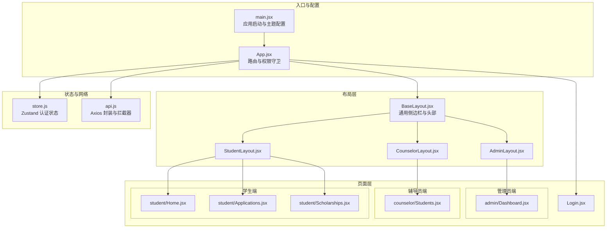
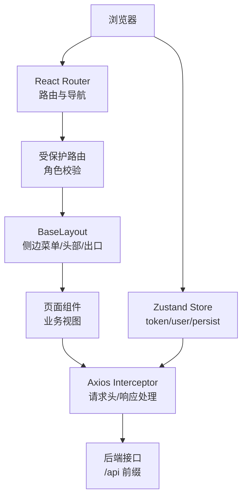
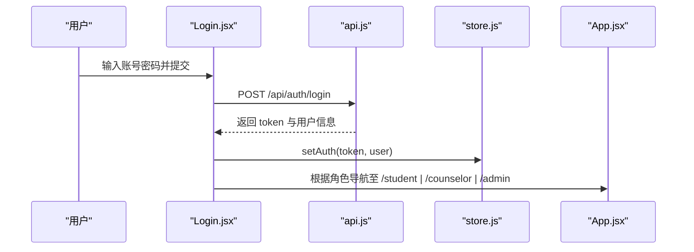
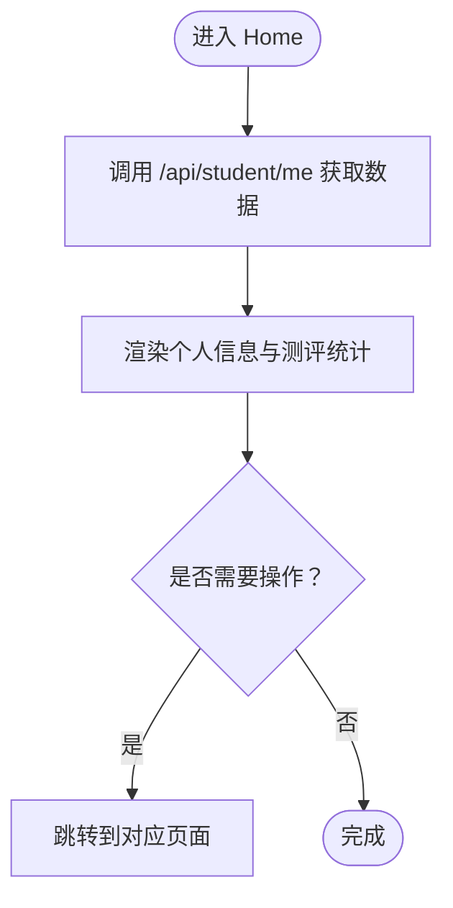
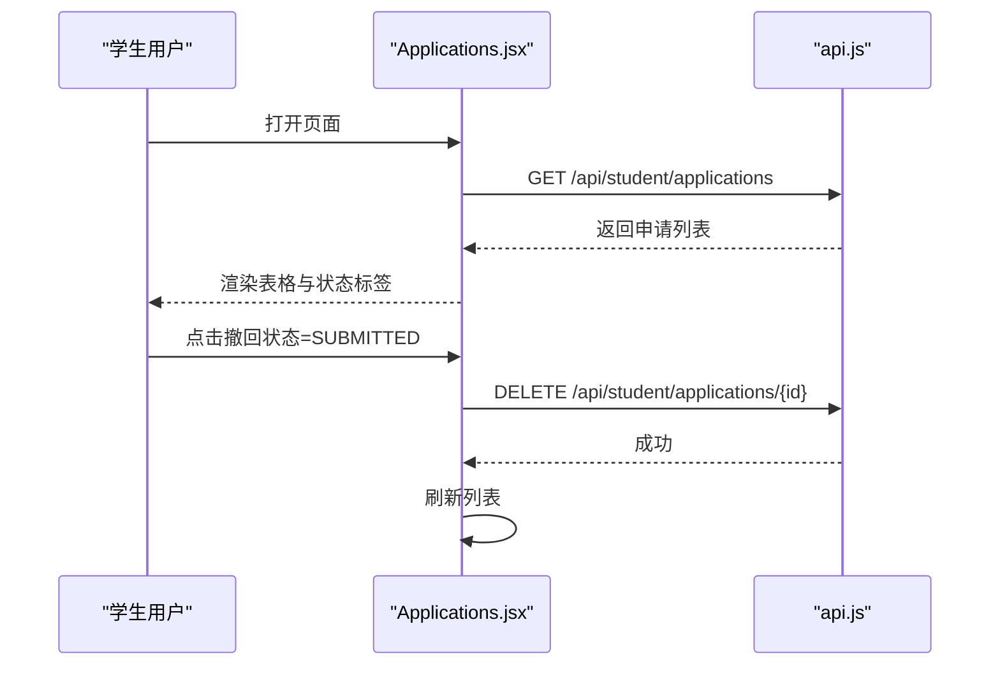
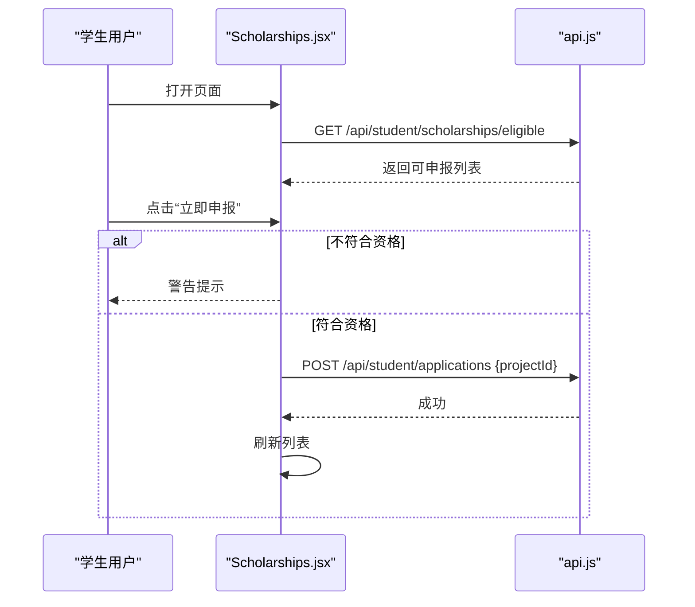
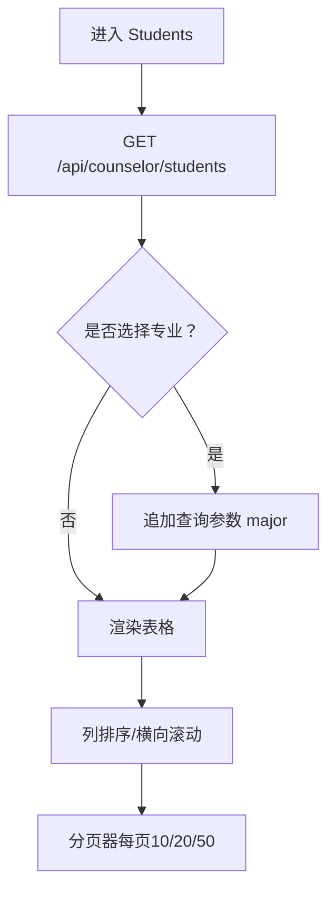
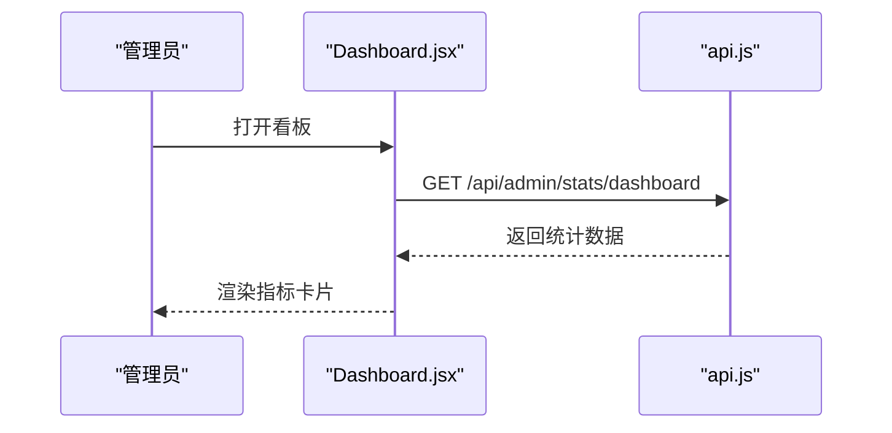
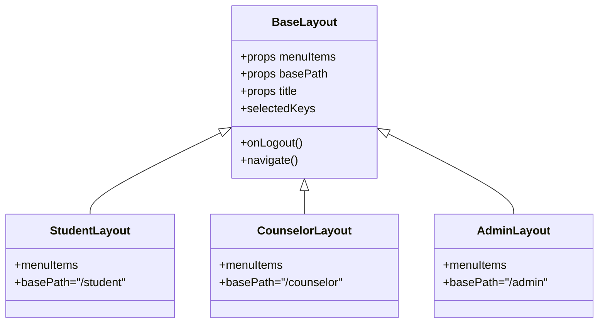
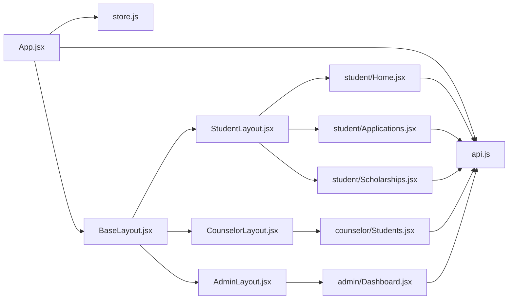

# 页面组件设计

<cite>
**本文引用的文件**
- [frontend/src/App.jsx](file://frontend/src/App.jsx)
- [frontend/src/main.jsx](file://frontend/src/main.jsx)
- [frontend/package.json](file://frontend/package.json)
- [frontend/src/store.js](file://frontend/src/store.js)
- [frontend/src/api.js](file://frontend/src/api.js)
- [frontend/src/layouts/BaseLayout.jsx](file://frontend/src/layouts/BaseLayout.jsx)
- [frontend/src/layouts/StudentLayout.jsx](file://frontend/src/layouts/StudentLayout.jsx)
- [frontend/src/layouts/CounselorLayout.jsx](file://frontend/src/layouts/CounselorLayout.jsx)
- [frontend/src/layouts/AdminLayout.jsx](file://frontend/src/layouts/AdminLayout.jsx)
- [frontend/src/pages/Login.jsx](file://frontend/src/pages/Login.jsx)
- [frontend/src/pages/student/Home.jsx](file://frontend/src/pages/student/Home.jsx)
- [frontend/src/pages/student/Applications.jsx](file://frontend/src/pages/student/Applications.jsx)
- [frontend/src/pages/student/Scholarships.jsx](file://frontend/src/pages/student/Scholarships.jsx)
- [frontend/src/pages/counselor/Students.jsx](file://frontend/src/pages/counselor/Students.jsx)
- [frontend/src/pages/admin/Dashboard.jsx](file://frontend/src/pages/admin/Dashboard.jsx)
</cite>

## 目录
1. [引言](#引言)
2. [项目结构](#项目结构)
3. [核心组件](#核心组件)
4. [架构总览](#架构总览)
5. [详细组件分析](#详细组件分析)
6. [依赖关系分析](#依赖关系分析)
7. [性能考虑](#性能考虑)
8. [故障排查指南](#故障排查指南)
9. [结论](#结论)
10. [附录](#附录)

## 引言
本设计文档面向奖学金管理系统前端页面组件，系统采用 React + Ant Design + Zustand + Axios 技术栈，围绕“学生端”“辅导员端”“管理员端”三大角色构建页面与权限体系。文档从页面组件化设计、生命周期与状态管理、Ant Design 使用规范、权限控制、性能优化、导航与参数传递、测试与调试等方面进行系统阐述，帮助开发者快速理解并扩展页面功能。

## 项目结构
前端采用模块化目录组织，页面按角色划分在 student、counselor、admin 三个子目录下，通用布局组件位于 layouts，全局状态与 API 封装分别在 store.js 与 api.js 中，入口在 main.jsx 中完成国际化与主题配置。

图示来源
- [frontend/src/main.jsx:1-19](file://frontend/src/main.jsx#L1-L19)
- [frontend/src/App.jsx:1-83](file://frontend/src/App.jsx#L1-L83)
- [frontend/src/layouts/BaseLayout.jsx:1-66](file://frontend/src/layouts/BaseLayout.jsx#L1-L66)
- [frontend/src/layouts/StudentLayout.jsx:1-17](file://frontend/src/layouts/StudentLayout.jsx#L1-L17)
- [frontend/src/layouts/CounselorLayout.jsx:1-14](file://frontend/src/layouts/CounselorLayout.jsx#L1-L14)
- [frontend/src/layouts/AdminLayout.jsx:1-16](file://frontend/src/layouts/AdminLayout.jsx#L1-L16)
- [frontend/src/pages/student/Home.jsx:1-98](file://frontend/src/pages/student/Home.jsx#L1-L98)
- [frontend/src/pages/student/Applications.jsx:1-42](file://frontend/src/pages/student/Applications.jsx#L1-L42)
- [frontend/src/pages/student/Scholarships.jsx:1-81](file://frontend/src/pages/student/Scholarships.jsx#L1-L81)
- [frontend/src/pages/counselor/Students.jsx:1-111](file://frontend/src/pages/counselor/Students.jsx#L1-L111)
- [frontend/src/pages/admin/Dashboard.jsx:1-35](file://frontend/src/pages/admin/Dashboard.jsx#L1-L35)
- [frontend/src/pages/Login.jsx:1-76](file://frontend/src/pages/Login.jsx#L1-L76)

章节来源
- [frontend/src/main.jsx:1-19](file://frontend/src/main.jsx#L1-L19)
- [frontend/src/App.jsx:1-83](file://frontend/src/App.jsx#L1-L83)

## 核心组件
- 应用入口与主题配置：在入口文件中完成国际化与主题注入，并挂载路由容器。
- 路由与权限守卫：通过受保护路由组件实现角色级访问控制，未登录或角色不匹配时重定向至登录页。
- 状态管理：使用 Zustand 管理 token 与用户信息，并持久化到本地存储。
- 网络层：基于 Axios 的封装，统一添加 Authorization 头、处理响应码与错误提示。
- 布局组件：BaseLayout 提供统一的侧边菜单、顶部用户菜单与内容区出口；各角色布局仅配置菜单项集合。
- 页面组件：围绕业务场景拆分，如学生首页、申请列表、奖学金项目、辅导员学生列表、管理员看板等。

章节来源
- [frontend/src/main.jsx:1-19](file://frontend/src/main.jsx#L1-L19)
- [frontend/src/App.jsx:27-41](file://frontend/src/App.jsx#L27-L41)
- [frontend/src/store.js:1-15](file://frontend/src/store.js#L1-L15)
- [frontend/src/api.js:1-44](file://frontend/src/api.js#L1-L44)
- [frontend/src/layouts/BaseLayout.jsx:1-66](file://frontend/src/layouts/BaseLayout.jsx#L1-L66)
- [frontend/src/layouts/StudentLayout.jsx:1-17](file://frontend/src/layouts/StudentLayout.jsx#L1-L17)
- [frontend/src/layouts/CounselorLayout.jsx:1-14](file://frontend/src/layouts/CounselorLayout.jsx#L1-L14)
- [frontend/src/layouts/AdminLayout.jsx:1-16](file://frontend/src/layouts/AdminLayout.jsx#L1-L16)

## 架构总览
系统采用“路由 + 布局 + 页面”的三层结构，配合全局状态与网络层，形成清晰的职责边界：

图示来源
- [frontend/src/App.jsx:27-41](file://frontend/src/App.jsx#L27-L41)
- [frontend/src/layouts/BaseLayout.jsx:1-66](file://frontend/src/layouts/BaseLayout.jsx#L1-L66)
- [frontend/src/api.js:10-41](file://frontend/src/api.js#L10-L41)
- [frontend/src/store.js:4-14](file://frontend/src/store.js#L4-L14)

## 详细组件分析

### 登录页（Login）
- 功能特性：支持账号密码登录、演示账号一键填充、角色跳转、初始密码提示。
- 表单处理：使用 Ant Design 表单组件，结合规则校验与受控表单。
- 导航与状态：登录成功后写入认证状态并根据角色跳转至对应角色首页。
- 安全提示：对初始密码使用警示性提示，引导用户修改。

图示来源
- [frontend/src/pages/Login.jsx:16-34](file://frontend/src/pages/Login.jsx#L16-L34)
- [frontend/src/api.js:18-35](file://frontend/src/api.js#L18-L35)
- [frontend/src/store.js:4-14](file://frontend/src/store.js#L4-L14)
- [frontend/src/App.jsx:34-41](file://frontend/src/App.jsx#L34-L41)

章节来源
- [frontend/src/pages/Login.jsx:1-76](file://frontend/src/pages/Login.jsx#L1-L76)

### 学生端页面

#### 个人主页（Home）
- 数据获取：首次渲染时拉取当前学生与测评快照数据，使用加载指示器提升体验。
- 展示逻辑：个人信息卡片、基本项测评统计、综合能力测评统计与公式说明。
- 操作入口：提供“填报基本项”“填报综合能力”“查看可申报奖学金”等快捷跳转。

图示来源
- [frontend/src/pages/student/Home.jsx:6-15](file://frontend/src/pages/student/Home.jsx#L6-L15)
- [frontend/src/pages/student/Home.jsx:22-96](file://frontend/src/pages/student/Home.jsx#L22-L96)

章节来源
- [frontend/src/pages/student/Home.jsx:1-98](file://frontend/src/pages/student/Home.jsx#L1-L98)

#### 我的申请（Applications）
- 数据获取：拉取学生所有申请记录，展示项目名称、类型、分数快照、系统/最终等级、状态与退回原因。
- 操作控制：仅当状态为“已提交”时允许撤回，使用气泡确认框降低误操作风险。
- 列表设计：小尺寸表格、无分页，便于集中查看。

图示来源
- [frontend/src/pages/student/Applications.jsx:11-19](file://frontend/src/pages/student/Applications.jsx#L11-L19)
- [frontend/src/pages/student/Applications.jsx:21-35](file://frontend/src/pages/student/Applications.jsx#L21-L35)

章节来源
- [frontend/src/pages/student/Applications.jsx:1-42](file://frontend/src/pages/student/Applications.jsx#L1-L42)

#### 奖学金申报（Scholarships）
- 数据获取：拉取“当前可申报”奖学金列表，包含项目详情、等级与比例、系统推荐等级等。
- 交互流程：若不符合条件弹出警告；确认后提交申请；提交后刷新列表。
- 条件校验：对每个项目展示资格检查结果，避免无效提交。

图示来源
- [frontend/src/pages/student/Scholarships.jsx:12-15](file://frontend/src/pages/student/Scholarships.jsx#L12-L15)
- [frontend/src/pages/student/Scholarships.jsx:17-33](file://frontend/src/pages/student/Scholarships.jsx#L17-L33)

章节来源
- [frontend/src/pages/student/Scholarships.jsx:1-81](file://frontend/src/pages/student/Scholarships.jsx#L1-L81)

### 辅导员端页面

#### 我的学生（Students）
- 数据获取：支持按专业筛选，加载学生综测相关字段与排名。
- 排序与筛选：多列数值型字段支持排序，表格横向滚动适配宽表。
- 分页与展示：内置分页器，支持切换每页条数与显示总数。

图示来源
- [frontend/src/pages/counselor/Students.jsx:12-27](file://frontend/src/pages/counselor/Students.jsx#L12-L27)
- [frontend/src/pages/counselor/Students.jsx:29-75](file://frontend/src/pages/counselor/Students.jsx#L29-L75)
- [frontend/src/pages/counselor/Students.jsx:94-107](file://frontend/src/pages/counselor/Students.jsx#L94-L107)

章节来源
- [frontend/src/pages/counselor/Students.jsx:1-111](file://frontend/src/pages/counselor/Students.jsx#L1-L111)

### 管理员端页面

#### 统计看板（Dashboard）
- 数据获取：加载系统关键指标（学生总数、项目数、申请总数、待审数量等）。
- 展示设计：使用栅格卡片与统计组件直观呈现运营数据。
- 指南提示：提供操作步骤提示，辅助管理员完成流程。

图示来源
- [frontend/src/pages/admin/Dashboard.jsx:6-9](file://frontend/src/pages/admin/Dashboard.jsx#L6-L9)
- [frontend/src/pages/admin/Dashboard.jsx:13-32](file://frontend/src/pages/admin/Dashboard.jsx#L13-L32)

章节来源
- [frontend/src/pages/admin/Dashboard.jsx:1-35](file://frontend/src/pages/admin/Dashboard.jsx#L1-L35)

### 布局组件（BaseLayout）
- 结构组成：侧边菜单、顶部用户菜单、内容出口、顶部横幅提示。
- 菜单联动：根据当前路径高亮选中项，点击跳转至对应页面。
- 用户操作：提供“修改密码”“退出登录”入口，退出后回到登录页。

图示来源
- [frontend/src/layouts/BaseLayout.jsx:8-26](file://frontend/src/layouts/BaseLayout.jsx#L8-L26)
- [frontend/src/layouts/StudentLayout.jsx:4-12](file://frontend/src/layouts/StudentLayout.jsx#L4-L12)
- [frontend/src/layouts/CounselorLayout.jsx:4-9](file://frontend/src/layouts/CounselorLayout.jsx#L4-L9)
- [frontend/src/layouts/AdminLayout.jsx:4-11](file://frontend/src/layouts/AdminLayout.jsx#L4-L11)

章节来源
- [frontend/src/layouts/BaseLayout.jsx:1-66](file://frontend/src/layouts/BaseLayout.jsx#L1-L66)
- [frontend/src/layouts/StudentLayout.jsx:1-17](file://frontend/src/layouts/StudentLayout.jsx#L1-L17)
- [frontend/src/layouts/CounselorLayout.jsx:1-14](file://frontend/src/layouts/CounselorLayout.jsx#L1-L14)
- [frontend/src/layouts/AdminLayout.jsx:1-16](file://frontend/src/layouts/AdminLayout.jsx#L1-L16)

## 依赖关系分析
- 组件耦合：页面组件仅依赖 api.js 与 store.js，布局组件仅依赖路由与 store，保持低耦合。
- 外部依赖：Ant Design 提供 UI 基础，Zustand 管理轻量状态，Axios 负责网络请求。
- 路由与权限：App.jsx 统一声明路由与守卫，避免在页面内重复逻辑。

图示来源
- [frontend/src/App.jsx:43-82](file://frontend/src/App.jsx#L43-L82)
- [frontend/src/store.js:4-14](file://frontend/src/store.js#L4-L14)
- [frontend/src/api.js:1-44](file://frontend/src/api.js#L1-L44)
- [frontend/src/layouts/BaseLayout.jsx:1-66](file://frontend/src/layouts/BaseLayout.jsx#L1-L66)
- [frontend/src/pages/student/Home.jsx:1-98](file://frontend/src/pages/student/Home.jsx#L1-L98)
- [frontend/src/pages/student/Applications.jsx:1-42](file://frontend/src/pages/student/Applications.jsx#L1-L42)
- [frontend/src/pages/student/Scholarships.jsx:1-81](file://frontend/src/pages/student/Scholarships.jsx#L1-L81)
- [frontend/src/pages/counselor/Students.jsx:1-111](file://frontend/src/pages/counselor/Students.jsx#L1-L111)
- [frontend/src/pages/admin/Dashboard.jsx:1-35](file://frontend/src/pages/admin/Dashboard.jsx#L1-L35)

章节来源
- [frontend/src/App.jsx:1-83](file://frontend/src/App.jsx#L1-L83)
- [frontend/package.json:11-24](file://frontend/package.json#L11-L24)

## 性能考虑
- 列表渲染优化
  - 学生端“我的申请”采用小尺寸表格、禁用分页，减少 DOM 节点与重排成本。
  - 辅导员端“我的学生”表格启用横向滚动与列宽固定，避免超宽表导致的重绘。
- 分页与懒加载
  - 建议在数据量增大时引入服务端分页参数（如 page/size），并在表格组件上开启虚拟滚动以降低内存占用。
- 图片懒加载
  - 若未来引入图片资源，建议使用 IntersectionObserver 或第三方库实现懒加载，减少首屏压力。
- 请求缓存
  - 对于不频繁变动的数据（如项目配置、学年信息），可在 store 中增加缓存策略，避免重复请求。
- 主题与国际化
  - 在入口集中配置 Ant Design 主题与语言，确保全局一致性，减少重复配置带来的开销。

## 故障排查指南
- 登录失败或 401
  - 检查请求拦截器是否正确附加 Authorization 头，确认后端返回的响应码与消息处理逻辑。
  - 若出现 401，拦截器会清理本地认证状态并跳转登录页。
- 网络异常
  - 统一错误提示已在响应拦截器中处理，若仍出现异常，检查网络连通性与后端接口可用性。
- 页面空白或加载缓慢
  - 检查数据请求是否成功返回，确认页面组件的加载状态与空态处理。
- 权限问题
  - 确认受保护路由的 role 参数与用户角色一致，避免因角色不匹配导致的重定向。

章节来源
- [frontend/src/api.js:18-41](file://frontend/src/api.js#L18-L41)
- [frontend/src/App.jsx:27-41](file://frontend/src/App.jsx#L27-L41)

## 结论
本系统通过清晰的角色化路由与布局、统一的状态与网络层，实现了学生、辅导员、管理员三大角色的页面组件化设计。页面组件聚焦单一职责，配合 Ant Design 组件库与轻量状态管理，具备良好的可维护性与扩展性。后续可在分页与虚拟滚动、图片懒加载、缓存策略等方面进一步优化性能，并完善单元测试与集成测试以提升质量。

## 附录

### Ant Design 组件使用指南（页面常用）
- 表单组件
  - 登录页使用 Form、Input、Button 实现账号密码输入与提交，结合规则校验与受控表单。
- 表格组件
  - “我的申请”使用 Table 展示申请列表，列渲染使用标签与格式化函数；“我的学生”使用带排序与横向滚动的表格。
- 模态框与确认
  - “奖学金申报”使用 Modal 警告与确认框，保障关键操作的安全性。
- 卡片与统计
  - “个人主页”“统计看板”使用 Card 与 Statistic 展示关键信息与指标。
- 下拉与选择
  - “我的学生”使用 Select 进行专业筛选，配合分页器控制数据规模。

章节来源
- [frontend/src/pages/Login.jsx:52-60](file://frontend/src/pages/Login.jsx#L52-L60)
- [frontend/src/pages/student/Applications.jsx:21-35](file://frontend/src/pages/student/Applications.jsx#L21-L35)
- [frontend/src/pages/counselor/Students.jsx:83-90](file://frontend/src/pages/counselor/Students.jsx#L83-L90)
- [frontend/src/pages/student/Scholarships.jsx:17-33](file://frontend/src/pages/student/Scholarships.jsx#L17-L33)
- [frontend/src/pages/student/Home.jsx:22-96](file://frontend/src/pages/student/Home.jsx#L22-L96)
- [frontend/src/pages/admin/Dashboard.jsx:13-32](file://frontend/src/pages/admin/Dashboard.jsx#L13-L32)

### 页面权限控制实现
- 路由守卫
  - 受保护路由组件在渲染前检查 token 与角色，不满足条件则重定向至登录页。
- 功能按钮显示控制
  - 通过用户角色与数据状态动态决定按钮可见性（如“撤回”仅在特定状态下显示）。

章节来源
- [frontend/src/App.jsx:27-41](file://frontend/src/App.jsx#L27-L41)
- [frontend/src/pages/student/Applications.jsx:33-35](file://frontend/src/pages/student/Applications.jsx#L33-L35)

### 页面间导航与参数传递
- 导航方式
  - 使用 useNavigate 进行编程式导航，如从“个人主页”跳转到“基本项测评”“综合能力测评”“奖学金申报”等。
- 参数传递
  - 当前页面通过路由参数或查询参数传递（如“我的学生”按专业筛选），后续可扩展为路由参数或状态传递。

章节来源
- [frontend/src/pages/student/Home.jsx:43-44](file://frontend/src/pages/student/Home.jsx#L43-L44)
- [frontend/src/pages/counselor/Students.jsx:17-27](file://frontend/src/pages/counselor/Students.jsx#L17-L27)

### 测试策略与调试方法
- 单元测试
  - 对纯函数与工具函数进行断言测试；对页面组件可使用 React Testing Library 进行快照与交互测试。
- 集成测试
  - 使用 Mock API 拦截器模拟后端响应，覆盖登录、列表加载、提交与撤回等关键流程。
- 调试技巧
  - 利用浏览器开发者工具观察网络请求与响应；在 store 中打印 token 与用户信息；在页面组件中输出关键状态变化。