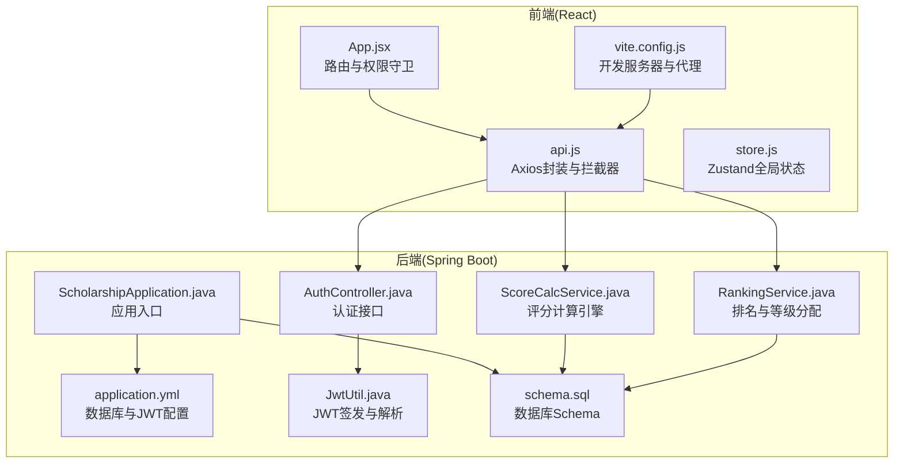
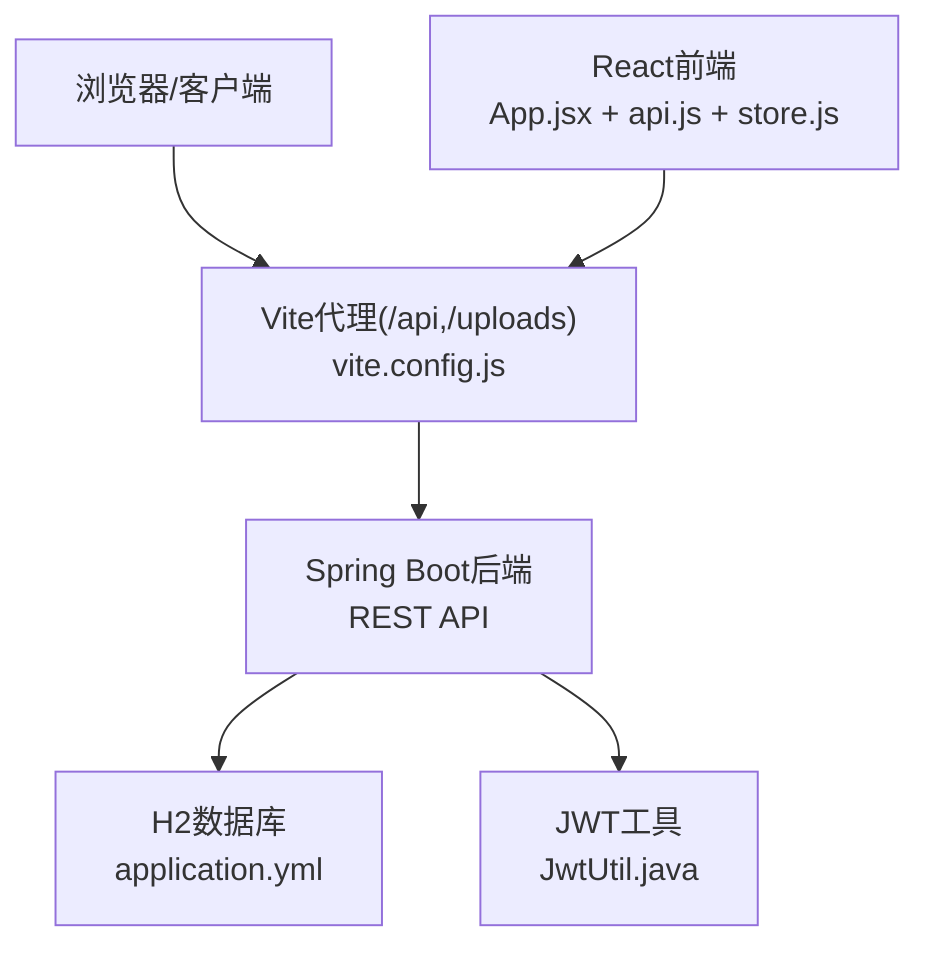
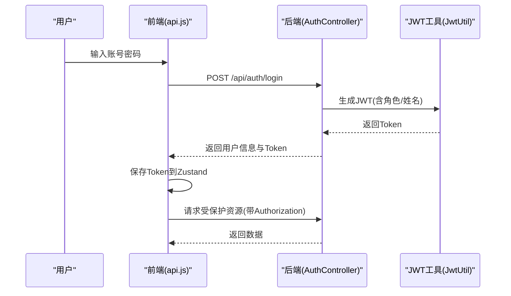
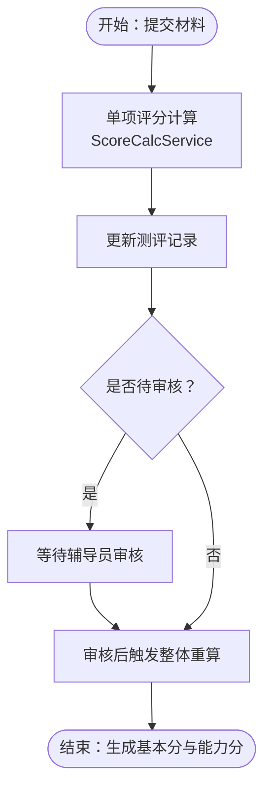
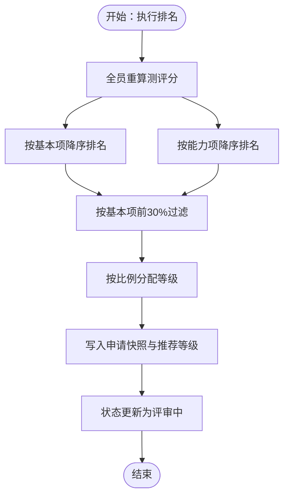
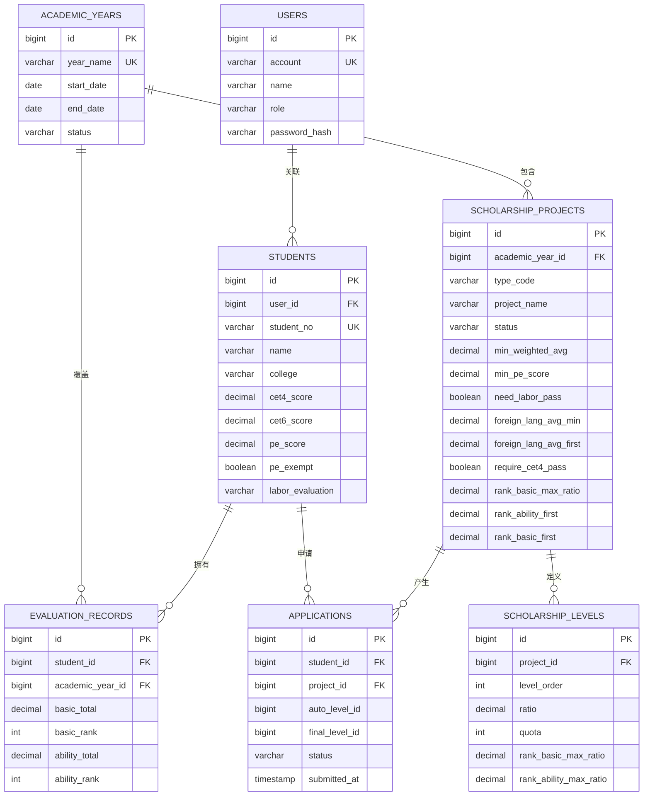
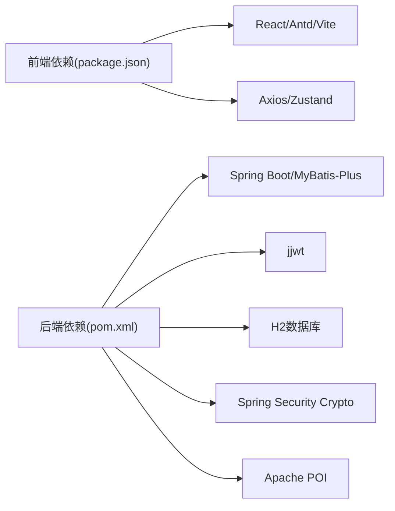

# 项目概述

<cite>
**本文引用的文件**
- [README.md](file://README.md)
- [ScholarshipApplication.java](file://backend/src/main/java/com/zjsu/scholarship/ScholarshipApplication.java)
- [pom.xml](file://backend/pom.xml)
- [application.yml](file://backend/src/main/resources/application.yml)
- [JwtUtil.java](file://backend/src/main/java/com/zjsu/scholarship/security/JwtUtil.java)
- [AuthController.java](file://backend/src/main/java/com/zjsu/scholarship/controller/AuthController.java)
- [ScoreCalcService.java](file://backend/src/main/java/com/zjsu/scholarship/service/ScoreCalcService.java)
- [RankingService.java](file://backend/src/main/java/com/zjsu/scholarship/service/RankingService.java)
- [Application.java](file://backend/src/main/java/com/zjsu/scholarship/entity/Application.java)
- [App.jsx](file://frontend/src/App.jsx)
- [api.js](file://frontend/src/api.js)
- [store.js](file://frontend/src/store.js)
- [vite.config.js](file://frontend/vite.config.js)
- [schema.sql](file://backend/src/main/resources/db/schema.sql)
</cite>

## 目录
1. [引言](#引言)
2. [项目结构](#项目结构)
3. [核心组件](#核心组件)
4. [架构总览](#架构总览)
5. [详细组件分析](#详细组件分析)
6. [依赖关系分析](#依赖关系分析)
7. [性能考虑](#性能考虑)
8. [故障排查指南](#故障排查指南)
9. [结论](#结论)
10. [附录](#附录)

## 引言
本项目是依据《浙江工商大学学生素质评价办法》(2025版) 与《浙江工商大学奖学金实施办法》(2025版) 开发的奖学金管理系统，面向学生、辅导员与管理员三类角色，提供从“综合测评”“在线申请”到“等级分配与结果公示”的全流程数字化支撑。系统采用前后端分离架构，后端基于 Spring Boot 3 + MyBatis-Plus，前端基于 React 18 + Vite，使用 JWT 实现认证与权限控制，内置 H2 数据库存储演示数据，支持一键启动与快速部署。

## 项目结构
系统采用典型的前后端分离结构，后端独立打包为 Spring Boot 应用，前端独立构建并通过反向代理访问后端 API。数据库采用 H2 文件模式，首次启动自动初始化 schema 与演示数据。

**图表来源**
- [App.jsx:1-83](file://frontend/src/App.jsx#L1-L83)
- [api.js:1-44](file://frontend/src/api.js#L1-L44)
- [store.js:1-15](file://frontend/src/store.js#L1-L15)
- [vite.config.js:1-21](file://frontend/vite.config.js#L1-L21)
- [ScholarshipApplication.java:1-14](file://backend/src/main/java/com/zjsu/scholarship/ScholarshipApplication.java#L1-L14)
- [application.yml:1-52](file://backend/src/main/resources/application.yml#L1-L52)
- [JwtUtil.java:1-52](file://backend/src/main/java/com/zjsu/scholarship/security/JwtUtil.java#L1-L52)
- [AuthController.java:1-44](file://backend/src/main/java/com/zjsu/scholarship/controller/AuthController.java#L1-L44)
- [ScoreCalcService.java:1-423](file://backend/src/main/java/com/zjsu/scholarship/service/ScoreCalcService.java#L1-L423)
- [RankingService.java:1-437](file://backend/src/main/java/com/zjsu/scholarship/service/RankingService.java#L1-L437)
- [schema.sql:1-402](file://backend/src/main/resources/db/schema.sql#L1-L402)

**章节来源**
- [README.md:123-154](file://README.md#L123-L154)
- [pom.xml:1-108](file://backend/pom.xml#L1-L108)
- [application.yml:1-52](file://backend/src/main/resources/application.yml#L1-L52)
- [vite.config.js:1-21](file://frontend/vite.config.js#L1-L21)

## 核心组件
- 认证与权限
  - 后端使用 JWT 与 BCrypt，提供登录、个人信息查询与修改密码接口；前端通过 Axios 拦截器注入 Authorization 头，Zustand 持久化保存登录态。
- 评分计算引擎
  - 实现“基本项”与“综合能力”两大模块的评分细则，覆盖品德评议、品德记实、专业素质、研究创新、专业技能、组织工作、体育美育、劳动实践等维度。
- 排名与等级分配
  - 支持双轨制排名（基本项与综合能力），按项目配置的比例与门槛进行等级分配，并写入申请快照与推荐等级。
- 数据模型
  - 基于 schema 定义了用户、学生、学年、测评记录、课程成绩、各类能力项、奖学金项目与等级、申请、申诉、处分等核心实体。

**章节来源**
- [AuthController.java:1-44](file://backend/src/main/java/com/zjsu/scholarship/controller/AuthController.java#L1-L44)
- [JwtUtil.java:1-52](file://backend/src/main/java/com/zjsu/scholarship/security/JwtUtil.java#L1-L52)
- [api.js:1-44](file://frontend/src/api.js#L1-L44)
- [store.js:1-15](file://frontend/src/store.js#L1-L15)
- [ScoreCalcService.java:1-423](file://backend/src/main/java/com/zjsu/scholarship/service/ScoreCalcService.java#L1-L423)
- [RankingService.java:1-437](file://backend/src/main/java/com/zjsu/scholarship/service/RankingService.java#L1-L437)
- [schema.sql:1-402](file://backend/src/main/resources/db/schema.sql#L1-L402)

## 架构总览
系统采用前后端分离架构，前端通过 Vite 开发服务器提供本地调试与代理，后端提供 RESTful API，数据库为 H2 文件模式，自动建表与初始化演示数据。JWT 用于认证与授权，权限通过注解与拦截器实现。

**图表来源**
- [vite.config.js:1-21](file://frontend/vite.config.js#L1-L21)
- [application.yml:1-52](file://backend/src/main/resources/application.yml#L1-L52)
- [JwtUtil.java:1-52](file://backend/src/main/java/com/zjsu/scholarship/security/JwtUtil.java#L1-L52)
- [App.jsx:1-83](file://frontend/src/App.jsx#L1-L83)
- [api.js:1-44](file://frontend/src/api.js#L1-L44)

## 详细组件分析

### 认证与权限控制
- 登录与个人信息
  - 后端提供登录、当前用户信息查询与修改密码接口；前端在请求头注入 Bearer Token，响应拦截处理 401 与错误提示。
- JWT 签发与解析
  - 使用对称密钥签发，包含用户标识、账号、角色与姓名，设置过期时间；后端通过拦截器读取上下文。
- 角色守卫
  - 前端根据用户角色动态渲染路由与页面，未登录或角色不符跳转登录页。

**图表来源**
- [AuthController.java:1-44](file://backend/src/main/java/com/zjsu/scholarship/controller/AuthController.java#L1-L44)
- [JwtUtil.java:1-52](file://backend/src/main/java/com/zjsu/scholarship/security/JwtUtil.java#L1-L52)
- [api.js:1-44](file://frontend/src/api.js#L1-L44)

**章节来源**
- [AuthController.java:1-44](file://backend/src/main/java/com/zjsu/scholarship/controller/AuthController.java#L1-L44)
- [JwtUtil.java:1-52](file://backend/src/main/java/com/zjsu/scholarship/security/JwtUtil.java#L1-L52)
- [api.js:1-44](file://frontend/src/api.js#L1-L44)
- [store.js:1-15](file://frontend/src/store.js#L1-L15)
- [App.jsx:1-83](file://frontend/src/App.jsx#L1-L83)

### 评分计算引擎（ScoreCalcService）
- 基本项
  - 品德总分 = 评议分 × 70% + 记实分 × 30%；评议分 = 自评 × 5% + 学生代表 × 60% + 辅导员 × 35%；记实分包含荣誉、志愿服务、处分等，有上限与区间约束。
  - 专业素质 = 课程加权平均分。
  - 基本分 = 品德总分 × 30% + 专业素质 × 70%。
- 综合能力
  - 能力分 = 75 + 研究创新 × 30% + 专业技能 × 25% + 组织工作 × 15% + 体育美育 × 15% + 劳动实践 × 15%。
  - 研究创新支持竞赛、论文、专利、项目等类型，包含多人合作系数、核心成员系数、A/B/C 类竞赛系数等。
- 实时计算
  - 学生提交单项材料即触发单项分计算，辅导员审核后触发整体重算。

**图表来源**
- [ScoreCalcService.java:1-423](file://backend/src/main/java/com/zjsu/scholarship/service/ScoreCalcService.java#L1-L423)

**章节来源**
- [ScoreCalcService.java:1-423](file://backend/src/main/java/com/zjsu/scholarship/service/ScoreCalcService.java#L1-L423)

### 排名与等级分配（RankingService）
- 双轨制排名
  - 全员重算后按基本项与能力项分别降序排名。
- 过滤与门槛
  - 基本项排名前 30% 为资格门槛；一等奖额外要求基本项前 15% 且能力项前 30%。
- 等级分配
  - 按项目配置的比例切分等级，写入申请快照与推荐等级，状态流转至评审中。
- 硬性条件校验
  - 包含课程全部合格、加权平均分、基本项/能力项排名、外语、体育、劳动教育、无未解除处分等。

**图表来源**
- [RankingService.java:1-437](file://backend/src/main/java/com/zjsu/scholarship/service/RankingService.java#L1-L437)
- [Application.java:1-43](file://backend/src/main/java/com/zjsu/scholarship/entity/Application.java#L1-L43)

**章节来源**
- [RankingService.java:1-437](file://backend/src/main/java/com/zjsu/scholarship/service/RankingService.java#L1-L437)
- [Application.java:1-43](file://backend/src/main/java/com/zjsu/scholarship/entity/Application.java#L1-L43)

### 数据模型与关系
系统围绕“学生-学年-测评-申请-等级-项目”等核心实体建立关系，支持完整的评选周期数据沉淀与追溯。

**图表来源**
- [schema.sql:1-402](file://backend/src/main/resources/db/schema.sql#L1-L402)

**章节来源**
- [schema.sql:1-402](file://backend/src/main/resources/db/schema.sql#L1-L402)

## 依赖关系分析
- 后端技术栈
  - Spring Boot 3 + MyBatis-Plus 3.5 + H2 + jjwt + Spring Security Crypto + POI。
- 前端技术栈
  - React 18 + Vite 5 + Ant Design 5 + Axios + dayjs + react-router-dom + Zustand。
- 关键依赖
  - 后端通过 Maven 管理依赖，前端通过 npm 管理依赖；数据库连接、JWT 密钥与文件上传路径在 application.yml 中集中配置。

**图表来源**
- [pom.xml:1-108](file://backend/pom.xml#L1-L108)
- [package.json:1-26](file://frontend/package.json#L1-L26)

**章节来源**
- [pom.xml:1-108](file://backend/pom.xml#L1-L108)
- [package.json:1-26](file://frontend/package.json#L1-L26)

## 性能考虑
- 数据库
  - H2 为内存/文件混合模式，适合演示与中小规模数据；生产环境建议替换为 MySQL 并启用索引与连接池优化。
- 排名计算
  - 排名涉及全量重算与排序，建议在项目配置中合理设置过滤比例与阈值，避免大规模排序压力。
- 前端
  - 使用 Vite 快速开发与热更新；Axios 统一拦截器减少重复逻辑，提升用户体验。
- 安全
  - JWT 过期时间可配置，建议生产环境使用 HTTPS 与更安全的密钥管理策略。

## 故障排查指南
- 登录失效
  - 响应拦截器检测到 401 将清除本地登录态并跳转登录页；检查后端 JWT 密钥与过期时间配置。
- 数据库初始化失败
  - 确认 application.yml 中 SQL 初始化路径与编码设置正确；必要时删除 data 目录后重启。
- 文件上传失败
  - 检查 multipart 配置与上传目录权限；确认前端代理已正确转发 /uploads。
- 依赖冲突或版本不匹配
  - 后端使用 Spring Boot Starter Parent 管理版本；前端使用 npm 管理依赖；确保 Node 与 JDK 版本满足要求。

**章节来源**
- [api.js:1-44](file://frontend/src/api.js#L1-L44)
- [application.yml:1-52](file://backend/src/main/resources/application.yml#L1-L52)
- [vite.config.js:1-21](file://frontend/vite.config.js#L1-L21)

## 结论
本系统严格遵循 2025 版评价与实施办法，围绕“评分计算引擎 + 双轨制排名 + 在线申请与审核 + 结果公示”的业务闭环，提供清晰的角色权限与数据流设计。前后端分离架构与 H2 演示数据使系统易于部署与验证，具备良好的扩展性与可维护性。

## 附录
- 一键运行
  - 后端：PowerShell 执行 start-backend.ps1，端口 8080；首次启动自动下载依赖并初始化数据库。
  - 前端：PowerShell 执行 start-frontend.ps1，端口 5173；通过 http://localhost:5173 访问。
- 演示账号
  - 管理员、辅导员与学生演示账号详见 README 的“演示账号”表格。
- 公开结果页
  - 无需登录即可访问 http://localhost:5173/results 查看公示名单。

**章节来源**
- [README.md:20-60](file://README.md#L20-L60)